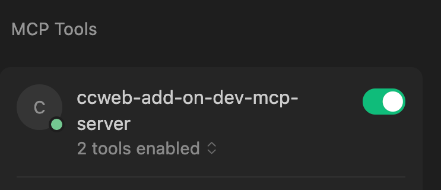
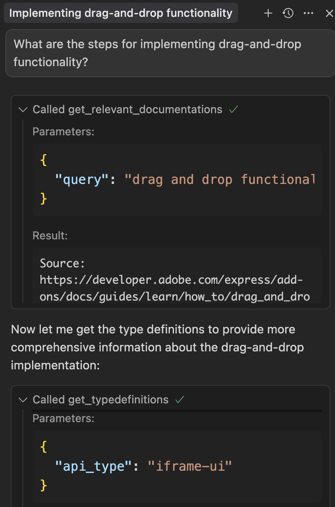

# Adobe Express Add-on MCP Server (Beta)

Get Adobe Express Add-on documentation and TypeScript definitions directly in your AI-assisted IDE through the Model Context Protocol (MCP). Build faster with grounded answers and accurate code suggestions.

> **Status: Beta** - We're actively improving based on developer feedback. API and tool surfaces may change.

## Prerequisites

- **Node.js 18+** (check with `node --version`)
- **MCP-compatible IDE** (Cursor, Claude Desktop, etc.)
- **Internet connection** (for initial npx download)

## Quick Setup (No Installation Required)

You don't need to clone or build anything. Just configure your MCP client to launch the server via `npx`.

### For Cursor Users

Add this to `~/.cursor/mcp.json`:

```json
{
  "mcpServers": {
    "adobe-express-addon": {
      "command": "npx",
      "args": [
        "@adobe/ccweb-add-on-dev-mcp-server@latest",
        "--yes"
      ]
    }
  }
}
```

### For Claude Desktop Users

Add this to `claude_desktop_config.json`:

```json
{
  "mcpServers": {
    "adobe-express-addon": {
      "command": "npx",
      "args": [
        "@adobe/ccweb-add-on-dev-mcp-server@latest",
        "--yes"
      ]
    }
  }
}
```

If there's a toggle to enable the new MCP server in your IDE, make sure it's enabled.

### Verification

Many IDEs show a green indicator when the MCP server connects successfully, for example in Cursor:  



The LLM will automatically invoke tools based on your prompts:



<!--  -->

## Usage

**Example Prompts:**

- "What are the steps for implementing drag-and-drop functionality?"
- "How do I create a rendition of a document"
- "Show me examples of using the color picker component."
- "How do I create and style text in Adobe Express?"
- "How does the Document API work for manipulating elements?"

**Pro Tips for Better Results:**

- **Be Specific**: "Add a stroke to a rectangle" vs "Style shapes"
- **Include Context**: "I'm building a text editor add-on" helps narrow results
- **Use Technical Terms**: "text styling" vs "make it look good"
- **Ask for Examples**: "Show me code examples for text manipulation"
- **Specify Surfaces**: "Show me iframe-ui types" vs generic requests

## Important Notes

- **IDE Requirement**: Requires MCP-compatible IDE for full functionality
- **Network Dependency**: Initial setup requires internet for `npx` download
- **Update Frequency**: Documentation index updates periodically, not real-time

## Compatibility

- **Adobe Express SDK**: Latest stable versions
- **Node.js**: 18.0.0 or higher required
- **MCP Protocol**: v1.0 supported
- **Tested IDEs**: Cursor 0.40+, Claude Desktop 1.0+, Visual Studio Code 1.80+

## Getting Started Workflow

1. **Configure your IDE** (see setup instructions above)
2. **Try it out** - ask a simple question like "How do I create text?"
3. **Explore the APIs** - try "Show me the Editor interface"
4. **Build something** - use the tools while developing your add-on

## Troubleshooting

### Server Won't Start

- ✅ Check Node.js version: `node --version` (needs 18+)
- ✅ Verify MCP config JSON syntax
- ✅ Ensure firewall allows npx downloads
- ✅ Ensure you are connected to the internet

### No Documentation Results

- ✅ Use specific technical terms ("text styling" vs "make it pretty")
- ✅ Try adding "Adobe Express Add-ons" for an additional context cue
- ✅ Try broader queries first, then narrow down
- ✅ Double-check API names and concepts

### Missing Type Definitions

- ✅ Specify the correct API surface (iframe-ui, express-document-sdk, add-on-sdk-document-sandbox)
- ✅ Ensure your IDE supports MCP protocol
- ✅ Ask for specific types rather than general requests

## Resources & Support

- **📚 Documentation**: [Adobe Express Add-on Guides](https://developer.adobe.com/express/add-ons/docs/guides/)
- **💡 Examples**: [Samples Repository](https://github.com/AdobeDocs/express-add-on-samples)
- **📋 Updates**: [Changelog](https://developer.adobe.com/express/add-ons/docs/guides/getting_started/changelog/)
- **💬 Community**: [Adobe Express Add-on Developers Discord](https://discord.com/invite/nc3QDyFeb4)
- **🔍 Forum**: [Adobe Express Developers Community](https://community.adobe.com/t5/adobe-express-developers/ct-p/ct-adobe-express-developers?page=1&sort=latest_replies&lang=all&tabid=all)
