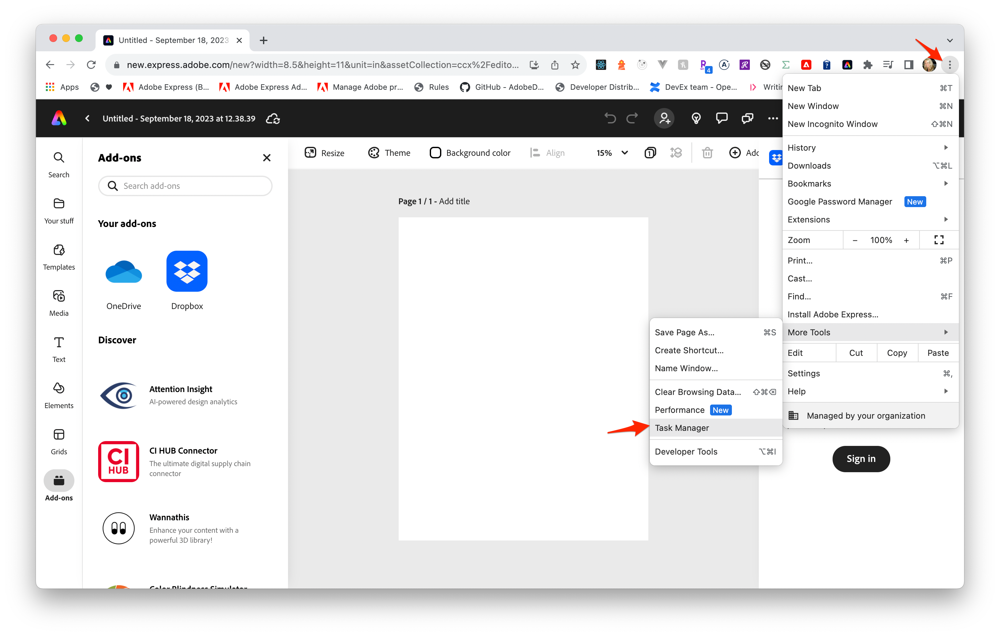
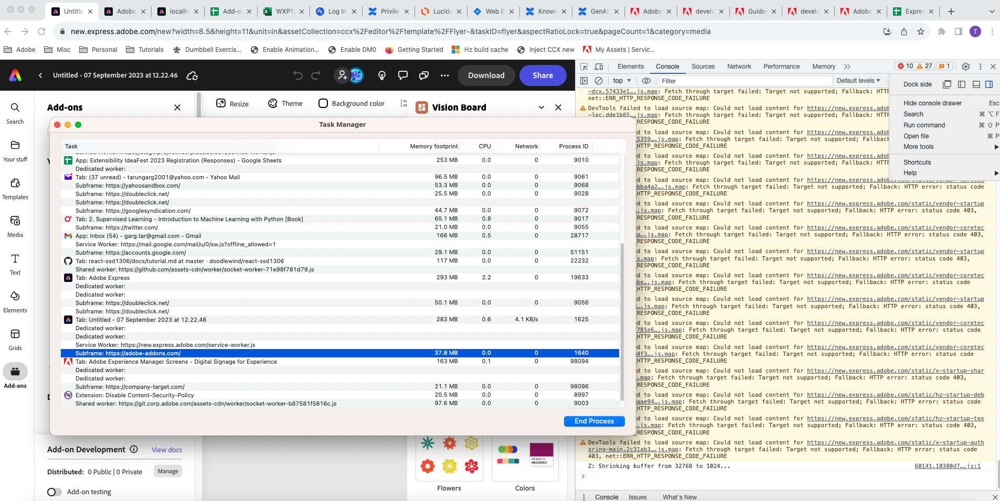
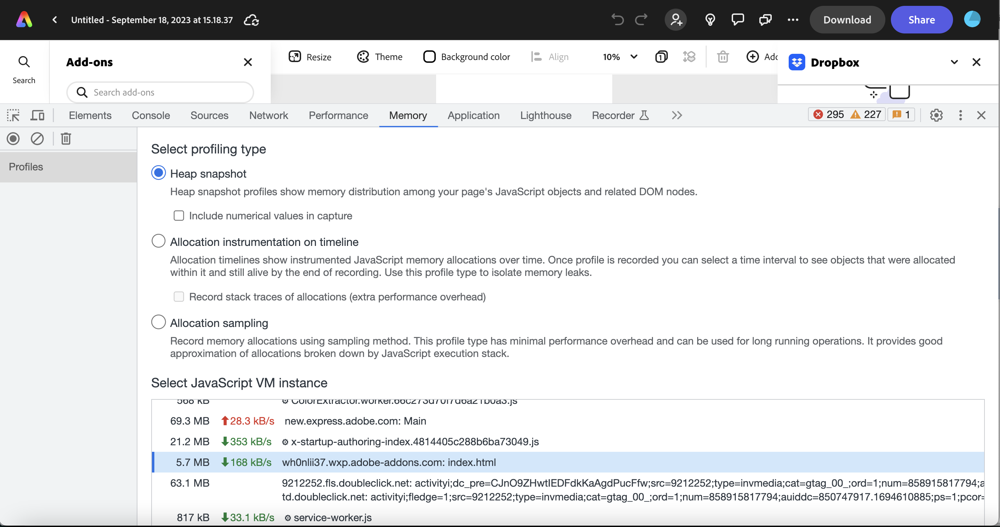

---
keywords:
  - Adobe Express
  - Express Add-on SDK
  - Performance
  - Optimization
  - JavaScript
  - React
  - Async Programming
  - Performance Testing
  - Memory Management
  - Code Optimization
title: Performance Tips and Techniques for Adobe Express Add-ons
description: Comprehensive guide to optimizing add-on performance with JavaScript and React best practices, performance testing techniques, and memory management strategies.
contributors:
  - https://github.com/hollyschinsky
---

# Performance Tips and Techniques for Adobe Express Add-ons

Master performance optimization techniques to build fast, responsive Adobe Express add-ons with efficient JavaScript and React code.

## Overview

This guide covers essential performance optimization strategies for Adobe Express add-ons, including JavaScript best practices, React-specific optimizations, and performance testing techniques. Follow these guidelines to ensure your add-ons provide excellent user experience.

Adobe Express add-ons operate in two distinct environments:
- **UI Runtime**: Where your add-on's user interface runs (`src/index.js`, `ui/` folder)
- **Document Sandbox**: Where document manipulation occurs (`src/code.js`, sandbox environment)

Understanding this architecture is crucial for optimal performance.

## Prerequisites FAQ

**Q:** What should I know before optimizing my add-on performance?

**A:** You should have:
- Basic understanding of [Adobe Express Add-on SDK](https://developer.adobe.com/express/add-ons/docs/)
- Knowledge of JavaScript ES6+ features
- Familiarity with React (if using React-based add-ons)
- Understanding of browser developer tools

**Q:** How do I know if my add-on needs performance optimization?

**A:** Watch for these signs:
- Slow loading or response times
- High memory usage in Chrome Task Manager
- Laggy UI interactions
- Poor user feedback or complaints

## JavaScript Performance Optimization

### UI Runtime Performance Strategies

When working in the UI Runtime environment, focus on optimizing user interface responsiveness and memory usage.

### Asynchronous Programming Best Practices

**Q:** Why is asynchronous programming important for add-on performance?

**A:** Asynchronous programming prevents blocking the main UI thread, keeping your add-on responsive during data fetching, file operations, or API calls. This is crucial for good user experience in Adobe Express.

**Q:** What are the main approaches to asynchronous programming in add-ons?

**A:** There are three main approaches, each with specific use cases:

#### 1. Callbacks (Legacy Pattern)

**Use case**: Simple operations, legacy code integration

```js
// UI Runtime Context - Basic callback pattern
function fetchAddOnData(callback) {
  // Simulate add-on data fetching (e.g., user preferences)
  setTimeout(() => {
    const userData = { theme: 'dark', language: 'en' };
    callback(null, userData); // error-first callback pattern
  }, 1000);
}

// Usage in add-on initialization
fetchAddOnData((error, data) => {
  if (error) {
    console.error('Failed to load user data:', error);
    return;
  }
  console.log('User preferences loaded:', data);
  // Update UI with user preferences
});
```

#### 2. Promises (Modern Standard)

**Use case**: API calls, chaining operations, complex workflows

```js
// UI Runtime Context - Promise-based API calls
import addOnUISdk from "https://express.adobe.com/static/add-on-sdk/sdk.js";

function loadUserAssets() {
  return new Promise((resolve, reject) => {
    // Simulate loading user assets from Adobe Express
    addOnUISdk.app.document.getPagesInfo()
      .then(pagesInfo => {
        if (pagesInfo.length > 0) {
          resolve(pagesInfo);
        } else {
          reject(new Error('No pages found'));
        }
      })
      .catch(reject);
  });
}

// Chain multiple operations
loadUserAssets()
  .then(pages => {
    console.log('Pages loaded:', pages.length);
    return addOnUISdk.app.document.createPage(); // Chain another operation
  })
  .then(newPage => {
    console.log('New page created:', newPage.id);
  })
  .catch(error => {
    console.error('Asset loading failed:', error);
  });
```

#### 3. Async/Await (Recommended)

**Use case**: Most add-on operations, cleaner error handling, sequential operations

```js
// UI Runtime Context - Modern async/await pattern
import addOnUISdk from "https://express.adobe.com/static/add-on-sdk/sdk.js";

async function initializeAddOn() {
  try {
    // Wait for SDK to be ready
    await addOnUISdk.ready;
    
    // Load user preferences
    const userPrefs = await loadUserPreferences();
    console.log('User preferences:', userPrefs);
    
    // Initialize UI with preferences
    await setupUserInterface(userPrefs);
    
    // Load any required assets
    const assets = await loadRequiredAssets();
    console.log('Assets loaded:', assets.length);
    
  } catch (error) {
    console.error('Add-on initialization failed:', error);
    // Show user-friendly error message
    showErrorDialog('Failed to initialize add-on. Please refresh and try again.');
  }
}

async function loadUserPreferences() {
  // Simulate async operation
  return new Promise(resolve => {
    setTimeout(() => {
      resolve({ theme: 'light', autoSave: true });
    }, 500);
  });
}

async function setupUserInterface(preferences) {
  // Apply theme and UI preferences
  document.body.className = `theme-${preferences.theme}`;
  return Promise.resolve();
}

async function loadRequiredAssets() {
  // Load fonts, icons, or other assets
  return ['icon1.svg', 'font1.woff2'];
}

// Initialize when page loads
initializeAddOn();
```

<InlineAlert slots="text" variant="success"/>

Asynchronous programming can be more complex than synchronous programming, and requires careful handling of errors and callbacks. However, it can greatly improve the performance and responsiveness of your JavaScript code, and is the recommended practice for developers building add-ons.

### Data Management and Caching

**Q:** How should I cache frequently accessed data in my add-on?

**A:** Implement smart caching strategies to avoid redundant computations:

```js
// UI Runtime Context - Caching implementation
class AddOnDataCache {
  constructor() {
    this.cache = new Map();
    this.maxSize = 100; // Prevent memory leaks
  }
  
  get(key) {
    return this.cache.get(key);
  }
  
  set(key, value) {
    if (this.cache.size >= this.maxSize) {
      // Remove oldest entry
      const firstKey = this.cache.keys().next().value;
      this.cache.delete(firstKey);
    }
    this.cache.set(key, value);
  }
  
  has(key) {
    return this.cache.has(key);
  }
}

// Usage example
const dataCache = new AddOnDataCache();

async function getProcessedData(inputData) {
  const cacheKey = JSON.stringify(inputData);
  
  if (dataCache.has(cacheKey)) {
    console.log('Cache hit!');
    return dataCache.get(cacheKey);
  }
  
  // Expensive computation
  const result = await processComplexData(inputData);
  dataCache.set(cacheKey, result);
  return result;
}
```

**Q:** What are the best data structures for add-on performance?

**A:** Choose the right data structure for your use case:

```js
// UI Runtime Context - Efficient data structures
// Use Map for key-value pairs with better performance than objects
const userAssets = new Map();
userAssets.set('images', ['img1.jpg', 'img2.png']);
userAssets.set('fonts', ['font1.woff2', 'font2.ttf']);

// Use Set for unique collections with fast lookups
const processedItemIds = new Set();

function processItem(item) {
  if (processedItemIds.has(item.id)) {
    return; // Already processed
  }
  
  // Process the item
  console.log('Processing:', item.id);
  processedItemIds.add(item.id);
}

// Use WeakMap for object metadata without memory leaks
const elementMetadata = new WeakMap();

function attachMetadata(element, data) {
  elementMetadata.set(element, data);
}
```

### DOM Optimization Techniques

**Q:** How can I minimize DOM manipulation for better performance?

**A:** Batch DOM operations and use efficient patterns:

```js
// UI Runtime Context - Efficient DOM manipulation
// ❌ Inefficient: Multiple DOM updates
function updateUIBadly(items) {
  const container = document.getElementById('item-container');
  items.forEach(item => {
    const div = document.createElement('div');
    div.textContent = item.name;
    container.appendChild(div); // Triggers reflow each time
  });
}

// ✅ Efficient: Batch DOM updates
function updateUIEfficiently(items) {
  const container = document.getElementById('item-container');
  const fragment = document.createDocumentFragment();
  
  items.forEach(item => {
    const div = document.createElement('div');
    div.textContent = item.name;
    fragment.appendChild(div); // No reflow
  });
  
  container.appendChild(fragment); // Single reflow
}

// ✅ Even better: Use innerHTML for static content
function updateUIFastest(items) {
  const container = document.getElementById('item-container');
  const html = items.map(item => `<div>${item.name}</div>`).join('');
  container.innerHTML = html; // Single DOM update
}
```

### Event Handling Optimization

**Q:** How should I handle events efficiently in my add-on?

**A:** Use event delegation and proper cleanup:

```js
// UI Runtime Context - Event delegation pattern
class AddOnEventManager {
  constructor() {
    this.eventListeners = new Map();
    this.setupEventDelegation();
  }
  
  setupEventDelegation() {
    // Single listener for all button clicks
    document.addEventListener('click', (event) => {
      if (event.target.matches('.add-on-button')) {
        this.handleButtonClick(event);
      }
    });
    
    // Single listener for all form inputs
    document.addEventListener('input', (event) => {
      if (event.target.matches('.add-on-input')) {
        this.handleInputChange(event);
      }
    });
  }
  
  handleButtonClick(event) {
    const action = event.target.dataset.action;
    console.log('Button action:', action);
    
    switch (action) {
      case 'save':
        this.saveDocument();
        break;
      case 'export':
        this.exportDocument();
        break;
    }
  }
  
  handleInputChange(event) {
    // Debounce input changes
    clearTimeout(this.inputTimeout);
    this.inputTimeout = setTimeout(() => {
      this.processInputChange(event.target);
    }, 300);
  }
  
  cleanup() {
    // Clean up timers and listeners
    clearTimeout(this.inputTimeout);
  }
}
```

### Loop and Algorithm Optimization

**Q:** How can I optimize loops and algorithms in my add-on?

**A:** Use efficient patterns and early exits:

```js
// UI Runtime Context - Loop optimization
// ❌ Inefficient: Accessing length property repeatedly
function processItemsBadly(items) {
  for (let i = 0; i < items.length; i++) { // length accessed each iteration
    if (items[i].processed) continue;
    processItem(items[i]);
  }
}

// ✅ Efficient: Cache length and use early exits
function processItemsEfficiently(items) {
  const length = items.length; // Cache length
  
  for (let i = 0; i < length; i++) {
    const item = items[i];
    
    // Early exit conditions
    if (item.processed || !item.valid) continue;
    
    // Break early if possible
    if (item.type === 'terminal') {
      processItem(item);
      break; // No need to continue
    }
    
    processItem(item);
  }
}

// ✅ Modern approach: Use array methods for cleaner code
function processItemsModern(items) {
  items
    .filter(item => !item.processed && item.valid)
    .forEach(processItem);
}

// ✅ For large datasets: Use for...of for better performance
function processLargeDataset(items) {
  for (const item of items) {
    if (!shouldProcess(item)) continue;
    processItem(item);
  }
}
```

### Resource Loading Optimization

**Q:** How should I implement lazy loading in my add-on?

**A:** Load resources only when needed:

```js
// UI Runtime Context - Lazy loading implementation
class LazyResourceLoader {
  constructor() {
    this.loadedResources = new Set();
    this.loadingPromises = new Map();
  }
  
  async loadResource(resourceId, loadFunction) {
    if (this.loadedResources.has(resourceId)) {
      return; // Already loaded
    }
    
    if (this.loadingPromises.has(resourceId)) {
      return this.loadingPromises.get(resourceId); // Already loading
    }
    
    const loadPromise = loadFunction().then(result => {
      this.loadedResources.add(resourceId);
      this.loadingPromises.delete(resourceId);
      return result;
    });
    
    this.loadingPromises.set(resourceId, loadPromise);
    return loadPromise;
  }
  
  async loadImageWhenVisible(imageElement, imageSrc) {
    const observer = new IntersectionObserver((entries) => {
      entries.forEach(entry => {
        if (entry.isIntersecting) {
          entry.target.src = imageSrc;
          observer.unobserve(entry.target);
        }
      });
    });
    
    observer.observe(imageElement);
  }
}

// Usage
const resourceLoader = new LazyResourceLoader();

async function loadExpensiveFeature() {
  return resourceLoader.loadResource('advanced-tools', async () => {
    const module = await import('./advanced-tools.js');
    return module.initializeTools();
  });
}
```

## React Performance Optimization for Add-ons

**Q:** How can I optimize React components in my Adobe Express add-on?

**A:** Follow these React-specific optimization strategies:

### Component Optimization

**Q:** How do I prevent unnecessary re-renders in React add-ons?

**A:** Use React's optimization techniques:

```js
// UI Runtime Context - React component optimization
import React, { memo, useMemo, useCallback, useState } from 'react';

// ✅ Use React.memo for functional components
const OptimizedButton = memo(({ label, onClick, disabled }) => {
  console.log('Button rendering:', label);
  return (
    <button onClick={onClick} disabled={disabled}>
      {label}
    </button>
  );
});

// ✅ Use useMemo for expensive calculations
const ExpensiveComponent = ({ items, filterText }) => {
  const filteredItems = useMemo(() => {
    console.log('Filtering items...');
    return items.filter(item => 
      item.name.toLowerCase().includes(filterText.toLowerCase())
    );
  }, [items, filterText]); // Only recalculate when dependencies change

  return (
    <div>
      {filteredItems.map(item => (
        <div key={item.id}>{item.name}</div>
      ))}
    </div>
  );
};

// ✅ Use useCallback for event handlers
const AddOnPanel = () => {
  const [count, setCount] = useState(0);
  const [items, setItems] = useState([]);

  const handleIncrement = useCallback(() => {
    setCount(prev => prev + 1);
  }, []); // No dependencies, function never changes

  const handleAddItem = useCallback((newItem) => {
    setItems(prev => [...prev, newItem]);
  }, []); // Stable reference

  return (
    <div>
      <OptimizedButton 
        label={`Count: ${count}`}
        onClick={handleIncrement}
        disabled={false}
      />
    </div>
  );
};
```

### State Management Optimization

**Q:** How should I manage state efficiently in React add-ons?

**A:** Use proper state patterns and avoid common pitfalls:

```js
// UI Runtime Context - Efficient state management
import React, { useState, useReducer, useContext } from 'react';

// ✅ Use reducer for complex state logic
const addOnReducer = (state, action) => {
  switch (action.type) {
    case 'SET_LOADING':
      return { ...state, loading: action.payload };
    case 'SET_DATA':
      return { ...state, data: action.payload, loading: false };
    case 'ADD_ITEM':
      return { 
        ...state, 
        data: { 
          ...state.data, 
          items: [...state.data.items, action.payload] 
        } 
      };
    default:
      return state;
  }
};

const AddOnContainer = () => {
  const [state, dispatch] = useReducer(addOnReducer, {
    loading: false,
    data: { items: [] }
  });

  // ✅ Batch state updates when possible
  const loadData = async () => {
    dispatch({ type: 'SET_LOADING', payload: true });
    
    try {
      const data = await fetchAddOnData();
      dispatch({ type: 'SET_DATA', payload: data }); // Single update
    } catch (error) {
      console.error('Failed to load data:', error);
      dispatch({ type: 'SET_LOADING', payload: false });
    }
  };

  return (
    <div>
      {state.loading ? <Spinner /> : <DataDisplay data={state.data} />}
    </div>
  );
};
```

### List Rendering Optimization

**Q:** How do I optimize list rendering performance?

**A:** Use proper keys and virtualization for large lists:

```js
// UI Runtime Context - Optimized list rendering
import React, { memo } from 'react';

// ✅ Stable keys for list items
const AssetListItem = memo(({ asset, onSelect }) => (
  <div 
    className="asset-item" 
    onClick={() => onSelect(asset.id)}
  >
    
    <span>{asset.name}</span>
  </div>
));

const AssetGrid = ({ assets, onAssetSelect }) => {
  return (
    <div className="asset-grid">
      {assets.map(asset => (
        <AssetListItem
          key={asset.id} // ✅ Stable, unique key
          asset={asset}
          onSelect={onAssetSelect}
        />
      ))}
    </div>
  );
};

// ✅ For very large lists, consider virtualization
const VirtualizedAssetGrid = ({ assets }) => {
  const [visibleRange, setVisibleRange] = useState({ start: 0, end: 20 });
  
  const visibleAssets = useMemo(() => 
    assets.slice(visibleRange.start, visibleRange.end),
    [assets, visibleRange]
  );

  return (
    <div className="virtualized-grid">
      {visibleAssets.map(asset => (
        <AssetListItem key={asset.id} asset={asset} />
      ))}
    </div>
  );
};
```

### Code Splitting and Lazy Loading

**Q:** How do I implement code splitting in my React add-on?

**A:** Use React's lazy loading and dynamic imports:

```js
// UI Runtime Context - Code splitting and lazy loading
import React, { Suspense, lazy } from 'react';

// ✅ Lazy load heavy components
const AdvancedEditor = lazy(() => import('./AdvancedEditor'));
const AssetLibrary = lazy(() => import('./AssetLibrary'));
const ExportPanel = lazy(() => import('./ExportPanel'));

const AddOnApp = () => {
  const [activeTab, setActiveTab] = useState('editor');

  const renderTabContent = () => {
    switch (activeTab) {
      case 'editor':
        return (
          <Suspense fallback={<div>Loading editor...</div>}>
            <AdvancedEditor />
          </Suspense>
        );
      case 'assets':
        return (
          <Suspense fallback={<div>Loading assets...</div>}>
            <AssetLibrary />
          </Suspense>
        );
      case 'export':
        return (
          <Suspense fallback={<div>Loading export tools...</div>}>
            <ExportPanel />
          </Suspense>
        );
      default:
        return <div>Select a tab</div>;
    }
  };

  return (
    <div className="add-on-app">
      <nav>
        <button onClick={() => setActiveTab('editor')}>Editor</button>
        <button onClick={() => setActiveTab('assets')}>Assets</button>
        <button onClick={() => setActiveTab('export')}>Export</button>
      </nav>
      
      <main>{renderTabContent()}</main>
    </div>
  );
};
```

For detailed React patterns specific to Adobe Express add-ons, see [Lesson 2: React-based add-on with swc-react](../../tutorials/spectrum-workshop/part2.md).

## Document Sandbox Performance Optimization

**Q:** How do I optimize performance in the Document Sandbox environment?

**A:** Focus on efficient document manipulation and proper use of `editor.queueAsyncEdit`:

### Document API Performance

```js
// Document Sandbox Context - src/code.js
import { editor } from "https://express.adobe.com/static/add-on-sdk/sdk.js";

// ✅ Efficient document operations with proper queueAsyncEdit usage
async function createOptimizedElements() {
  // For synchronous operations, no queueAsyncEdit needed
  const rect = editor.createRectangle();
  rect.width = 200;
  rect.height = 100;
  rect.translation = { x: 50, y: 50 };
  
  const insertionParent = editor.context.insertionParent;
  insertionParent.children.append(rect);
  
  // For async operations (font loading, image loading), use queueAsyncEdit
  const fontFamily = await fonts.fromPostscriptName("Arial-Regular");
  
  await editor.queueAsyncEdit(() => {
    const text = editor.createText();
    text.fullContent.text = "Optimized Text";
    text.fullContent.characterStyleRanges = [{ 
      length: 13, 
      font: fontFamily 
    }];
    insertionParent.children.append(text);
  });
}

// ✅ Batch document operations for better performance
async function batchDocumentOperations(items) {
  await editor.queueAsyncEdit(() => {
    const insertionParent = editor.context.insertionParent;
    
    items.forEach(item => {
      const element = createElementFromItem(item);
      insertionParent.children.append(element);
    });
  });
}

// ✅ Use sandboxProxy for efficient UI-Sandbox communication
async function communicateWithUI(data) {
  try {
    const result = await addOnUISdk.instance.sandboxProxy.performHeavyCalculation(data);
    return result;
  } catch (error) {
    console.error('Sandbox communication failed:', error);
    throw error;
  }
}
```

### Memory Management in Document Sandbox

**Q:** How do I prevent memory leaks in the Document Sandbox?

**A:** Follow these patterns for efficient memory usage:

```js
// Document Sandbox Context - Memory optimization
class DocumentMemoryManager {
  constructor() {
    this.elementCache = new WeakMap();
    this.disposables = new Set();
  }
  
  cacheElementData(element, data) {
    // WeakMap automatically cleans up when element is removed
    this.elementCache.set(element, data);
  }
  
  addDisposable(disposable) {
    this.disposables.add(disposable);
  }
  
  cleanup() {
    // Clean up any remaining references
    this.disposables.forEach(disposable => {
      if (typeof disposable.dispose === 'function') {
        disposable.dispose();
      }
    });
    this.disposables.clear();
  }
}
```

## Performance Testing and Monitoring

**Q:** How do I measure and monitor my add-on's performance?

**A:** Use these comprehensive testing strategies to identify and resolve performance issues:

### Basic Performance Measurement

**Q:** What are the quickest ways to measure code performance?

**A:** Start with these built-in browser tools:

```js
// UI Runtime Context - Basic performance measurement
// ✅ Method 1: console.time() for quick measurements
console.time('addOnInitialization');
await initializeAddOn();
console.timeEnd('addOnInitialization'); // Logs: addOnInitialization: 245.123ms

// ✅ Method 2: performance.now() for high precision
const startTime = performance.now();
await processLargeDataset(data);
const endTime = performance.now();
console.log(`Processing took ${endTime - startTime} milliseconds`);

// ✅ Method 3: Performance wrapper for repeated measurements
class PerformanceTracker {
  constructor() {
    this.measurements = new Map();
  }
  
  async measure(label, asyncFunction) {
    const startTime = performance.now();
    try {
      const result = await asyncFunction();
      const duration = performance.now() - startTime;
      
      this.recordMeasurement(label, duration);
      console.log(`${label}: ${duration.toFixed(2)}ms`);
      
      return result;
    } catch (error) {
      console.error(`${label} failed:`, error);
      throw error;
    }
  }
  
  recordMeasurement(label, duration) {
    if (!this.measurements.has(label)) {
      this.measurements.set(label, []);
    }
    this.measurements.get(label).push(duration);
  }
  
  getAverageTime(label) {
    const times = this.measurements.get(label) || [];
    return times.reduce((sum, time) => sum + time, 0) / times.length;
  }
}

// Usage
const tracker = new PerformanceTracker();
await tracker.measure('API Call', () => fetchUserData());
```

### Chrome DevTools Profiling

**Q:** How do I use Chrome DevTools to debug add-on performance?

**A:** Follow this systematic approach:

#### 1. Task Manager Monitoring

Monitor your add-on's resource usage:

1. **Open Task Manager**: Chrome menu → More Tools → Task Manager
2. **Locate add-on process**: Look for your add-on's iframe process
3. **Monitor metrics**: Watch CPU, memory, and network usage





#### 2. Memory Profiling

**Q:** How do I identify memory leaks in my add-on?

**A:** Use Chrome's Memory tab:

```js
// UI Runtime Context - Memory leak detection
class MemoryLeakDetector {
  constructor() {
    this.intervalId = null;
    this.memoryLog = [];
  }
  
  startMonitoring() {
    this.intervalId = setInterval(() => {
      if (performance.memory) {
        const memInfo = {
          timestamp: Date.now(),
          used: performance.memory.usedJSHeapSize,
          total: performance.memory.totalJSHeapSize,
          limit: performance.memory.jsHeapSizeLimit
        };
        
        this.memoryLog.push(memInfo);
        console.log(`Memory: ${(memInfo.used / 1048576).toFixed(2)} MB`);
        
        // Alert if memory usage is growing rapidly
        if (this.memoryLog.length > 10) {
          const recent = this.memoryLog.slice(-10);
          const growth = recent[9].used - recent[0].used;
          if (growth > 10 * 1048576) { // 10MB growth
            console.warn('Potential memory leak detected!');
          }
        }
      }
    }, 5000);
  }
  
  stopMonitoring() {
    if (this.intervalId) {
      clearInterval(this.intervalId);
      this.intervalId = null;
    }
  }
  
  generateReport() {
    return {
      samples: this.memoryLog.length,
      peak: Math.max(...this.memoryLog.map(log => log.used)),
      average: this.memoryLog.reduce((sum, log) => sum + log.used, 0) / this.memoryLog.length
    };
  }
}

// Usage
const memoryDetector = new MemoryLeakDetector();
memoryDetector.startMonitoring();

// Stop monitoring when add-on is closed
window.addEventListener('beforeunload', () => {
  memoryDetector.stopMonitoring();
  console.log('Memory report:', memoryDetector.generateReport());
});
```



### Advanced Performance Testing

**Q:** How do I benchmark different implementations?

**A:** Use systematic comparison techniques:

```js
// UI Runtime Context - Performance benchmarking
class AddOnBenchmark {
  constructor() {
    this.results = new Map();
  }
  
  async benchmark(name, testFunction, iterations = 100) {
    const times = [];
    
    // Warm up
    for (let i = 0; i < 5; i++) {
      await testFunction();
    }
    
    // Actual benchmark
    for (let i = 0; i < iterations; i++) {
      const start = performance.now();
      await testFunction();
      const end = performance.now();
      times.push(end - start);
    }
    
    const avg = times.reduce((sum, time) => sum + time, 0) / times.length;
    const min = Math.min(...times);
    const max = Math.max(...times);
    
    const result = { avg, min, max, iterations };
    this.results.set(name, result);
    
    console.log(`${name}: ${avg.toFixed(2)}ms avg, ${min.toFixed(2)}ms min, ${max.toFixed(2)}ms max`);
    return result;
  }
  
  compare(nameA, nameB) {
    const resultA = this.results.get(nameA);
    const resultB = this.results.get(nameB);
    
    if (!resultA || !resultB) {
      throw new Error('Both functions must be benchmarked first');
    }
    
    const speedup = resultB.avg / resultA.avg;
    console.log(`${nameA} is ${speedup.toFixed(2)}x faster than ${nameB}`);
    return speedup;
  }
}

// Example: Compare array vs Set performance
const benchmark = new AddOnBenchmark();

const testData = Array.from({ length: 10000 }, (_, i) => i);

await benchmark.benchmark('Array.includes', () => {
  const arr = [...testData];
  return arr.includes(5000);
});

await benchmark.benchmark('Set.has', () => {
  const set = new Set(testData);
  return set.has(5000);
});

benchmark.compare('Set.has', 'Array.includes');
```

### External Performance Tools

**Q:** What external tools can help with add-on performance?

**A:** Use these specialized tools:

#### Lighthouse Integration

```js
// UI Runtime Context - Lighthouse performance hints
// Implement Performance Observer for Core Web Vitals
const observer = new PerformanceObserver((list) => {
  for (const entry of list.getEntries()) {
    switch (entry.entryType) {
      case 'largest-contentful-paint':
        console.log('LCP:', entry.startTime);
        break;
      case 'first-input':
        console.log('FID:', entry.processingStart - entry.startTime);
        break;
      case 'layout-shift':
        if (!entry.hadRecentInput) {
          console.log('CLS:', entry.value);
        }
        break;
    }
  }
});

observer.observe({ entryTypes: ['largest-contentful-paint', 'first-input', 'layout-shift'] });
```

**Q:** How do I integrate third-party benchmarking tools?

**A:** Consider these options:

1. **[Lighthouse](https://developer.chrome.com/docs/lighthouse/overview/)**: Automated performance auditing
2. **[Benchmark.js](https://benchmarkjs.com/)**: Statistical performance testing
3. **Chrome DevTools Performance Panel**: Detailed flame graphs
4. **User Timing API**: Custom performance marks

### Performance Testing Best Practices

**Q:** What should I include in my performance testing strategy?

**A:** Create a comprehensive testing plan:

1. **Load Testing**: Test with realistic data volumes
2. **Memory Testing**: Monitor for leaks over extended use
3. **Network Testing**: Simulate slow connections
4. **User Interaction Testing**: Measure response times for user actions
5. **Regression Testing**: Compare performance across code changes

For more performance patterns, see:
- [Advanced Topics: Frameworks, Libraries & Bundling](../../build/advanced-topics/frameworks-libraries-bundling.md)
- [Spectrum Web Components Performance Tips](../../tutorials/spectrum-workshop/part3.md)

## Common Performance Pitfalls and Solutions

**Q:** What are the most common performance mistakes in add-ons?

**A:** Avoid these frequent issues:

### Memory Leaks

```js
// UI Runtime Context - Memory leak prevention
// ❌ Common memory leak: Uncleaned event listeners
class LeakyComponent {
  constructor() {
    this.handleClick = this.handleClick.bind(this);
    document.addEventListener('click', this.handleClick); // Never removed!
  }
  
  handleClick() {
    console.log('Clicked');
  }
}

// ✅ Proper cleanup
class CleanComponent {
  constructor() {
    this.handleClick = this.handleClick.bind(this);
    this.abortController = new AbortController();
    
    document.addEventListener('click', this.handleClick, {
      signal: this.abortController.signal
    });
  }
  
  handleClick() {
    console.log('Clicked');
  }
  
  destroy() {
    this.abortController.abort(); // Removes all listeners
  }
}
```

### Inefficient API Usage

```js
// UI Runtime Context - Efficient API patterns
// ❌ Inefficient: Multiple API calls
async function loadUserDataBadly(userIds) {
  const users = [];
  for (const id of userIds) {
    const user = await fetch(`/api/users/${id}`); // N+1 problem
    users.push(await user.json());
  }
  return users;
}

// ✅ Efficient: Batch API calls
async function loadUserDataEfficiently(userIds) {
  const response = await fetch('/api/users', {
    method: 'POST',
    headers: { 'Content-Type': 'application/json' },
    body: JSON.stringify({ ids: userIds })
  });
  return response.json(); // Single request
}
```

By implementing comprehensive performance testing and monitoring, you can ensure your Adobe Express add-on provides excellent user experience. Remember to test regularly and measure the impact of optimizations to validate improvements.
