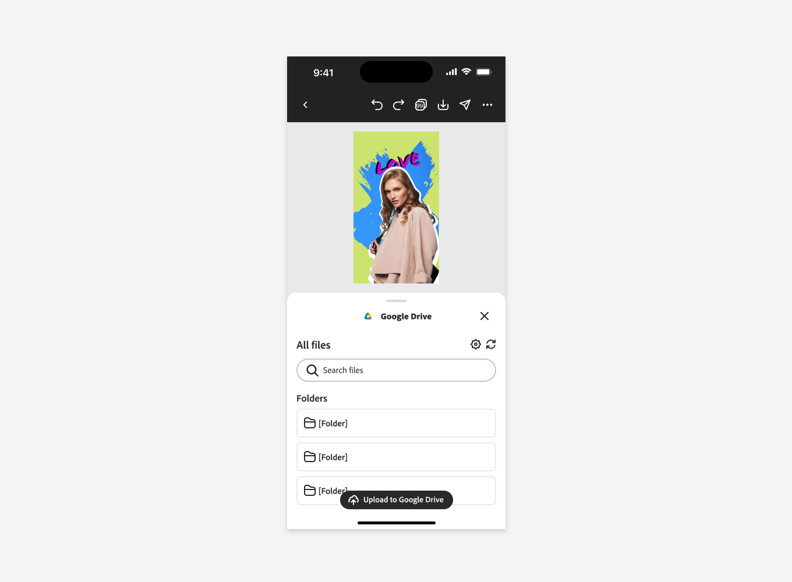
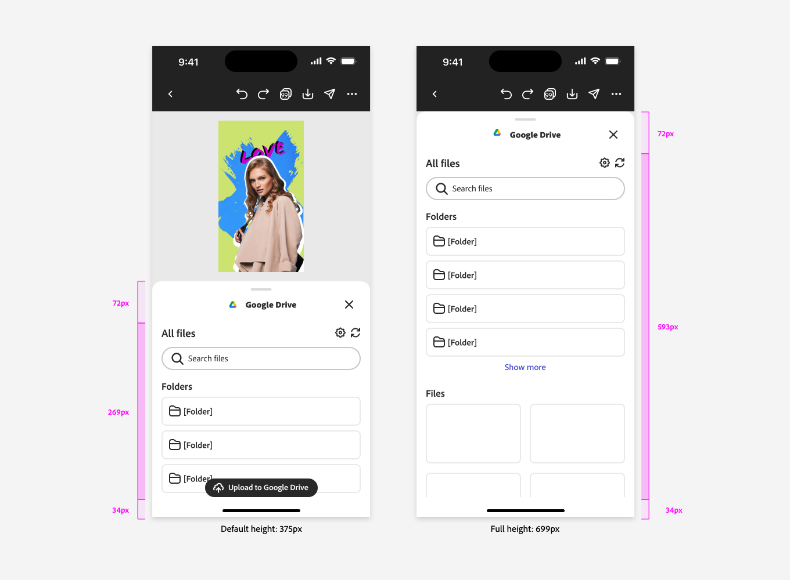
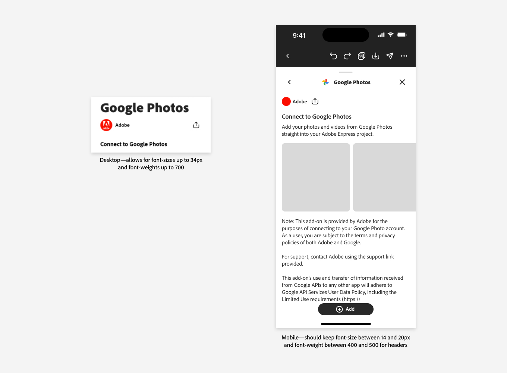
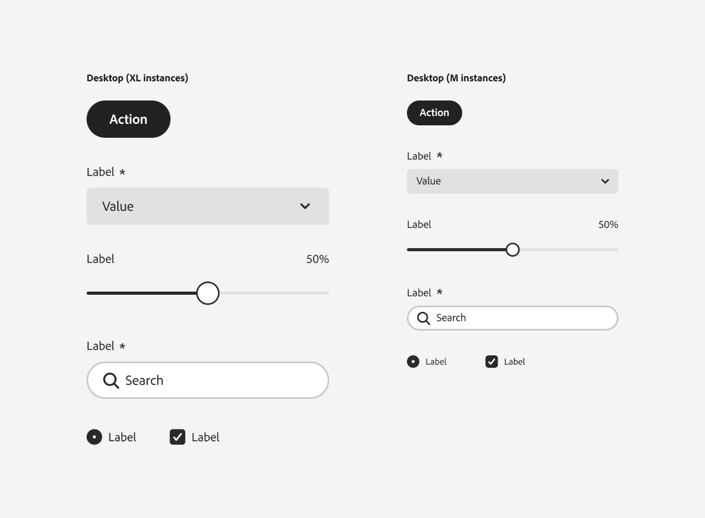
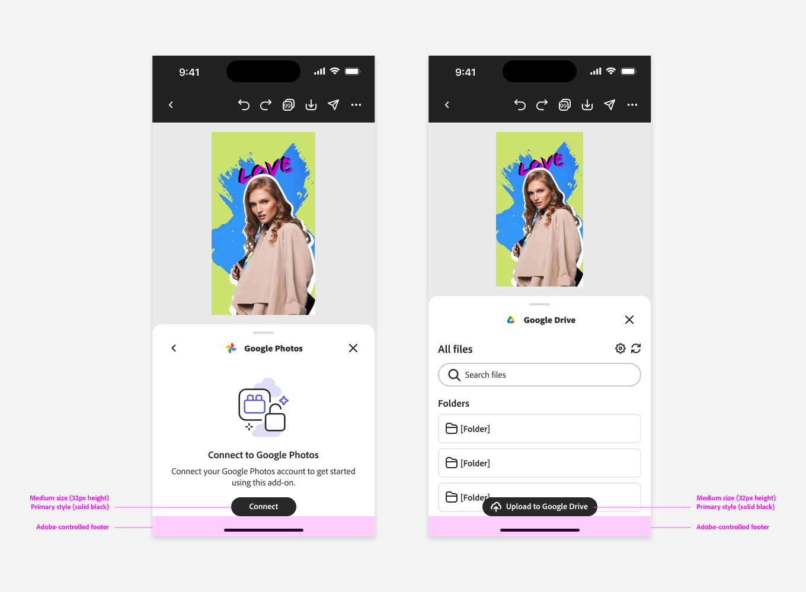

---
keywords:
  - Adobe Express
  - Express Add-on 
  - Extend
  - Extensibility
  - User Interface
  - User Experience
  - UI
  - UX
  - Guidelines
  - Mobile
title: Mobile UX
description: This document provides an overview of the UX guidelines to follow when designing your Adobe Express add-on.
contributors:
  - https://github.com/undavide
---

# Mobile UX

Designing add-ons that can be used when Adobe Express runs on mobile devices requires some attention. Although the same general principles so far outlined still apply, component sizing, layout, and typography should be tweaked to ensure the proper user experience on smaller screens.

The following sections outline the key differences and best practices for optimizing your add-ons for mobile devices.

## Basic Structure

Mobile interfaces feature a streamlined layout, with two primary content areas controlled by Adobe: the title bar and the footer. The add-on's content is displayed in the body area; considering the smaller screen size, you should optimize the design for readability and ease of interaction.

## Default panel height vs. full panel height

By default, the panel covers around half of the screen's vertical space, with a height of 375px. This layout balances the add-on interface and the document view, ensuring both are easily accessible.

When the user swipes up the handlebar, which is always visible, the panel expands upward until the entire 699px height available is covered. This full-height view is ideal for displaying detailed content or additional options.

## Typography

Typography on mobile requires adjustments from desktop standards to ensure readability; the font size is generally smaller, and the weight is lighter.

For **headings**, we recommended a font-size in the 15-19px range, and not exceeding 20px. The font-weight should be 400-500, typically the latter. On desktop, headings are in the 14-22px range (rarely, up to 34px) and weights of 600-700 are common.

On mobile, **body** is in the same 15-19px range, with a font-weight of 300.

## Foundational components

While mobile and desktop share many common components, sizing and placement are crucial distinctions. Mobile interfaces should avoid using extra-large (XL) component instances, which can overwhelm the screen. Instead, opt for Medium (M) or Large (L) sizes, more suitable for mobile displays.

### Buttons

On mobile, buttons that convey singular, primary actions should be styled using the Medium size and Primary variant. Center them horizontally and align them to the bottom—remember to account for the footer area controlled by Adobe.

### Button Groups

Button groups should extend across the available width of the UI, minus a 40px margin (16px on each side, with an 8px gap between buttons). This layout ensures that buttons are easily tappable and well-spaced on smaller screens.

