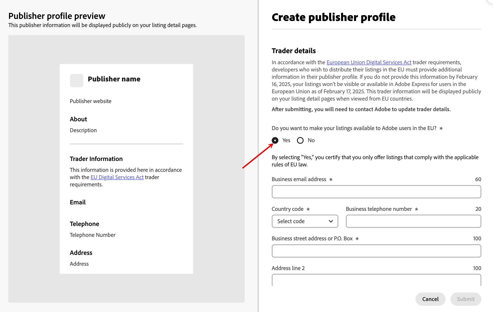

# Listing Your Add-on

Your listing should provide valuable information about what your add-on does, and why people should use it.

<Announcement slots="heading, text, button" />

### Are you an existing developer?

Action required: Add trader details to continue EU distribution.

[Add trader details now.](https://express.adobe.com/add-ons?mode=submission)

## Listing metadata

Your listing metadata provides Adobe and users with details about your add-on. Follow the guidelines below to ensure your listing clearly describes everything you want your users to know about your add-on.

<InlineAlert slots="text" variant="info"/>

**NOTE:** Please avoid the use of emojis in your listing metadata as the user interface does not allow them.

Refer to our [Developer Brand Guidelines](../brand-guidelines.md) for more information.

### Naming your add-on

Consider using a simple name that is easy to spell, but distinctive enough to find using search.

The name should give users an idea of what the add-on does. For example, using a company name may be clear to you, but not to other users. Try to avoid using a long name where possible.

When listing an add-on, you must not use the word "Premium" to describe your upgrade options, as this should only be used in relation to the [Adobe Express Premium Plan](https://www.adobe.com/express/pricing).

### Your add-on description

Let your users know clearly and concisely what your add-on does.

Think of this as your elevator pitch. Use this space to concisely describe the functionality and benefits of your add-on, using tone and language which is appropriate to your add-on and your own personal or brand style.

If your add-on generates assets via AI or imports assets from an asset repository, you should include accurate and up-to-date information about usage rights here.

Consult our [Generative AI guidelines](../genai/index.md) for more information.

### Your summary

Use the summary section to concisely outline the features and functionality of the add-on. Think of this as the tagline to your add-on.

### Support email

You must provide a valid email address so that we can contact you for support. End users will not see this email address.

### Screenshots

Your screenshots should accurately represent the functionality and appearance of the add-on, such as key features and important user steps. It is essential to refrain from including images that could potentially mislead users or are deemed inappropriate.

### Your icon

Use an original icon that complies with our [Developer Brand Guidelines](https://developer.adobe.com/express/embed-sdk/docs/assets/34359598a6bd85d69f1f09839ec43e12/Adobe_Express_Partner_Program_brand_guide.pdf). Consider using a design that illustrates what the add-on does.

Your icon should be simple and distinctive, and must be suitable for viewing on different devices and browsers.

### Help URL

Include a link to a valid webpage that provides accurate and relevant information about the add-on’s usage and functionality.

It is recommended to add support for common queries or user issues.

### Privacy Policy/License Agreement

You must include details of your privacy policy and contractual terms applicable to the use of your add-on(s). Do not include text that violates our [Developer Brand Guidelines](https://developer.adobe.com/express/embed-sdk/docs/assets/34359598a6bd85d69f1f09839ec43e12/Adobe_Express_Partner_Program_brand_guide.pdf).

### Keywords

It is recommended to include keywords to categorize your add-on and make it easier to find. Multi-word keywords are allowed (but remember: spaces count toward the overall character limit for keywords).

Try to include keywords which reflect the features and purpose of the add-on, which the user is likely to search for. Spell out keywords in full. You must not include any words that are abusive and/or derogatory.

### Release section

Use this section to include details of any updates, fixes and improvements you have made to the add-on since launch.

These notes must accurately describe the changes made, and be written in such a way that they make sense to the user.

## Publisher profile

Completing your publisher profile can be helpful in making your app look more professional, interesting and trustworthy.

Ensure that all content adheres to our [Developer Brand Guidelines](https://developer.adobe.com/express/embed-sdk/docs/assets/34359598a6bd85d69f1f09839ec43e12/Adobe_Express_Partner_Program_brand_guide.pdf).

### Your publisher name

Create a unique name that reflects your personality. It must not contain inappropriate words or phrases.

### Your description

Use your description to explain a little more about you, including any areas you may specialize in.

### Your logo

Your publisher logo must be original. You must not use the Adobe logo, or any product icons or images, without authorization.

### Your website URL

Include a website so that people can find out more about you. This should successfully open your own website. Specifically, according to page 5 of the [Developer Brand Guidelines](https://developer.adobe.com/express/embed-sdk/docs/assets/34359598a6bd85d69f1f09839ec43e12/Adobe_Express_Partner_Program_brand_guide.pdf) your "...domain name must not include any Adobe trademark or product name."

For example:

**www.[Your Company name].com/Add-onforExpress**

NOT:

**www.[Your Company name]forAdobeExpress.com**

### Trader details

In accordance with the [European Union Digital Services Act](https://eur-lex.europa.eu/legal-content/EN/ALL/?uri=CELEX:32022R2065) trader requirements, developers who wish to distribute their add-ons in the European Union (EU) must provide additional information in their publisher profile.

<InlineAlert variant="info" slots="header, text1, text2, text3, text4" />

Developer/Trader

The terms **developers/traders** are used interchangeably in this guide.

Any developer who wishes to publish their add-ons in the EU can be identified as a trader.

Checkout our [Know your trader](https://developer.adobe.com/compliance/) guide to understand **why** you must provide these details to make your add-ons available in the EU.

This information will be displayed to only users in the European Union (EU).

Choose **Yes** if you wish to make your add-ons available for users in the EU.

You must provide the following details:

- Business email address​
- Country code and Business telephone number
- Business street address or P.O. box
- City
- State/Province/Region
- ZIP/Postal code
- Country
- Business D-U-N-S number [`optional`]

You must complete and submit your publisher profile in order to submit your first add-on, however this is only a one time thing, unless you decide you need to update for your own reasons.

Any changes to your publisher profile will need to be submitted for approval again.

<InlineAlert variant="warning" slots="header, text1, text2, text3" />

**Are you an existing developer?**

Existing developers can easily update their trader details directly in their [publisher profile](https://express.adobe.com/add-ons?mode=submission).

Note that only trader details can be added; other fields cannot be edited by developers.

You must provide trader details by February 16, 2025, to keep your add-on visible and available in Adobe Express for users in the European Union as of February 17, 2025. This trader information will be displayed publicly on your listing detail pages when viewed from EU countries.
