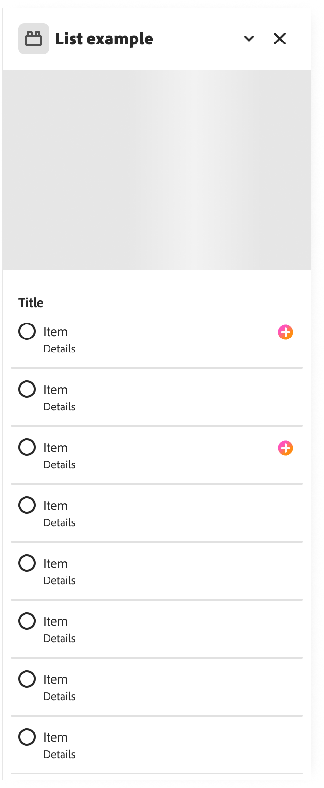
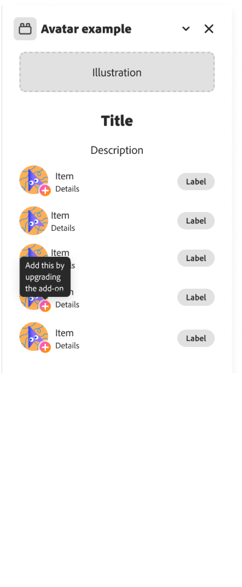
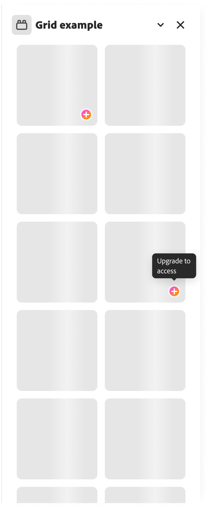

# Monetization Guidelines

Developers who submit to the marketplace can charge users for using their add-ons.

## Overview

Consider whether you want to monetize your add-on at the outset, as it helps you plan your strategy more effectively.

Remember to research the marketplace carefully before you start creating. This will help you learn whether there is a substantial market for a paid add-on and what other developers (if any) are charging for similar solutions.

We’ve created these standards to ensure monetized add-ons provide users with a consistent and reliable experience.

Our monetization guidelines include:

- [General](#general-guidelines)
- [Requirements](#requirements-for-monetizing-your-add-ons)
- [Recommendations](#recommendations-for-monetizing-your-add-ons)
- [Branding your add-ons](#branding-your-add-ons-for-monetization)

## General Guidelines

The sections below provide details on the guidelines developers should be following when monetizing their add-ons.

### Transparency

All add-on developers must be transparent about their pricing and monetization methods. This includes being honest about the price and any recurring fees or additional costs.

Users must be able to:

- Locate clear instructions on requesting a refund (please place a refund policy on your site).
- Find a way to cancel any recurring payments, including subscriptions. Manage their payments and update their payment method
- see how much an add-on will cost them, with no hidden fees or surprise charges.

### Support

You must offer a clear and simple support process for all publicly-listed add-ons. This includes responding to any queries from users regarding access and payments.

### Compliance

You must comply with all applicable laws and regulations. This includes payment regulations, taxation, data privacy, and security.

### Third-party ads

Your add-ons must not contain any third-party advertising, including any ads from Google Ads, Facebook Ads, or any other ad networks.

This applies to the advertising of products and services within the add-on description, and the use of banners in the add-on itself.

### Complying with Express monetization rules

When listing an Adobe Express add-on, you should not use "Premium" to describe your upgrade options.

The word "Premium" should only be used in relation to the Adobe Express Premium Plan, which provides users with extra content, increased storage and more.

### Exporting premium content

Adobe Express allows users that aren't subscribed to a premium version of Adobe Express to experiment with premium content in their documents. When users download or share their document, they'll be prompted to upgrade to a premium plan.

Add-ons must not allow users on a free plan to download, share, or export premium content provided by Adobe Express. When a user on a free plan tries to share or export premium content using your add-on, you must notify the user that they need to upgrade, and inform the user how they can do so. See our [documentation](../../../learn/how_to/premium-content.md) for more information on how to do this.

## Requirements for monetizing your add-ons

When listing your add-ons for monetization to the public marketplace, you must indicate your add-on's purchase offerings in [the public listing](../public-dist.md#step-8-enter-the-monetization-details).

The following are the supported monetization details currently:

- Free
- One-time payment
- Recurring subscription
- Micro transactions
- Other

<InlineAlert slots="text" variant="info"/>

In all these examples, checkout is handled by the developer outside of Adobe Express.

Here are examples for each payment model based on a Brush Pack add-on in Adobe Express:

| Your selection         | End-user view: add-on listing Payment details                    | Example                                                                                                                                                                                                                                      |
| ---------------------- | ---------------------------------------------------------------- | -------------------------------------------------------------------------------------------------------------------------------------------------------------------------------------------------------------------------------------------- |
| Free                   | This add-on does not require any payment.                        | Explore our selection of free brush packs in Adobe Express. Access a range of essential brushes at no cost, perfect for getting started on your creative journey without any upfront payment.                                                |
| One time payment       | Upgrade is available for a one-time purchase.                    | Upgrade to premium brushes with our one-time Brush Pack purchase in Adobe Express. Unlock a diverse range of high-quality brushes for a single payment, granting you unlimited creative potential without any recurring fees.                |
| Recurring subscription | Upgrade is available with a recurring subscription.              | Subscribe to Premium and enjoy continuous access to our extensive library of Brush Packs. For a small monthly fee, access exclusive brushes and receive regular updates with new additions to fuel your creativity.                          |
| Micro-transactions     | You can purchase assets or features individually or in packages. | Customize your creative toolkit with individual brush packs available for purchase in Adobe Express. Choose from a variety of sets or opt for bundled packages to save. Pay only for what you need, empowering you to create without limits. |

## Recommendations for monetizing your add-ons

We recommend following these tips to make your add-on more user-friendly and to avoid potential confusion:

### Offer a choice

We recommend giving users payment options when signing up or upgrading. This includes:

- A choice of payment methods, such as credit cards, PayPal and other popular alternatives.
- A choice of payment terms. When signing up for a subscription or pay-as-you-go, provide short and long-term payment options, such as monthly and annual terms.
- Giving users the chance to try before they buy. Free trials and freemium options can improve sign-up numbers.
- Avoid using "Pro".
- Adobe Express caters to non-professional and professional users, so avoid using "pro" in your language.
- If "pro" refers to a pricing model, make this clear (for example, by saying "Pro Plan").

### Consider user action

Instead of using words such as "premium" or "gold" in your copy, you should try using words that make it clear what the user needs to do.

Words such as "upgrade" or "subscribe" are clearer and more user-friendly. For example, instead of:

❌ _"You're using the trial version. Go Premium"_

Try:

✅ _"You're using the trial version. Upgrade today"_

Also, consider adjusting your language to make the benefits of upgrading clearer. For example, instead of:

❌ _"This item is premium"_

Try:

✅ _"Subscribe to access unlimited illustrations like these"_

## Branding your add-ons for monetization

When building your checkout experience to monetize your add-ons, you can use the approved colors, gradients, and iconography to communicate when content or features in your add-on require purchase and when content or features are paid and unlocked.

### Best practices

Here are some guidelines for effectively communicating purchasing options and upgrades within your add-ons:

- Use visual cues like the "plus" gradient badge to indicate that certain features require a purchase. The "plus" icon visually suggests that users can upgrade their experience.
- Provide textual cues through tooltips to inform users about in-app purchase options. Consider using phrases like "add" alongside the plus badge to convey that users can access additional features or content by upgrading.
- Use the "paid" green checkmark badge to signify when a feature or asset has been successfully added after purchase.
- Use terms like "upgrade," "add," "Pro," and "Plus," for example:
  - Add this [feature] by upgrading the add-on.
  - Add more when you upgrade.
  - Upgrade to Pro.
  - Upgrade to [Add-on name] Plus.
- At the beginning of the upgrade flow, let users know that they will have to navigate to an external payment processor to complete their upgrade purchase, for example:
  - "You'll need to pay to upgrade outside of Adobe."
- Include a disclaimer in your checkout flow to remind users that upgrading the add-on does not change their access to Adobe Express Premium, for example:
  - "This upgrade only applies to the [Add-on name] add-on and does not grant or remove access to Adobe Express Premium."

### Patterns to avoid

While our monetization best practices are recommendations for your add-on, implementing the following patterns to avoid them may result in a rejected submission.

- 🚫 Don't use any crown icons, colors, or gradients associated with Adobe Express Premium.
- 🚫 Don't use "Premium" for your add-on's upgrade experience.
- 🚫 Don't use a lock icon because it conflicts with the "lock layer" feature in Express. If you previously implemented this pattern, we recommend updating to the "plus badge" in your next submission.

### Branding assets for monetization

#### Plus badge

Use the plus gradient icon below to indicate when content or features require purchase:

| Badge                                                             | Size(px) |                                                                                 Download link |
| ----------------------------------------------------------------- | -------- | --------------------------------------------------------------------------------------------: |
|                                 | 20x20    | [download](https://drive.google.com/file/d/1wRoBJOBHwsoWsbCB2nnTkSjXYyhG-Nyd/view?usp=drive_link) |

#### Paid badge

Use the checkmark badge below to indicate when content or features are paid and unlocked:

| Badge                                                            | Size(px) |                                                                               Download link |
| ---------------------------------------------------------------- | -------- | ------------------------------------------------------------------------------------------: |
|                                 | 20x20    | [download](https://drive.google.com/file/d/1U4zKzYlzm6axHOrRKIpWX2TXNuLfZ-qD/view?usp=drive_link)  |

<InlineAlert slots="text" variant="info"/>

The most common size of badges used within Express panels is typically 20x20px, so we've included an easy download of that size specifically above. However, since it's an `.svg` icon, you could simply scale it to another size as needed.

#### General badge recommendations

- As a general rule, badges should be placed on the bottom right or right side of the paywalled content or feature.
- The badge size should typically be 18px or 20px, but can be adjusted depending on the size of the content it is paired with.
- We highly recommend adding a tooltip to let your users know what the badge indicates, i.e. _This content is available when you upgrade the add-on_.
- Using the "paid" badge is optional. The paid badge makes the most sense in situations where you want to highlight specific content is now unlocked, in particular "micro-transactions".
- If a user has paid for full access to an add-on through a one-time payment or subscription, then the "paid" badge is not really necessary.

| Sample badge usage                             |                                                  |                                                |
| ---------------------------------------------- | ------------------------------------------------ | ---------------------------------------------: |
|          |          |          |

<InlineAlert slots="text" variant="success"/>

For other examples of badge sizes and placement used in Adobe Express, check the **Templates** or **Media** panel for instance, where you'll see content marked with a crown icon used to denote Adobe Express Premium content.
