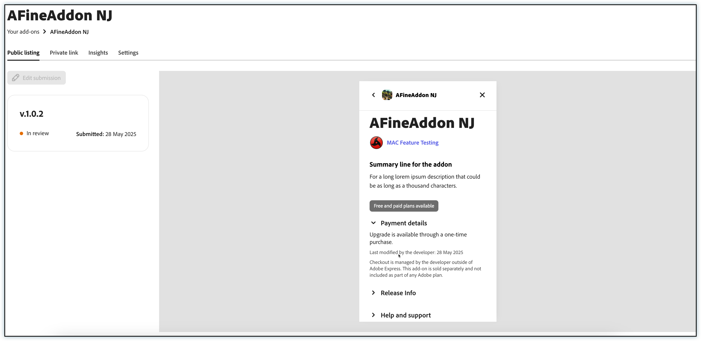
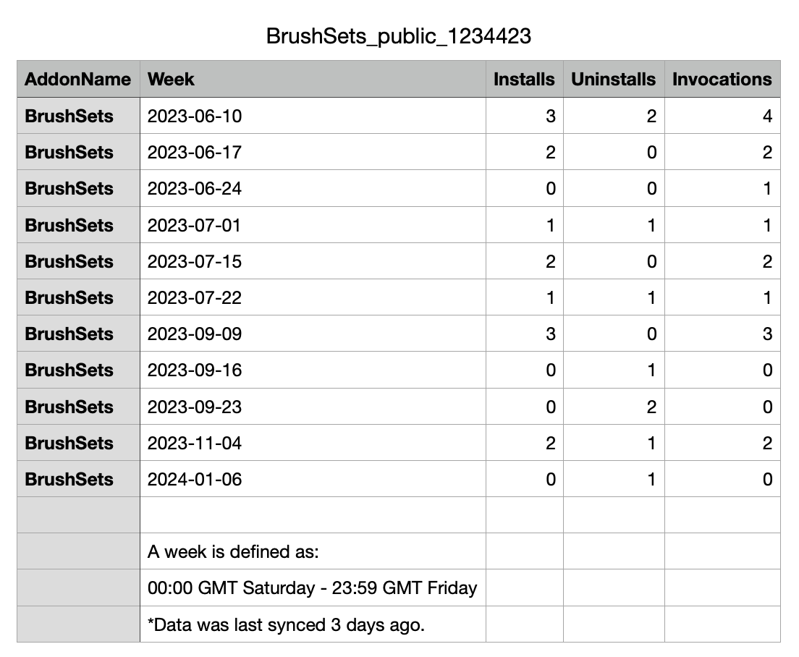

---
keywords:
  - Adobe Express
  - Express Add-on SDK
  - Express Editor
  - Adobe Express
  - Add-on SDK
  - SDK
  - JavaScript
  - Extend
  - Extensibility
  - API
  - Add-on Manifest
  - DSA
title: Public add-on distribution
description: A guide to public distribution of your add-on.
contributors:
  - https://github.com/hollyschinsky
  - https://github.com/undavide
  - https://github.com/nimithajalal
---

# Public add-on Distribution

## Overview

This guide is provided to help ensure your add-on distribution process goes as smoothly as possible. We've provided a list of all of the things you can prepare in advance, as well as the steps to follow to actually submit your add-on for public distribution. Please note that public distribution is subject to a quality review by our team according to our [Guidelines](./guidelines/index.md).

## Preparing for Submission

This section outlines everything you'll need to be prepared for submitting your add-on for public distribution.

### 1. Prepare your metadata

**\* Indicates Required**

|                                 Name | Character Length |                                                                                                                                                                                 Description |
| -----------------------------------: | ---------------- | ------------------------------------------------------------------------------------------------------------------------------------------------------------------------------------------: |
|                   **\* Add-on name** | 25               |                                                                                                                                                              A unique name for your add-on. |
|                       **\* Summary** | 50               |                                                                                                                                               A short description of what your add-on does. |
|              **\* Full Description** | 1000             |                                                                                                                                Full context and description of your add-on and its features |
|                      **\* Help URL** | 1000             |                                                                                                                               URL for your users to get help (ie: https://www.example.com/) |
|         **\* Support email address** | 1000             |                                                                                                                          An email address that users of your add-on can contact for support |
|             **\*Trader information** | NA               | Provide the trader information as per the [listing guidelines](./guidelines/general/listing.md#trader-details) in the publisher profile if you want to make your addons available in the EU |
|                   **Privacy Notice** | 1000             |                                                                                                                                   URL of your privacy notice (ie: https://www.example.com/) |
| **End User License Agreement(EULA)** | 1000             |                                                                                                                               End User License Agreement URL (ie: https://www.example.com/) |
|                         **Keywords** | 100              |                                                                                                                                   Keywords to help users find your add-on (comma-separated) |
|                    **Release notes** | 1000             |                                                                                                                                  Provide information specific to this version of the add-on |

### 2. Prepare your assets

|                   Type | Format     |                                                      Description |
| ---------------------: | ---------- | ---------------------------------------------------------------: |
|        \* 144x144 icon | `.jpg/png` |                    a 144x144 sized icon representing your add-on |
|          \* Screenshot | `.jpg/png` | a 1360x800 sized screenshot to show users how to use your add-on |
| Additional screenshots | `.jpg/png` |       4 more optional 1360x800 sized screenshots for your add-on |
|    \*\* Publisher logo | `.jpg/png` |              250x250 sized logo to represent you or your company |

<InlineAlert slots="text" variant="info"/>

A **publisher logo** is only required the first time you submit for distribution, and if you've never created a publisher profile.

### 3. Prepare your add-on package

The CLI contains a handy script to help with this step. Before you proceed, open your terminal and navigate to the root of your add-on project, then run the following command.

```bash
npm run package
```

The result will be a distributable zip of your add-on package with the name `dist.zip`, and can be uploaded in step 3 below. This add-on package contains the **production-ready built content** in the _root_ of the zip file, similar to what's built into the `/dist` folder.

### 4. Carefully [review our set of guidelines](./guidelines/index.md)

## Submission Steps

This set of steps can be followed when you have everything prepared, have diligently reviewed the guidelines, and are ready to submit your add-on for review via the Adobe Express in-app distribution experience.

### Step 1: Create a new Add-on Listing

To distribute your add-on, you must create an add-on listing.

<InlineAlert slots="text" variant="info"/>

If you have already performed the listing creation steps, e.g. to create a Private Link as outlined here, feel free to skip to
[Step 3](#step-3-create-a-new-public-listing).

Provided that you've enabled Add-on Development in your user's settings as described [here](../../getting_started/quickstart.md#step-3-enable-add-on-development-mode-first-time-only), you can do so in two ways, which will invoke the same in-app distribution experience.

**1.** From the Adobe Express home page, click the Add-ons link in the left-hand navigation.


**2.** While loading a local add-on, click the **Manage add-ons** link in the Add-on Testing section.


In case you haven't created any listings for your add-ons yet, you will see the following.


If you have existing listings, instead, your first screen will display them, alongside the possibility of adding a new one.


Select **Create new** from either, and type the add-on name in the following modal dialog (25 characters max). Your add-on name will be validated when you tab out (or the field loses focus) before you will be allowed to move to the next step. You will know that it's verified by a green checkmark shown, or receive an error that it exists, and you need to choose another.


### Step 2: Add-on Listing Settings

Your add-on container will be created and a settings panel like the one shown below will be presented. Please note the unique subdomain URL from where your add-on will be hosted, and a button to delete the listing if needed.


### Step 3: Create a new public listing

Navigate to the **Public listing** tab, and click the **Create public listing** button to proceed.


### Step 4: Enter listing details

The **"Create a public listing"** page contains a number of form inputs, grouped into logical sections that start as blank.


Fill the details with the requested information. The **Add-on name** must be unique, 25 characters max. It will be validated when you tab out (or the field loses focus) before you can move to the next step. You will know that it's verified by a green checkmark, or you'll receive an error, in which case you'll need to choose another.

The **icon** must be of the size, 144 px. Once you upload an icon, it will be auto-resized into **Minimized add-on module icon(36 px)**, **Panel header icon (64 px)** and **Launchpad icon (144 px)**.


All the other **textual fields** have a character count that update with the remaining amount as you're typing into them. Please ensure your URLs and email addresses are properly formed to avoid unnecessary errors.

<InlineAlert slots="text" variant="success"/>

The `*` indicates required fields. Note that you can skip entering these required fields if you are only planning to save a draft with your current edit, though you will not be able to submit it until they are completed.

Please note the dropdown checklist below the **"Jump to"** label, in the top-left corner: you can use it to scroll to the relevant part of the document—complete sections are marked in green. Also note a Progress bar, indicating how far you are in the listing compilation.


### Step 5: Upload screenshots

In the next section, you should upload 1-5 screenshots to show off your add-on and what it's all about. Please note, at least one screenshot is required.

<InlineAlert slots="text" variant="warning"/>

Sometimes it may take a moment to upload the images to the back-end server, please be patient.

### Step 6: Upload your add-on package

It's time to upload your package. Either drag and drop the add-on package `.zip` file, or click the **browse** link to select the file from your computer's filesystem.

<InlineAlert slots="text" variant="info"/>

In case you missed it, the [top section on preparing your add-on package](#3-prepare-your-add-on-package) can be used to help you create the zip file needed for this step.

The package will go through a verification process which may take a few seconds, so please be patient. In case you receive an error, please review the following warning notes.

<InlineAlert slots="text1, text2, text3, text4" variant="warning"/>

**1.** If you receive a `MANIFEST_NOT_FOUND_ERROR`, instead of zipping the folder containing the add-on files, please zip only the contents. For example, manifest file would be at the **root** level of the extracted package.

**2.** Your add-on package file size must not exceed 50 MB.

**3.** In places where you are referring to paths, please ensure you are only using relative paths.

**4.** Hidden files should not be present in your package zip. You can use this command on MAC to zip your add-on and to ensure unnecessary files are not included: `zip -r your_addon_name.zip . -x '**/.*' -x '**/__MACOSX' -x '*.DS_Store'`. The `package` script [described earlier](#3-prepare-your-add-on-package) takes care of this for you.

If the `zip` validation is successful, you will see a green checkmark next to the **Add-on package verified** text; you can then add some Release Notes (1000 characters max) and check the add-on's supported languages.

### Step 7: Enter the AI usage details

The rise of Generative AI offers significant benefits for add-ons and streamlines content creation and workflows. Adobe encourages user choice regarding add-ons using Generative AI, but transparency is paramount. Your AI-powered add-on must not generate illegal content, and it must be clear and transparent about how generative AI is used in your add-on.

In this section, you'll have to answer a variety of questions, depending on the type of AI-based content your add-on generates, the input it accepts, whether you test the output, etc. Carefully review our [AI usage guidelines](./guidelines/genai/index.md) to get the latest information on Adobe’s requirements and recommendations to try add-ons that employ Generative AI technology.

### Step 8: Enter the monetization details

The **Monetization details** section allows developers to declare the payment option they support for their add-on. A selection is required for any new add-on submitted, and existing add-ons can be updated to include or change the selection. The monetization details entered can be seen in the preview of the listing (on the right) before submission, and in the add-on details once published.


Developers can choose from various payment options, including **free**, **one-time payments**, **recurring subscriptions**, **micro-transactions**, and more. Select the monetization options that suit your preferences best. Use the [examples](./guidelines/monetization.md#requirements-for-monetizing-your-add-ons) outlined in the guidelines for monetizing add-ons to help you make informed decisions about which options to choose.

- The _Other_ option is provided for developers to choose when their current setup does not fit the provided options.
- The final _additional details_ text area allows developers to provide additional payment terms like _"7 day free trial"_ or _"$9.99/month"_ and is optional for all payment choices except _Other_. We encourage the use of this field to clearly state any specific payment details.

Do check in the live preview how the listing will appear to users. Depending on the payment selection, different details will automatically be displayed in the add-on listing.

If the payment choice selected is not free, an **Upgrade available** badge will be displayed in the details along with specific default text describing the choice selected (ie: "_...for a one-time purchase_", "_...with a recurring subscription_", "_...purchase assets or features individually or in packages_"), and **Checkout is handled by the developer outside of Adobe Express**—as shown in the previous screenshot.

Any additional custom details entered by the developer are then shown below the default checkout message, as well as a timestamp indicating when the listing was last updated.

In the case of the **free** payment selection, the following text simply be shown: "This add-on does not require any payment".

<!-- If you wish to explore alternative monetization methods for your add-on, you may do so by selecting **Other** and providing relevant details in the **Additional Details** section. This information will be visible to Adobe Express users within the add-on details. We recommend clearly stating the pricing for add-on upgrades, any recurring fees, and any additional costs that users may encounter. -->

Carefully review our [monetization guidelines](./guidelines/monetization.md) to get the latest information on Adobe’s requirements and recommendations for monetizing your add-ons.

### Step 9: Create a publisher profile

<InlineAlert slots="text" variant="info"/>
You will only see this step the first time you submit an add-on and if you've never created a publisher profile before to this submission.

- Fill your publisher profile details.
- Upload a 250x250 logo.
- Add your trader details: In accordance with the European Union Digital Services Act trader requirements, developers who wish to distribute their listings in the EU must provide additional information in their publisher profile. [Learn more](./guidelines/general/listing.md#trader-details) about adding trader details.

#### Edit publisher profile

The existing developers can now edit their publisher profile to add trader details.

Choose **Yes** if you wish to make your add-ons available for users in the EU.

<InlineAlert variant="warning" slots="text1, text2, text3" />

**Are you an existing developer?**

You must provide trader details by February 16, 2025, to keep your add-on visible and available in Adobe Express for users in the European Union as of February 17, 2025. This trader information will be displayed publicly on your listing detail pages when viewed from EU countries.

[Add trader details now.](https://new.express.adobe.com/add-ons?mode=submission)


### Step 10: Final submission

- Enter your **Notes to reviewer**
  - Add there any relevant information for the vetting team, including coupon codes that may allow them to test premium features for free. Carefully review all the information entered.
- Click the **Submit for review** button in the top-right corner.


<InlineAlert slots="text" variant="warning"/>

The **Submit for review** button will only be enabled if you have entered all of the required data.

In case there are any errors, a message will be displayed at the bottom of the page. Follow the instructions to fix them, and try submitting again.

Eventually, the submission will be successful. Congratulations!

Click **View submission details** to see the details of your add-on submission.

You can choose to revisit your submission details later if you need to update it, or if you want to download insights for your add-on. To do so, choose **Manage add-ons** from the add-on launchpad again, and then select your add-on listing.

<InlineAlert variant="warning" slots="header, text1, text2" />

Add-on visbility for EU users

If an EU user has a deep link to your add-on, and you are not compliant with the [European Union Digital Services Act](https://eur-lex.europa.eu/legal-content/EN/ALL/?uri=CELEX:32022R2065) trader requirements, they will not be able to install the add-on. However, if they have already installed it, they will still be able to use it. In both cases, they will see a banner with the following message:

_This listing is not currently available in the EU. This developer has not submitted the trader information required by the EU Digital Services Act._

## Post-Submission details and insights

When the add-on will be published, you will see the details, as shown in the screenshot below.



If you select the **Insights** tab, you'll be able to get analytics for your add-on, via the **Download** buttons.


The insights come as `.csv` files named like your add-on, and appended with `_public` or `_private` depending on the listing type (e.g., `AFineAddOn_private.csv`). The insights data currently includes the number of installs, uninstalls and invocations of your add-on per week. A sample is shown below for reference:


