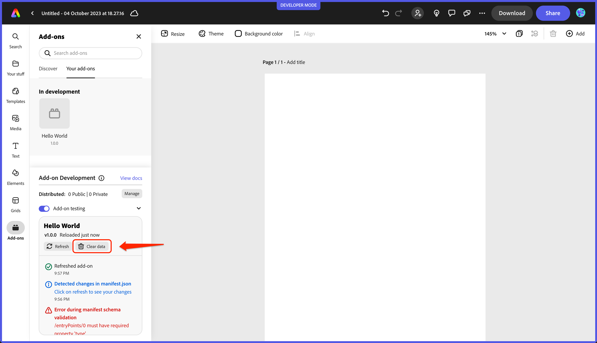

# Add-on Developer Tools

### Status messages

The **Add-on developer tools** panel provides useful information via status messages like below to indicate when and where an error is occurring to help you target specific issues in your add-on. For instance, if an invalid value is found in the manifest, you will see something like the following:

### Refreshing and clearing data

The **Refresh** and **Clear data** buttons in the Add-on developer tools can also be helpful when you want to manually force refresh your code (or when you update the manifest), or clear data you no longer want to persist. For instance, in the case of the ToDo list sample add-on (aka: `use-client-storage`), if you had added some items previously they will still be displayed when you open it again unless you actually clear the data. See the demo workflow video at the bottom of the boilerplate section for an example of this in action.

<InlineAlert slots="text" variant="success"/>

The ToDo list sample takes advantage of the Add-on SDK's `ClientStorage` API which stores data to an underlying IndexedDB store. You can also view this store in the browser developer tools by going into the `Application` tab and locating the IndexedDB store with your add-on ID associated with it, such as in the following:

<InlineAlert slots="text" variant="info"/>

See [the Add-on SDK section](../3-WritingCode/add-on-sdk.md) for more details about storing and persisting data with your add-ons.
