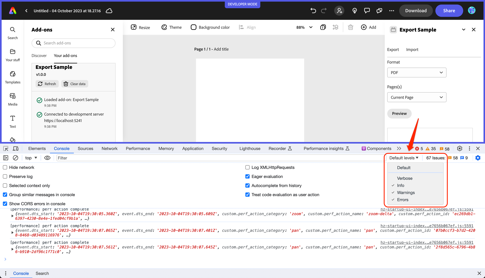
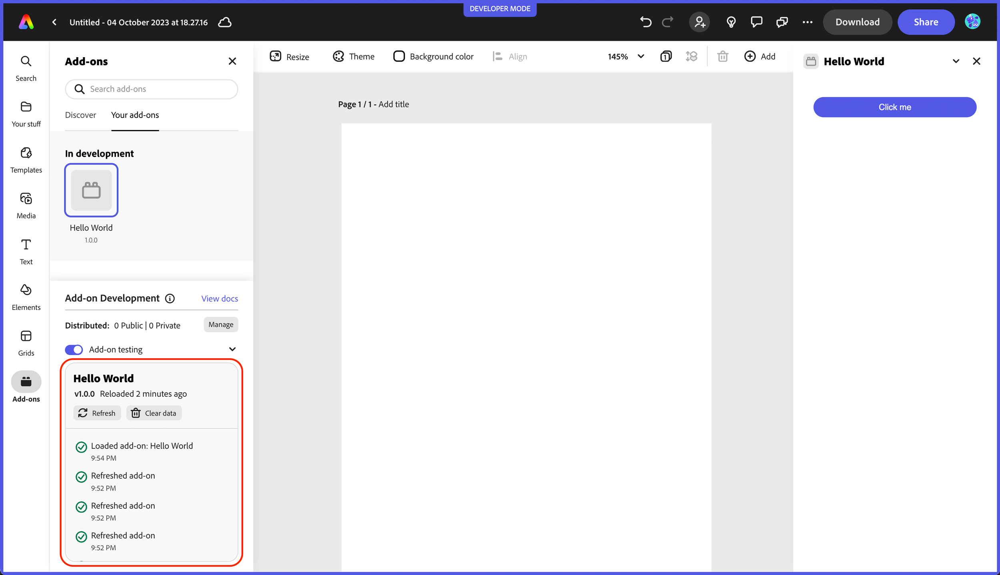
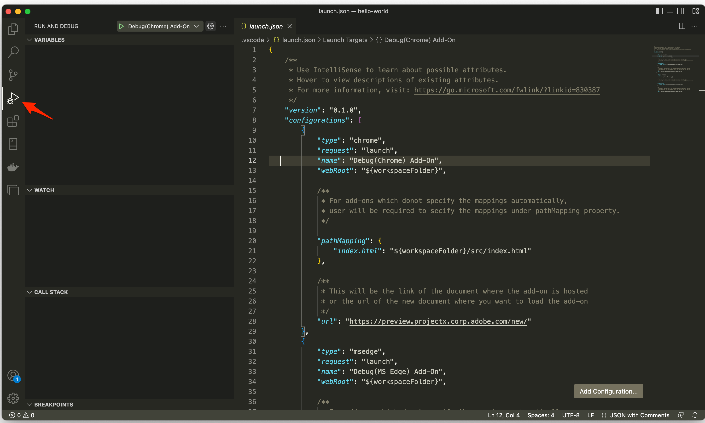
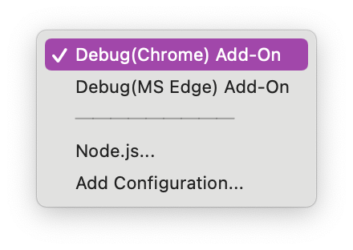
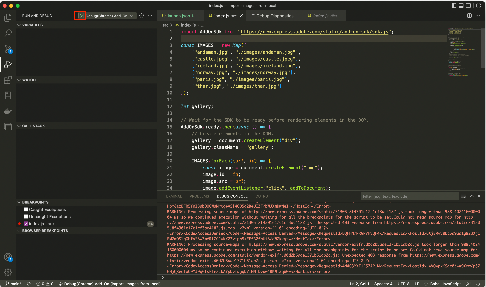

# Debugging Tools

## Browser Developer Tools

You can use the built-in developer tools of your browser to do in-depth debugging while your add-on is loaded and running, including setting breakpoints and stepping through your code, and logging messages to the console. An example of debugging with the browser developer tools is shown in the video below:

<br/>

<iframe aria-label="Browser Debugging Demo" src="https://drive.google.com/file/d/13FHUuRpVti9AH4nUwAMcvNcP6OzGpOc1/preview" width="640" height="480"></iframe>


### Console Messages

You can also log messages from different places in your code with certain severity levels to help you filter what you're looking for further when you're looking in the developer tools console. However, since the browser is running many other things into the same page, you will see a lot of messages in the console. A good practice is to use some identifier in your messages and filter the message that way. For instance, each `console.*` method represents severity level, such as `Info`, `Warning`, `Error`, `Verbose`. Some examples are below, and you can see [this link](https://developer.chrome.com/docs/devtools/console/api/) for more details:

```
    console.log('Info level)
    console.warn('Warning level')
    console.error('Error level)
    console.debug(Verbose level)
```

You can also specifically set which levels you want to view in the developer tools with the **Custom levels** drop-down as well to help you find your specific messages more quickly:



### Printing JSON Data

Another useful console method is the `.dir()` which prints a JSON representation of the object, such as `console.dir(document.head);` which would produce the following:


## Add-on Developer Tools



### Status messages

The **Add-on developer tools** panel provides useful information via status messages like below to indicate when and where an error is occurring to help you target specific issues in your add-on. For instance, if an invalid value is found in the manifest, you will see something like the following:


### Refreshing and clearing data

The **Refresh** and **Clear data** buttons in the Add-on developer tools can also be helpful when you want to manually force refresh your code (or when you update the manifest), or clear data you no longer want to persist. For instance, in the case of the ToDo list sample add-on (aka: `use-client-storage`), if you had added some items previously they will still be displayed when you open it again unless you actually clear the data. See the demo workflow video at the bottom of the boilerplate section for an example of this in action.


<InlineAlert slots="text" variant="success"/>

The ToDo list sample takes advantage of the Add-on SDK's `ClientStorage` API which stores data to an underlying IndexedDB store. You can also view this store in the browser developer tools by going into the `Application` tab and locating the IndexedDB store with your add-on ID associated with it, such as in the following:


<InlineAlert slots="text" variant="info"/>

See [the Add-on SDK section](../3-WritingCode/add-on-sdk.md) for more details about storing and persisting data with your add-ons.

## Debugging with Visual Studio Code 
You can use VS Code to debug your add-ons. An example of this workflow is shown in the video below for reference:

<iframe aria-label="Debugging VS Code Demo" src="https://drive.google.com/file/d/1at1jXCTIi9TZWxwFn11su0PeEQZhUGFC/preview" width="640" height="480"></iframe>


### Steps
The steps to debug in VS Code are also here for quick reference.

- For any add-ons that were generated with the CLI, start by locating the existing `launch.json` file in the `.vscode` folder in the root of your project. Double check to ensure the URL points to `https://new.express.adobe.com/new/`. 

<InlineAlert slots="text,image" variant="info"/>

If it's a sample add-on that you downloaded, you will need to create one first with the "create a launch.json file" and copy in the JSON configuration included below (or copy one in from an add-on you previously generated). 


 Start your add-on from your terminal as normal with `npm run start`.

- Back in VS Code, click the **Run and Debug** option from the left panel and then select the profile related to where you want to debug (note that Chrome is the first one and selected by default but you can modify your configuration in the `launch.json` to your liking).

    

    

- Once you have your selection set from above, simply hit the green play button outlined below to start debugging.

    

- A new browser window will open for your debugging session directly to the Express URL you configured above. Connect to your add-on as you normally would in Express.

- You can now set breakpoints as desired, and you will see the code execution stop with the line highlighted. You can also check the **DEBUG CONSOLE** window to see any console output directly in VS Code.

  

- Also note the toolbar that's added to the top of your screen in VS Code when you're in debug mode which allows you to step through your code after it's been stopped on a breakpoint. 

    
