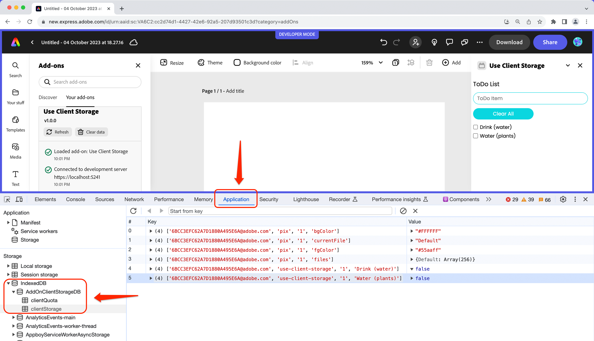

# Browser Debugging
You can use the built-in developer tools of your browser to do in-depth debugging while your add-on is loaded and running, including setting breakpoints and stepping through your code, and logging messages to the console. 

## Browser Developer Tools
To access the developer tools, you can simply right-click on the browser window and select "Inspect Element" or "Inspect" from the context menu. This will open the developer tools window, which provides a wide range of debugging and development features.

Some of the key debugging features that are available in the developer tools include:

- **Console** - The console allows you to log messages and errors from your code, as well as execute JavaScript code and interact with the page or add-on.
- **Debugger** - The debugger allows you to set breakpoints in your code and step through it line by line, so you can see exactly what's happening at each stage of execution.
- **Network Monitor** - The network monitor allows you to monitor the network requests made by your add-on, so you can see how it's interacting with other resources and services.
- **Profiler** - The profiler allows you to analyze the performance of your add-on and identify areas where it may be slow or inefficient.

Using these tools, you can gain a deep understanding of how your add-on is working, identify and fix bugs, and optimize its performance.

<!-- You can use the built-in developer tools of your browser to do in-depth debugging while your add-on is loaded and running, including setting breakpoints and stepping through your code, and logging messages to the console. An example of debugging with the browser developer tools is shown in the video below:

<br/> -->

<!-- <iframe aria-label="Browser Debugging Demo" src="https://drive.google.com/file/d/13FHUuRpVti9AH4nUwAMcvNcP6OzGpOc1/preview" width="640" height="480"></iframe> -->


### Console
When logging messages in your code, use the appropriate severity level that best describes the message. For example, an **Info** message might be used to provide general information about the application's state, while a **Warning** message might be used to alert developers about potential issues that could cause problems with the add-on. Similarly, an **Error** message might be used to indicate that an unexpected error has occurred, and a **Verbose** message might be used to provide detailed information about the add-on's internal workings.


<!-- You can log messages from different places in your code with certain severity levels to help you filter what you're looking for further when you're looking in the developer tools console. However, since the browser is running many other things into the same page, you will see a lot of messages in the console. A good practice is to use some identifier in your messages and filter the message that way. For instance, each `console.*` method represents severity level, such as `Info`, `Warning`, `Error`, `Verbose`. Some examples are below, and you can see [this link](https://developer.chrome.com/docs/devtools/console/api/) for more details:

```
    console.log('Info level)
    console.warn('Warning level')
    console.error('Error level)
    console.debug(Verbose level)
```

-->

 Each `console.*` method represents a severity level, such as `Info`, `Warning`, `Error`, `Verbose`. 

```
    console.log('Info level)
    console.warn('Warning level')
    console.error('Error level)
    console.debug(Verbose level)
```

You can specifically filter which levels you want to view in the developer tools with the **Custom levels** drop-down as well to help you find your specific messages more quickly:


To make it easier to filter and identify relevant messages in the console, it's also a good practice to include an identifier in your messages. This identifier could be a unique string or tag that is specific to your add-on, making it easier to distinguish your messages from other messages in the console.

<!-- For example, you might usin a tag like [MyAddOn] at the beginning of each message to identify messages that are related to your add-on. This can help you quickly filter out irrelevant messages and focus on the ones that are important for debugging. -->

Using appropriate severity levels and including identifiers in your console messages can greatly help improve the efficiency and effectiveness of your debugging, making it easier to identify and resolve issues.

### Printing JSON Data
A helpful console method is `.dir()`, which displays a JSON representation of an object. For example, running `console.dir(document.head)` would generate the following output:


## Add-on SDK Developer Tools
The **Add-on Development** tools panel provides useful logging details and action buttons to allow for refreshing and clearing the data associated with your add-on, which are also useful for debugging and troubleshooting your add-on.


### Status messages

The **Add-on Development** panel also provides useful information via status messages like below to indicate when and where an error is occurring to help you target specific issues in your add-on. For instance, if an invalid value is found in the manifest, you will see something like the following:


### Refreshing and clearing data

The **Refresh** and **Clear data** buttons in the add-on developer tools can also be helpful when you want to manually force refresh your code (or when you update the manifest), or clear data you no longer want to persist. For instance, in the case of the ToDo list sample add-on (aka: `use-client-storage`), if you had added some items previously they will still be displayed when you open it again unless you actually clear the data. See the demo workflow video at the bottom of the boilerplate section for an example of this in action.


<InlineAlert slots="text" variant="success"/>

The ToDo list sample takes advantage of the add-on SDK's `ClientStorage` API which stores data to an underlying IndexedDB store. You can also view this store in the browser developer tools by going into the `Application` tab and locating the IndexedDB store with your add-on ID associated with it, such as in the following:




<InlineAlert slots="text" variant="info"/>

See [the Client Storage API](../../references/index.md#client-storage) for more details about storing and persisting data with your add-ons.