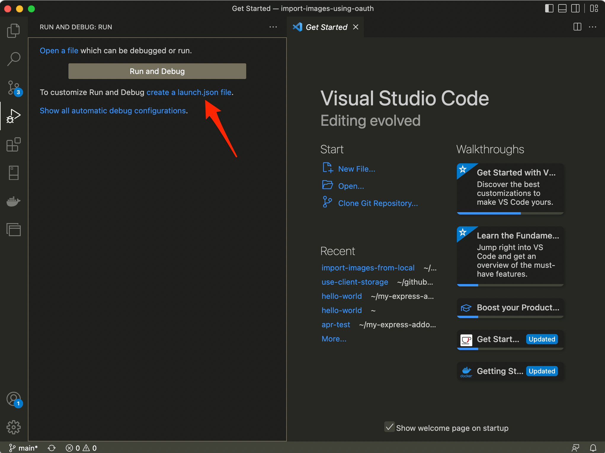
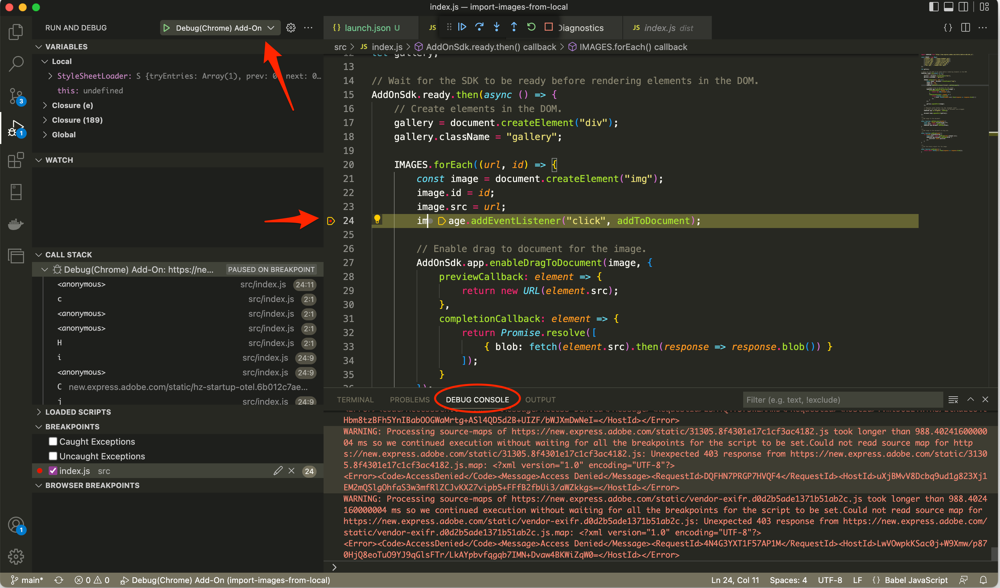
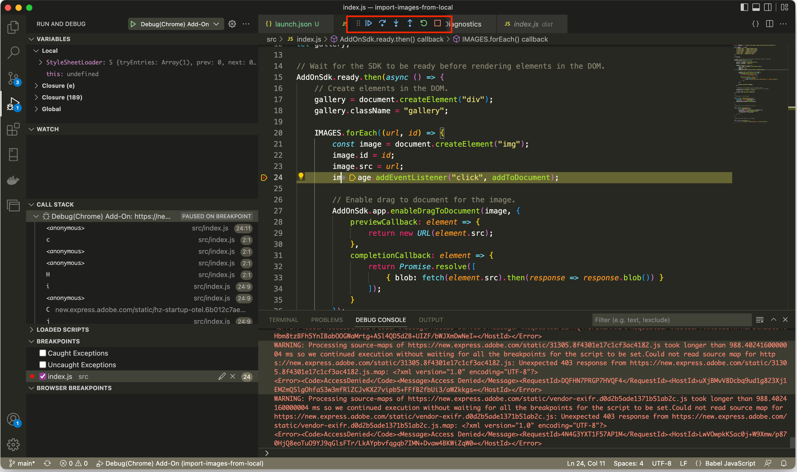

# Debugging with Visual Studio Code

If you are a Visual Studio Code user, you can easily debug your add-on by following the steps in this guide.

## Steps

1. Begin by locating the existing `launch.json` file in the `.vscode` folder in the root of your project. This file will exist if you have created your add-on with the add-on CLI. Double check to ensure the URL points to `https://new.express.adobe.com/new/`.

   **NOTE:** If it's a sample add-on that you downloaded, you may need to create one first with the **create a launch.json file**.

   

 Then copy in the JSON configuration included below (or copy one in from an add-on you previously generated).

  ```json
  {        
    "version": "0.1.0",
    "configurations": [
        {
            "type": "chrome",
            "request": "launch",
            "name": "Debug(Chrome) Add-On",
            "webRoot": "${workspaceFolder}",

            /**
            * For add-ons which donot specify the mappings automatically,
            * user will be required to secify the mappings under pathMapping property.
            */

            "pathMapping": {
                "index.html": "${workspaceFolder}/src/index.html"
            },

            /**
            * This will be the link of the document where the add-on is hosted
            * or the url of the new document where you want to load the add-on
            */
            "url": "https://new.express.adobe.com/new/"
        },
        {
            "type": "msedge",
            "request": "launch",
            "name": "Debug(MS Edge) Add-On",
            "webRoot": "${workspaceFolder}",

            /**
            * For add-ons which donot specify the mappings automatically,
            * user will be required to secify the mappings under pathMapping property.
            */

            "pathMapping": {
                "index.html": "${workspaceFolder}/src/index.html"
            },

            /**
            * This will be the link of the document where the add-on is hosted
            * or the url of the new document where you want to load the add-on
            */
            "url": "https://new.express.adobe.com/new/"
        }
    ]
  }
  ```

2. Start your add-on from your terminal as normal with `npm run start`.

3. Back in VS Code, click the **Run and Debug** option from the left panel and then select the profile related to where you want to debug (note that Chrome is the first one and selected by default but you can modify your configuration in the `launch.json` to your liking).

    

    

4. Once you have your selection set from above, simply hit the green play button outlined below to start debugging.

    

5. A new browser window will open for your debugging session directly to the Express URL you configured above. Connect to your add-on as you normally would in Express.

6. You can now set breakpoints as desired, and you will see the code execution stop with the line highlighted. You can also check the **DEBUG CONSOLE** window to see any console output directly in VS Code.

  

7. Note the toolbar added to the top of your screen in VS Code when you're in debug mode which allows you to step through your code after it's been stopped on a breakpoint.

  
