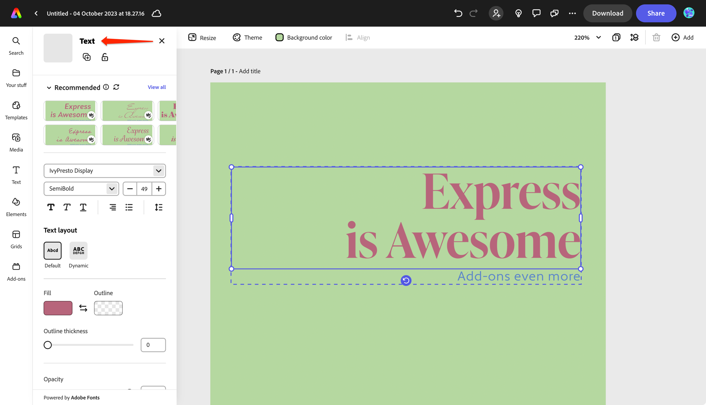

# Design Overview

## Tips  
Use the existing Express UI as an example of the types of patterns and behaviors to use in your own add-on design. For instance, you could take a closer look at the other panels and how the UI is implemented in them to help guide you, such as the Media, Theme and Text panels shown below, which are already part of Express. 

## Useful Resources
- [Adobe XD plugin that provides Spectrum UI elements](https://adobe.com/go/cc_plugins_discover_plugin?pluginId=f4771cd5&workflow=share), including the Express look.
- [Figma plugin](https://www.figma.com/community/file/1211274196563394418/Adobe-Spectrum-Design-System) that provides Spectrum UI elements.

<InlineAlert slots="text" variant="success"/>
Official design guidelines coming soon!