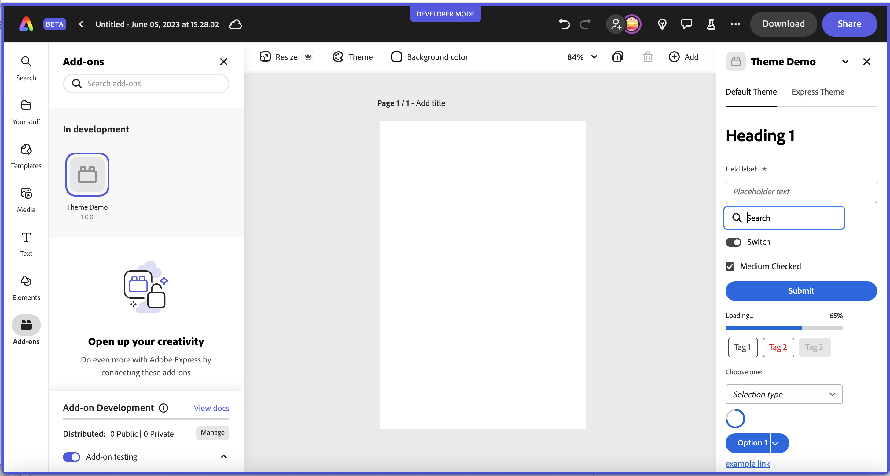
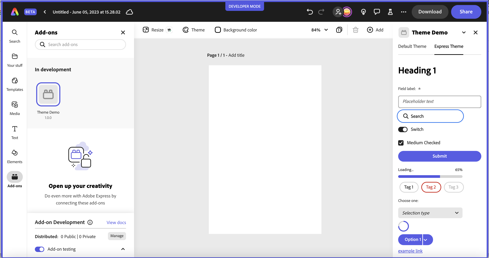
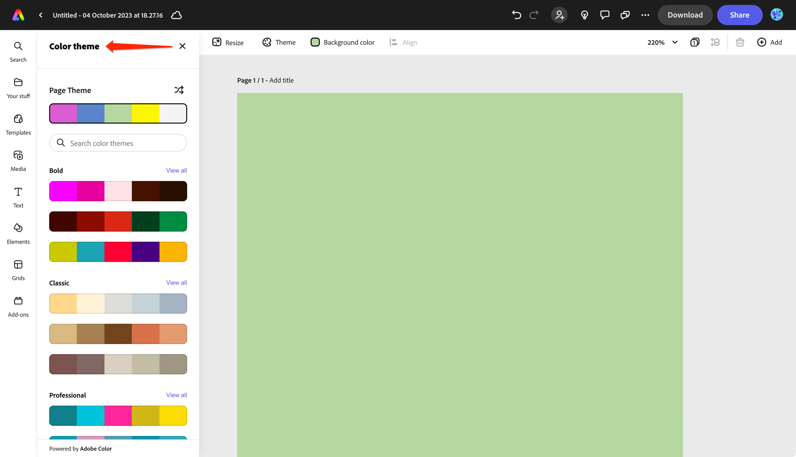

# Design Overview
The design of your add-on is just as important to the success of your add-on as the features it provides. This design section is provided to help lead you through the design process with useful guidelines, tips and resources.

## Spectrum Design System
Adobe provides the [Spectrum Design System](https://spectrum.adobe.com/) which contains a comprehensive set of design guidelines, components and tools to help designers create a consistent user experience across products. Leveraging Spectrum in your add-on allows you to take advantage of all of the built-in benefits it provides while saving front-end development time. There are a few different implementations of Spectrum that are listed here for reference, and in order of preferred use. 

<InlineAlert slots="text" variant="info"/>

Check out our [code samples](../../samples.md) for examples of how to use the libraries described here. Refer to the **export-sample** and **Pix** sample for a reference on using **Spectrum Web Components**, and the **Dropbox** and **import-images-using-oauth** for specific examples using **React Spectrum**. 

## Spectrum Express Theme
If you want your add-on UI to match the [Express look-and-feel](https://spectrum.adobe.com/page/theming/#Resources-for-Spectrum-for-Adobe-Express), you can find Express-themed components available within the [Spectrum CSS](https://github.com/adobe/spectrum-css), [Spectrum Web Components](https://opensource.adobe.com/spectrum-web-components/tools/theme/) and [React Spectrum](https://www.npmjs.com/package/@react-spectrum/theme-express) libraries. Each of the sections below has more details on how to use the theme with the different libraries. 

<InlineAlert slots="text" variant="info"/>

Check out the variety of icons available for use in your add-ons as well from [Spectrum here](https://spectrum.adobe.com/page/icons/). There's also a set of icons for the Express theme in an alpha stage currently available. To use those, install the package with `npm i @spectrum-icons/express`. Then you can use them by importing them. See the above steps for an example of how to import and use an icon. 

## Spectrum Web Components
The [Spectrum Web Components](https://opensource.adobe.com/spectrum-web-components/) project is an implementation of Spectrum with a set of pre-built UI components that can be easily customized and integrated into your application. These components are designed to work seamlessly together and provide a consistent user experience across different devices and platforms. ***We highly recommend Spectrum Web Components as the preferred approach for building the UI of your add-ons***, since it offers a comprehensive set of components and built-in benefits that make it easy to create consistent, accessible, and responsive user interfaces. Some additional benefits include:

  - Framework agnostic
  - Lightweight and performant
  - Standards based

<!-- <InlineAlert slots="text" variant="important"/>

The [Spectrum Web Components](https://opensource.adobe.com/spectrum-web-components) (or [swc-react](https://opensource.adobe.com/spectrum-web-components/using-swc-react) are the preferred approach to use for building the UI in your add-ons since it currently offers the most comprehensive set of components and built-in benefits.  -->

### Spectrum Web Components with React
[**swc-react**](https://opensource.adobe.com/spectrum-web-components/using-swc-react/) is a collection of React wrapper components for the Spectrum Web Components (SWC) library, allowing you to use SWC in your React applications with ease. Currently, `swc-react` supports 62 components. To install `swc-react`, simply replace the scope name `"@spectrum-web-components"` with `"@swc-react"` in the package naming convention. The sub-package name remains identical to the original SWC component. Check out [this page](https://opensource.adobe.com/spectrum-web-components/using-swc-react/) for more details on swc-react. 

<InlineAlert slots="text" variant="info"/>

We recommend using `swc-react` over [React Spectrum](#react-spectrum) in your add-ons based in React because it currently offers a more comprehensive set of components and built-in benefits. 


### Spectrum Web Components with Express Theme
Below are the steps for using the Express theme with your Spectrum Web Components UI:

- Install the `spectrum-web-components` packages you would like to use. The `theme` package is one you will always want to install, but the others are included for illustration. See the [Spectrum Web Components site](https://opensource.adobe.com/spectrum-web-components/getting-started/) for all of the components available.

    ```bash
    npm install @spectrum-web-components/theme
    npm install @spectrum-web-components/field-label        
    npm install @spectrum-web-components/textfield
    npm install @spectrum-web-components/button
    ```

- Next, start adding your imports. All add-ons should have this base set of imports, which provide support for Spectrum typography, the Express themes, including colors (lightest, light, dark, and darkest) and scale (medium, large). 

    ```js        
    import '@spectrum-web-components/styles/typography.css';
    import '@spectrum-web-components/theme/sp-theme.js';
    import '@spectrum-web-components/theme/src/express/themes.js';       
    ``` 

- Then import the specific components you want to use in your code, such as: 
    
    ```js
    import '@spectrum-web-components/button/sp-button.js';
    import '@spectrum-web-components/field-label/sp-field-label.js';
    import '@spectrum-web-components/textfield/sp-textfield.js';
    ```
    
   **Note:** The `import '@spectrum-web-components/theme/src/express/themes.js';` includes all of the definitions for the Express theme, but you can also only include the specific parts you need. For instance, if you only want to support the light theme and the medium scale, you could specifically include those with: `import '@spectrum-web-components/theme/express/theme-light.js'; import '@spectrum-web-components/theme/express/scale-medium.js';` For more details on themes and all of the color and scale options, see [this link](https://opensource.adobe.com/spectrum-web-components/tools/theme/). 


- Use a `webpack.config.js` for bundling the Spectrum Web Components and your JavaScript into a bundle. If you used the basic javascript template for your add-on, you can copy it in from a sample add-on, such as the SWC one in the contributed samples folder. Also be sure to include the webpack specific dependencies and script options in your `package.json`, which you can also copy from a sample like SWC. If you find that some files aren't being moved to `dist` after you build, you'll want to edit the file (line 31,32) to add more file types to copy. 

- Now you can use the `scale`, `color` and `theme` selections you desire with the `<sp-theme>` component. Within those tags is where you should place all of your content that you want styled with those settings. For example:
    ```html
    <body>
        <sp-theme scale="medium" color="light" theme="express">   
            /* Everything you want styled with those settings */
            /* goes within the <sp-theme/> tag */
            <sp-field-label required for="txtName">Enter your full name in the field below</sp-field-label>
            <sp-textfield multiline grows id="txtName" placeholder="Full Name"></sp-textfield>
            <sp-button>Submit</sp-button>
        </sp-theme>                    
    </body>
    ```

#### Default vs Express Theme
The screenshots below are from a Spectrum Web Components sample app showing some an example of how the components differ between the themes to illustrate some differences for reference. 

##### Default Theme sample:


##### Express Theme sample:


<InlineAlert slots="text" variant="info"/>

Check out the [code samples](../../samples.md) in the contributed folder for **SWC** and **Pix** for examples of using Spectrum Web Components with plain JavaScript and React accordingly. 

## React Spectrum
[React Spectrum](https://react-spectrum.adobe.com/react-spectrum/index.html) is a project that implements the Adobe's Spectrum design language into React UI components.

  React Spectrum is composed of three parts:

  - **react-spectrum**: a component library implementing the Adobe Spectrum design system
  - **react-aria**: a library of React hooks implementing the patterns defined in the ARIA practices spec, including mouse, touch, and keyboard behavior, accessibility, and internationalization support
  - **react-stately**: a library of React hooks implementing cross platform (e.g. web/native) state management for components that need it.

### React Spectrum with Express Theme
[The React Spectrum Express theme](https://www.npmjs.com/package/@react-spectrum/theme-express) is still in an alpha stage currently, but can be used with the following steps:

1. Install it in your project with:

    `npm install @react-spectrum/theme-express`

2. Install the Express themed icons:

    `npm install @spectrum-icons/express`

3. Import the theme and icons into your code to use them. For example, notice the following code snippet which imports and sets the Express `theme`, light `colorScheme` option and medium `scale` option on the `<Provider>` object. It also illustrates how to use the Express version of the `Delete` icon.  
    
    ```js
    import { theme as expressTheme } from '@react-spectrum/theme-express';
    import Delete from '@spectrum-icons/express/Delete';

    const App = ({ addOnSdk }) => {
        return (
            <Provider theme={expressTheme} colorScheme="light" scale="medium">
                <Button variant="accent"><Delete/></Button>  
            </Provider>       
        )
    }
    ```

#### React Spectrum Theme Examples
Below is an example of some components from React Spectrum with the two themes. Please note, since the [React Spectrum with Express theme project](https://www.npmjs.com/package/@react-spectrum/theme-express) is still in an alpha state, there will be components that haven't been completely ported over yet.

##### Default theme sample:


##### Express theme sample:


<InlineAlert slots="text" variant="info"/>

The [React Spectrum Express theme](https://www.npmjs.com/package/@react-spectrum/theme-express) is still in an alpha state, but you can use [Spectrum Web Components](https://opensource.adobe.com/spectrum-web-components/tools/theme/) with React as well. See the **Pix** code sample in the provided samples for an example of how to mix Spectrum Web Components with React. Specifically, you should note that there are some intricacies when using this combination of Spectrum Web Components and React in terms of event handling, but they can be handled by using a component that wraps the Spectrum Web Components for providing the event handling instead. In the **Pix** sample, take a look at the wrapper component called `WC.jsx` for a reference of how to do this.

#### CAUTION: Using React Spectrum with a Slider Component
If you're using a slider component with React Spectrum, you may notice behavior where if the user moves their mouse out of the panel and releases the mouse pointer, the slider still thinks the mouse pointer is down when the mouse is moved back inside the panel. You can fix this with the following steps:

1. Wrap your slider(s) with another element. A &lt;div&gt; works fine.
2. Add a ref that points to this div so you can refer to it later. 
3. Add two event handlers:
    - `onPointerDownCapture` will call `sliderContainer.current.setPointerCapture(evt.nativeEvent.pointerId)`
    - `onPointerUp` will call `sliderContainer.current.releasePointerCapture(evt.nativeEvent.pointerId)`

**Example Snippet**
```js
import React, {useRef} from "react";

import { theme as expressTheme } from '@react-spectrum/theme-express';
import {Slider, Provider} from '@adobe/react-spectrum'

const App = ({ addOnSdk }) => {
    const sliderContainer = useRef();
    const startDrag = (evt) => {
        sliderContainer.current.setPointerCapture(evt.nativeEvent.pointerId);
    }
    const stopDrag = (evt) => {
        sliderContainer.current.releasePointerCapture(evt.nativeEvent.pointerId);
    }
    return <>
        <Provider theme={expressTheme} colorScheme="light" scale="medium">
            <div ref={sliderContainer} onPointerDownCapture={startDrag} onPointerUp={stopDrag}>
                <Slider label="Cookies to buy" defaultValue={12} />
            </div>
        </Provider>
    </>
};

export default App;
```

## Spectrum CSS
[Spectrum CSS](https://opensource.adobe.com/spectrum-css/) is an open-source implementation of Spectrum and includes components and resources to make applications more cohesive. Spectrum CSS is designed to be used in partnership with [Spectrum’s detailed usage guidelines](https://spectrum.adobe.com/).


<InlineAlert slots="text" variant="warning"/>

You should only rely on using the base [Spectrum CSS](https://opensource.adobe.com/spectrum-css/) library for simple applications that need basic things like typography, checkboxes, text fields, etc. Otherwise you should try using one of the other implementations provided like [Spectrum Web Components](https://opensource.adobe.com/spectrum-web-components/) and [React Spectrum](https://react-spectrum.adobe.com/react-spectrum/index.html) since they include interactivity, event handling etc built-in over what's possible with pure CSS. The best place to start with each of these libraries is to go to the **Getting Started** page in the top of the docs for each. 


## Tips  
Use the existing Adobe Express UI as an example of the types of patterns and behaviors to use in your own add-on design. For instance, you could take a closer look at the other panels and how the UI is implemented in them to help guide you, such as the Media, Theme and Text panels shown below, which are already part of Express. 

#### Media Panel


#### Theme Panel


#### Text Panel


<InlineAlert slots="text" variant="success"/>

**Color Picker Component Tip:**
If you're using the native browser color picker, it looks slightly different in every browser and doesn't fit the Express theme by default. You can make this control look more like Spectrum with CSS as [illustrated in this codepen](https://codepen.io/kerrishotts/pen/QWZazJP) for reference.

## Useful Resources
<!-- - [Adobe XD plugin that provides Spectrum UI elements](https://adobe.com/go/cc_plugins_discover_plugin?pluginId=f4771cd5&workflow=share), including the Express look. -->
- [Figma plugin](https://www.figma.com/community/file/1211274196563394418/Adobe-Spectrum-Design-System) that provides Spectrum UI elements.
