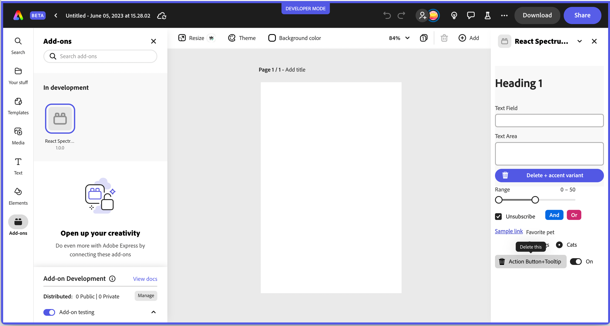

# Introduction to Spectrum 
Adobe provides the [Spectrum Design System](https://spectrum.adobe.com/) which contains a comprehensive set of design guidelines, components and tools to help designers create a consistent user experience across products. It's also available in the following open-source implementations to cover a variety of needs. We highly recommend checking it out for use in your own add-ons.

- [Spectrum CSS](https://opensource.adobe.com/spectrum-css/) - Spectrum CSS is an open-source implementation of Spectrum, Adobe’s design system. It includes components and resources to make applications more cohesive. Spectrum CSS is designed to be used in partnership with [Spectrum’s detailed usage guidelines](https://spectrum.adobe.com/).

- [Spectrum Web Components](https://opensource.adobe.com/spectrum-web-components/) - **PREFERRED** 

The Spectrum Web Components project is an implementation of Spectrum, Adobe’s design system. It's designed to work with any web framework — or even without one. Some benefits to using Spectrum Web Components include:
    
    - Framework agnostic
    - Lightweight    
    - Accessible by default 
    - Standards based

- [React Spectrum](https://react-spectrum.adobe.com/react-spectrum/index.html)-  The React Spectrum project implements the Adobe's Spectrum design language into React UI components.

    React Spectrum is composed of three parts:

    - **react-spectrum**: a component library implementing the Adobe Spectrum design system
    - **react-aria**: a library of React hooks implementing the patterns defined in the ARIA practices spec, including mouse, touch, and keyboard behavior, accessibility, and internationalization support
    - **react-stately**: a library of React hooks implementing cross platform (e.g. web/native) state management for components that need it.

    React Spectrum enables accessibility and common behavior to be handled out of the box. Leveraging React Spectrum in your App Builder application allows you to save front end development time, and focus on styling and other design specific features that can be built on top of the library.


<InlineAlert slots="text" variant="info"/>

You should only rely on using the base [Spectrum CSS](https://opensource.adobe.com/spectrum-css/) library for simple applications that need basic things like typography, checkboxes, text fields, etc. Otherwise you should try using one of the other implementations provided like [Spectrum Web Components](https://opensource.adobe.com/spectrum-web-components/) and [React Spectrum](https://react-spectrum.adobe.com/react-spectrum/index.html) since they include interactivity, event handling etc built-in over what's possible with pure CSS. The best place to start with each of these libraries is to go to the **Getting Started** page in the top of the docs for each. 

<InlineAlert slots="text" variant="success"/>

Check out the [code samples](guides/develop/samples) for examples that use the above libraries. Currently you can refer to the **export-sample** and **Pix** sample for a reference on using **Spectrum Web Components**, and the **Dropbox** and **import-images-using-oauth** can be referred to for specific examples using **React Spectrum**. 

### Spectrum Express Theme
If you want your add-on UI to match the [Express look-and-feel](https://spectrum.adobe.com/page/theming/#Resources-for-Spectrum-for-Adobe-Express), you can find Express-themed components available within the [Spectrum CSS](https://github.com/adobe/spectrum-css), [Spectrum Web Components](https://opensource.adobe.com/spectrum-web-components/tools/theme/) and [React Spectrum](https://www.npmjs.com/package/@react-spectrum/theme-express) libraries. 

<InlineAlert slots="text" variant="info"/>

The [React Spectrum Express theme](https://www.npmjs.com/package/@react-spectrum/theme-express) is still in an alpha state, but you can use [Spectrum Web Components](https://opensource.adobe.com/spectrum-web-components/tools/theme/) with React as well. See the **Pix** code sample in the provided samples for an example of how to mix Spectrum Web Components with React. Specifically, you should note that there are some intricacies when using this combination of Spectrum Web Components and React in terms of event handling, but they can be handled by using a component that wraps the Spectrum Web Components for providing the event handling instead. In the **Pix** sample, take a look at the wrapper component called `WC.jsx` for a reference of how to do this.

#### Spectrum Web Components with Express Theme Steps
- Install the `spectrum-web-components` packages you would like to use. The `theme` package is one you will always want to specify, but the others are being shown for illustration purposes. You can choose which components you will be using in your add-on and install them as needed. See the [Spectrum Web Components site](https://opensource.adobe.com/spectrum-web-components/getting-started/) for all of the components available.

        npm install @spectrum-web-components/theme
        npm install @spectrum-web-components/field-label        
        npm install @spectrum-web-components/textfield
        npm install @spectrum-web-components/button

- Next, start adding your imports. All add-ons should have this base set of imports, which provide support for Spectrum typography, the Express themes, including colors (lightest, light, dark, and darkest) and scale (medium, large). 

        
        import '@spectrum-web-components/styles/typography.css';
        import '@spectrum-web-components/theme/sp-theme.js';
        import '@spectrum-web-components/theme/src/express/themes.js';
        

    And then import the specific components you need to use in your code, such as: 


        import '@spectrum-web-components/button/sp-button.js';
        import '@spectrum-web-components/field-label/sp-field-label.js';
        import '@spectrum-web-components/textfield/sp-textfield.js';


    <InlineAlert slots="text" variant="success"/>

    The `import '@spectrum-web-components/theme/src/express/themes.js';` includes all of the definitions for Express, but you can also only include the specific parts you need. For instance, if you only want to support the light theme and the medium scale, you could specifically include those with:
        ```import '@spectrum-web-components/theme/express/theme-light.js'; import '@spectrum-web-components/theme/express/scale-medium.js';
        ``` For more details on themes and all of the color and scale options, see [this link](https://opensource.adobe.com/spectrum-web-components/tools/theme/). 


- Use a `webpack.config.js` for bundling the Spectrum Web Components and your JavaScript into a bundle. If you used the basic javascript template for your add-on, you can copy it in from a sample add-on, such as the SWC one in the contributed samples folder. Also be sure to include the webpack specific dependencies and script options in your `package.json`, which you can also copy from a sample like SWC. If you find that some files aren't being moved to `dist` after you build, you'll want to edit the file (line 31,32) to add more file types to copy. 


- Now you can use the `scale`, `color` and `theme` selections you desire with the `<sp-theme>` component. Within those tags is where you should place all of your content that you want styled with those settings. For example:

        <body>
                <sp-theme scale="medium" color="light" theme="express">   
                    /* Everything you want styled with those settings goes in here */
                    <sp-field-label required for="txtName">Enter your full name in the field below</sp-field-label>
                    <sp-textfield multiline grows id="txtName" placeholder="Full Name"></sp-textfield>
                    <sp-button>Submit</sp-button>
                </sp-theme>                    
        </body>


<InlineAlert slots="text" variant="info"/>

Check out the [code samples](guides/develop/samples) in the contributed folder for **SWC** and **Pix** for examples of using Spectrum Web Components with plain JavaScript and React accordingly. 

#### React Spectrum with Express Theme Steps
[The React Spectrum Express theme](https://www.npmjs.com/package/@react-spectrum/theme-express) is still in alpha stage currently, but can be used with the following steps:

1. Install it in your project with:

    `npm install @react-spectrum/theme-express`

2. Install the express themed icons (optional - if needed):

    `npm install @spectrum-icons/express`

3. Import the theme and icons into your code to use them. For example, notice the following code snippet which imports and sets the Express `theme`, light `colorScheme` option and medium `scale` option on the `<Provider>` object. It also illustrates how to use the Express version of the `Delete` icon.  
    
    
        import { theme as expressTheme } from '@react-spectrum/theme-express';
        import Delete from '@spectrum-icons/express/Delete';

        const App = ({ addOnSdk }) => {
            return (
                <Provider theme={expressTheme} colorScheme="light" scale="medium">
                    <Button variant="accent"><Delete/></Button>  
                </Provider>       
            )
        }

These screenshots are from a React Spectrum app with the theme and icons changed from the default theme, (first screenshot), to the Express theme (second screenshot), to illustrate some differences for reference. Remember the React Spectrum + Express theme is still in alpha, so not all of the components have been completely ported over yet.





<InlineAlert slots="text" variant="success"/>

Check out the variety of icons available for use in your add-ons as well from [Spectrum here](https://spectrum.adobe.com/page/icons/). There's also a set of icons for the Express theme in an alpha stage currently available. To use those, install the package with `npm i @spectrum-icons/express`. Then you can use them by importing them. See the above steps for an example of how to import and use an icon. 
