---
keywords:
  - Adobe Express
  - Express Add-on 
  - Extend
  - Extensibility
  - User Interface
  - User Experience
  - UI
  - UX
  - Guidelines
  - Visual Elements
title: Visual Elements
description: This document provides an overview of the UX guidelines to follow when designing your Adobe Express add-on.
contributors:
  - https://github.com/undavide
---

import '/src/styles.css'

# Visual Elements

You can use Color, Typography and Layout to establish hierarchy in your designs.

Adobe Express implements the "Spectrum for Adobe Express theme", which has been designed specifically for it. You’ll notice a friendlier visual tone, with bolder typography, softer rounding on elements, and indigo serving as the accent color.

## Color

The colors available in the Spectrum for Adobe Express light theme are designed to provide users with clear visual context and establish a hierarchy of actions within the UI. These colors help guide users through their workflow, ensuring that key actions stand out while maintaining a cohesive and accessible design.

When applying color, follow the specific styling recommendations at the component level to ensure consistency. Avoid overusing the accent color: it's meant to highlight primary actions, not dominate the entire interface. Additionally, adhere to the contrast ratio guidelines to maintain readability and accessibility for all users.

For more details on best practices, please refer to this [Color system guide](https://spectrum.adobe.com/page/color-system/#Colors).

## Typography

Spectrum is based on the Adobe Clean and Adobe Clean Han typefaces. The former is used for Latin characters, while the latter is for Simplified Chinese, Traditional Chinese, Japanese, and Korean ones.

<!-- 

  

    
  

  

    <h3>Headings</h3>
    
Headings in Spectrum for Adobe Express always use bolder typography. The default and heavy weights both rely on Adobe Clean Black (Sans Serif).

  

 -->

### Headings

Headings in Spectrum for Adobe Express use bolder typography. The default weight is 700 (Adobe Clean Black, Sans Serif), with a size ranging from M to XXS.

### Body Text

The available sizes for body text in Spectrum for Adobe Express span from XS to XXL, while the weight is usually around 400-500.

### Usage

Here's an example of how you can implement the Adobe Clean typeface in your add-on; please note the recommended spacing between text and other user interface elements.

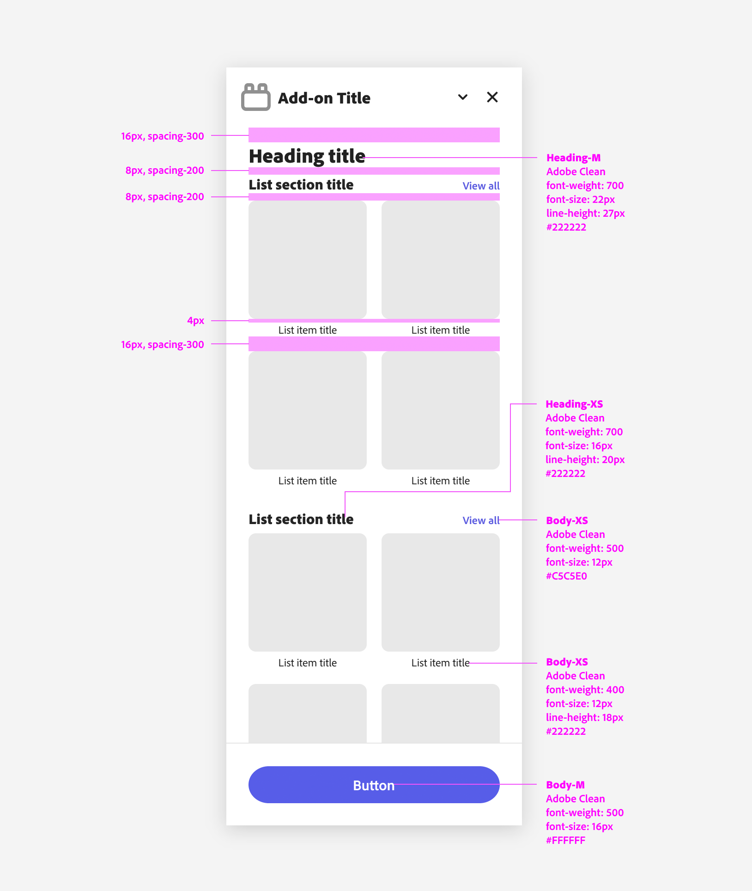

## Layout & Structure

A well-structured layout sets the stage for a great design.

Adobe Express is built on a clean and consistent structure designed for clarity and usability: add-ons should follow the same rules and blend in.

### Basic Structure

Add-ons on Desktop are assigned a specific width of **320px** and a **100%** height to ensure uniformity within the Adobe Express user interface and its modules. The layout is divided into the following parts:

- The title bar with the add-on's icon—controlled by Adobe.
- The body holding the add-on's content.
- Optionally, a footer with Call to Action (CTA) buttons.

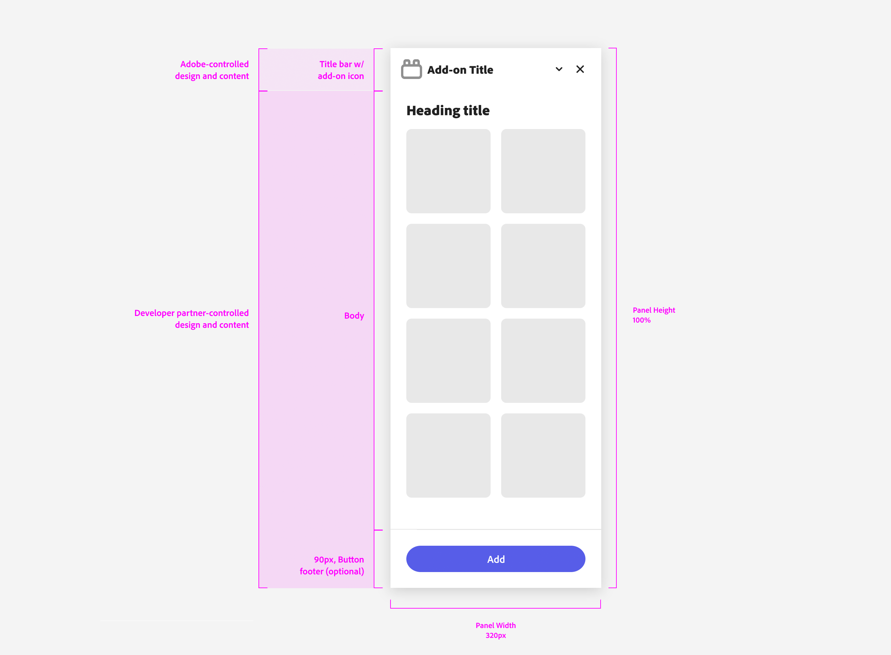

### Padding

Padding plays a crucial role in maintaining visual harmony and readability. You should consistently apply the following padding scheme:

- **24px** on the body to create a balanced spacing around the content. An additional padding of the same amount is applied at the footer's bottom.
- **16px** between internal elements to ensure they are appropriately spaced.

This padding structure ensures that content is well-separated and easy to interact with.

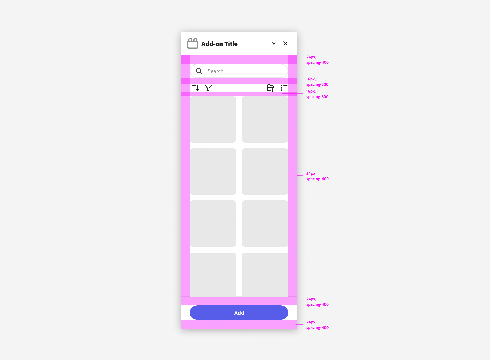

### Responsive Grid and Core Container Styles

Adobe Express add-ons rely on a [responsive grid system](https://spectrum.adobe.com/page/responsive-grid/). Core container styles define a few key media sizes:

- **272x128px** for banners.
- **128x128px** tops for standard media.
- **80x80px** for smaller media items.

Remember to apply the standard gap of 16px between grid elements for consistency.

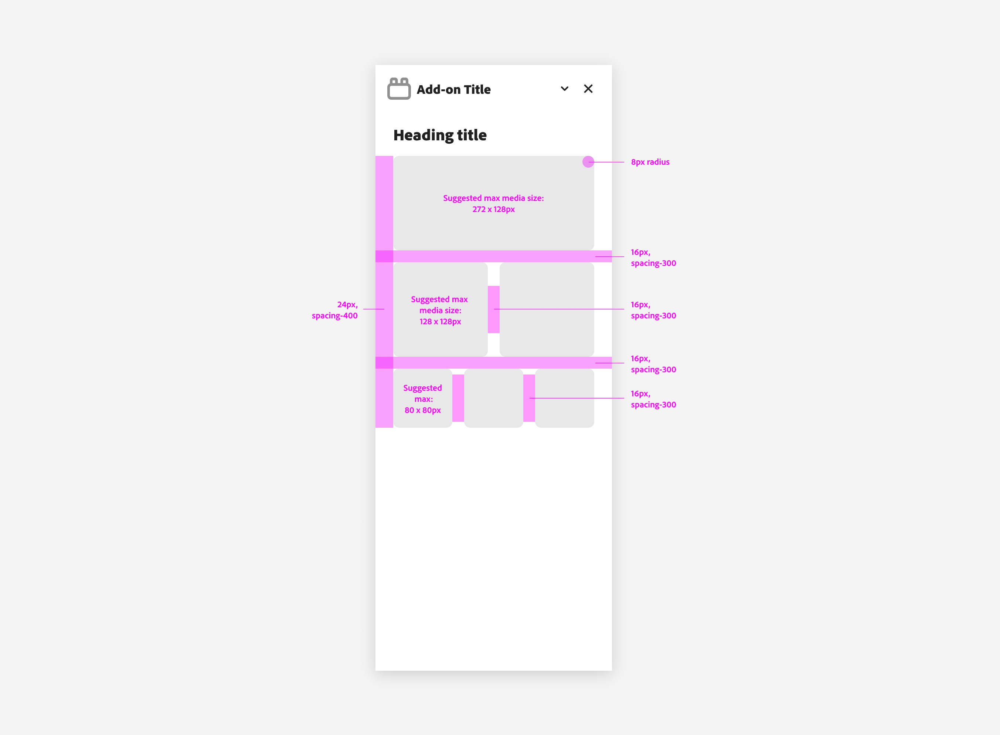

### Panel Structure and core content actions

Panel structure in Adobe Express add-ons is designed to support core content actions, such as searching, sorting, and filtering. These actions are typically placed at the top of the panel for easy access, between the title and main body.

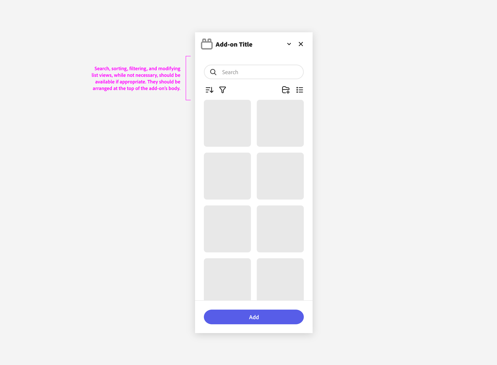

### Structural Grids and Foundational Patterns

Structural grids in Adobe Express add-ons are designed to accommodate various content types, from simple lists to more visually complex media grids. Three of the container variants are as follows:

- **Media Grid:** A straightforward grid for displaying media items.
- **Media Grid with Labels:** Enhances the basic grid by adding labels beneath each item, ensuring clarity.
- **Media Grid with Cards:** Adds a card-like structure on each media item.

Please note the specific paddings on each of these grid types.

## Panel Actions

Panel Actions are interactive elements that allow users to search, sort, filter, and manage content within your add-on.

### Actions Overview

Commonly found at the top of the add-on panel, Panel Actions include:

- **Search**: allows users to quickly find specific content.
- **Filter**: enables users to narrow down visible content based on criteria.
- **Sort**: organizes content by relevance, date, or other metrics.
- **Add Folder**: gives users the ability to create new folders within the add-on.
- **Tabs**: lmets users navigate between different sections or views.

These actions enable users to "drill into" specific sections, for example dynamically refining a list of thumbnails that follows.

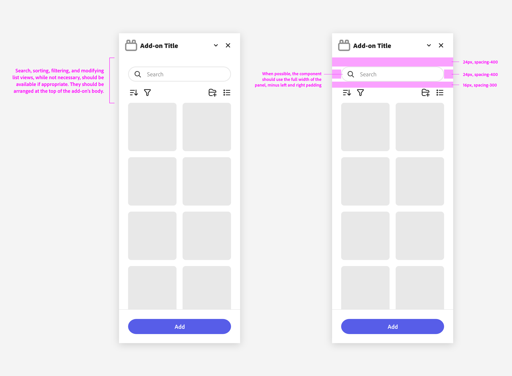

### Best Practices

Panel Actions, when available, should be arranged at the top of the add-on's content area. This ensures that users can easily access them and that they are always visible even when the grid below scrolls.

### Examples

Here are some examples of common panel organizations and hierarchies for Adobe Express add-ons.

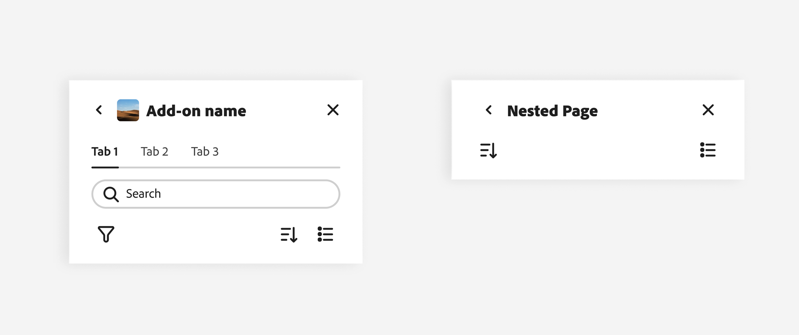

## Components

Spectrum includes a number of widgets that allow you to build rich UIs for your add-ons. Foundational components should use the Spectrum for Adobe Express theme whenever possible.

This is a [Spectrum theme](https://spectrum.adobe.com/page/theming/) specifically designed for the Adobe Express product suite to accommodate the needs of a mainstream, creative consumer audience. It features a friendlier visual tone, bolder typography, softer rounding on elements, and indigo as the accent color. See the Spectrum for Adobe Express theme in action below on the right, compared to the default on the left:

<!-- ### Buttons & Buttons Groups

Buttons are essential for enabling user interactions in your add-on. -->

### Buttons

[Buttons](https://spectrum.adobe.com/page/button/#Usage-guidelines) allow users to perform an action or navigate to a different part of the add-on. They have multiple styles to fit various needs and are ideal for calling attention when a user needs to take action to move forward in the workflow.

Please mind the padding when using CTA buttons in the add-on's footer.

### Button Groups

A [Button Group](https://spectrum.adobe.com/page/button-group/) is a collection of buttons that perform related actions. See the [Usage Guidelines](https://spectrum.adobe.com/page/button-group/#Usage-guidelines) for more information on their correct use.

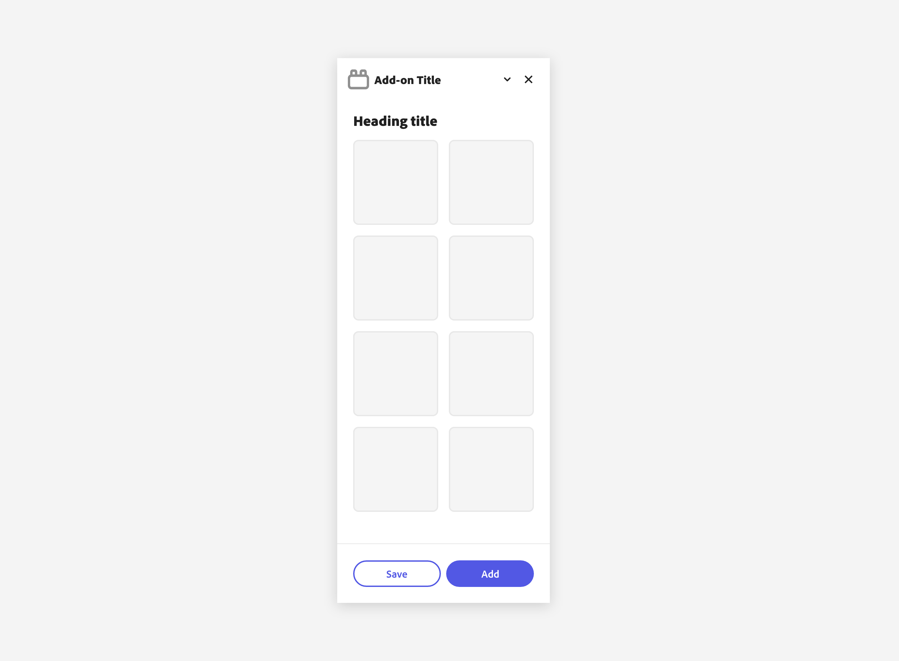

### Secondary Variant Buttons

The [Secondary Variant Button](https://spectrum.adobe.com/page/button/#Usage-guidelines) is for low emphasis. It’s paired with other button types to surface less prominent actions, and should never be the only button in a group.

Spectrum buttons support several variants (Accent, Primary, Secondary, Negative, Icon) to fit different use cases; refer to the [Spectrum reference](https://spectrum.adobe.com/page/button/#Options) to see all available options and when to use them.

## Form Elements

Form elements are essential for collecting user input and enabling interactions within your add-on. They include a variety of components such as text fields, search fields, pickers, and more.

### Text Fields

[Text fields](https://spectrum.adobe.com/page/text-field/) allow users to input custom text entries with a keyboard. Various options can be shown with the field to communicate their requirements.

It's recommended to let text fields span the entire add-on's width—minus the container's padding—when possible, for a more consistent look.

### Search Fields

A [Search Field](https://spectrum.adobe.com/page/search-field/) is used for searching and filtering content. As mentioned in the [Layout & Structure](#layout--structure) section, the search field should be placed at the top of the panel, between the title and the main body.

### Pickers

[Pickers](https://spectrum.adobe.com/page/picker/) (sometimes known as "dropdowns" or "selects") allow users to choose from a list of options in a limited space. The list of options can change based on the context.

Like all the components covered so far, it's best for pickers to take advantage of the add-on's full width.

### Color Pickers

Color pickers are a special type of picker that allows users to select a color.

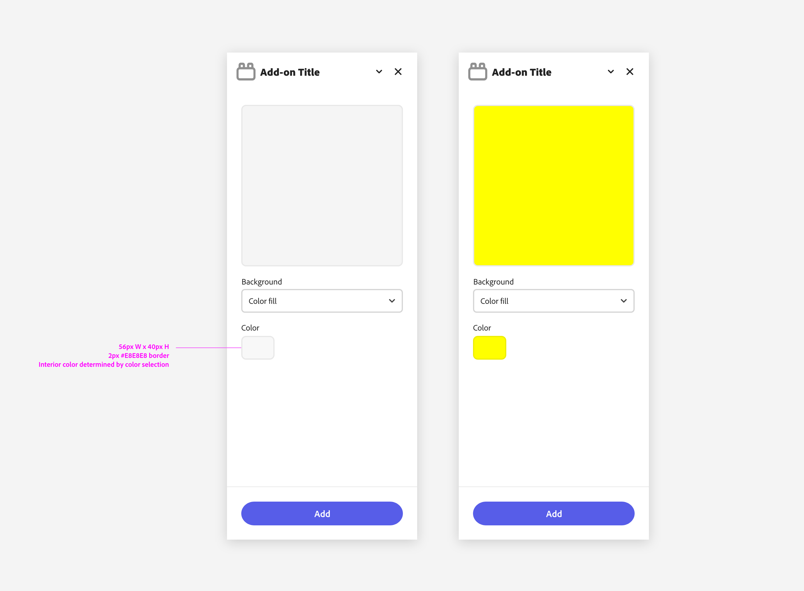

The Spectrum component used as a Color Picker is the [Swatch](https://spectrum.adobe.com/page/swatch/), which shows a small sample of a fill—such as a color, gradient, texture, or material—that is intended to be applied to an object.

The Swatch itself doesn't embed any color picker functionality, but it can be used in conjunction with a native `<input>` hidden element to trigger the browser's color picker. You can find an example with sample code in [this tutorial](/guides/tutorials/grids-addon.md#coding-the-grids-add-on).

## Navigation

Navigation is a key component of any user interface. It helps users understand where they are, where they can go, and how to get there. Spectrum provides a few components that we recommend to help you build a clear and consistent navigation system for your add-on.

### Tabs

Tabs organize content into multiple sections and allow users to navigate between them; the content under the set of tabs should be related and form a coherent unit. Please always include a label for accessibility.

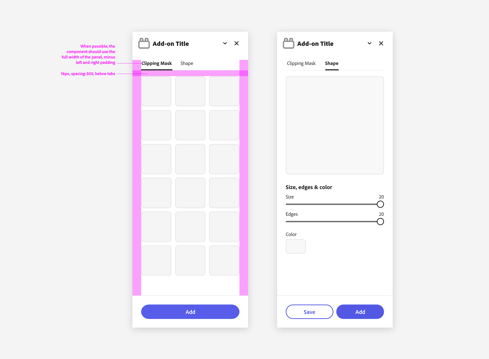

### Accordions

The [Accordion](https://opensource.adobe.com/spectrum-web-components/components/accordion/) element contains a list of items that can be expanded or collapsed to reveal additional content or information associated with each item. There can be zero expanded items, exactly one expanded item or more than one item expanded at a time, depending on the configuration. This list of items is defined by child elements that are targeted to the default slot of their parent.

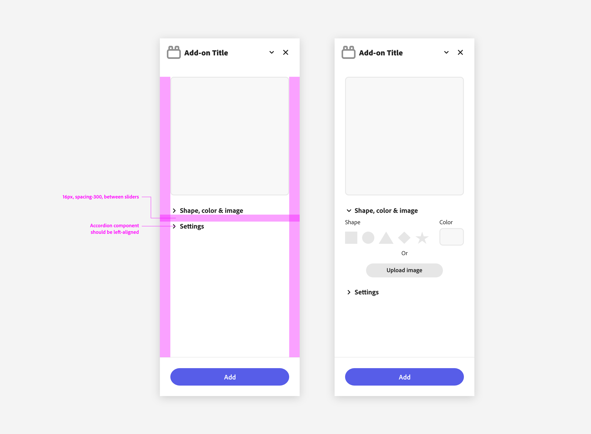
