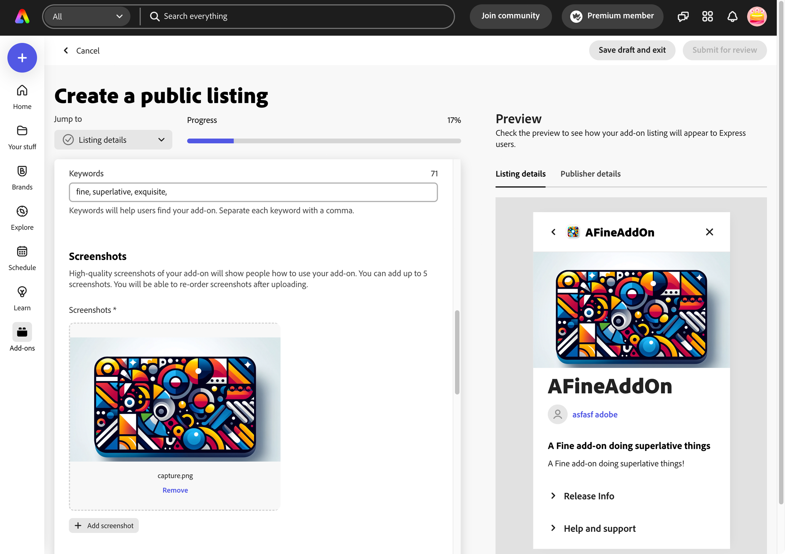

---
keywords:
  - Adobe Express
  - Express Add-on 
  - Extend
  - Extensibility
  - User Interface
  - User Experience
  - UI
  - UX
  - Guidelines
  - Branding
title: Branding Guidelines
description: This document provides an overview of the UX guidelines to follow when designing your Adobe Express add-on.
contributors:
  - https://github.com/undavide
---

# Branding Guidelines

When creating your add-on, a distinct and consistent brand identity is your ticket to a lasting impression.

This section focuses on key aspects of branding, like Icon and Publisher Logo design, as well as best practices for incorporating promotional images (screenshots or illustrations) for the Adobe Express add-on Marketplace.

Please refer to the [Developer Brand Guidelines](https://developer.adobe.com/express/embed-sdk/docs/assets/34359598a6bd85d69f1f09839ec43e12/Adobe_Express_Partner_Program_brand_guide.pdf) for comprehensive details on integrating Adobe branding, including when and how to use Adobe logos, product names, and terms.

## Add-on Icon

The add-on's icon should be original, suitable for different devices and browsers, and not violate the [Developer Brand Guidelines](https://developer.adobe.com/express/embed-sdk/docs/assets/34359598a6bd85d69f1f09839ec43e12/Adobe_Express_Partner_Program_brand_guide.pdf). Please request a written license agreement from Adobe if you wish to use any Adobe logo, product icon, or image in your preview and feature graphics, product icons, or website.

Three sizes are required for the add-on's icon: **36x36**, **64x64**, and **144x144** pixels as PNG or JPG files.

## Publisher Logo

The publisher's logo is only required the first time you [submit for distribution](/guides/distribute/public-dist.md#2-prepare-your-assets), in case you've never created a publisher profile before. It should be a square, **250x250** pixels PNG or JPG file.

## Imagery

When creating a [public listing](../../distribute/public-dist.md) for the Adobe Express add-on Marketplace, you can provide promotional images, such as screenshots and illustrations. At least one is required.

### Screenshots and illustrations

Any image used in your listing must comply with the [Developer Brand Guidelines](https://developer.adobe.com/express/embed-sdk/docs/assets/34359598a6bd85d69f1f09839ec43e12/Adobe_Express_Partner_Program_brand_guide.pdf). They should accurately depict the add-on's functionality and features and not contain any misleading information or inappropriate content. The recommended image size is **1360x800** pixels, as PNG or JPG.

