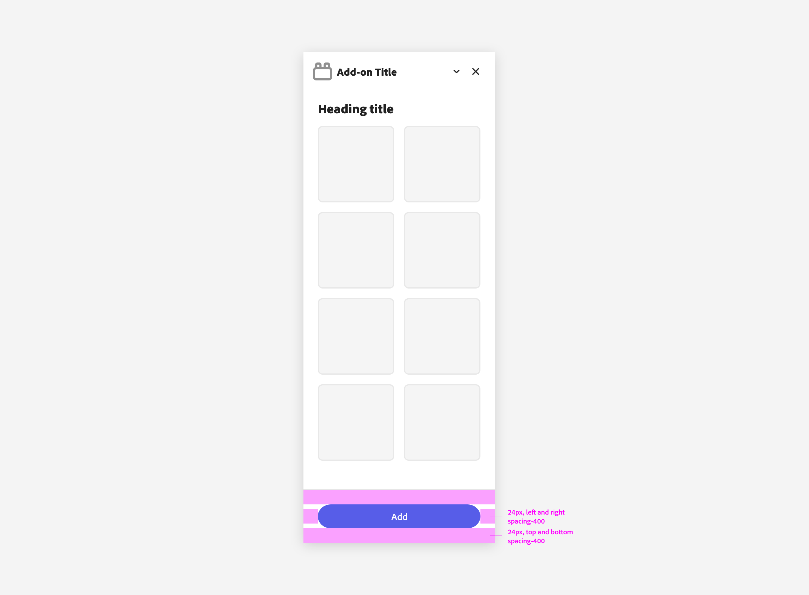
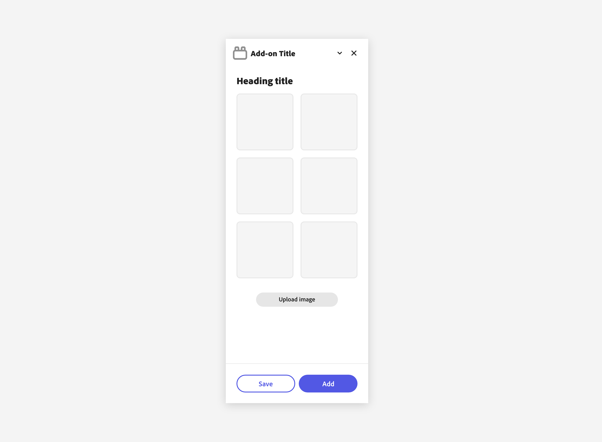

---
keywords:
  - Adobe Express
  - Express Add-on 
  - Extend
  - Extensibility
  - User Interface
  - User Experience
  - UI
  - UX
  - Guidelines
  - Components
title: Components
description: This document provides an overview of the UX guidelines to follow when designing your Adobe Express add-on.
contributors:
  - https://github.com/undavide
---

# Components

Spectrum includes a number of widgets that allow you to build rich UIs for your add-ons. Foundational components should use the Spectrum for Adobe Express theme whenever possible.

This is a [Spectrum theme](https://spectrum.adobe.com/page/theming/) specifically designed for the Adobe Express product suite to accommodate the needs of a mainstream, creative consumer audience. It features a friendlier visual tone, bolder typography, softer rounding on elements, and indigo as the accent color. See the Spectrum for Adobe Express theme in action below on the right, compared to the default on the left:

## Buttons & Buttons Groups

### Buttons

[Buttons](https://spectrum.adobe.com/page/button/#Usage-guidelines) allow users to perform an action or navigate to a different part of the add-on. They have multiple styles to fit various needs and are ideal for calling attention when a user needs to take action to move forward in the workflow.

Please mind the padding when using CTA buttons in the add-on's footer.

### Button Groups

A [Button Group](https://spectrum.adobe.com/page/button-group/) is a collection of buttons that perform related actions. See the [Usage Guidelines](https://spectrum.adobe.com/page/button-group/#Usage-guidelines) for more information on their correct use.

### Secondary Variant Buttons

The [Secondary Variant Button](https://spectrum.adobe.com/page/button/#Usage-guidelines) is for low emphasis. It’s paired with other button types to surface less prominent actions, and should never be the only button in a group.

Spectrum buttons support several variants (Accent, Primary, Secondary, Negative, Icon) to fit different use cases; refer to the [Spectrum reference](https://spectrum.adobe.com/page/button/#Options) to see all available options and when to use them.
