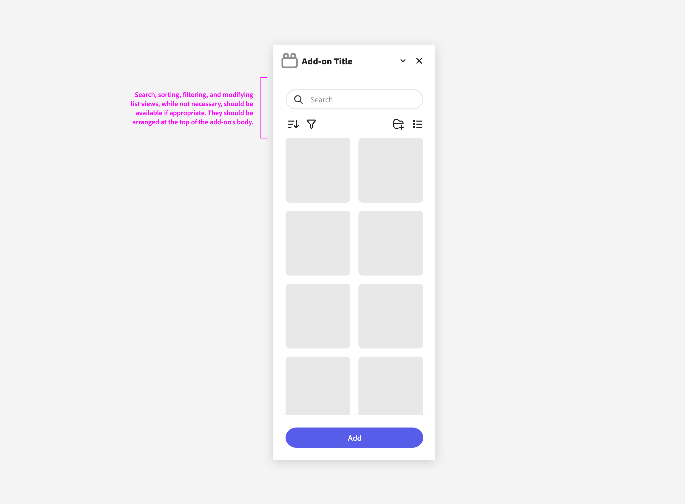

---
keywords:
  - Adobe Express
  - Express Add-on 
  - Extend
  - Extensibility
  - User Interface
  - User Experience
  - UI
  - UX
  - Guidelines
  - Core Content Actions
title: Core Content Actions
description: This document provides an overview of the UX guidelines to follow when designing your Adobe Express add-on.
contributors:
  - https://github.com/undavide
---

# Core Content Actions

Core Content Actions are interactive elements that allow users to search, sort, and filter content within your add-on. 

## Actions Overview

These actions enable users to "drill into" specific sections, for example dynamically refining a list of thumbnails that follows.

## Best Practices

Core Content Actions, when available, should be arranged at the top of the add-on's content area. This ensures that users can easily access them and that they are always visible even when the grid below scrolls.

## Examples

TODO: Ask Matthew for examples that he mentions, and in general, more content for this page.