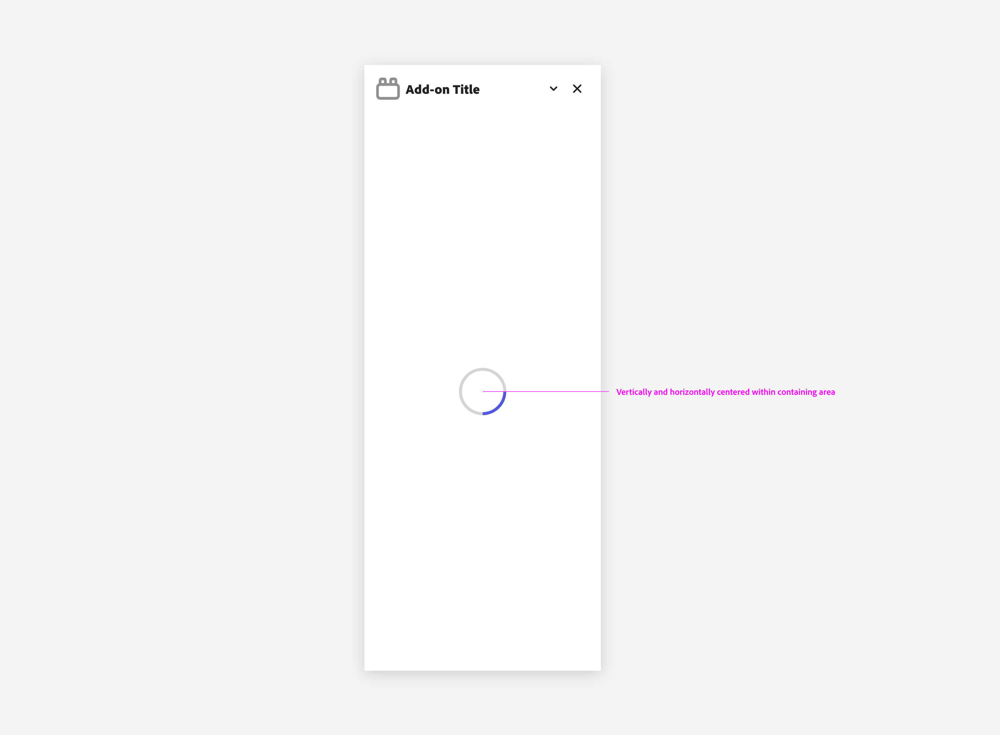
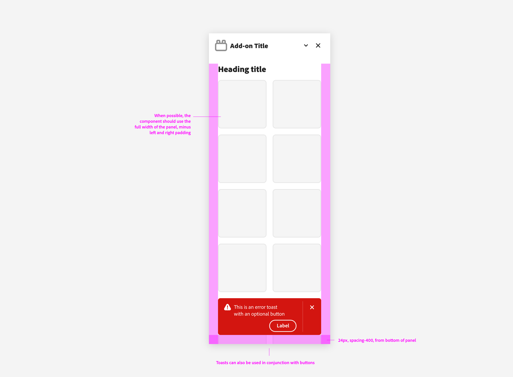
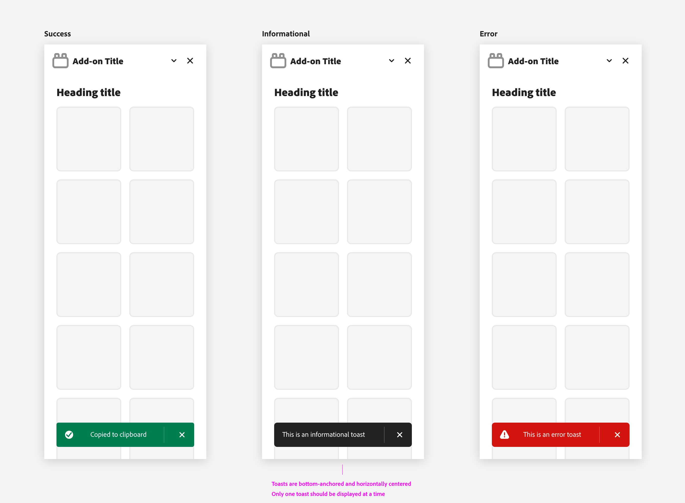
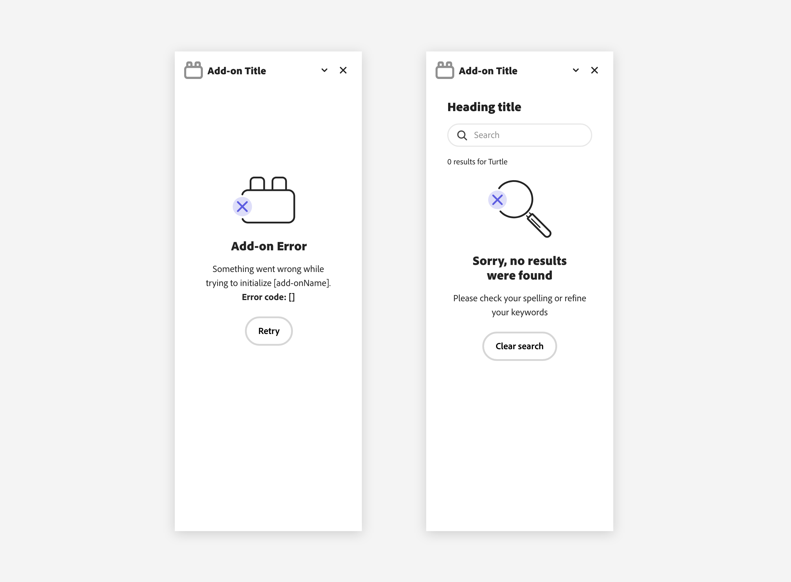
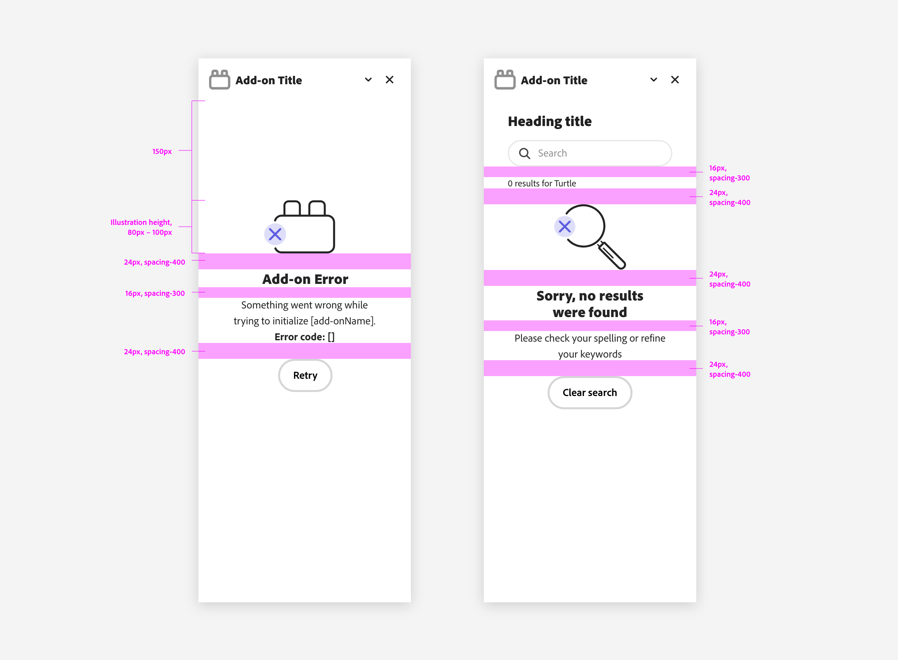

---
keywords:
  - Adobe Express
  - Express Add-on 
  - Extend
  - Extensibility
  - User Interface
  - User Experience
  - UI
  - UX
  - Guidelines
  - Feedback
  - Messaging
title: Feedback & Messaging
description: This document provides an overview of the UX guidelines to follow when designing your Adobe Express add-on.
contributors:
  - https://github.com/undavide
---

# Feedback & Messaging

Feedback and messaging are essential UX components. Your add-ons should always provide users with information about the state of the system, the results of their actions, and any errors that may have occurred.

Unclear feedback and mishandled errors can lead to confusion and, crucially, are a cause of [rejection](../../distribute/rejections.md#error-handling) when submitting add-ons to the Adobe Express Marketplace. On the other hand, well-designed feedback can help users understand what is happening and what they need to do next.

## Loading Indicators

Loading indicators are particularly important when the system is processing a request that may take some time to complete; for instance, when fetching data from a server or authenticating a user. They show that the system is working and users should wait for the process to finish.

### Progress Circles

[Progress circles](https://spectrum.adobe.com/page/progress-circle/) show the progression of a system operation such as downloading, uploading, processing, etc. in a visual way.

They can represent determinate or indeterminate progress: either the percentage of the operation that has been completed or spin indefinitely until completion.

### Ghost Loading

When a group of cards are loading, they follow the [ghost loading convention](https://spectrum.adobe.com/page/cards/#Ghost-loading).

There are 5 phases for ghost loading:

1. Card group (including metadata) ghost loads.
2. If metadata for all cards is loaded before all preview images are loaded, the metadata is displayed for all cards as soon as the last piece of metadata loads. Previews continue to ghost-load.
3. If all preview images load within a certain period (usually measured in seconds, which you need to specify depending on the use case), they are shown as soon as the last preview loads.
4. If all previews have not finished loading at the end of the x period, the loaded previews are shown, and the pending previews each receive an individual progress circle. The group is no longer in a ghost-loading state.
5. If the preview load times out, an error is shown along with a mechanism to retry loading.

## In-line Alerts

[In-line alerts](https://opensource.adobe.com/spectrum-css/inlinealert.html) display a non-modal message associated with objects in a view. These are often used in form validation, providing a place to aggregate feedback related to multiple fields.

## Toasts

[Toasts](https://spectrum.adobe.com/page/toast/) display brief, temporary notifications. They’re meant to be noticed without disrupting a user’s experience or requiring an action to be taken.

They come in multiple kinds, each with a different purpose:

## Full-panel Messaging

When the feedback is more complex or requires more space, a full-panel message can be used.

Please mind the padding between the graphics, text and other UI elements to ensure a clear and organized layout.

