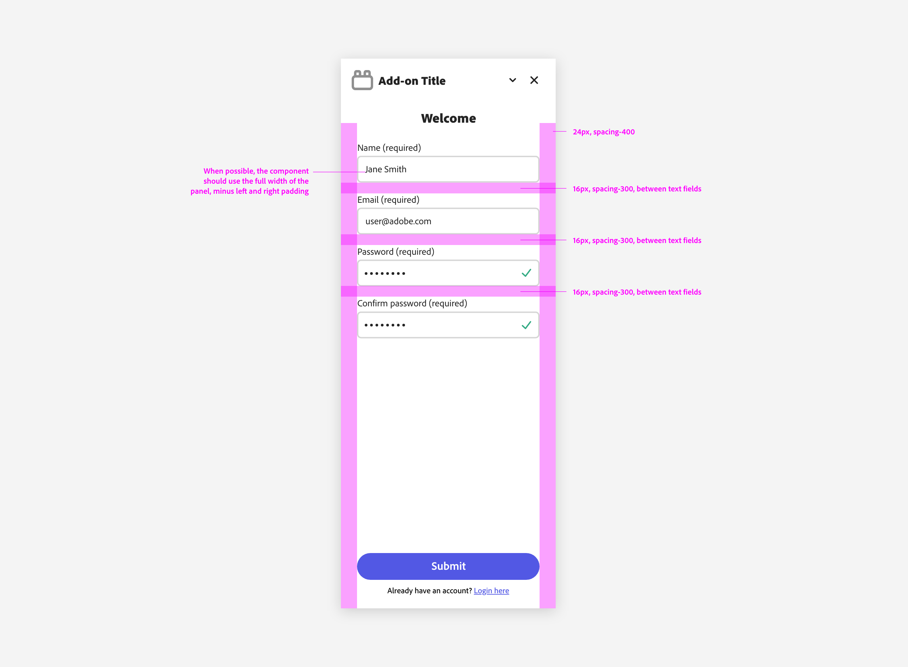
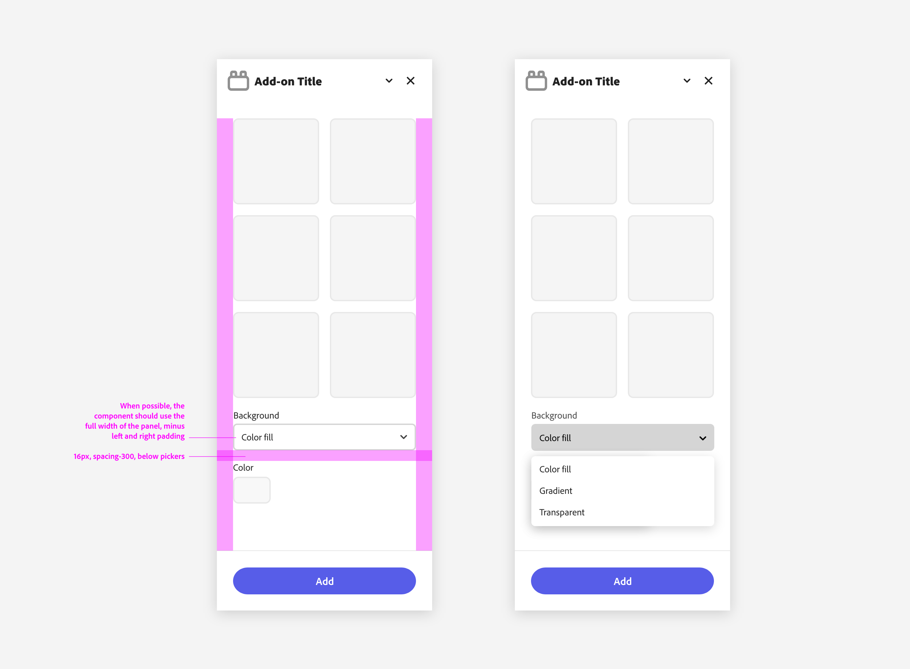

---
keywords:
  - Adobe Express
  - Express Add-on 
  - Extend
  - Extensibility
  - User Interface
  - User Experience
  - UI
  - UX
  - Guidelines
  - Form Elements
title: Form Elements
description: This document provides an overview of the UX guidelines to follow when designing your Adobe Express add-on.
contributors:
  - https://github.com/undavide
---

# Form Elements

Form elements are essential for collecting user input and enabling interactions within your add-on. They include a variety of components such as text fields, search fields, pickers, and more.

## Text Fields

[Text fields](https://spectrum.adobe.com/page/text-field/) allow users to input custom text entries with a keyboard. Various options can be shown with the field to communicate their requirements.

It's recommended to let text fields span the entire add-on's width—minus the container's padding—when possible, for a more consistent look.

## Search Fields

A [Search Field](https://spectrum.adobe.com/page/search-field/) is used for searching and filtering content. As mentioned in the [Layout & Structure](./layout_and_structure.md#panel-structure-and-core-content-actions) section, the search field should be placed at the top of the panel, between the title and the main body.

## Pickers

[Pickers](https://spectrum.adobe.com/page/picker/) (sometimes known as "dropdowns" or "selects") allow users to choose from a list of options in a limited space. The list of options can change based on the context.

Like all the components covered so far, it's best for pickers to take advantage of the add-on's full width.

### Color Pickers

Color pickers are a special type of picker that allows users to select a color.

The Spectrum component used as a Color Picker is the [Swatch](https://spectrum.adobe.com/page/swatch/), which shows a small sample of a fill—such as a color, gradient, texture, or material—that is intended to be applied to an object.

The Swatch itself doesn't embed any color picker functionality, but it can be used in conjunction with a native `<input>` hidden element to trigger the browser's color picker. You can find an example with sample code in [this tutorial](/guides/tutorials/grids-addon.md#coding-the-grids-add-on).
