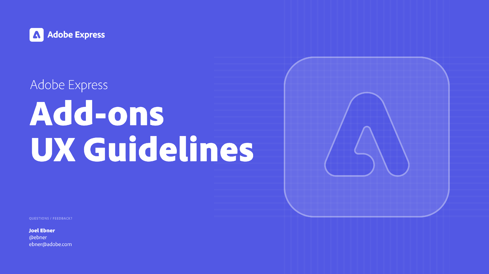

---
keywords:
  - Adobe Express
  - Express Add-on 
  - Extend
  - Extensibility
  - User Interface
  - User Experience
  - UI
  - UX
  - Guidelines
hideBreadcrumbNav: true
title: Add-on UX Guidelines
description: This document provides an overview of the UX guidelines to follow when designing your Adobe Express add-on.
contributors:
  - https://github.com/undavide
---

# UX Guidelines for Adobe Express Add-ons

A successful add-on provides a seamless and intuitive User Experience (UX) that blends harmoniously with Adobe Express. 

These Guidelines are your roadmap to creating add-ons that align with Adobe's design principles and visual language, ensuring a consistent and enjoyable experience. Following them will help you build tools that resonate with users and feel like a natural extension of the application.

## Intended audience

This document is intended for developers, designers, and product teams involved in creating Adobe Express add-ons. Whether you're crafting your first add-on or improving an existing one, these guidelines offer valuable insights and best practices to help you align with Adobe's UX standards.

## How to navigate this document

To get the most out of the UX Guidelines, start by familiarizing yourself with the [Design Principles](design_principles.md) section. They provide the foundation for all design decisions and will help you understand the core values that should drive your work.

Next, explore the [Branding Guidelines](branding_guidelines.md) and [Visual Elements](./visual_elements.md) to ensure your add-on is legally & visually aligned with Adobe Express. These sections cover everything from color schemes to typography and proper ways to refer to copyrighted material.

As you move forward, the [Layout & Structure](layout_and_structure.md) and [Components](components.md), [Form Elements](./form_elements.md), and [Sliders](sliders.md) sections offer detailed instructions on how to construct a fitting user interface. They provide specific guidance on everything from grid systems to individual UI elements like buttons and form components.

The [Navigation](./navigation.md) page will help you design a clear and intuitive routing system that guides users through your add-on's features, while [Feedback & Messaging](feedback_and_messaging.md) provides best practices for communicating feedback or alert errors.

[Core Content Actions](core_content_actions.md) focuses on...
TODO: ...on what?! Ask Matthew Ladner.

The [Mobile UX](mobile_ux.md) section offers guidance on how to format content for mobile devices so that the user experience is consistent across all platforms.

Finally, the [Theming](theming.md) section shows you how to implement the Spectrum for Adobe Express theme, along with customization options and examples.

Please refer to the [Resources & References](resources_and_references.md) for additional tools, templates, and further reading. You can also find there a [Changelog](resources_and_references.md#changelog) listing the latest updates to these guidelines.

## Changelog

### 31 August 2024

- Created the new web version of the Adobe Express add-ons UX Guidelines
- Integrated the existing content from the Adobe XD document into the new structure.
- Added a new section on Mobile UX.

### 28 August 2023

- Last update to the Adobe XD document version of the Adobe Express add-ons UX Guidelines.