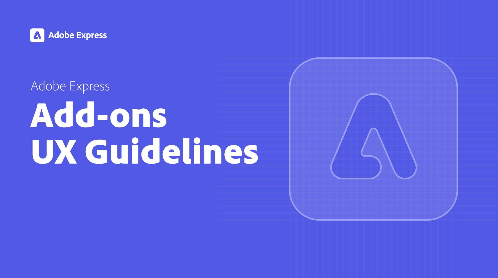

---
keywords:
  - Adobe Express
  - Express Add-on 
  - Extend
  - Extensibility
  - User Interface
  - User Experience
  - UI
  - UX
  - Guidelines
hideBreadcrumbNav: true
title: Add-on UX Guidelines
description: This document provides an overview of the UX guidelines to follow when designing your Adobe Express add-on.
contributors:
  - https://github.com/undavide
---

# UX Guidelines for Adobe Express Add-ons

A successful add-on provides a seamless and intuitive User Experience (UX) that blends harmoniously with Adobe Express.

These Guidelines are your roadmap to creating add-ons that align with Adobe's design principles and visual language, ensuring a consistent and enjoyable experience. Following them will help you build tools that resonate with users and feel like a natural extension of the application.

## Intended audience

This document is intended for developers, designers, and product teams involved in creating Adobe Express add-ons. Whether you're crafting your first add-on or improving an existing one, these guidelines offer valuable insights and best practices to help you align with Adobe's UX standards.

## How to navigate this document

To get the most out of the UX Guidelines, start by familiarizing yourself with the [Design Principles](design-principles.md) section. They provide the foundation for all design decisions and will help you understand the core values that should drive your work.

Next, the [Theming](theming.md) section shows you how to implement the Spectrum for Adobe Express theme, along with customization options and examples. [Visual Elements](./visual-elements.md) is a detailed list of structural and functional components that make up the Adobe Express visual language. It covers everything from typography to grids, navigation, and a variety of UI elements alongside with implementation examples.

[Feedback & Messaging](feedback-and-messaging.md) provides best practices for communicating feedback or alert errors to users.

Explore the [Branding Guidelines](branding-guidelines.md) to ensure your add-on is legally & visually aligned with Adobe Express. They cover key aspects of branding, as well as best practices for incorporating promotional images for the Adobe Express add-on Marketplace.

Finally, look at the [Resources & References](./resources-and-references.md) for videos and further reading. Refer to the [Changelog](./changelog.md) to stay up-to-date with the latest features and improvements to these guidelines: they are a living document we encourage you to consult regularly, both as a reference and a source of inspiration.
