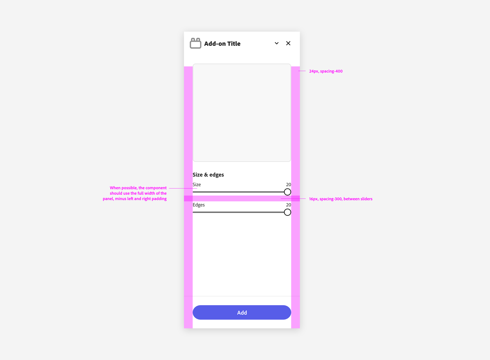

---
keywords:
  - Adobe Express
  - Express Add-on 
  - Extend
  - Extensibility
  - User Interface
  - User Experience
  - UI
  - UX
  - Guidelines
  - Sliders
title: Sliders
description: This document provides an overview of the UX guidelines to follow when designing your Adobe Express add-on.
contributors:
  - https://github.com/undavide
---

# Sliders

Sliders allow users to quickly select a value within a range. 

They should be used when the upper and lower bounds are both fixed; a 100% width is always recommended.

[Spectrum Sliders](https://spectrum.adobe.com/page/slider/) support a variety of options, including editable values, fill, linear and logarithmic progression scales, and more. You can find them all [here](https://spectrum.adobe.com/page/slider/#Options).