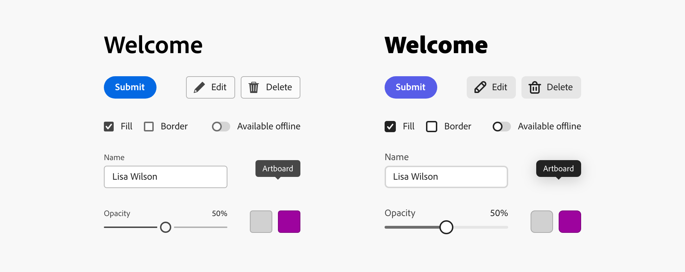

---
keywords:
  - Adobe Express
  - Express Add-on 
  - Extend
  - Extensibility
  - User Interface
  - User Experience
  - UI
  - UX
  - Guidelines
  - Theming
title: Theming
description: This document provides an overview of the UX guidelines to follow when designing your Adobe Express add-on.
contributors:
  - https://github.com/undavide
---

# Theming

Adobe Express is based on Spectrum, Adobe's design system, which provides a set of guidelines and components for creating consistent and visually engaging user interfaces.

While Spectrum is the main reference throughout this guide, the Adove Design team has released a preview of the next major version, [Spectrum 2](https://s2.spectrum.adobe.com/): a completely rebuilt user experience that is more modern, friendly, accessible, and enjoyable to use.

## Spectrum for Adobe Express Theme

The Spectrum design system supports theming, allowing you to customize features like icon sets, font weight and size, and accent colors to suit your brand or use case better. We recommend using the provided Adobe Express Theme, specifically designed to accommodate the needs of a mainstream, creative consumer audience. It features a friendlier visual tone, bolder typography, softer rounding on elements, and indigo as the accent color. See the Spectrum for Adobe Express theme in action below on the right, compared to the default on the left:

## Customization Guidelines

You can find information about [theming](https://spectrum.adobe.com/page/theming/) on the Adobe Spectrum website.

**TODO:** There's next to nothing on the Spectrum website about theming; is it documented internally somewhere we can draw from?

## Theming Examples

**TODO:** Same as above.
