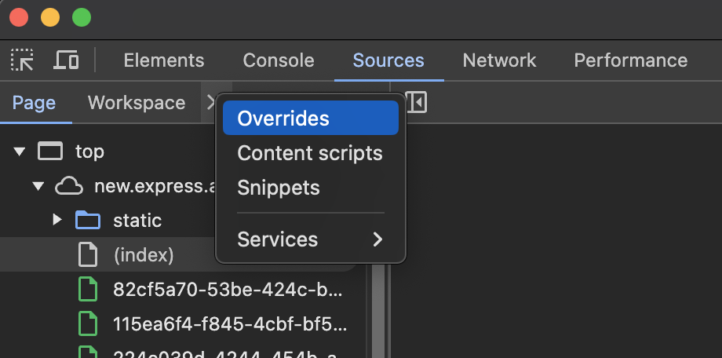

# Cross-origin isolation handling

How to ensure your add-ons work properly with the cross-origin isolation headers enforced by Adobe Express.

## Overview

Adobe Express will soon be enforcing cross-origin isolation on the associated domains (i.e., “new.express.adobe.com”) for Chromium-based browsers (including Chrome, Microsoft Edge, Opera, and others). This *may* impact your add-on due to stricter rules enforced by the browser.

<InlineAlert slots="text" variant="info"/>

We expect the enforcement of cross-origin isolation headers to begin around the end of 2024, and we will update you the moment we have a more specific date. In the meantime, you’ll want to ensure that any add-ons you’ve developed or are developing now work in this new environment.

Specifically, Adobe Express will be setting the following response headers:

- `Cross-Origin-Embedder-Policy: credentialless`
- `Cross-Origin-Opener-Policy: same-origin`
- `Cross-Origin-Resource-Policy: same-site`

This change is being done to support Adobe Express’ use of certain browser capabilities requiring cross-origin isolation.

## Impact

This change may impact your add-on’s access to external resources, especially if it relies on iframes to display content or support payment flows. It could also impact  `fetch` or image requests from external sources. In these cases, users may see missing content or be presented with silent failures if your add-on can’t load a remote resource. Since this results in a poor experience, developers must ensure that their add-ons work in the above environment.

Please note that this change affects *all* add-ons, even those not published in the add-on marketplace (i.e., private and internally distributed add-ons).

Currently, this change *only impacts* Chromium-based browsers (e.g., Chrome, Edge, Opera, etc.). Firefox and Safari browsers are currently exempt. If you've developed a an add-on with mobile support, this would apply to add-ons running on Android devices as well.

## Types of failures

Some failures will be more evident than others, but all will negatively impact the user experience of your add-on.

- If a nested iframe fails to load, Chrome displays a very obvious error message inside the iframe indicating that the domain "refused to connect".
- If an image fails to load, you may notice missing images in your add-on’s user interface. You should also see failures in the Network section of the browser’s developer tools.
- If a network call fails due to JavaScript code, you should see warning and error messages in the browser’s developer tools.

## Testing your add-on

Until Adobe Express enables these headers by default, you must configure your local development environment to simulate these changes.

### Apply local header overrides

The developer tools in Chromium-based browsers on the desktop allow you to specify header overrides. Using this, you can simulate the headers that Adobe Express will enable to test whether your add-on has any problems in this environment.

<InlineAlert slots="header, text" variant="info"/>

**Mobile add-ons**

You cannot test this on mobile devices. You should test your add-on on a desktop web browser powered by Chromium. Any issues you run into would also appear on mobile devices, and any fixes you apply would also apply to mobile users.

To enable this environment yourself, perform the following steps:

1. Open the developer tools:

 Launch your Chromium-based browser (e.g., Chrome, Edge, Opera).
 Open the developer tools by pressing `F12` or `Ctrl+Shift+I` (Windows/Linux) or `Cmd+Option+I` (Mac).

2. Navigate to the **Network** tab:

 In the developer tools, click on the **Network** tab, and then navigate to [Adobe Express](https://new.express.adobe.com) in the browser. Your network panel should fill up with a lot of network traffic, like this:

 

3. Apply header overrides:

 To apply an override, right click on the entry for **new.express.adobe.com** and select **Override headers**.

 

  **IMPORTANT:** Assuming you haven’t done this before, the developer tools will ask you to pick a folder on your local file system where these overrides are stored. The alert is easy to miss, since it doesn’t present as a dialog box, but rather a message near the top of your developer tool window.

  

4. Select a local folder:

 Click **Select folder** to choose where you want to store the overrides. This will open your browser’s file picker. You’ll likely want to create a new folder for this step. You can put this anywhere you’d like. For example, in the following image we've selected the **Downloads** folder.

  

5. Allow access, if prompted:

 Depending on your operating system and the folder's location, the developer tools may need to request additional permissions to access it. If so, the message will again appear near the top of the developer tool window.

 

 Click **Allow**. This may prompt an operating system level permissions prompt. In that case, be sure to allow that as well:

 

6. Navigate to the **Sources** tab:

 Once any required permissions have been granted, navigate to the **Sources** tab in the developer tools:

 

7. Open the **Overrides** menu:

  Next, click the **`>>`** icon and select the **Overrides** menu option:

 

 Expand the entry you see there completely. You should see something like the following:

 

8. Add an override rule:

 To add an override rule, click the **Add override rule** option:

 

9. Enter the header names and values to override:

 Click on `header-name-1` and start entering the name of the first header -- in this case, `Cross-Origin-Embedder-Policy`.

 

 Press TAB or click into the field that says `header value` and update it to the appropriate value -– in this case, `credentialless`. Once done, click the **+** icon to add the next header.

 

10. Finalize header overrides:

 You’ll want to add headers until your overrides look like the following:

 

11. Reload and test:

 At this point, you can reload Adobe Express and test your add-on. Be sure to watch the network panel for errors that your add-on might encounter.

### What to test in your add-on

You should test flows in your add-on that involve the following:

- **Purchase flows:** In particular, if you’re using an iframe to handle the purchase experience, you should also test an international purchase to ensure that any additional verification flows your payment provider requires also work. *Note: You're probably not impacted if you handle purchases in a new tab.*
- **Flows that load external domains in iframes:** For example, you may be using an iframe to generate a preview for the user or using an iframe to embed a video player.
- **Flows that display images and other content:** For example, if you’ve built an add-on that allows the user to add stickers and the stickers are served from your domain or another third party, you should verify that the images appear in the add-on’s user interface correctly. (If the content is bundled with your add-on, you should already be covered.)
- **Flows that add content to the user’s document:** Make sure that users can successfully add images or other assets to the document if your add-on provides this functionality. This should only apply to assets loaded from your domain or an external domain. Generated assets or assets bundled with your add-on should not have any issues.

If your add-on doesn’t access external content, make network calls, or use iframes to display content or payment flows, you should not be affected by this change.

## Disabling overrides

When you’re done testing, you’ll likely want to disable any header overrides in your browser’s developer tools. You can disable the overrides by unchecking **Enable Local Overrides** or by removing the header override directly.

## Addressing issues found in your add-on

Applying fixes to your add-on is generally straightforward, but it depends on the issue you’re seeing.

### Fixing assets that fail to load

If the asset is in an `` tag, you’ll want to set the `crossorigin` attribute. You can also set the `crossOrigin` property when using JavaScript. For examples, see the [MDN web documentation](https://developer.mozilla.org/en-US/docs/Web/API/HTMLImageElement/crossOrigin).

### Fixing iframes or network calls that fail to load

You’ll need to set the following headers on the endpoint you’re trying to load. If loading an iframe, you’ll likely need to ensure these headers apply to all assets that can be loaded by the iframe.

- `Cross-Origin-Embedder-Policy: credentialless`
- `Cross-Origin-Resource-Policy: cross-origin`

If the endpoint is managed by a third party, you may have more difficulty in addressing the issue. Some things you can do:

- Check if the third party provider provides a mechanism to specify header overrides.
- Ask if the third party provider can set headers for you via their existing support channels.
- Create a proxy that you control to act as an intermediary. This has security and privacy implications since you need to ensure that the proxy is secure, doesn’t mix up or serve incorrect data, and doesn’t preserve user information for any longer than necessary to complete the transaction.

## [Review process impact](../distribute/guidelines/general/index.md)

All new add-ons published to the marketplace will be reviewed with these headers in place. If the reviewer finds a problem with your submission related to cross-origin isolation that impacts the usability of your add-on, the reviewer will reject your add-on. You can then use the above to address the issues before submitting again.
