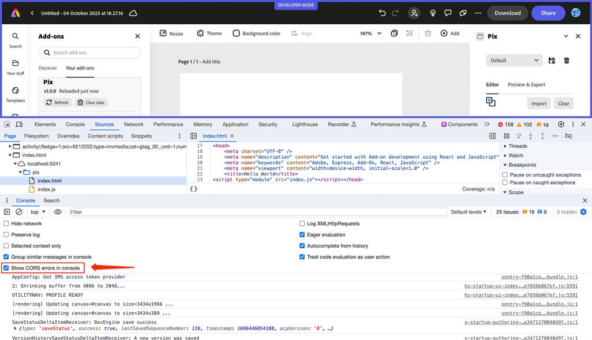
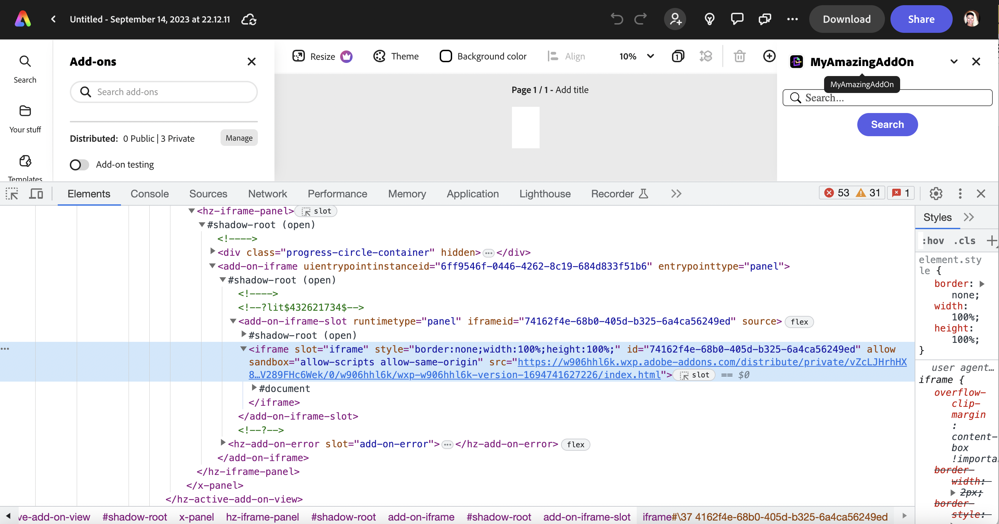
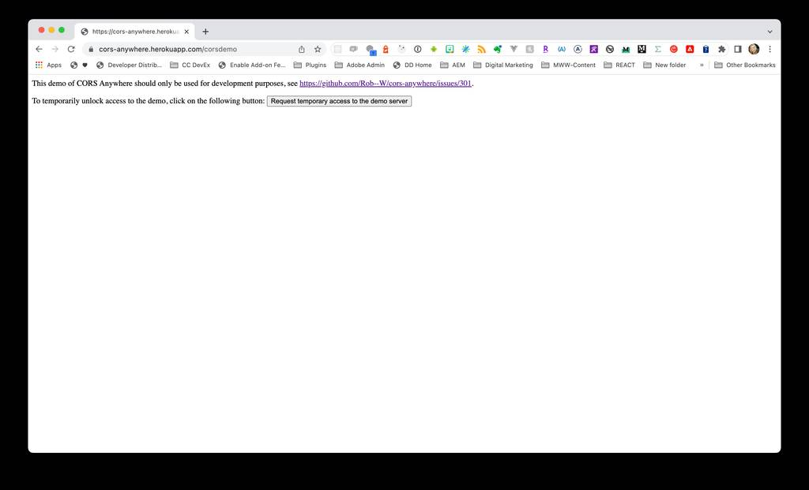

# Add-on iframe Context

Important details about the context of your add-on; permissions, security, CORS and more.

## iframe Sandbox

Your add-on is essentially a website running in a [sandboxed](https://developer.mozilla.org/en-US/docs/Web/HTML/Element/iframe#sandbox) iframe. As a result, the content of your add-on runs in a low-privileged environment, has a subset of capabilities, and has an extra set of restrictions by default. It's important to understand how this may affect the add-on you're building, as well as how to learn to mitigate any problems you may run into along the way.

### Restrictions

The following set of restrictions are enabled when the `sandbox` attribute is applied to the `<iframe>` tag (ie: `<iframe sandbox=""`):

- The add-on bundle is served from a unique subdomain.
- Form submission is blocked.
- The Pointer Lock API (capturing mouse movement) is blocked.
- New windows or tabs cannot be opened from the add-on, unless overridden in the manifest.
- Add-ons can't use `<embed>`, `<object>`, `<applet>`, or similar.
- Add-ons cannot change the navigation of the top-level browsing context
Media can't be autoplayed.

### Permissions

The value of the `sandbox` attribute can either be empty (in which case all restrictions are applied), or a space-separated list of pre-defined permissions that remove a particular restriction. By default, **the `allow-scripts` and the `allow-same-origin` sandbox permissions are automatically set for all add-ons** (ie: `sandbox="allow-scripts allow-same-origin"`). The table below describes the rest of the permissions that can be applied to your add-on. These permissions can be applied by setting their values in the [manifest sandbox permissions](../../references/manifest/index.md#entrypointspermissionssandbox). 

<!-- <InlineAlert slots="text" variant="info"/>

The add-on iframe automatically includes the `allow-scripts` and the `allow-same-origin` sandbox permissions by default (ie: `sandbox="allow-scripts allow-same-origin"`). The other supported permissions can be applied by setting their values in the [manifest sandbox permissions](../../references/manifest/index.md#entrypointspermissionssandbox). <br/><br/> -->

| Permission              | Description   |
| ------------------ | -----------:  |
| `allow-downloads`  |  Allow downloading files through an &lt;a&gt; or &lt;area&gt; element with the download attribute.         |
| `allow-popups`          | Allows the add-on to `window.open` popups |
| `allow-popups-to-escape-sandbox`   |  Allows a sandboxed document to open new windows without forcing the sandboxing flags upon them.         |
| `allow-presentation`  | Allows the add-on to start a presentation session.           |

<!-- The following two permissions are added to the `sandbox` attribute by default.

| Permission              | Description   |
| ------------------ | -----------:  |
| * `allow-same-origin`               | Removes the "different" origin policy           |
| * `allow-scripts` | Re-enables JavaScript.           | -->

**IMPORTANT:** Please note that these are currently the *only* permissions that are currently supported from [the set of sandbox permissions available](https://developer.mozilla.org/en-US/docs/Web/HTML/Element/iframe). Any other attributes are not supported or allowed in the manifest for your add-ons.

## CORS

In order to provide security to the users of your add-on, browsers implement a [CORS (Cross-Origin Resource Sharing)](https://developer.mozilla.org/en-US/docs/Web/HTTP/CORS) mechanism. This allows a service to control whether to allow JavaScript code to make requests from a different [origin](#origin). Many services decide to restrict access to specific [origins](#origin) (or [domains](#domain)), but many also allow developers to customize the [allowed list of origins](#allowed-list-of-origins) that can make requests to their service when creating an integration. When developing and testing your add-ons, it's important to understand where your add-on is being hosted, and what is being sent in the requests it's making specifically, to manage this security measure, and in the event you run into [CORS errors](../faq.md#why-do-i-receive-a-no-access-control-allow-origin-header-is-present-on-the-requested-resource-error).

<InlineAlert slots="text" variant="success"/>

Be sure to set your browser devtools option to "**Show CORS errors in console**". For example, in Chrome it looks like the screenshot shown below.



### Add-on subdomain

To help enable a smoother experience for developers dealing with CORS, we provide each add-on with a unique [subdomain](#subdomain) which can be supplied in the list of [allowed origins](https://developer.mozilla.org/en-US/docs/Web/HTTP/Headers/Access-Control-Allow-Origin) that can make requests to a given service.
Your add-on is given a unique ID when you distribute your add-on for private or public sharing. This ID will not change once it's been generated, regardless of [future distributions](../distribute/index.md), so we suggest that you create a private sharing link when you need it, even if you're still in the development phase. Your add-on's [subdomain](#subdomain) is then created with a prefix of your unique add-on id, followed by the URL where it's hosted: `.wxp.adobe-addons.com`, for example: `src="https://w906hhl6k.wxp.adobe-addons.com/`.

#### Determining the subdomain

You can determine your add-on's subdomain by first [creating a private sharing link](../distribute/private-dist.md). In the link generated, you'll see that it contains a unique ID in the `claimCode`, just befre the colon (`:`), for instance:


#### Steps

With the private link above: `https://new.express.adobe.com/new?category=addOns&claimCode=w906hhl6k:TEOYF0DH`

1. Locate the `claimCode` parameter (e.g., `claimCode=w906hhl6k:TEOYF0DH`).
2. Extract the unique add-on ID which is the string between the equal (`=`) and colon (`:`) symbols (e.g., `w906hhl6k`).
3. Concatenate the unique ID with the `.wxp.adobe-addons.com` string to derive at the add-on's subdomain (e.g., `https://w906hhl6k.wxp.adobe-addons.com/`).

<!-- **Option 2 (Preferred)** <br/>
A more straightforward way to ensure you have the correct subdomain for your add-on, is to open and add it with the [private sharing link](../distribute/private-dist.md), then inspect the CSS with the browser devtools. (In Chrome you can do this by right-clicking on your add-on, such as in the title, and clicking "Inspect" to open the devtools to the CSS tab). Locate the `<hz-iframe-panel>`, element in the CSS, and continue to drill down into its child elements until you find the actual `<iframe>` for your add-on, as shown below:



You'll see the `src` of the `<iframe>` is set to the whole path to your hosted add-on, and contains the subdomain you can supply to any services/servers for the allowed domains list (ie: `"https://w906hhl6k.wxp.adobe-addons.com/"`).
 -->

### Using the subdomain

There are multiple situations where you may run into a CORS issue and need to use the unique subdomain provided with your add-on to get past it. One way was described above, where you can just include it in the allowed list for a service integration. Another is to manage it by setting a server-side header, if you have access to that server. A third option is to use a [CORS proxy server](#cors-proxy-server). These options are described in the next sections below.

### Server-side CORS Handling

If you have access to the endpoint server your add-on is fetching from, you can set an [`Access-Control-Allow-Origin`](#allowed-list-of-origins) header with the value set to the subdomain of your add-on in the server's response object. Handling the headers on the server side is the ideal solution, but often times the issue occurs with services outside your control. In that case, your best bet is to use a CORS Proxy Server.

### CORS Proxy Server

Typically, the origin responsible for serving resources is also responsible for setting the access headers for those resources. However, in instances where you don't have access to the server, a proxy server can be set up to bypass the issue by acting as the intermediate server that makes the request for you, and returns the [`Access-Control-Allow-Origin`](#allowed-list-of-origins) header in the response with the the value of your subdomain.

#### Hosted CORS Proxy Server

One of the fastest ways to unblock your requests while testing in the event of CORS issues, is to use a hosted proxy server. For instance, `cors-anywhere` is a [NodeJS pakage](https://www.npmjs.com/package/cors-anywhere) which also has a free hosted demo server with it set up that you can use for quick testing. Open your browser to [https://cors-anywhere.herokuapp.com/](https://cors-anywhere.herokuapp.com/) and request temporary access to the demo server with the button shown in the screenshot:



Then, simply prefix the URLs you're fetching with the `cors-anywhere` demo server URL of [https://cors-anywhere.herokuapp.com/](https://cors-anywhere.herokuapp.com/). For instance:

```js
let cors_anywhere = "https://cors-anywhere.herokuapp.com/";
let myUrl = "https://example.com/"; 
let url = cors_anywhere+myUrl;  

fetch(url).then(function (response) {        
    console.log(response);
})
```

  The response should be a successful response including that prefixed URL call:

`Response {type: 'cors', url: 'https://cors-anywhere.herokuapp.com/https://example.com/', redirected: false, status: 200, ok: true, …}`

<InlineAlert slots="text" variant="success"/>

Hosting your proxy server code in an online service like Cloudinary or Heroku is also a good option for handling CORS issues in your add-on development. These services provide a platform for deploying your code and can handle cross-origin requests for you. Additionally, using Cloudinary's [URL prefix feature](https://cloudinary.com/documentation/fetch_remote_images) can be a quick solution for handling CORS issues with remote images in your add-on development.

#### Locally Hosted CORS Proxy Server

You can also use the `cors-anywhere` node package to create and run your own proxy server locally for testing for instance, with a few easy steps. This can be useful if you want to modify the default settings or use different functions provided by the library. Follow the steps below to install and use it. Also be sure to run it on it's own port separate from where your add-on is running. Once you have it working as desired, you can modify the settings to host it externally to suit your needs.

1. Install the `cors-anywhere` node package:

    `npm install -g cors-anywhere` (or `npm i cors-anywhere` to install it in your current directory)

2. Create a file called `server.js` in your favorite editor and add the following to it:
    
    ```js        
    // Listen on a specific host via the HOST environment variable
    var host = process.env.HOST || '0.0.0.0';
    // Listen on a specific port via the PORT environment variable
    var port = process.env.PORT || 8080;

    var cors_proxy = require('cors-anywhere');
    cors_proxy.createServer({
        originWhitelist: ['https://w906hhl6k.wxp.adobe-addons.com/'], // Your add-on subdomain
        requireHeader: ['origin', 'x-requested-with'],
        removeHeaders: ['cookie', 'cookie2']
    }).listen(port, host, function() {
        console.log('Running CORS Anywhere on ' + host + ':' + port);
    });
    ```

3. Run the server:
    `node server.js`

    or optionally pass in a host and port when you run it:
    `HOST=0.0.0.0 PORT=8080 node proxy-server.js`

#### CORS / COEP Handling

The value of the [**Cross-Origin-Embedder-Policy** (COEP)](https://developer.mozilla.org/en-US/docs/Web/HTTP/Headers/Cross-Origin-Embedder-Policy) header for add-on resources is set to `credentialless`, but you should be aware that it will be changing to use `require-corp` sometime in the future, so you should plan for that by ensuring resources loaded from within the document have CORP / CORS enabled. If you see any issues with fetch or using images, you can try implementing one of the following solutions.

1. For http requests, make sure that the resource server responds with the `Cross-Origin-Resource-Policy: cross-origin` header. See [this link](https://developer.mozilla.org/en-US/docs/Web/HTTP/Cross-Origin_Resource_Policy) for reference.

2. If you're using the `` tag and your resource is being served with CORS, add the `crossorigin` attribute to the HTML tag loading it, for example: ``. See [this link](https://developer.mozilla.org/en-US/docs/Web/HTML/Attributes/crossorigin) for more details.

## Terms

### origin

A combination of a protocol (for example HTTP or HTTPS), hostname, and port (if specified). For example, in the URL `https://www.adobe.com:443/foo`, the "origin" is `https://www.adobe.com:443`.

### domain

A website's address on the Internet that is used in URLs to identify which server a specific webpage belongs to. A domain name consists of a sequence of names separated by periods and ending with an extension (ie: `wxp.adobe-addons.com`).

### subdomain

Subdomains are unique URLs that include an additional part to identify them in front of the main domain where it lives (ie: https://w906hhl6k.wxp.adobe-addons.com).

### allowed list of origins

A list of external domains that the server allows to request resources. This is typically enforced with a header defined on servers who enforce CORS, with the [`Access-Control-Allow-Origin`](https://developer.mozilla.org/en-US/docs/Web/HTTP/Headers/Access-Control-Allow-Origin) header. This server-side header is returned to a [preflight request](https://developer.mozilla.org/en-US/docs/Glossary/Preflight_request), (dispatched transparently by the browser, before the request from your add-on itself), in order to determine if it's safe to send it when a cross-origin request is allowed.
