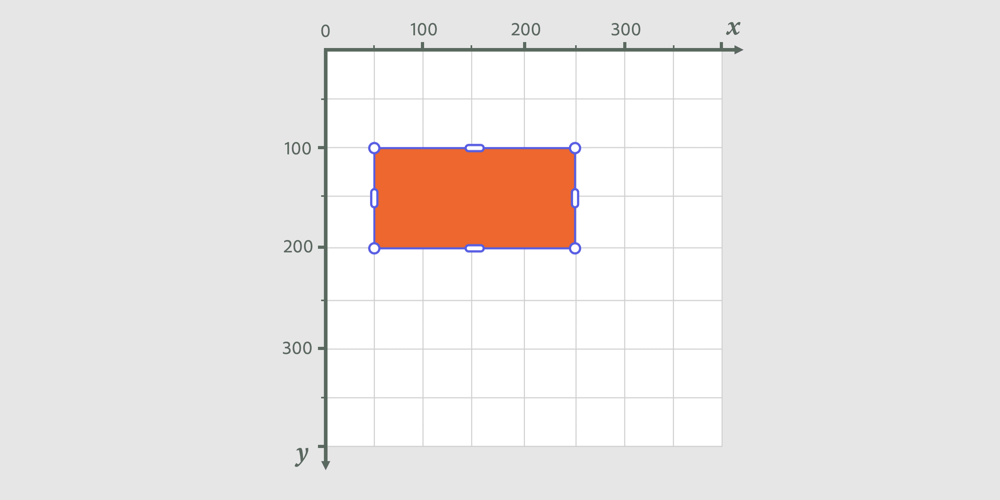
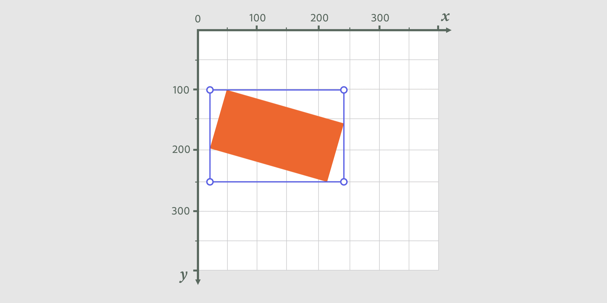

---
keywords:
  - Adobe Express
  - Express Add-on SDK
  - Express Editor
  - Adobe Express
  - Add-on SDK
  - SDK
  - JavaScript
  - Extend
  - Extensibility
  - API
  - Position
  - Translation
  - Rotation
  - Bounding Box
  - Bounds
title: Position Elements
description: Position Elements.
contributors:
  - https://github.com/undavide
---

# Position Elements

## Move and Rotate Elements

Let's use this simple Rectangle to demonstrate how to move and rotate elements in Adobe Express.

```js
// sandbox/code.js
import { editor } from "express-document-sdk";

const rect = editor.createRectangle();
rect.width = 200;
rect.height = 100;

editor.context.insertionParent.children.append(rect);
```

### Example: Translation

Elements can be moved around by setting their `translation` property, which is an object with `x` and `y` properties defined in the element's parent coordinates.

```js
// Move the rectangle 100px to the right and 50px down
rect.translation = { x: 50, y: 100 };
```



<InlineAlert slots="header, text1" variant="info" />

**Mind the origin of the axes!**

The zero point of the coordinate system is at the top-left corner of the parent container, with the x-axis pointing to the right and the y-axis pointing down. So, to move a shape to the right, you increase its `x` value; to move it down, you increase its `y` value.

A more advanced way to move shapes is by using the `setPositionInParent()` method, which takes two arguments: the **desired position** and the **reference point** of the shape.

```js
// Move the rectangle to the center of the artboard
const artboard = editor.context.currentPage.artboards.first;
rect.setPositionInParent(
  // Where to move the shape: the artboard center
  { x: artboard.width / 2, y: artboard.height / 2 },
  // Reference point of the shape
  { x: rect.width / 2, , y: rect.hwight / 2 } // the rectangle's center 👈
);
```

### Example: Rotation

You cannot rotate shapes by setting their `rotation` property, though; it's read-only, like `rotationInScreen`, which takes into account any cumulative rotations from the node's parent container. To rotate a shape, you must use `setRotationInParent()` instead, passing the **desired angle** in degrees, and the **point to rotate around**, in the shape's local coordinates. The `{ x: 0, y: 0 }` point in the example below is the shape's top-left corner.

```js
// sitting on the top-left corner
rect.translation = { x: 50, y: 100 };
// rotate 15 degrees around the rectangle's top-left corner
rect.setRotationInParent(15, { x: 0, y: 0 });
```


<InlineAlert slots="text1" variant="info" />

Please note, rotation and translation are never additive, meaning that each time you set a new value, it replaces the previous one.

## Get Element Bounds

By definition, the bounds of an element (or its _bounding box_) are the smallest rectangle that contains the element. The bounds are represented by a [Rect](../../../references/document-sandbox/document-apis/interfaces/Rect.md) object, which has a `x`, `y`, `width`, and `height` properties. There are two types of bounds, though, depending on the coordinate space in which they are calculated:

- **Local bounds**: The bounding box of an element in its own coordinate space (which may be shifted or rotated relative to its parent).
- **Parent bounds**: The bounding box of an element in its parent's coordinate space.

### Example: Local and Parent's Bounds

Let's see how to get the bounds of a rotated rectangle in both local and parent coordinates; since the rectangle is rotated, the two bounding boxes will differ.

```js
// sandbox/code.js
import { editor } from "express-document-sdk";

const rect = editor.createRectangle();
rect.width = 200;
rect.height = 100;

rect.translation = { x: 50, y: 100 };
rect.setRotationInParent(15, { x: 0, y: 0 });

console.log(rect.boundsLocal);
// {x: 0, y: 0, width: 200, height: 100} 👈
console.log("boundsInParent", rect.boundsInParent);
// {x: 24.2, y: 100, width: 219.0, height: 148.3} 👈
editor.context.insertionParent.children.append(rect);
```



<InlineAlert slots="text1" variant="info" />

In case you need it, there's a handy `centerPointLocal` property of the element that returns the center point of the `boundsLocal` box.

## Account for Parent Transformations

The one Rectangle on the canvas, as we've used here for demonstration purposes, is but a simplified example; when dealing with real-world scenarios, the element's parent container may have a different rotation or translation, which affects the element's position and global angle. The Document Sandbox API provides some handy features that help you account for the parent's transformations.

### Example: Converting between coordinate spaces

In the following example, we'll create and group two rectangles; the group itself will be rotated and translated. We'll then find out the position of the second rectangle in the artboard's axis.

```js
// sandbox/code.js
import { editor } from "express-document-sdk";

const rect1 = editor.createRectangle();
rect1.width = 200;
rect1.height = 200;
rect1.fill = editor.makeColorFill(colorUtils.fromHex("#ED672F"));
rect1.translation = { x: 0, y: 0 };

const rect2 = editor.createRectangle();
rect2.width = 200;
rect2.height = 50;
rect2.fill = editor.makeColorFill(colorUtils.fromHex("#F8CE94"));
rect2.translation = { x: 150, y: 150 };

// Group the rectangles
const group = editor.createGroup();
group.children.append(rect1, rect2);

// Rotate the group
group.setRotationInParent(10, { x: 0, y: 0 });

// Translate the group
group.translation = { x: 50, y: 50 };

// Add the group to the artboard
editor.context.currentPage.artboards.first.children.append(group);
```


Where does the second rectangle sit in the artboard's coordinate system? To find out, we can use the [`localPointInNode()`](../../../references/document-sandbox/document-apis/classes/FillableNode.md#localpointinnode) method, which converts a point from the local coordinate space of the element to the parent's coordinate space.

```js
//...
console.log(
  rect2.localPointInNode(
    rect2.centerPointLocal, // the point to convert (the rectangle's center)
    editor.context.currentPage.artboards.first // the node to convert to (the artboard)
  )
);
// {x: 265.8, y: 265.8}   👈
```

### Example: Global Rotation

Similarly, you can calculate the global rotation of an element with the `rotationInScreen` property.

```js
//...
console.log(rect2.rotationInScreen);
// 10  👈
```
