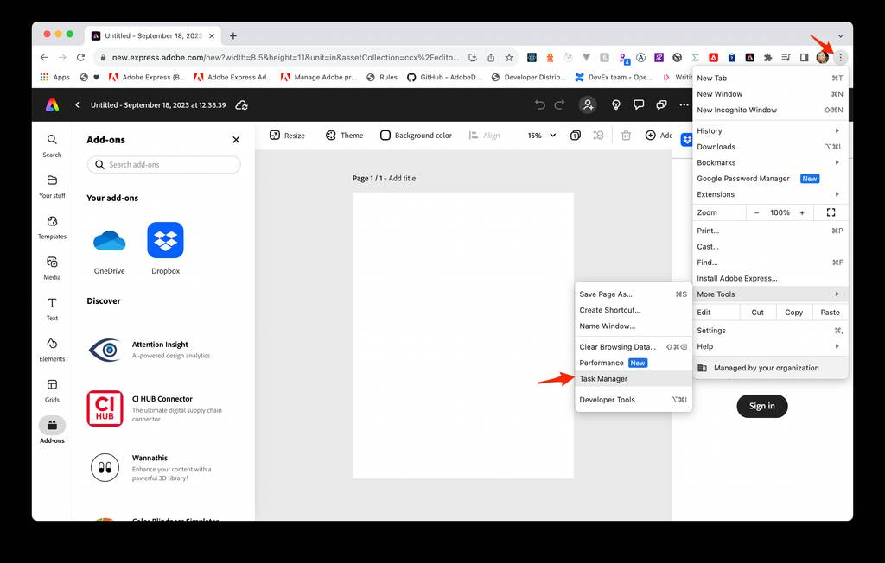
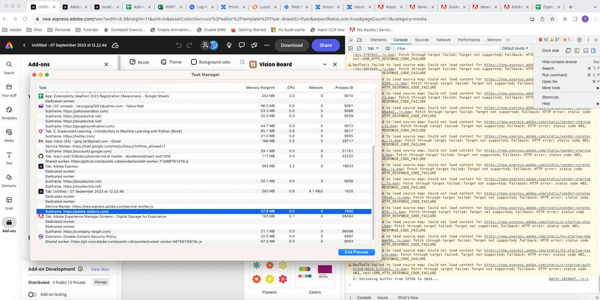
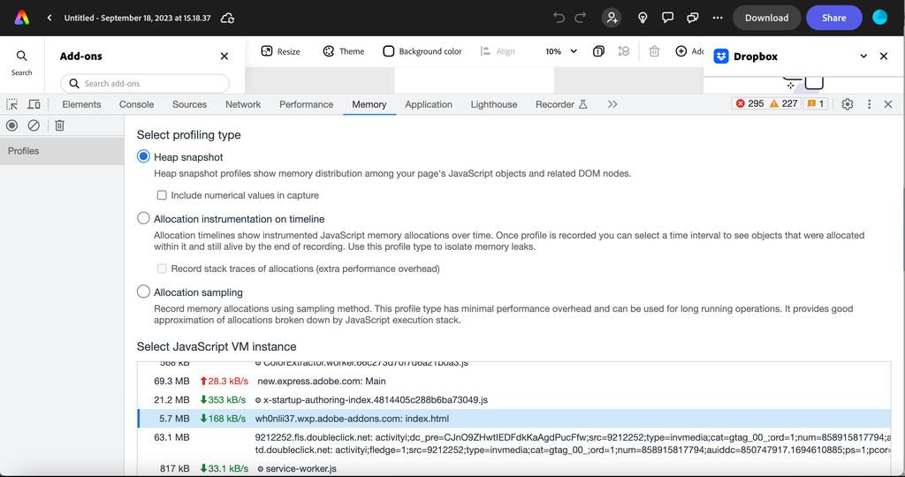

# Performance Tips and Techniques

This page covers a list of tips for optimizing your code to help you build high-performance add-ons.

## JavaScript Performance Tips

### Use asynchronous programming

Use asynchronous programming techniques like callbacks, promises, and async/await to avoid blocking the main thread and improve performance. An example of each approach is given below:

**1. Asynchronous programming using callbacks**
Callbacks are the simplest form of asynchronous programming in JavaScript. Instead of waiting for a function to complete, you pass a callback function to the function that will be called when the operation is complete.

```js
function fetchData(callback) {  
  // perform some asynchronous operation  
  // ...  
  // call the callback function with the result  
  callback(result);  
}  
  
// call the function with a callback  
fetchData(function(result) {  
  // handle the result  
});  
```

**2. Asynchronous programming using promises**
Promises are a more powerful form of asynchronous programming that allow you to chain operations and handle errors more easily.

```js
function fetchData() {  
  return new Promise(function(resolve, reject) {  
    // perform some asynchronous operation  
    // ...  
    // resolve the promise with the result  
    resolve(result);  
    // or reject the promise with an error  
    reject(error);  
  });  
}  
  
// call the function and handle the result with a promise  
fetchData().then(function(result) {  
  // handle the result  
}).catch(function(error) {  
  // handle the error  
});  
```

**3. Asynchronous programming using async/await**
Async/await is a newer feature in JavaScript that allows you to write asynchronous code that looks like synchronous code. For example:

```js
async function fetchData() {  
  // perform some asynchronous operation  
  // ...  
  // return the result  
  return result;  
}  
  
// call the function and handle the result with async/await  
async function handleData() {  
  try {  
    var result = await fetchData();  
    // handle the result  
  } catch (error) {  
    // handle the error  
  }  
}  
```

<InlineAlert slots="text" variant="success"/>

Asynchronous programming can be more complex than synchronous programming, and requires careful handling of errors and callbacks. However, it can greatly improve the performance and responsiveness of your JavaScript code, and is the recommended practice for developers building add-ons.

### Cache frequently accessed data

Cache frequently accessed data to reduce the number of times it needs to be computed.

### Use efficient data structures

Use efficient data structures like `maps` and `sets` instead of arrays for faster access and better performance.

### Minimize DOM manipulation

Accessing and manipulating the DOM is one of the slowest operations in JavaScript. Minimize DOM manipulation by grouping DOM changes together and using techniques like document fragments or virtual DOM.

### Use event delegation

Instead of attaching an event listener to every element, use event delegation to attach a single event listener to a parent element and handle events for all its child elements.

### Optimize loops

Optimize loops by minimizing the number of times you access an array's length property, using `while` loops instead of `for` loops, and breaking out of loops early when possible.

### Use lazy loading

Use lazy loading to load resources only when they are needed, reducing initial page load time.

### Minimize the use of global variables

Minimize the use of global variables to reduce the risk of naming collisions and improve performance.

### Reduce HTTP requests

Minimize the number of HTTP requests by combining multiple files into one, using image sprites, or using data URLs for small images.

## React Performance Tips

This section outlines some performance tips for writing React code.

### Use the virtual DOM

React uses a virtual DOM to minimize the number of updates needed to render changes to the user interface. Make sure to use React's built-in components and lifecycle methods to take advantage of this feature.

### Minimize component updates

Minimize component updates by using `shouldComponentUpdate()` or `React.memo()` to prevent unnecessary re-renders of components.

### Avoid unnecessary state changes

Avoid unnecessary state changes by only updating state when necessary and using setState() correctly.

### Use `PureComponent`

Use [`PureComponent`](https://react.dev/reference/react/PureComponent) instead of regular components to automatically implement `shouldComponentUpdate()` and improve performance.

### Use keys for lists

Use keys for lists to help React identify which items have changed and minimize unnecessary re-renders.

### Use lazy loading

Use lazy loading to load components or resources only when they are needed, reducing the initial page load time.

### Avoid excessive looping

Avoid excessive looping by using techniques like `map`, `filter`, and `reduce`.

### Use memoization

Use memoization to cache the results of expensive calculations or functions and avoid unnecessary re-computation.

### Use React Profiler

Use [React Profiler](https://react.dev/reference/react/Profiler) to identify performance bottlenecks in your code and optimize them.

### Use code splitting

Use code splitting to split your code into smaller chunks and load only the necessary code for a given page or component.

### Avoid unnecessary `props`

Avoid unnecessary `props` by passing only those necessary to child components, and use destructuring to avoid passing unnecessary data.

By following these tips, you can optimize your React code and improve its performance. Remember to test and measure the performance of your code to identify areas for optimization.

## Performance Testing

Be sure to test your add-on code and measure its performance to identify areas for optimization and ensure that your changes have a positive impact on performance. There are several ways to measure the performance of your JavaScript code, some are listed below for reference:

### `console.time()` and `console.timeEnd()`

Use the `console.time()` and `console.timeEnd()` methods to measure the time it takes for a block of code to execute.

```js
console.time('myFunction');  
myFunction();  
console.timeEnd('myFunction');  
```

### `performance.now()`

Use the `performance.now()` method to measure the time it takes for a block of code to execute with high precision.

```js
const t0 = performance.now();  
myFunction();  
const t1 = performance.now();  
console.log(`myFunction took ${t1 - t0} milliseconds.`);  
```

### Chrome DevTools

Use the performance profiler in Chrome DevTools to identify performance bottlenecks in your code. The profiler can show you a detailed breakdown of the time spent in each function, as well as information about memory consumption.

#### Task Manager

The Chrome Task Manager displays the CPU, memory, and network usage of each open tab and plug-in, and allows you to kill an individual process similar to the Windows Task Manager or MacOS Activity Monitor. To open the Task Manager, go to the Chrome triple dot menu -> **More Tools** -> **Task Manager**:



There you can locate the memory consumption of the OS process spawned specifically for the add-on iframe, like below:



#### Memory Consumption Monitoring

The Chrome **Memory** tab can be used to help solve memory issues, including debugging of JavaScript memory leaks. You can also use it to see the memory consumption of the JavaScript context created by the add-on iframe specifically, as shown below:



### Lighthouse

Use [Lighthouse](https://developer.chrome.com/docs/lighthouse/overview/), an open-source tool from Google, to audit performance and identify areas for optimization while your add-on is loaded. Lighthouse can provide suggestions for improving page load time, reducing the size of resources, and optimizing JavaScript code.

### Benchmark.js

Use [Benchmark.js](https://benchmarkjs.com/) to benchmark different implementations of a function or compare the performance of different libraries. Benchmark.js provides a simple and powerful way to measure the performance of your code in a standardized way.

By measuring the performance of your JavaScript code, you can identify areas for optimization and ensure that your code is running efficiently. Use these techniques to test and optimize your code to achieve the best possible performance.
