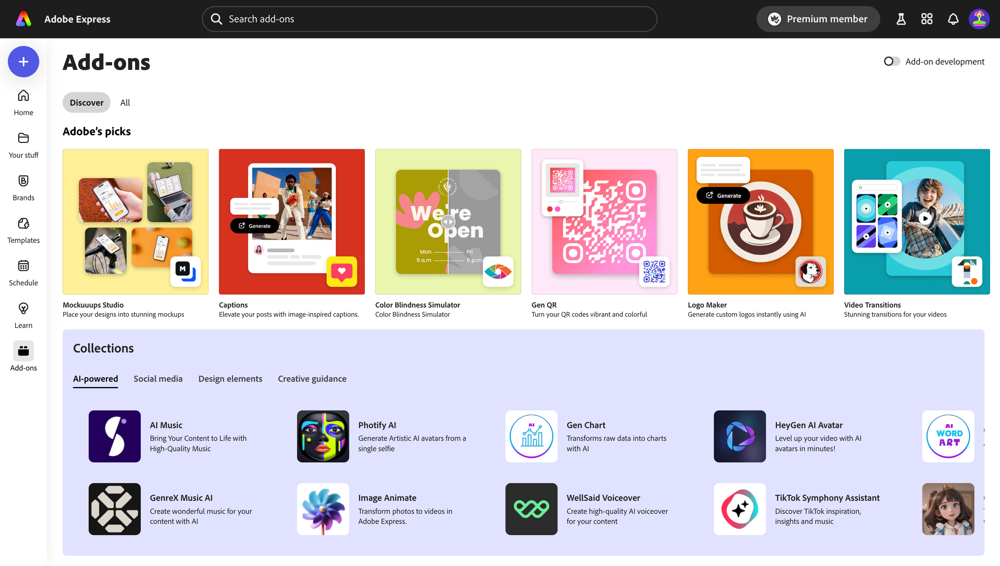

---
keywords:
  - Adobe Express
  - Express Add-on SDK
  - Express Editor
  - Adobe Express
  - Add-on SDK
  - SDK
  - JavaScript
  - Extend
  - Extensibility
  - API
  - Discover
  - Developer Journey
title: Introduction to the Adobe Express ecosystem
description: Introduction to the Adobe Express ecosystem
contributors:
  - https://github.com/hollyschinsky
  - https://github.com/undavide
---

# Introduction to the Adobe Express ecosystem

[Adobe Express](https://www.adobe.com/express/) is an AI-first, all-in-one, web-based app to easily create and share content for free. It's a powerful tool that can be used by everyone, from designers to marketers, to create stunning content in minutes.

## What are add-ons?

[Add-ons](https://new.express.adobe.com/add-ons) are extensions that enhance the functionality of Adobe Express, allowing users to be more productive and creative.

The add-on's use cases are endless, but some real-world examples are:

- Generate **AI avatars** from a selfie.
- Browse and insert **voiceover** and **music** to your project.
- Create **stylish product mockups**.
- Integrate with **Google Drive** and **Google Photos** to manage your files.
- And much more!

## How to develop add-ons

Add-ons are lightweight programs that run in their own panel within the Adobe Express user interface; you can build add-ons with standard web technologies like **HTML**, **CSS**, and **JavaScript**. Ideally, they provide a seamless experience for the user—they should feel like they are part of the Adobe Express app!

Once you have your add-on ready, you can distribute it through the [Adobe Express Marketplace](https://new.express.adobe.com/add-ons). With a few clicks, it'll be made available to **millions of Adobe Express users**.

## Monetize add-ons

Add-ons can be either **free** or **paid**, and anything in between like _freemium_ or _credit-based_.

<InlineAlert slots="text1" variant="info" />

You're allowed to implement your payment processor of choice, the Adobe Express Marketplace _does not take_ a cut of your revenue, so **you keep 100% of your earnings**.

Adobe sponsors the development of selected use cases through the [Adobe Fund for Design](https://developer.adobe.com/fund-for-design); check it out, and get paid to develop your add-on!

## Resources

You now have a basic understanding of the Adobe Express ecosystem; if you want to dive deeper into the different parts of the ecosystem, check out the following resources:

- [Introducing Adobe Express add-ons](https://www.youtube.com/watch?v=CHBiTTN1neE) (Youtube video)
- [Adobe Express add-ons overview](https://developer.adobe.com/express/add-ons/)
- [Adobe Express Office Hours](https://developer.adobe.com/developers-live)
- [Adobe Fund for Design](https://developer.adobe.com/fund-for-design)
