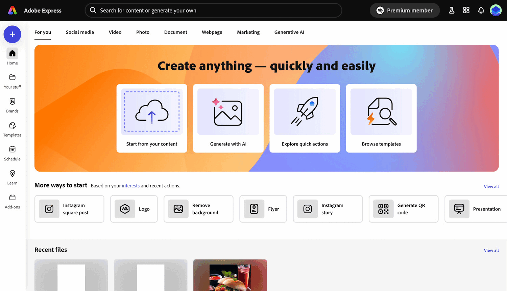
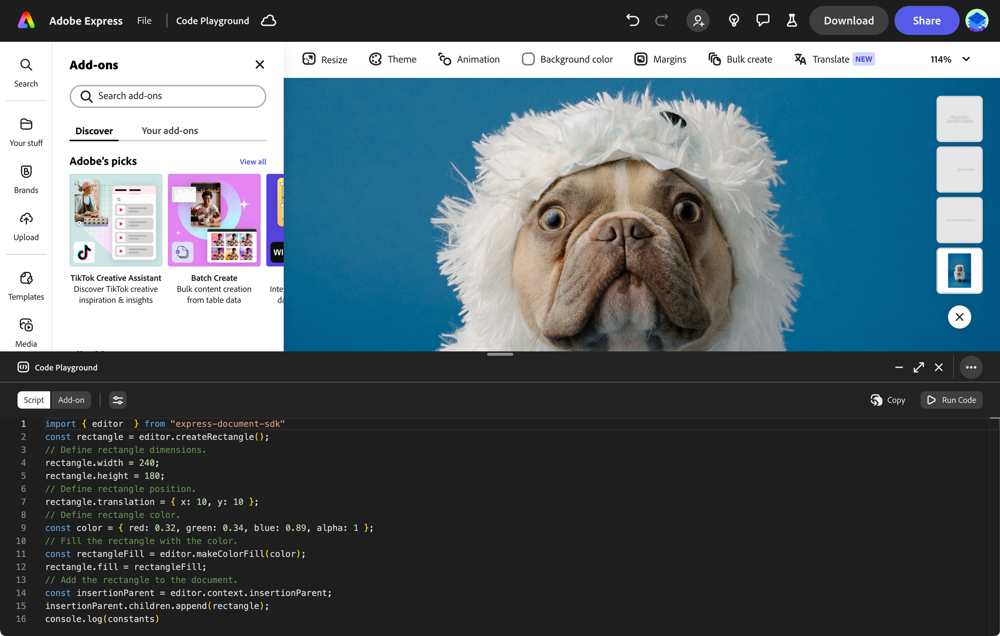

---
keywords:
  - Adobe Express
  - Express Add-on SDK
  - Express Editor
  - Adobe Express
  - Add-on SDK
  - SDK
  - JavaScript
  - Extend
  - Extensibility
  - API
  - Discover
  - Developer Journey
title: Introduction to the Adobe Express ecosystem
description: Introduction to the Adobe Express ecosystem
contributors:
  - https://github.com/hollyschinsky
  - https://github.com/undavide
---

# Learn by tinkering with the Code Playground

The best way to learn is by doing! Adobe Express integrates a [Playground](../getting_started/code_playground.md) environment that allows you experiment with the code directly in the application, without the need to set up a local development environment.

  

 <iframe width="779" height="438" src="https://www.youtube.com/embed/j6KS6CXZmKo?si=j4kX8gItWbm1ZDVz" title="YouTube video player" frameborder="0" allow="accelerometer; clipboard-write; encrypted-media; gyroscope; picture-in-picture; web-share" allowfullscreen></iframe>

 

## Run the Code Playground

You need to tick a few boxes in the application in order to enable it, as the animation below shows.

Once it's open, you can play with the code directly in the editor, and see the changes you make reflected in the document. The [Script Mode](#) is particularly useful for experimenting with the add-on's APIs. Please refer to the complete guide to the [Code Playground](../getting_started/code_playground.md) for more details.

## Explore the How-to Guides

To properly experiment with the Playground, head to the [How-tos](../develop/how_to.md) section: you'll find a collection of short guides and accompanying snippets that you can plug and play in the Playground editor. They cover the most common use cases, and are a great way to get familiar with the add-on SDK. Try the following as a starter:

- [Creating Text](../develop/how_to/use_text.md#create-text)
- [Creating Geometry](../develop/how_to/use_geometry.md)
- [Grouping Elements](../develop/how_to/group_elements.md)

When you feel more comfortable, you can tinker with these other use cases:

- [Using Colors](../develop/how_to/use_color.md)
- [Exporting Renditions](../develop/how_to/create_renditions.md)
- [Document](../develop/how_to/document_metadata.md) and [Element Metadata](../develop/how_to/document_metadata.md)

## Next steps

Feel free to explore the rest of the [How-to Guides](../develop/how_to.md) to get exposed the entire range of possibilities that the add-on SDK offers. If you're ready to get your hands dirty and start building your own add-ons, head over to the [Develop](./develop.md) section to learn how to scaffold a local environment with the CLI, and build a more complex add-on from the ground up.
