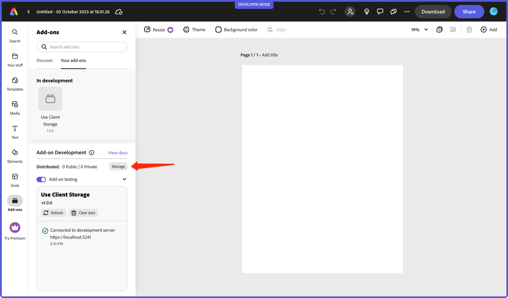
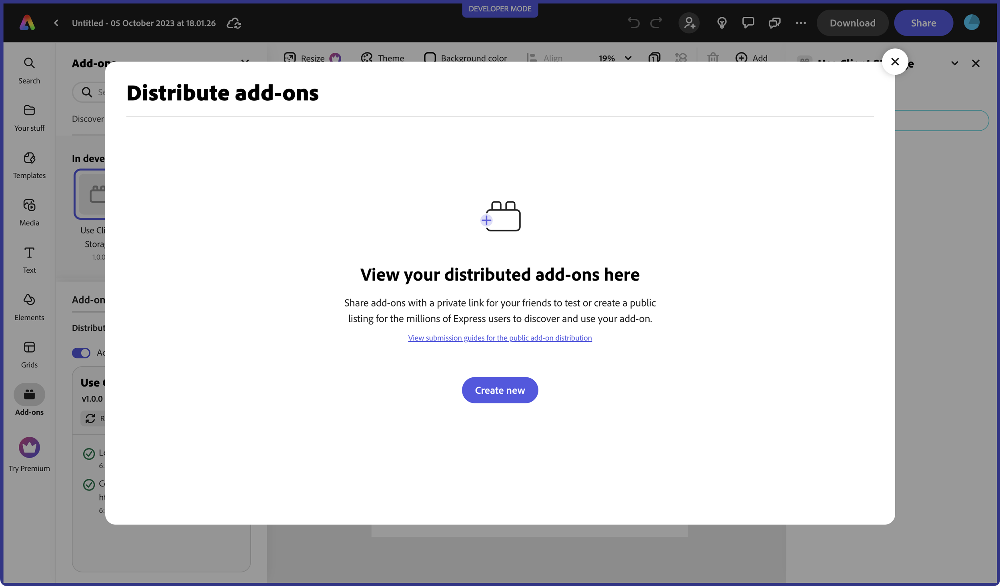
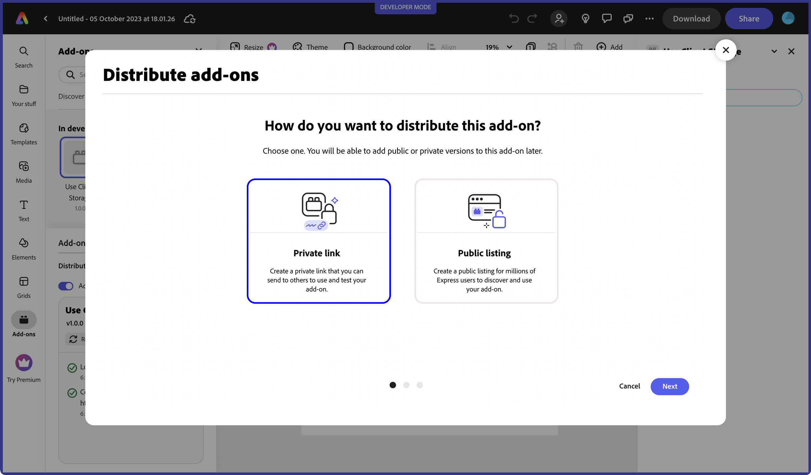
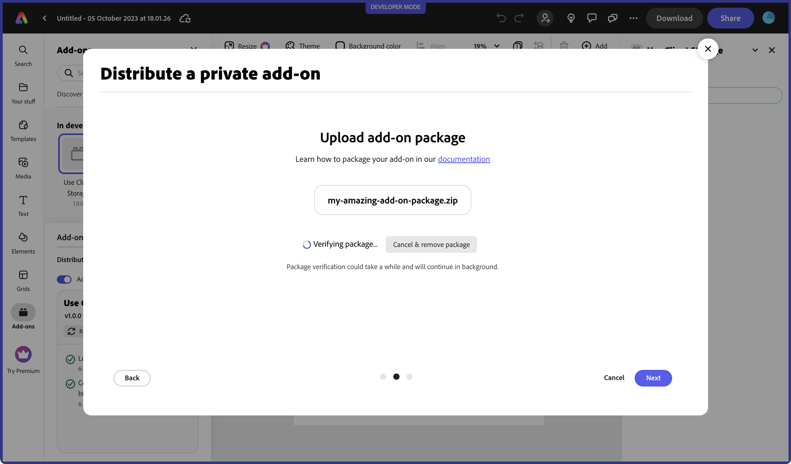
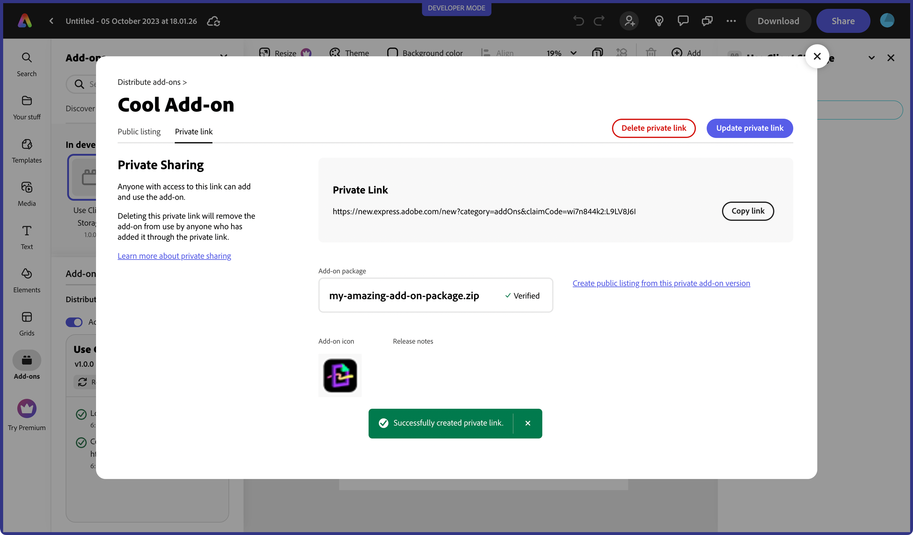
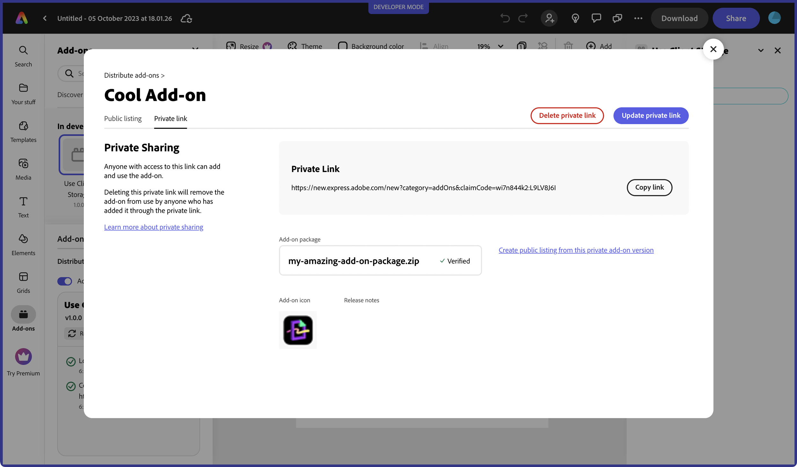

# Create a Private Distribution Link

## Overview

You can choose to create a private link to share your add-on with others to use or test by following the instructions outlined in this section.

## Prepare your add-on package

You will be required to upload a zip of your add-on package in the process of creating a private link. The CLI contains a handy script to help with this step. Open your terminal and navigate into the root of your add-on project, then run the following command:

```bash
npm run package
```

The result will be a distributable zip of your add-on package with the name `dist.zip`, and can be uploaded in step 3 below. This add-on package contains the **production-ready built content** in the *root* of the zip file, similar to what's built into the `/dist` folder.

## Step 1: Invoke the distribution modal

Locate the **Manage** button in the add-ons launchpad and click it to invoke the in-app distribution modal.



If you haven't created any listings for your add-ons yet, then you will see the following in the modal:



If you have existing listings, your first screen will display them:


Select **Create New** from either, and continue to step 2.

## Step 2: Create a new private link

Next, you will choose how you want to distribute your add-on, whether it's to share privately only, or if you want it publicly available. Select **Private link**, and hit **Next**.



## Step 3: Upload your add-on package

The next step is to upload your package zip. Click on the **select from your computer** link and choose your add-on package zip from your file system.

<InlineAlert slots="text" variant="info"/>

In case you missed it, the [top section on preparing your add-on package](#prepare-your-add-on-package) can be used to help you create the zip file needed for this step.


The package will go through a verification process which may take a few seconds, so please be patient.



If you receive an error, please review the following warning notes.

<InlineAlert slots="text1, text2, text3, text4" variant="warning"/>

**1.** If you receive a `MANIFEST_NOT_FOUND_ERROR`, instead of zipping the folder containing the add-on files, please zip only the contents. For example, manifest file would be at the **root** level of the extracted package.

**2.** Your add-on package file size must not exceed 50 MB.

**3.** In places where you are referring to paths, please ensure you are only using relative paths.

**4.** Hidden files should not be present in your package zip. You can use this command on MAC to zip your add-on and to ensure unnecessary files are not included:   `zip -r your_addon_name.zip . -x '**/.*' -x '**/__MACOSX' -x '*.DS_Store'`

Otherwise, you should see the following green check mark showing it's verified and hit **Next** to go to the next step.


## Step 4: Enter name, icon and release notes

In this step you will be prompted to choose a unique **Add-on name** (25 characters max), a 144x144px **Add-on icon**, and optional **Release notes** (1000 characters max). Your add-on name will be validated when you tab out (or the field loses focus) before you will be allowed to move to the next step. You will know that it's verified by a green checkmark shown, or receive an error that it exists, and you need to choose another.


<InlineAlert slots="text" variant="success"/>

The number of characters allowed for any given field is shown above it throughout the distribution experience (for instance, the name field allows a max of 25 characters). The number will automatically update with the remaining amount as you're typing into it.

Once you've entered the required fields, the **Save and create private link** button will be enabled.

<InlineAlert slots="text" variant="warning"/>

The **Save and create private link** button will only be enabled if you have entered all of the required data. Also, once you click the button, it may take a moment to send the package and details to the backend server to generate the link, so please be patient.



You can now click **Copy link** to copy your private link for sharing.

## Post-Submission

You can choose to revisit your submission details later if you want to copy, delete or update your link, or choose to create a public listing from it. To do so, choose **Manage** from the add-on launchpad again, and then select your add-on submission. You will see the details and options available as shown in the example screenshot below.


