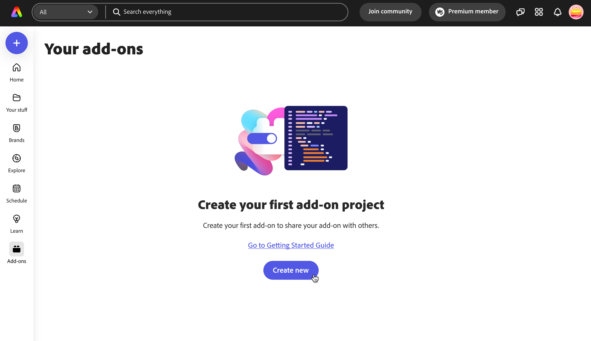
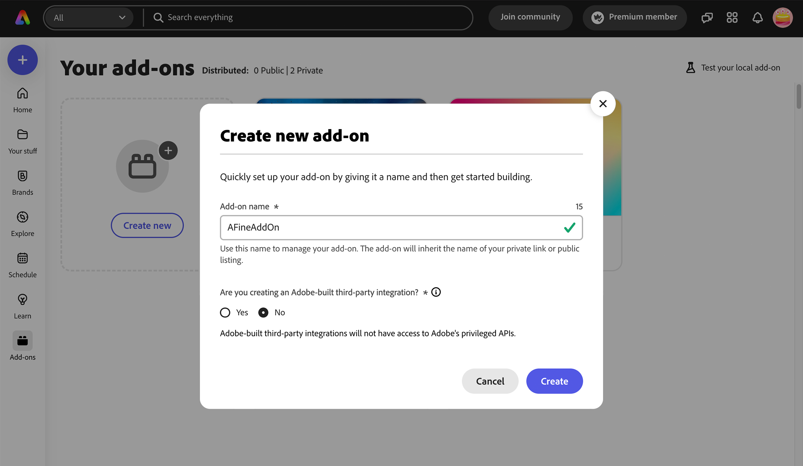
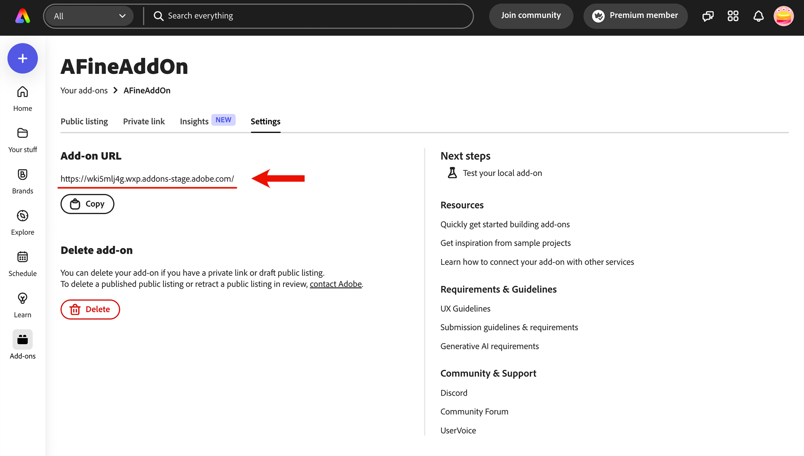
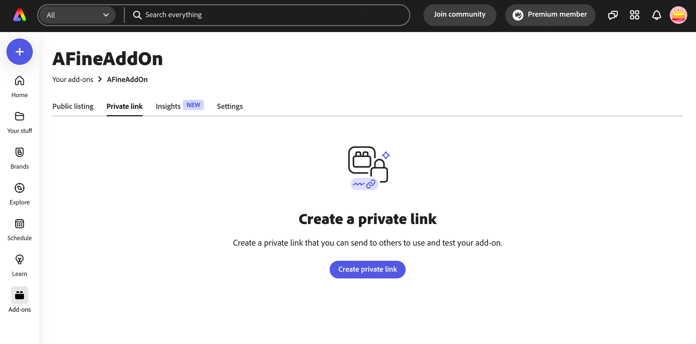
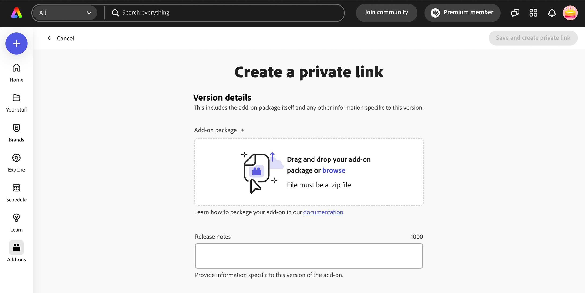
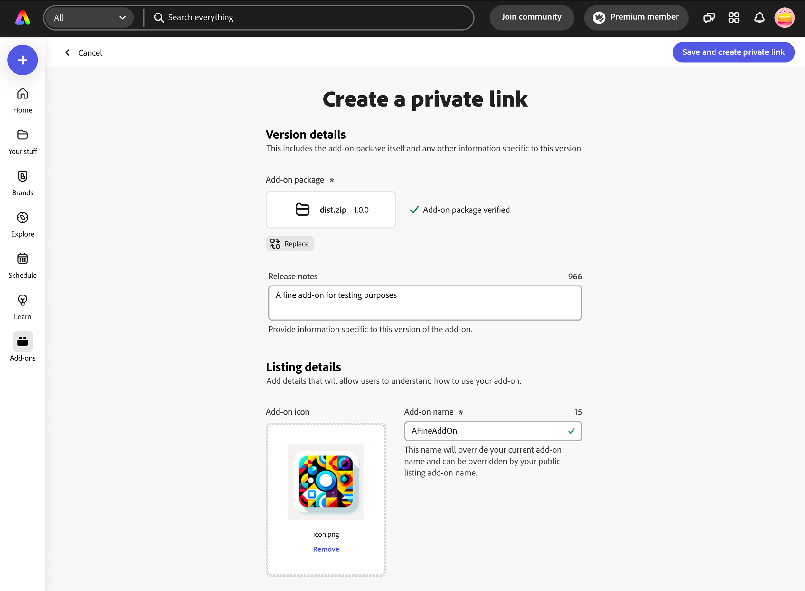
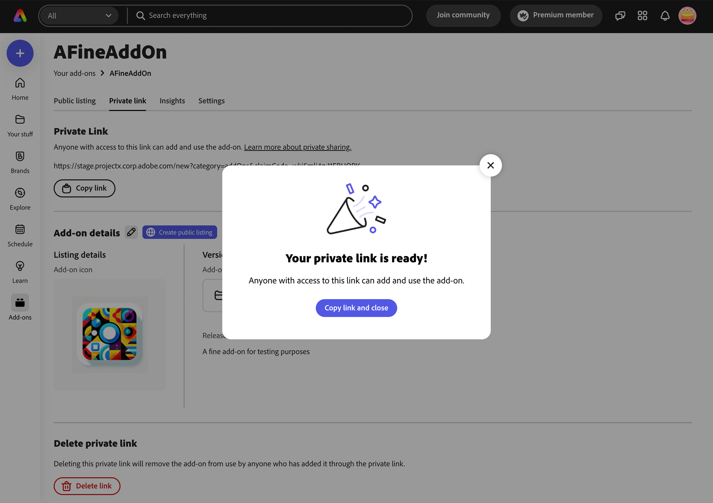

---
keywords:
  - Adobe Express
  - Express Add-on SDK
  - Express Editor
  - Adobe Express
  - Add-on SDK
  - SDK
  - JavaScript
  - Extend
  - Extensibility
  - API
  - Add-on Manifest
title: Create a Private Distribution Link
description: A guide to creating a private distribution link. 
contributors:
  - https://github.com/hollyschinsky
  - https://github.com/undavide
---

# Create a Private Distribution Link

## Overview

You can choose to create a private link to share your add-on with others to use or test by following the instructions outlined in this section.

## Prepare your add-on package

In the process of creating a private link, you will be required to upload a zip of your add-on package. The CLI contains a handy script to help with this step. Before you proceed, open your terminal and navigate to the root of your add-on project, then run the following command.

```bash
npm run package
```

The result will be a distributable zip of your add-on package with the name `dist.zip`, and can be uploaded in step 3 below. This add-on package contains the **production-ready built content** in the *root* of the zip file, similar to what's built into the `/dist` folder.

## Step 1: Create a new Add-on Listing

In order to get a private distribution link, you will need to create a new add-on listing first; provided that you've enabled Add-on Development in your user's settings as described [here](../getting_started/quickstart.md#step-3-enable-add-on-development-mode-first-time-only), you can do so in two ways, which will invoke the same in-app distribution experience.

1. From the Adobe Express home page, click the Add-ons link in the left-hand navigation.


2. While loading a local add-on, click the **Manage add-ons** link in the Add-on Testing section.


In case you haven't created any listings for your add-ons yet, you will see the following.



If you have existing listings, instead, your first screen will display them, alongside the possibility of adding a new one.


Select **Create new** from either, and type the add-on name in the following modal dialog (25 characters max). Your add-on name will be validated when you tab out (or the field loses focus) before you will be allowed to move to the next step. You will know that it's verified by a green checkmark shown, or receive an error that it exists, and you need to choose another.



## Step 2: Add-on Listing Settings

Your add-on container will be created and a settings panel like the one shown below will be presented. Please note the unique subdomain URL from where your add-on will be hosted, and a button to delete the listing if needed.



## Step 3: Create a new private link

Navigate to the **Private link** tab, and click the **Create private link** button to proceed.



## Step 4: Upload your add-on package

The next step is to upload your package. Either drag and drop the add-on package `.zip` file, or click the **browse** link to select the file from your computer's filesystem.

<InlineAlert slots="text" variant="info"/>

In case you missed it, the [top section on preparing your add-on package](#prepare-your-add-on-package) can be used to help you create the zip file needed for this step.



The package will go through a verification process which may take a few seconds, so please be patient. In case you receive an error, please review the following warning notes.

<InlineAlert slots="text1, text2, text3, text4" variant="warning"/>

**1.** If you receive a `MANIFEST_NOT_FOUND_ERROR`, instead of zipping the folder containing the add-on files, please zip only the contents. For example, manifest file would be at the **root** level of the extracted package.

**2.** Your add-on package file size must not exceed 50 MB.

**3.** In places where you are referring to paths, please ensure you are only using relative paths.

**4.** Hidden files should not be present in your package zip. You can use this command on MAC to zip your add-on and to ensure unnecessary files are not included:   `zip -r your_addon_name.zip . -x '**/.*' -x '**/__MACOSX' -x '*.DS_Store'`. The `package` script [described earlier](#prepare-your-add-on-package) takes care of this for you.

## Step 5: Enter add-on details

If the `zip` validation is successful, you will see a green checkmark next to the **Add-on package verified** text, and you can add some Release Notes (1000 characters max) and a 144 x 144px icon.



Once you've entered the required fields, the **Save and create private link** button will be enabled.

<InlineAlert slots="text" variant="warning"/>

The button will only be enabled if you have entered all of the required data. Also, upon clicking, it may take a moment to send the package and details to the backend server to generate the link, so please be patient.


When the process is finished, you'll be greeted by the following popup. Click the **Copy link and close** to copy your private link for sharing.



## Post-Submission details and insights

You can choose to revisit your submission details now if you want to copy, delete, update your link, or choose to create a public listing from it. It's possible also at a later time: in case, choose **Manage add-ons** from the add-on launchpad again, and then select your add-on submission. You will see the details and options available as shown in the screenshot below.


If you select the **Insights** tab, you'll be able to get analytics for your add-on, via the **Download** buttons.


The insights come as `.csv` files named like your add-on, and appended with `_public` or `_private` depending on the listing type (e.g., `AFineAddOn_private.csv`). The insights data currently includes the number of installs, uninstalls and invocations of your add-on per week. A sample is shown below for reference:


