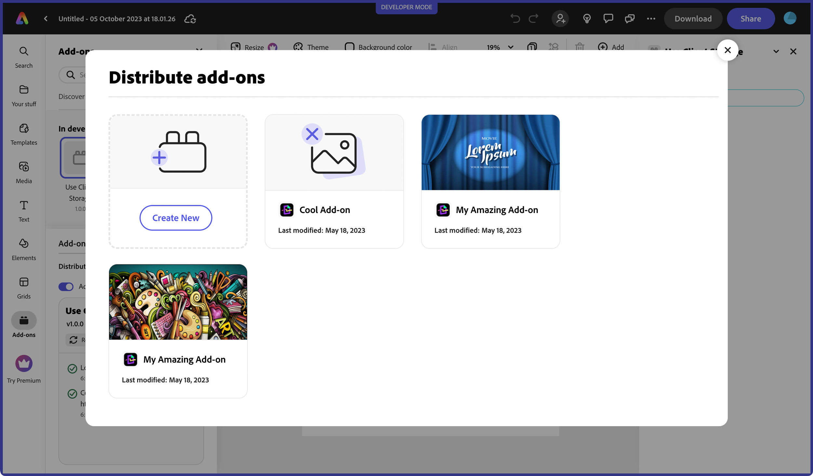
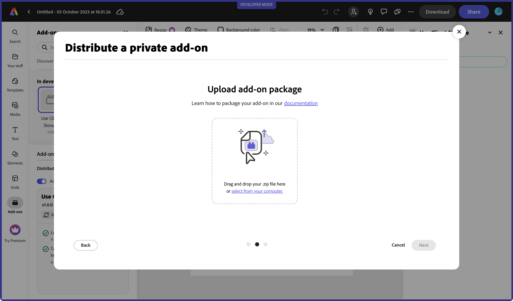
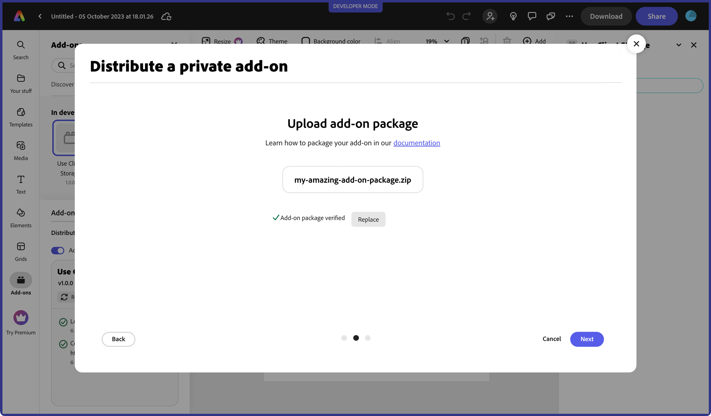
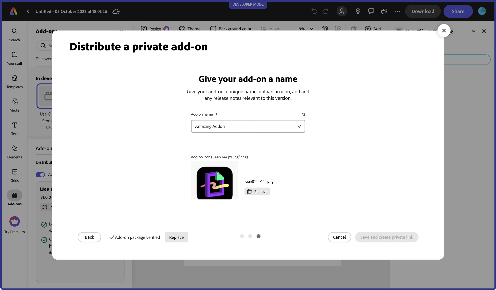

# Create a Private Distribution Link

## Overview
You can choose to create a private link to share your add-on with others for use or testing by following the instructions outlined in this section.

## Step 1: Invoke the distribution modal
A new **Manage** button should now be displayed in your add-ons launchpad, and will invoke the in-app distribution experience when clicked.

If you haven't created any listings for your add-ons yet, then you will see the following modal:

If you have existing listings, your first screen will display them:

Select **Create New** from either, and continue to step 2.

## Step 2: Create a new private link
Next, you will choose how you want to distribute your add-on, whether it's to share privately only, or if you want it publicly available. Select **Private link**, and hit **Next**.

## Step 3: Upload add-on package
The next step is to upload your package zip. Click on the **select from your computer** link and choose your add-on package zip from your file system.

<InlineAlert slots="text" variant="info"/>

This plugin package should contain the production-ready built content in the root of the zip (think in terms of content like from the `/dist` folder, but in the root of the zip and in the most production-ready form). We will not be building/compiling your source. You should try to reduce the size as much as possible. Minifying, uglifying, obfuscating, removing the sourcemaps etc are acceptable to use in producing your final bundle. You can use the command `npm run package` to create a package. It will create a `dist.zip` that you can use for uploading. 

The package will go through a verification process which may take a few seconds, so please be patient. 

If you receive an error, please review the following warning notes.

<InlineAlert slots="text1, text2, text3, text4" variant="warning"/>

**1.** If you receive a `MANIFEST_NOT_FOUND_ERROR`, instead of zipping the folder containing the add-on files, please zip only the contents. For example, manifest file would be at the **root** level of the extracted package.

**2.** Your add-on package file size must not exceed 50 MB.

**3.** In places where you are referring to paths, please ensure you are only using relative paths.

**4.** Hidden files should not be present in your package zip. You can use this command on MAC to zip your add-on and to ensure unnecessary files are not included:   `zip -r your_addon_name.zip . -x '**/.*' -x '**/__MACOSX' -x '*.DS_Store'`

Otherwise, you should see the following green check mark showing it's verified and hit **Next** to go to the next step.

## Step 4: Enter name, icon and release notes
Now you will be prompted to choose a unique *name* for your add-on, an *icon*, and *release notes*. Your add-on name will be validated when you tab out (or the field loses focus) before you will be allowed to move to the next step. You will know that it's verified by a green checkmark shown, or receive an error that it exists and you need to choose another. 

<InlineAlert slots="text" variant="success"/>

The number of characters allowed for any given field above it on the right throughout the distribution experience, and see how many are available still as you are typing into it. For instance, the name allows a max of 25 characters.

Once you've entered the required fields, the **Save and create private link** button will be enabled.

<InlineAlert slots="text" variant="warning"/>

The **Save and create private link** button will only be enabled if you have entered all of the required data. Also, once you click the button, it may take a moment to send the package and details to the backend server to generate the link, so please be patient.

You can now click **Copy link** to copy your private link for sharing.

## Post-Submission
You can choose to revisit your submission details later if you want to copy, delete or update your link, or choose to create a public listing from it. To do so, choose **Manage** from the add-on launchpad again, and then select your add-on submission. You will see the details and options available as shown in the example screenshot below.

