# Public add-on Distribution

## Overview

This guide is provided to help ensure your add-on distribution process goes as smoothly as possible. We've provided a list of all of the things you can prepare in advance, as well as the steps to follow to actually submit your add-on for public distribution. Please note, public distribution is subject to a quality review by our team according to our [Guidelines](./guidelines/index.md).

## Preparing for Submission

This section outlines everything you'll need in order to be prepared for submitting your add-on for public distribution.

### 1. Prepare your metadata

**\* Indicates Required**

| Name                    | Character Length  | Description   |
| -------------:          | ------------------| -----------:  |
| **\* Add-on name**      | 25                | A unique name for your add-on.|
| **\* Summary**               | 50                | A short description of what your add-on does.|
| **\* Full Description**      | 1000              | Full context and description of your add-on and its features |
| **\* Help URL**              | 1000              | URL for your users to get help (ie: https://www.example.com/)  |
| **\* Support email address** | 1000              | An email address that users of your add-on can contact for support |
| **Privacy Notice**          | 1000              | URL of your privacy notice (ie: https://www.example.com/) |
| **End User License Agreement(EULA)**| 1000      | End User License Agreement URL (ie: https://www.example.com/) |
| **Keywords**                | 100              | Keywords to help users find your add-on (comma-separated) |
| **Release notes**       | 1000  | Provide information specific to this version of the add-on |

### 2. Prepare your assets

| Type           | Format      | Description   |
| -------------: | ------------| -----------:  |
| * 36x36 icon           | `.jpg/png`  | a 36x36 sized icon representing your add-on |
| * 64x64 icon           | `.jpg/png`  | a 64x64 sized icon representing your add-on |
| * 144x144 icon         | `.jpg/png`  | a 144x144 sized icon representing your add-on |
| * Screenshot           | `.jpg/png`  | a 1360x800 sized screenshot to show users how to use your add-on |
|   Additional screenshots | `.jpg/png` | 4 more optional 1360x800 sized screenshots for your add-on |
| ** Publisher logo       | `.jpg/png`  | 250x250 sized logo to represent you or your company |

<InlineAlert slots="text" variant="info"/>

** A publisher logo is only required the first time you submit for distribution, and if you've never created a publisher profile.

### 3. Prepare your add-on package

The CLI contains a handy script to help you with this step. Open your terminal and navigate into the root of your add-on project, then run the then run the following command:

```bash
npm run package
```

The result will be a distributable zip of your add-on package with the name `dist.zip`, and can be used as the file you upload in this step. This add-on package contains the **production-ready built content** in the *root* of the zip file, similar to what's built into the `/dist` folder.

### 4. Carefully [review our set of guidelines](./guidelines/index.md)

## Submission Steps

This set of steps can be followed when you have everything prepared, have carefully reviewed the guidelines, and are ready to submit your add-on for review via the Adobe Express in-app distribution modal.

### Step 1: Invoke the distribution modal

Locate the **Manage** button in the add-ons launchpad and click it to invoke the in-app distribution modal.


If you haven't created any listings for your add-ons yet, then you will see the following in the modal:


If you have already created existing listings, the first screen displayed will show them:


Select **Create New** from either and continue to step 2.

### Step 2: Create a new listing and distribution type

Next, you will choose how you want to distribute your add-on, whether its to share privately only, or if you want it publicly available. Select **Public listing**, and hit **Next**.

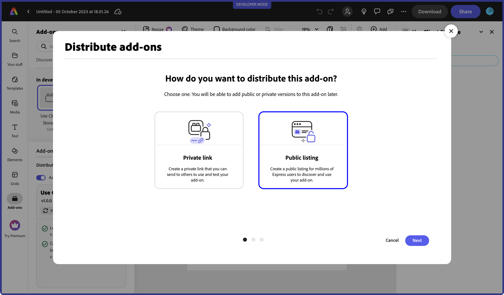

### Step 3: Upload your add-on package

The next step is to upload your package zip. Click on the **select from your computer** link and choose your add-on package zip.

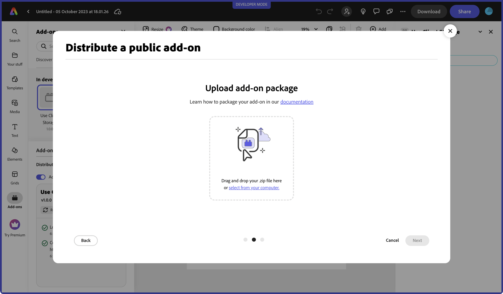

<InlineAlert slots="text" variant="success"/>

The CLI contains a handy script to help you with this step. Open your terminal and navigate into your add-on project, then run the command: **`npm run package`**. The result will be a distributable zip of your add-on package with the name `dist.zip`, and can be used as the file you upload in this step. This add-on package contains the **production-ready built content** in the *root* of the zip file, similar to what's built into the `/dist` folder.

The package will go through a verification process which may take a few seconds, so please be patient. You will see a green checkmark and message that it's verified once it's complete. Press **Next** to go to the next step.

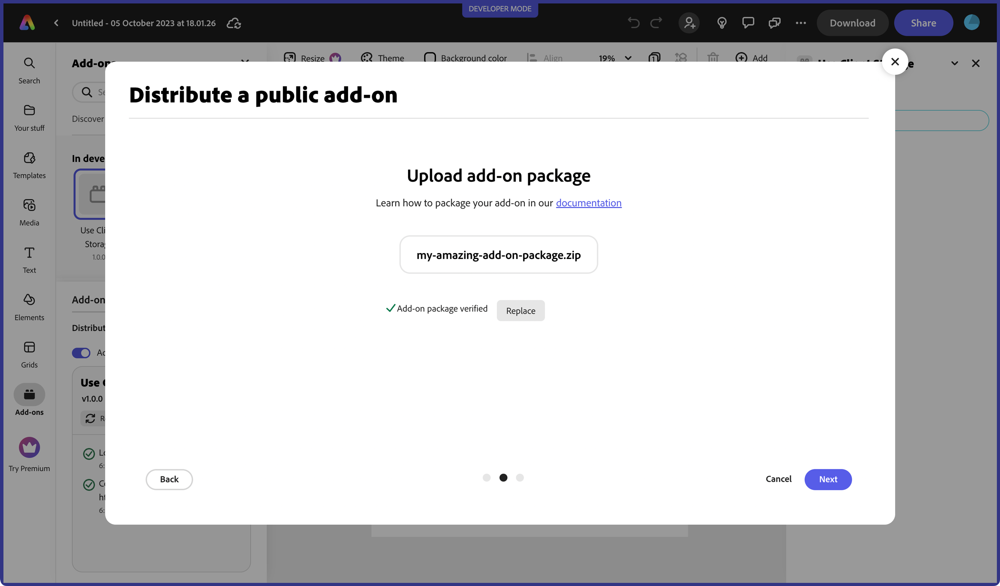

If you receive an error, please check the following warning notes.

<InlineAlert slots="text" variant="warning"/>

- If you receive a `MANIFEST_NOT_FOUND_ERROR`, instead of zipping the folder containing the add-on files, please zip only the contents. In other words, the manifest file should be at **root** level of the extracted package.
- Your add-on package file size must not exceed 50 MB.
- In places where you are referring to paths, please ensure you are only using relative paths.
- Hidden files should not be present in your package zip.
You can use this command on MAC to zip your add-on and to ensure unnecessary files are not included:    `zip -r your_addon_name.zip . -x '**/.*' -x '**/__MACOSX' -x '*.DS_Store'`

### Step 4: Choose your add-on name

In this step, you will be prompted to choose a unique name for your add-on. Your add-on name will be validated once you tab out, (or the field loses focus). This validation must occur before you can move to the next step. You will know that it's verified with a green checkmark (shown below). If you receive an error that it already exists, then you will need to choose another name. Once it's verified, click on the **Save draft and continue**. This will ensure you have a draft saved with your unique name and plugin package.

<InlineAlert slots="text" variant="success"/>

The number of characters allowed for any given field is shown above it throughout the distribution experience (for instance, the name field allows a max of 25 characters). The number will automatically update with the remaining amount as you're typing into it.

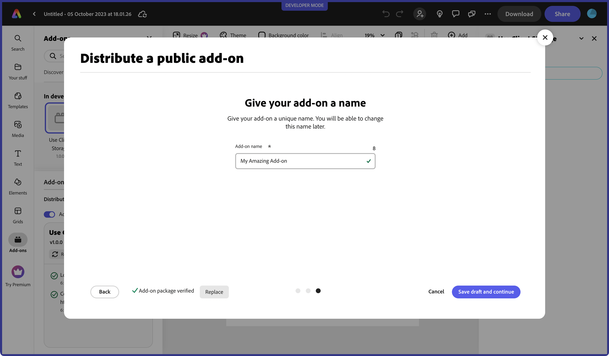

### Step 5: Enter the listing details

You should now see a success message that your draft was saved, and will be able to start filling our your listing details, starting with the three required icons:
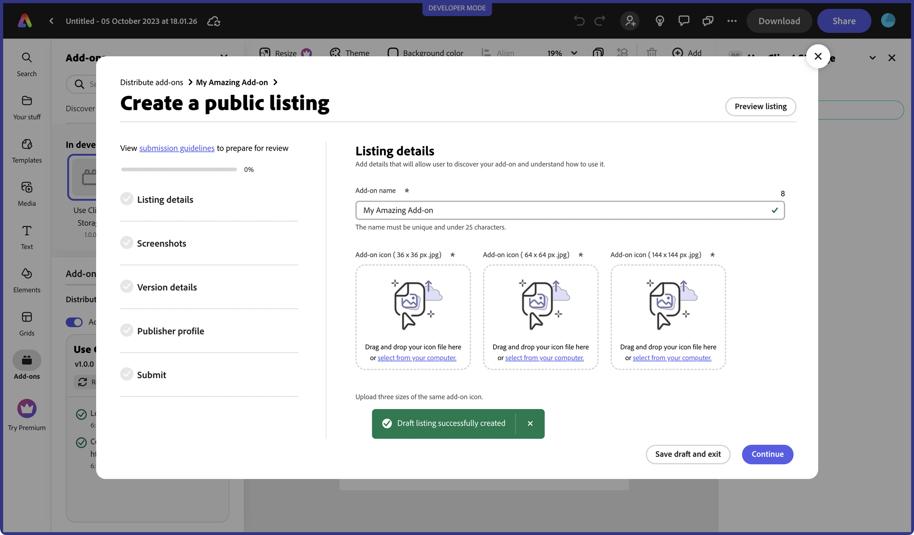

followed by the rest of the information you want to associate your listing. Please ensure your URLs and email addresses are properly formed to avoid any unnecessary errors.


<InlineAlert slots="text" variant="success"/>

The `*` indicates required fields. Note that you can skip entering these required fields if you are only planning to save a draft with your current edit, though you will not be able to submit it until they are completed.

Once you finish entering your listing details, you should see a green checkmark for **Listing Details** in the left rail showing your progress. You can then hit **Continue** to move on to the next step.


<InlineAlert slots="text" variant="success"/>

You can use the "Back" button throughout the distribution experience when you need to go back to change any details at any step.

### Step 6: Upload screenshots

In the next screen, you will be prompted to should upload 1-5 screenshots to show off your add-on and what it's all about. **NOTE**: At least one screenshot is required.

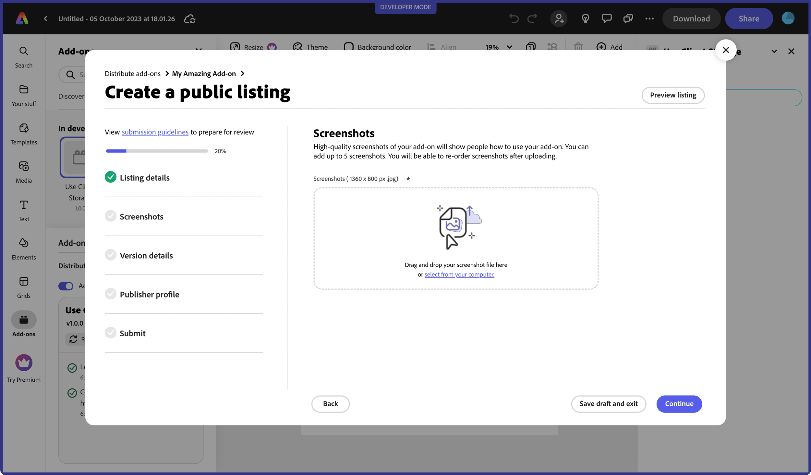

You will see the green checkmark for **Screenshots** in the left rail once you upload at least one, and at this point you can choose to **Continue**.

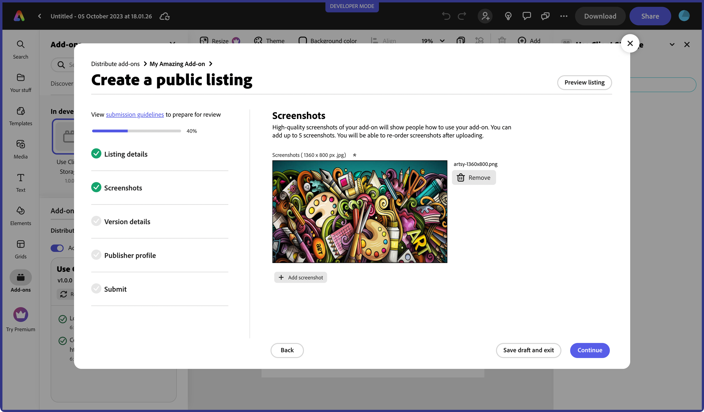

<InlineAlert slots="text" variant="warning"/>

Sometimes it may take a moment to upload the images to the back-end server before the **Continue** button will be highlighted.

### Step 7: Enter the version details

Next you will specify your version details. The package that you entered in the first step will be shown by default, but you can replace it if you have made an update since you originally uploaded it in this step as well. You can also enter any optional release notes at this step. You will see the green checkmark for **Version details** in the left rail and can press **Continue** to move on.

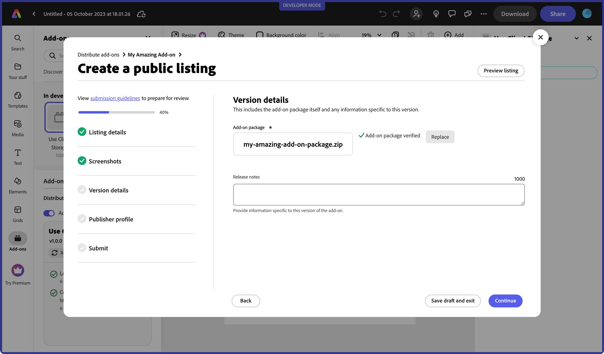

### Step 8: Create a publisher profile

You will only see this step the first time you submit an add-on and if you've never created a publisher profile prior to this submission. Fill our your publisher details and upload a 250x250 logo, then hit **Continue**.

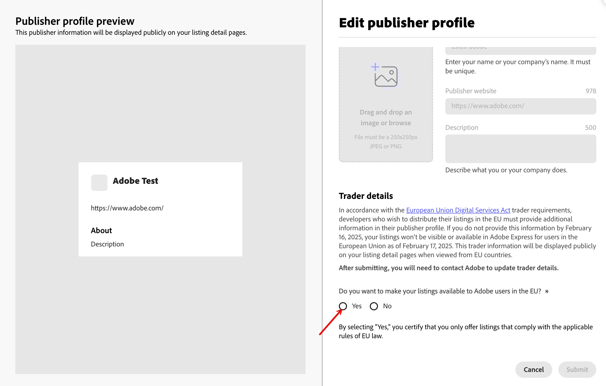

### Step 9: Final submission step

The final submission step prompts you to enter any **Notes to reviewer** and then you can choose to **Submit for review** if you've entered all of the required data and you are done making any more changes.

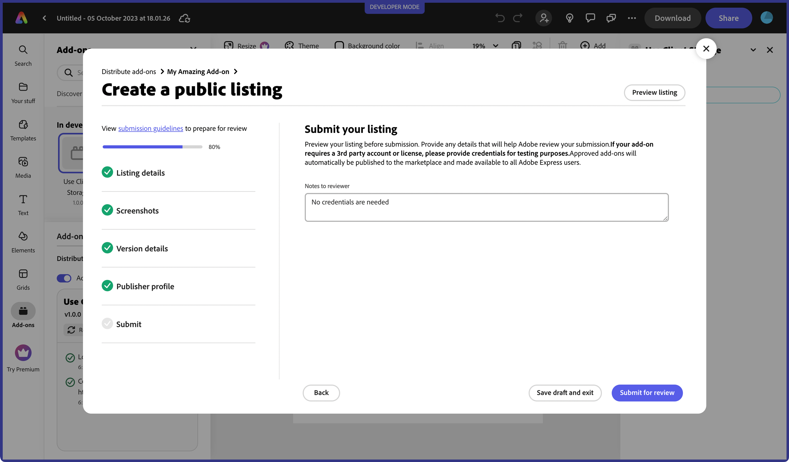

<InlineAlert slots="text" variant="warning"/>

The **Submit for review** button will only be enabled if you have entered all of the required data.

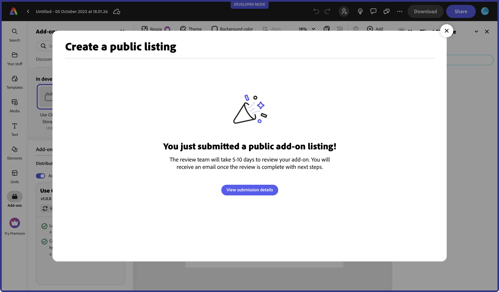

**View submission details** will display the details of your add-on submission:

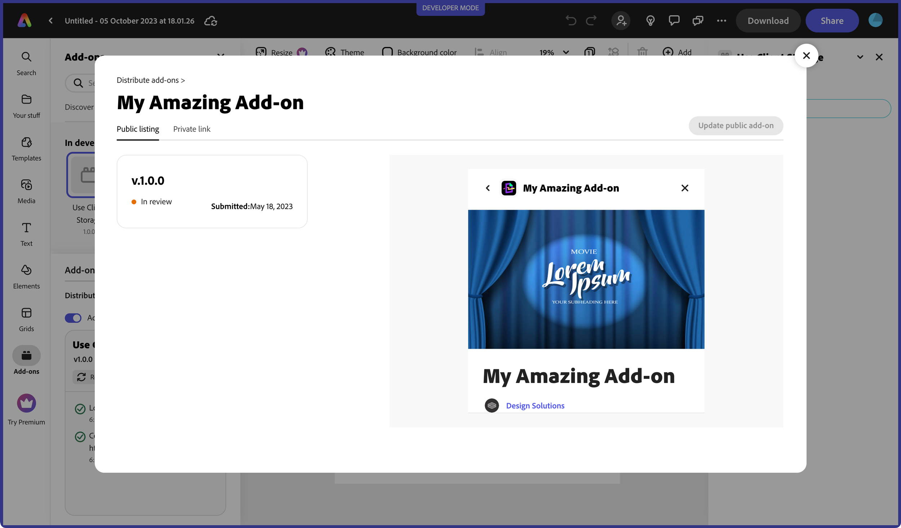

<InlineAlert slots="text" variant="success"/>

You can also choose to view your submission details later from the add-on launchpad by clicking **Manage** again, and then selecting any existing listing. If it's in a *Draft* status, you can click the ellipsis button "..." and choose **edit** if you want to update the details.
