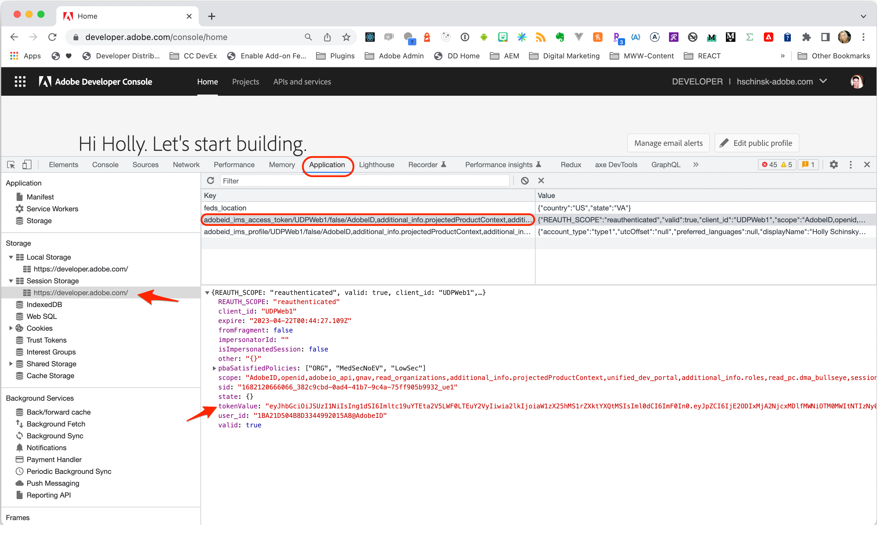

# Submission Guide
This document outlines the interim solution to submit add-ons until the self-service in-app submission surface is live.

- [Private Sharing Steps](#private-sharing-steps)
- [Public Distribution Requirements](#public-distribution-requirements)
<!-- - [Sample Submission Zip Files](#sample-submission-zip-files) -->

### Private Sharing Steps
Please follow the steps below to submit your add-on for review until the public in-app distribution option is available. You will receive a private sharing link as a result of your submission. Note: anyone it's shared with will still need to have access to the prerelease groups.

1. Login to the [Adobe Developer Console](https://developer.adobe.com/console/) and accept the TOU (Terms of Use) if prompted.
2. Get an access token from the developer tools of the browser:
    - Open the browser developer tools
    - Go to the **Application** tab
    - Locate **Session Storage** 
    - Copy the access token from the `tokenValue` field located in `adobeid_ims_access_token`

    

    WARNING:
    This access token expires after 24 hours, so if you are submitting a new version, you will need to get a new one.

3. Create a JSON file (ie: `addon_metadata.json`) and enter your intended values for the keys below, depending on whether you're creating a new add-on or a new version:

**JSON required to create a new add-on:**

    {
        "authToken": "Bearer token", // token as retrieved from step 2
        "publisherMetadata": {
            "name": "Adobe"
        },
        "addonMetadata": {
            "name" : "addon-unique-name"
        },
        "versionMetadata": {
            "releaseNotes": "Version release notes"
        }
    }

**JSON required to update an existing add-on or create a new version:**

    {
        "addonId": "wi5g43lhl", // required only in case you want to update addon metadata.
        "authToken": "Bearer token", // token as retrieved from step 2
        "publisherMetadata": {
            "name": "Adobe"
        },
        "addonMetadata": {
            "name" : "addon-unique-name"
        },
        "versionMetadata": {
            "releaseNotes": "Version release notes"
        }
    }

4. Provide a 36x36 icon in `.jpg` or `.png` format (ie: `icon_36.jpg`)
5. Provide a plugin package zip file of your pre-built add-on contents (ie: `addon_package.zip`). 

    IMPORTANT: Your plugin package should contain the production-ready built content in the root of the zip (think in terms of content like from the `/dist` folder, but in the root of the zip and in the most production-ready form). We will not be building/compiling your source. You should try to reduce the size as much as possible. Minifying, uglifying, obfuscating, removing the sourcemaps etc are acceptable to use in producing your final bundle. 

6. Package all of the mandatory files outlined in the steps above into a zip and upload it to a file sharing service like Dropbox, Google Drive, Creative Cloud Files etc).
7. Share the public link from the previous step in an email to our [Add-ons Review Team](addon-submission@adobe.com) and include anything relevant for us to know for reviewing your add-on (known issues, planned updates, etc). 

    Remember, the zip you upload to share with us should include:

    - An `addon_metadata.json` file.    
    - The 36x36px icon file (`icon_36.jpg` or `icon_36.png` for instance).
    - The `addon_package.zip`.

<InlineAlert slots="text" variant="info"/>

All files name are case-sensitive. Images supplied need to be of type `.jpg` or `.png`.

<InlineAlert slots="text" variant="success"/>

Download the add-on sample zip here for reference on what to include.
[Sample submission zip for private sharing](img/Addon_Sample_private.zip).

### Post Submission

1. Once received, the review team will generate a private sharing link that we will send you (assume a 24 hour turnaround).
2. The review team will use the private sharing link to start an initial review of your submission and provide feedback as needed. Once the in-app submission experience is available in the near future, we will ask you to use that for your final add-on submission. This final submission will also require a final approval. We encourage you to submit for private sharing sooner than later so we can start the review process and help ensure your final review will go more smoothly and quickly. 
3. Once officially approved, your add-on will be auto-published.

## Public Distribution Requirements
The in-app submission experience for public distribution of your add-ons will be released in the very near future, but if you want to prepare the assets in advance of it, the following describes what is required. 

#### Asset Requirements:

1. **Icons**

    3 sizes required in `.jpg` or `.png` format:

    - Size 36x36px
    - Size 64x64px
    - Size 144x144px
    
    <InlineAlert slots="text" variant="warning"/>
    
    All three sizes are mandatory.

2. **Screenshots**
    
    1-5 screenshots with dimensions of 1360x800px in `.jpg` or `.png` format. 
    
    <InlineAlert slots="text" variant="warning"/>
    
    At least one screenshot is mandatory.        

3. **Logo** 

    A publisher profile logo in `.jpg` or `.png` format with size 250x250px.

    <InlineAlert slots="text" variant="warning"/>
    
    The logo is mandatory.

#### Metadata Requirements:

1. **Publisher Metadata**
    - Publisher Name
    - Publisher Description
    - Publisher Website
    - Publisher Logo
2. **Add-on Metadata**
    - Support Email
    - Help Url
    - Privacy Policy
    - License Agreement
    - Name
    - Description
    - Summary
    - Keywords
3. **Version Metadata**
    - Version release notes

<InlineAlert slots="text" variant="success"/>

Download the [public submission add-on sample zip](img/Addon_Sample_public.zip) for reference on what assets will be expected when the in-app submission experience is available. Remember, this zip is just a sample purely for reference of the types of assets you will need, but *not something you'll submit to us via email in this initial phase*. **IMPORTANT:** The [private sharing steps](#private-sharing-steps) should be used until further notice.
