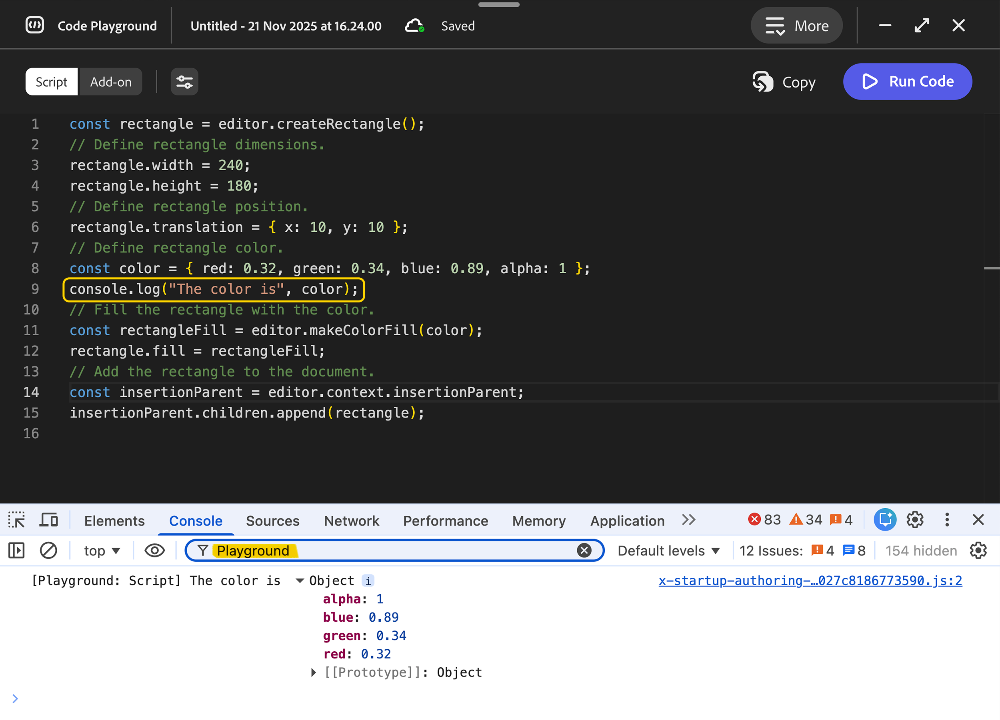
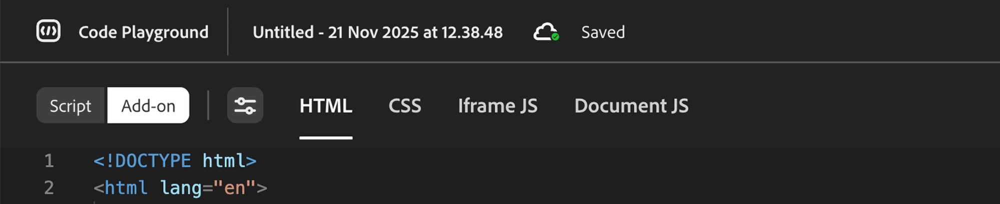
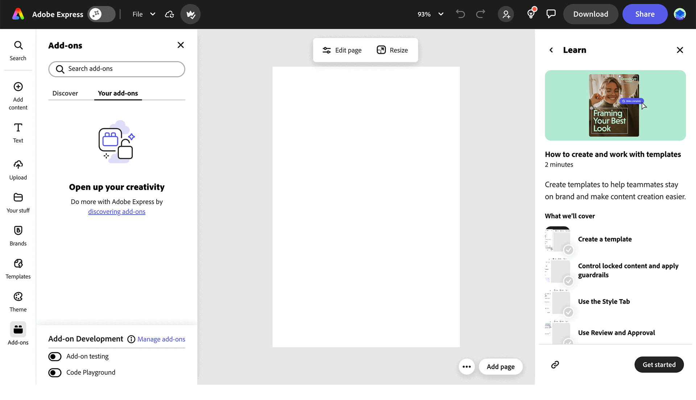
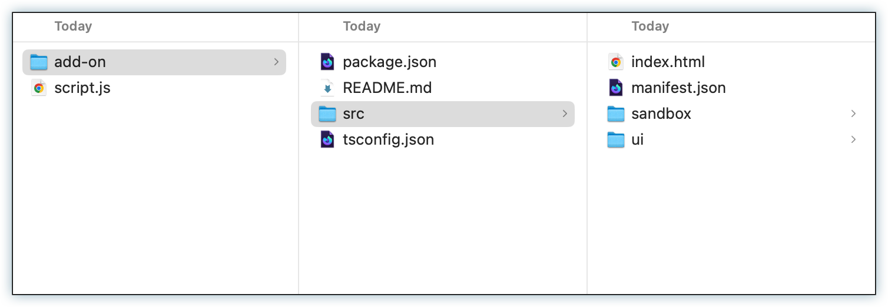

---
keywords:
  - Adobe Express
  - Express Add-on SDK
  - Adobe Express Add-on Development
  - Code Playground
  - Workflow
  - Productivity
  - Keyboard Shortcuts
  - Session Management
  - Code Download
  - Local Development
title: Code Playground - Workflow & Productivity
description: Master Code Playground workflow with keyboard shortcuts, session management, and productivity tips.
contributors:
  - https://github.com/padmkris123
  - https://github.com/hollyschinsky
  - https://github.com/ErinFinnegan
  - https://github.com/undavide
  - https://github.com/nimithajalal
---

# Code Playground - Workflow & Productivity

Master the Code Playground workflow with keyboard shortcuts, session management, and productivity tips to maximize your development efficiency.

## Transitioning Between Modes

### From Script Mode to Add-on Mode

Once you've tested your code in Script mode, you can easily transition it into Add-on Mode to build a user interface around your functionality:

1. **Copy Your Code**: Use the **Copy** button in the right corner to quickly copy your code to the clipboard
2. **Switch to Add-on Mode**: Click the **Add-on** button to enter Add-on Mode
3. **Paste and Adapt**: Paste the code into the **Document JS** tab. **Note:** Don't forget you'll need to add the `import` statements for the Document APIs and handle your `async` functions manually in this mode
4. **Build Your UI**: Modify your script code to be used in the add-on context along with your front-end logic in the **HTML**, **Iframe JS**, and **CSS** tabs. Use the initial sample code provided as a reference
5. **Configure Manifest**: If you set any manifest properties (e.g., **experimentalApis**) while in Script mode, make sure to set the same in Add-on Mode as well. These settings only apply to the context of the development mode you're in
6. **Test Your Add-on**: Click the **Run Code** button to execute your code within the context of your add-on

## Keyboard Shortcuts

Use these keyboard shortcuts to work more efficiently:

| Action                           | Windows/Linux                                                | macOS                                                       |
| -------------------------------- | ------------------------------------------------------------ | ----------------------------------------------------------- |
| **Save**                         | <kbd>Ctrl</kbd> + <kbd>Shift</kbd> + <kbd>S</kbd>            | <kbd>Cmd</kbd> + <kbd>Shift</kbd> + <kbd>S</kbd>            |
| **Run**                          | <kbd>Ctrl</kbd> + <kbd>Shift</kbd> + <kbd>Return/Enter</kbd> | <kbd>Cmd</kbd> + <kbd>Shift</kbd> + <kbd>Return/Enter</kbd> |
| **Reset**                        | <kbd>Ctrl</kbd> + <kbd>Shift</kbd> + <kbd>X</kbd>            | <kbd>Cmd</kbd> + <kbd>Shift</kbd> + <kbd>X</kbd>            |
| **Increase font size**           | <kbd>Ctrl</kbd> + <kbd>Shift</kbd> + <kbd>Plus (+)</kbd>     | <kbd>Cmd</kbd> + <kbd>Shift</kbd> + <kbd>Plus (+)</kbd>     |
| **Decrease font size**           | <kbd>Ctrl</kbd> + <kbd>Shift</kbd> + <kbd>Minus (-)</kbd>    | <kbd>Cmd</kbd> + <kbd>Shift</kbd> + <kbd>Minus (-)</kbd>    |
| **Switch between tabs**          | <kbd>Ctrl</kbd> + <kbd>1, 2, 3, 4</kbd>                      | <kbd>Cmd</kbd> + <kbd>1, 2, 3, 4</kbd>                      |
| **View the typings suggestions** | <kbd>Ctrl</kbd> + <kbd>space</kbd>                           | <kbd>Cmd</kbd> + <kbd>space</kbd>                           |

<InlineAlert slots="header,text1" variant="success"/>

#### TIP

Use the "**More**" button in the top right corner of the playground window to reference the available keyboard shortcuts, start a new session, link to documentation and more.

## Debugging

For debugging your code, you can view the logs from Code Playground in the browser's Console.

<InlineAlert slots="text, text1, text2" variant="info"/>

The Code Playground **prefixes the messages in the Console** with descriptive strings to help you distinguish them from other messages.

- `[Playground: Add-on]` for Code Playground in Add-on mode.
- `[Playground: Script]` for Code Playground in Script mode.

Open the browser's developer tools by right-clicking on the browser window where Adobe Express is running, and selecting **Inspect** from the context menu. In the **Console**, you can filter out the messages from the Code Playground by typing just `Playground` in the filter input.

## Session Management

### Save Your Work

The Code Playground now backs up your sessions in the cloud, ensuring your work is safely stored and protected from accidental loss. You can know whether your session is looking at the status next to the session name.

If an issue occurs, the status will update accordingly and an error toast will appear.

Your code is **_not saved automatically_**. The Code Playground saves your session only when you perform the following actions:

1. Run the code.
2. Save using the [keyboard shortcut for Save](#keyboard-shortcuts).
3. Switch to a new session.
4. Exit the Code Playground (with the **X** in the upper right corner).

### Manage and Resume Sessions

There are two ways to resume working on one of your saved sessions:

#### Via the Home Screen

1. Click the **Add-ons** button in the left rail.
2. Click the **Add-on development** toggle in the top right corner of the playground window.
3. Click **New sesion** to create a new one, or
4. Select the **Playground Sessions** tab to access your saved sessions.
5. Click on the session you want to resume to open it in the Code Playground.

#### Via the Add-ons Panel

If you have a **document open**, you can:

1. Click the **Add-ons** button in the left rail and select the **Your add-ons** tab.
2. Toggle on **Code Playground** at the bottom of the panel; it will open with the last session you were working on.

To browse your saved sessions:

1. Click the **More** button in the top right corner of the playground window
2. Select the **Manage Sessions** item in the dropdown menu
3. You'll see a list of your saved sessions; click on one to **select it** and click the **Open** button to resume working on it.

<InlineAlert slots="header, text1" variant="info"/>

#### Access "Your add-ons" Page

- **Without a document open:** Click the **Add-ons** button in the left rail, then click the **Add-on development** toggle in the top right
- **With a document open:** Click the **Add-ons** button in the left rail, select the **Your add-ons** tab, then click the "Manage add-ons" link in the Add-on Testing section

### Rename a Session

To rename a session, click on the session name and enter a new name. Click anywhere outside the input or press <kbd>Enter</kbd> to save the new name. A toast will appear to confirm the change.

### Delete a Session

To delete a session, click on the **•••** button next to the session name and click the **Delete Session** button. You'll need to confirm the deletion by clicking the **Delete** button . A toast will appear to confirm the success of the operation.

### Session Limits and Lifecycle

The Code Playground supports a maximum number of sessions per user. To help manage storage and maintain system performance, sessions automatically transition through different states based on activity:

- **Active**: Your session is actively maintained and fully functional for development.
- **Inactive**: Sessions become inactive after 60 days without any activity. Simply accessing the session and running your code will reactivate it and reset the inactivity timer.
- **Archived**: After 90 days of inactivity, sessions are automatically archived. While you can no longer run code in an archived session, you can still access and download your code to back it up locally.
- **Permanently Deleted**: Sessions are permanently deleted after 120 days of inactivity.

<InlineAlert slots="text" variant="info"/>

To preserve your work, regularly access your sessions or download your code for local backup. Running your code in a session resets the inactivity clock.

## Download Your Code

### How to Download

Downloading your code is a great way to save your work and continue working on it locally in your CLI.

To download your code:

1. Click the **More** button in the top right corner of the playground window
2. Click the **Download** button
3. This will download a zip file containing your code

### Folder Structure

The downloaded zip file will contain a folder with the following structure:

- add-on folder
- `script.js` file

### Run Downloaded Code

You can run your add-on folder as a local add-on project in your CLI by following the steps in the [Quickstart Guide](hello-world.md). There is a readme file in the add-on folder that will guide you through the process as well.

**Note:** You cannot run the `script.js` file alone.

## Productivity Tips

### Development Workflow

1. **Start with Script Mode**: Use Script Mode to prototype and test your core functionality.
2. **Iterate Quickly**: Use keyboard shortcuts to save and run code frequently.
3. **Test Incrementally**: Run your code often to catch issues early.
4. **Transition to Add-on Mode**: Once your logic is working, move to Add-on Mode to build the UI.
5. **Download for Local Development**: Use the download feature to continue development locally.

## Troubleshooting Common Issues

See the [Troubleshooting](code-playground-troubleshooting.md#common-issues) page for more details on common issues and solutions.

## Next Steps

- **[Script Mode Guide](code-playground-script-mode.md)**: Learn how to use Script Mode effectively
- **[Add-on Mode Guide](code-playground-addon-mode.md)**: Build complete add-ons with UI
- **[Troubleshooting](code-playground-troubleshooting.md)**: Get help with common issues
- **[Local Development](local-development/index.md)**: Set up a full development environment
