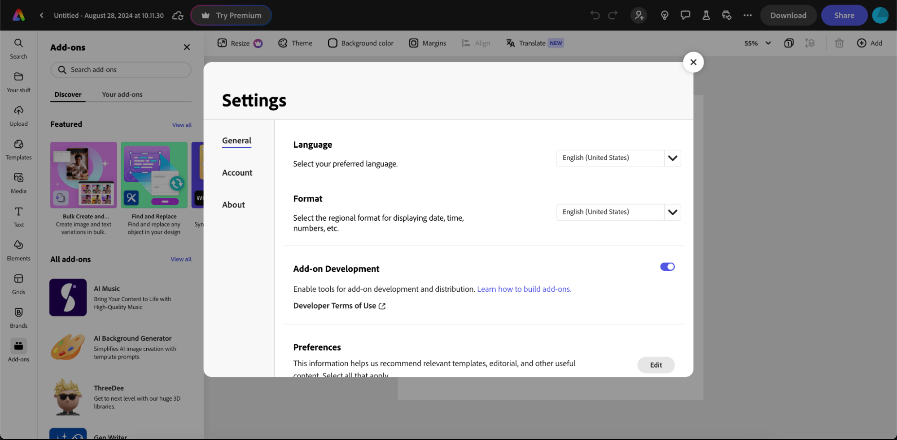
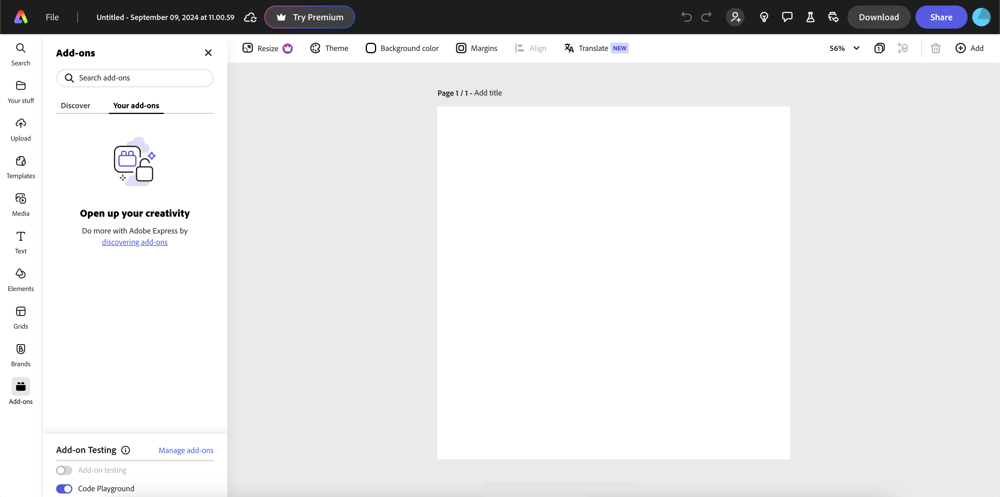
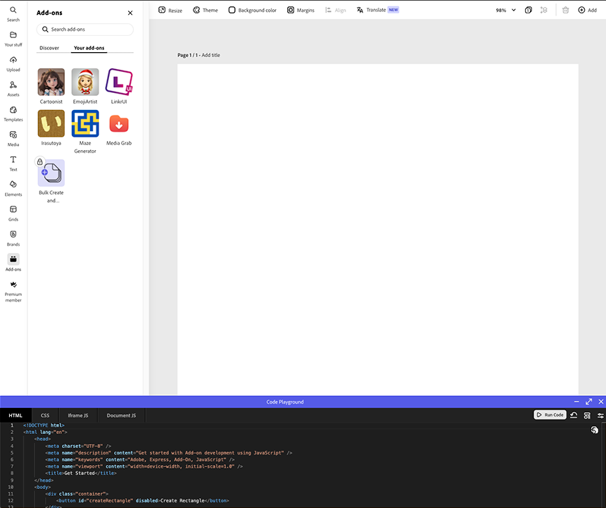

---
keywords:
  - Adobe Express
  - Express Add-on SDK
  - Express Editor
  - Adobe Express
  - Add-on SDK
  - SDK
  - JavaScript
  - Extend
  - Extensibility
  - API
  - Add-on Manifest
  - Add-on dev tool
title: Code Playground
description: How to access the Code Playground
contributors:
  - https://github.com/ErinFinnegan
  - https://github.com/padmkris123
  - https://github.com/undavide
---

# Code Playground

The Code Playground is an in-app lightweight code editor for fast and effortless prototyping. It lets you iterate on ideas directly by allowing you to experiment without any setup. Whether you're just getting started building add-ons or you want to test your concepts and ideas, this playground is for you.

## Introduction

Check out the video below for a quick introduction to the add-on playground.

<Embed slots="video" />

https://www.youtube.com/embed/j6KS6CXZmKo?si=j4kX8gItWbm1ZDVz

## Features

- **Real-Time Preview:** See your changes instantly as you code, allowing for immediate feedback and faster adjustments.
- **Effortless Prototyping:** Quickly turn ideas into add-ons with minimal setup.
- **Rapid Implementation:** Fast-track your prototype to a product by directly pasting your code into an add-on template.

## Getting Started

### Step 1: Enable Add-On Development Mode

Go to your settings and enable add-on development mode (if it isn't already enabled).

### Step 2: Locate the 'Code-playground' option

1. Start by opening any document in Adobe Express.
2. Click on the "Add-ons" section located on the left side rail.
3. In the Add-ons panel, select the "Your Add-ons" tab.

### Step 3: Access the Playground

At the bottom of the add-ons rail, you'll see the option to open the Code Playground. Click to get started!

## Next steps

- **Experiment with Common Use Cases:** Begin by experimenting with some [common use cases](../develop/use-cases.md) to kickstart your development.
- **Start with Code Samples:** Check out [these samples](../../samples.md) to see what's possible and get inspired.
- **Understand Add-on Concepts:** Get familiar with the fundamentals of building add-ons.
  - [iFrame Context](../develop/context.md)
  - [Document Sandbox](../../references/document-sandbox/document-apis/concepts/index.md)
  - [Manifest File](../../references/manifest/index.md)

- **Explore API References:** Discover all available APIs and their capabilities in the [SDK Reference](../../references/index.md).
- **[Ask Questions](https://developer.adobe.com/express/community/):** Join us for Office Hours or chat with the team on Discord.

## FAQs

### What is the Adobe Express Developer Playground?

 Adobe Express Developer Playground is a lightweight code editor designed for fast and effortless prototyping. It allows you to experiment with simple code snippets to build and refine add-ons, quickly turning ideas into functional features.

### Is it free to use?

 Yes, the Developer Playground is free to use. You can access all its features without any cost and start prototyping and creating add-ons right away.

### Do I need coding experience?

 While some basic coding knowledge is helpful, Playground is designed to be beginner-friendly and accessible. Its intuitive interface and simple code snippets make it easier for both experienced developers and those newer to coding to create and test add-ons.

### How do I start creating add-ons?

 Getting started is simple. Activate the Playground, experiment with code snippets, and start building your add-ons. Use the real-time preview feature to see your changes instantly and iterate on your ideas with ease.

### Where can I go for help?

[Join our Discord](http://discord.gg/nc3QDyFeb4) to chat with the add-on developer community.
