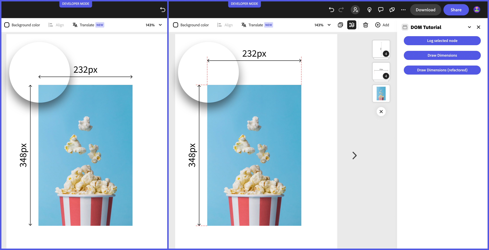

---
keywords:
  - Adobe Express
  - Express Add-on SDK
  - Express Editor
  - Adobe Express
  - Add-on SDK
  - SDK
  - JavaScript
  - Extend
  - Extensibility
  - API
  - Discover
  - Developer Journey
title: Developer Journey
description: Developer Journey
contributors:
  - https://github.com/undavide
---

# Developer Journey

[Adobe Express](https://www.adobe.com/express/) is an AI-first, all-in-one, web-based app to easily create and share content for free. It's a powerful tool that can be used by everyone, from designers to marketers, to create stunning content in minutes.

## Discover

### What are add-ons?

[Add-ons](https://express.adobe.com/add-ons) are extensions that enhance the functionality of Adobe Express, allowing users to be more productive and creative.

The add-on's use cases are endless, but some real-world examples are:

- Generate **AI avatars** from a selfie.
- Browse and insert **voiceover** and **music** to your project.
- Create **stylish product mockups**.
- Integrate with **Google Drive** and **Google Photos** to manage your files.
- And much more!

### How to develop add-ons

Add-ons are lightweight programs that run in their own panel within the Adobe Express user interface; you can build add-ons with standard web technologies like **HTML**, **CSS**, and **JavaScript**. Ideally, they provide a seamless experience for the user—they should feel like they are part of the Adobe Express app!

   

<Embed slots="video" />

https://www.youtube.com/embed/HHnX5o8CxHU?si=4w4KvQVdkl8r5BZZ

&lt;br /&gt; &lt;br /&gt;

Once you have your add-on ready, you can distribute it through the [Adobe Express Marketplace](https://express.adobe.com/add-ons). With a few clicks, it'll be made available to **millions of Adobe Express users**.

### Monetize add-ons

Add-ons can be either **free** or **paid**, and anything in between like _freemium_ or _credit-based_.

<InlineAlert slots="text1" variant="info" />

You're allowed to implement your payment processor of choice, the Adobe Express Marketplace _does not take_ a cut of your revenue, so **you keep 100% of your earnings!** 💰

Adobe sponsors the development of selected use cases through the [Adobe Fund for Design](https://developer.adobe.com/fund-for-design); check it out, and get paid to develop your add-on!

### Resources

You now have a basic understanding of the Adobe Express ecosystem; if you want to dive deeper into the different parts of the ecosystem, check out the following resources:

- [Introducing Adobe Express add-ons](https://www.youtube.com/watch?v=CHBiTTN1neE) (Youtube video)
- [Adobe Express Office Hours](https://developer.adobe.com/developers-live)
- [Adobe Fund for Design](https://developer.adobe.com/fund-for-design)

## Learn

The best way to learn is by doing! Adobe Express integrates a [Playground](code-playground.md) environment that allows you experiment with the code directly in the application, without the need to set up a local development environment.

&lt;br /&gt; &lt;br /&gt;

<Embed slots="video" />

https://www.youtube.com/embed/j6KS6CXZmKo?si=j4kX8gItWbm1ZDVz

### Run the Code Playground

To launch the Code Playground experience, follow [this link](https://www.adobe.com/go/addon-playground) or click the button below.

<TextBlock slots=" buttons" width="100%" isCentered variantsTypePrimary="primary" variantStyleFill="outline" className="code-playground-button-inline"/>

- [Launch the Code Playground](https://www.adobe.com/go/addon-playground)

Once it's open, you can play with the code directly in the editor, and see the changes you make reflected in the document. The [Script Mode](code-playground-script-mode.md) is particularly useful for experimenting with the add-on's APIs. Please refer to the complete guide to the [Code Playground](code-playground.md) for more details.

### Explore the How-to Guides

To properly experiment with the Playground, head to the [How-tos](../learn/how-to/index.md) section: you'll find a collection of short guides and accompanying snippets that you can plug and play in the Playground editor. They cover the most common use cases, and are a great way to get familiar with the add-on SDK. Try the following as a starter:

- [Creating Text](../learn/how-to/use-text.md#create-text)
- [Creating Geometry](../learn/how-to/use-geometry.md)
- [Grouping Elements](../learn/how-to/group-elements.md)

When you feel more comfortable, you can tinker with these other use cases:

- [Using Colors](../learn/how-to/use-color.md)
- [Exporting Renditions](../learn/how-to/create-renditions.md)
- [Document](../learn/how-to/document-metadata.md) and [Element Metadata](../learn/how-to/document-metadata.md)

### Scaffold a Local Development Environment

To build a more complex add-on, you can use our free [Command Line Interface (CLI) tool](local-development/dev-tooling.md#using-the-cli), that can set up a new local project (on your machine) with all the necessary files and dependencies to get you started.

<InlineAlert slots="text1" variant="success" />

The Code Playground can [export your project as a zip file](code-playground-workflow.md#download-your-code) so that existing add-ons projects can be migrated to the CLI seamlessly.

### Next steps

Feel free to explore the rest of the [How-to Guides](../learn/how-to/index.md) to get exposed the entire range of possibilities that the add-on SDK offers. If you're ready to get your hands dirty and start building your own add-ons, keep reading!

## Develop

Now that you feel comfortable with the Adobe Express add-on development's basics, let's take you to the next level.

### Follow a Tutorial to build a complete add-on

We've created a set of tutorials that guide you through the process of building a full-featured add-on from scratch. We recommend you to start with the [Design Grid creator](../learn/how-to/tutorials/grids-addon.md), which covers the basics of the add-on SDK and how to use the Document API.

Feel free to explore [the other Tutorials](../learn/how-to/tutorials/index.md), or our collection of [Code Samples](../learn/samples.md); there's no better way to learn than by doing!

### Discover our Design System

Adobe Express is based on the [Adobe Spectrum design system](https://s2.spectrum.adobe.com/), and your add-ons should follow the same design language.

&lt;br /&gt; &lt;br /&gt;

<Embed slots="video" />

https://www.youtube.com/embed/E9atPm5djco?si=QbafmhPAKJa6R4rI

We've created a set of [UX Guidelines](../build/design/index.md) to help you get started; they cover the [design principles](../build/design/ux-guidelines/design-principles.md), [color](../build/design/ux-guidelines/visual-elements.md#color), [typography](../build/design/ux-guidelines/visual-elements.md#typography), [layout](../build/design/ux-guidelines/visual-elements.md#layout--structure) and much more.

You should use [Spectrum Web Components](https://opensource.adobe.com/spectrum-web-components/), a library of pre-built components that you can use to create a consistent UI for your add-on. You can test them in a sandboxed environment like Codepen.

Read our [Implementation Guide](../build/design/implementation-guide.md) or follow our two-part [Bingo Card Generator add-on tutorial](../learn/how-to/tutorials/spectrum-workshop/index.md), which covers both basic JavaScript and React.

### Master the Document API

To become an expert add-on developer, you must confidently orient yourself around the Document Sandbox API. New features are constantly being added, and it's crucial to learn how to read and decode the SDK Reference to know how to use them.

Read the [Adobe Express Document API Concepts](../learn/platform-concepts/document-api.md) guide to learn about Object Oriented Programming concepts and the various [Classes and Interfaces](../learn/platform-concepts/document-api.md#classes-and-interfaces) available to you.

Complete the [Dimension annotation sample add-on exercise](../learn/platform-concepts/document-api.md#from-theory-to-practice) to practice your new knowledge.

## Distribute

Now that you have built an add-on, you can share it with the world and start earning money!

### The Adobe Express add-on's Marketplace

Add-ons can be [privately distributed](../build/distribute/private-dist.md) for testing purposes or [published in the Adobe Express Marketplace](../build/distribute/public-dist.md).

Familiarize yourself with the details of our [Review Process](../build/distribute/review-process/index.md) and follow the [Submission Guidelines](../build/distribute/guidelines/index.md) to prepare your add-on for review.

### Improve your sales with the Monetization Guide

Add-ons can be monetized according to a variety of models (free, free & paid, free trial, or paid); Adobe does not take any commission on the sales, **you keep 100% of your earnings!**

If you want to learn more about it, please read the [Monetization Guidelines](../build/distribute/guidelines/monetization.md), or watch the [Marketing and monetizing Adobe Express add-ons](https://www.youtube.com/watch?v=gF6FU_d6QoY) video below, recorded at one of the monthly [Adobe Express Office Hours](https://developer.adobe.com/developers-live) community events.

&lt;br /&gt; &lt;br /&gt;

<Embed slots="video" />

https://www.youtube.com/embed/gF6FU_d6QoY?si=YkooV1gOemVE1Rz5

## Next steps

Congratulations 🎉 Pause for a moment and pat yourself on the back; you've now a solid understanding of the end-to-end Adobe Express add-on's developer journey!

Feel free to explore the rest of the documentation on your own, and if you have any feedback, please get in touch in our [Discord server](http://discord.gg/nc3QDyFeb4) and join our monthly [Office Hours](https://developer.adobe.com/developers-live). The developer community is a great place to get help, share your work, and learn from others. Have fun building!
