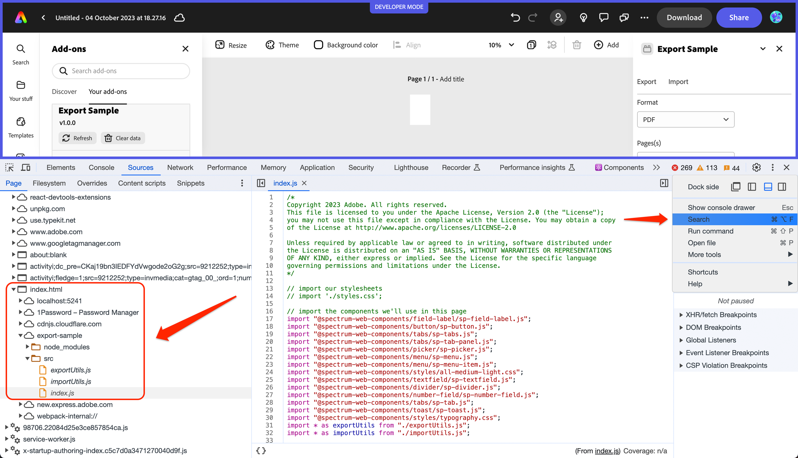
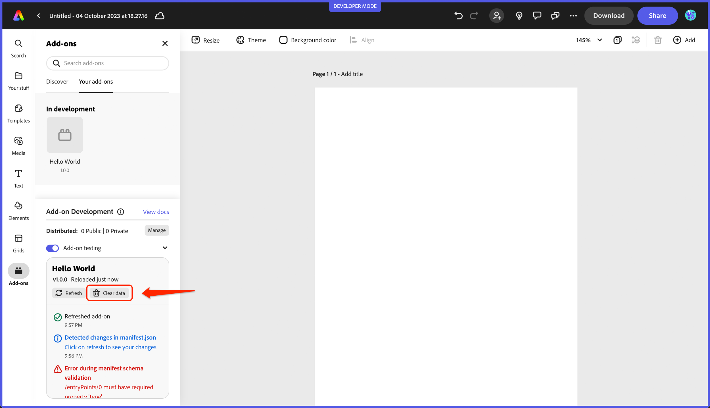

---
keywords:
  - Adobe Express
  - Express Add-on SDK
  - Express Editor
  - Adobe Express
  - Add-on SDK
  - SDK
  - JavaScript
  - Extend
  - Extensibility
  - Debugging
  - Browser
title: Browser debugging
description: Browser debugging
contributors:
  - https://github.com/hollyschinsky
  - https://github.com/undavide
---

# Browser debugging

During your development, it's important to be able to debug your code and troubleshoot any issues that may arise. Fortunately, most modern browsers come with built-in developer tools that can help you do just that.

&lt;div style="display: flex; justify-content: center;"&gt;
    &lt;iframe width="779" height="438" src="https://www.youtube.com/embed/XefQbfVOqto?si=VSxAEXYo-X2_pXMi" title="Testing and Debugging" frameborder="0" allow="accelerometer; autoplay; clipboard-write; encrypted-media; gyroscope; picture-in-picture; web-share" allowfullscreen&gt;&lt;/iframe&gt;
&lt;/div&gt;

## Browser Developer Tools

Some of the key debugging features available in the browser developer tools include:

- **Console** - The console allows you to log messages and errors from your code, as well as execute JavaScript code and interact with the page or add-on.
- **Debugger** - The debugger allows you to set breakpoints in your code and step through it line by line, so you can see exactly what's happening at each stage of execution.
- **Network Monitor** - The network monitor allows you to monitor the network requests made by your add-on, so you can see how it's interacting with other resources and services.
- **Profiler** - The profiler allows you to analyze the performance of your add-on and identify areas where it may be slow or inefficient.

### Debugging Steps

To get started with debugging your add-on:

Access the developer tools by right-clicking on the browser window where Adobe Express is running, and selecting **Inspect Element** or **Inspect** from the context menu.


<InlineAlert slots="text" variant="info"/>

Make sure you right click outside of the document area or you will not see the context menu pop-up. A good place to right-click is in the header of your add-on, where the title is. But if you're debugging because your add-on isn't running due to an issue, then you can right-click in the top frame of Adobe Express.

Next, navigate to the **Sources** tab, and from there you can locate and select the JavaScript file that contains the code you want to debug. You can locate it in the filesystem list or by using the **Search** tab. If the Search tab isn't displayed, clicking the 3 vertical dots will reveal it as shown below:



Once you've selected your file, you can set breakpoints by clicking on the line number where you want the breakpoint to be set. This will pause the execution of your code at that breakpoint, allowing you to inspect variables and step through your code one line at a time.

By leveraging these tools, you will develop a deeper understanding of how your add-on is working, be able to identify and fix bugs more quickly, and benefit from a high-performing add-on.

&lt;!-- <iframe aria-label="Browser Debugging Demo" src="https://drive.google.com/file/d/13FHUuRpVti9AH4nUwAMcvNcP6OzGpOc1/preview" width="640" height="480"></iframe> --&gt;

### Console

When logging messages in your code, use the appropriate severity level that best describes the message. For example, an **Info** message might be used to provide general information about the application's state, while a **Warning** message might be used to alert developers about potential issues that could cause problems with the add-on. Similarly, an **Error** message might be used to indicate that an unexpected error has occurred, and a **Verbose** message might be used to see more descriptive information about the internal workings of the processing occurring in your add-on.

Use the `console.*` methods as shown below to represent the severity level you would like to see for debugging:

```bash
    console.log('Info level)
    console.warn('Warning level')
    console.error('Error level)
    console.debug(Verbose level)
```

You can specifically filter which levels you want to view in the developer tools with the **Custom levels** drop-down as well to help you find your specific messages more quickly:


To make it easier to filter and identify relevant messages in the console, it's also a good practice to include an obvious identifier as a prefix. This identifier could be a unique string or tag that is specific to your add-on, making it easier to distinguish your messages from other messages in the console. For example: `console.log([MyAddOn] - Initialization complete);`. Then you can filter on `MyAddOn` in the devtools and easily see what is relevant to your add-on.

Using appropriate severity levels and including identifiers in your console messages can greatly help improve the efficiency and effectiveness of your debugging, making it easier to identify and resolve issues.

### Printing JSON Data

Another helpful console method is `.dir()`, which displays a JSON representation of an object. For example, running `console.dir(document.head)` would generate the following output:


## Add-on SDK Developer Tools

The **Add-on Development** tools panel provides useful logging details and action buttons to allow for refreshing and clearing the data associated with your add-on, which are also useful for debugging and troubleshooting your add-on.


### Status messages

The **Add-on Development** panel also provides useful information via status messages like below to indicate when and where an error is occurring to help you target specific issues in your add-on. For instance, if an invalid value is found in the manifest, you will see something like the following:


### Refreshing and clearing data

The **Refresh** and **Clear data** buttons in the add-on developer tools can also be helpful when you want to manually force refresh your code (or when you update the manifest), or clear data you no longer want to persist. For instance, in the case of the ToDo list sample add-on (aka: `use-client-storage`), if you had added some items previously they will still be displayed when you open it again unless you actually clear the data. See the demo workflow video at the bottom of the boilerplate section for an example of this in action.



<InlineAlert slots="text" variant="success"/>

To make use of the add-on SDK's [ClientStorage API](../../../references/addonsdk/instance-client-storage.md) and store data in an underlying IndexedDB store, explore the ToDo list sample. You can view this store in the browser developer tools by navigating to the **Application** tab. Look for the IndexedDB store associated with your add-on ID to locate it. Here's an example:


<InlineAlert slots="text" variant="info"/>

See [the Client Storage API](../../../references/addonsdk/instance-client-storage.md) for more details about storing and persisting data with your add-ons.
