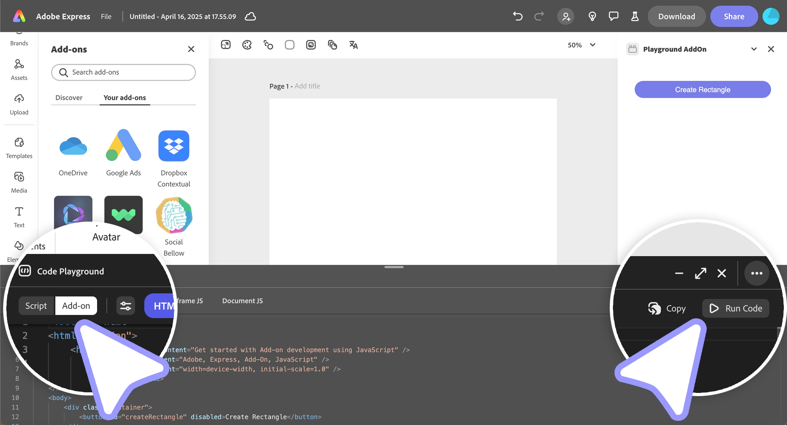

---
keywords:
  - Adobe Express
  - Express Add-on SDK
  - Adobe Express Add-on Development
  - Express Editor
  - Code Playground
  - Add-on Mode
  - UI Development
  - HTML
  - CSS
  - JavaScript
  - Iframe
  - Document Sandbox
title: Code Playground - Add-on Mode
description: Learn how to use Add-on Mode in Code Playground to build complete add-ons with UI and functionality.
contributors:
  - https://github.com/padmkris123
  - https://github.com/hollyschinsky
  - https://github.com/ErinFinnegan
  - https://github.com/undavide
  - https://github.com/nimithajalal
---

# Code Playground - Add-on Mode

Add-on Mode in Code Playground allows you to develop and test complete add-ons with user interfaces directly in Adobe Express, without setting up a full development environment.

## What is Add-on Mode?

Add-on Mode provides a complete development environment where you can:

- Build user interfaces with HTML, CSS, and JavaScript.
- Test add-on functionality in a real Adobe Express environment.
- Prototype complete add-ons before building full projects.
- Iterate quickly on UI and logic.

### When to Use Add-on Mode

Use Add-on Mode when you want to develop, prototype, and test a complete add-on experience—especially when iterating quickly on UI, logic, and overall functionality within Adobe Express.

## How to Use Add-on Mode

### Step 1: Select Add-on Mode

1. Click the **Add-on** toggle (next to **Script** in the top left corner of the playground window).
2. You'll see four tabs for organizing your code: HTML, CSS, Iframe JS, and Document JS.



### Step 2: Write Your Code

Write code for your add-on in each of the supplied tabs. This includes HTML, CSS, and JavaScript code that will run in the iframe UI or in the Document Sandbox to interact directly with the Express document.

### Step 3: Execute Your Add-on

Click **Run Code** to execute your add-on. Your add-on should open in an iframe on the right side of the Adobe Express window.

### Step 4: Configure Manifest Properties (Optional)

If you need to set [manifest properties](../../references/manifest/index.md) for your add-on (e.g., if you want to use APIs that are currently marked experimental, set permissions, OAuth domains etc):

1. Click on the properties icon to open the Manifest JSON editing modal.
2. Configure the necessary properties.


## Understanding the Tabs

The Add-on mode features four tabs for organizing your code:

### 1. HTML Tab

This tab is for writing HTML code that defines the **structure of your add-on's user interface**. You can create elements like buttons, text fields, and layout containers here. Functionally, this tab mirrors the role of the `index.html` file you'd use in a typical add-on project.

**Example:**

```html
<div class="addon-container">
  <h2>My Add-on</h2>
  <button id="myButton">Click Me</button>
  <input type="text" id="myInput" placeholder="Enter text">
</div>
```

### 2. CSS Tab

**Style** your add-on's HTML elements in this tab. Create a visually appealing interface consistent with Adobe Express design patterns. This section corresponds to the `styles.css` file in a standard add-on project.

**Example:**

```css
.addon-container {
  padding: 20px;
  font-family: 'Adobe Clean', sans-serif;
}

#myButton {
  background-color: #0073e6;
  color: white;
  border: none;
  padding: 10px 20px;
  border-radius: 4px;
  cursor: pointer;
}

#myInput {
  width: 100%;
  padding: 8px;
  border: 1px solid #ccc;
  border-radius: 4px;
  margin-top: 10px;
}
```

### 3. Iframe JS Tab

This tab is for writing **JavaScript code that runs in the iframe context** of your add-on. Here, you can interact with:

- The [Add-on UI SDK (`addOnUISdk`)](../../references/addonsdk/index.md).
- The DOM elements in your HTML.
- Event handlers for your UI components.

In case you are familiar with the add-on project structure, this tab corresponds to the code in the `index.js` file.

**Example:**

```js
// Wait for the add-on UI SDK to be ready
addOnUISdk.ready.then(() => {
  console.log('Add-on UI SDK is ready');

  // Get references to DOM elements
  const button = document.getElementById('myButton');
  const input = document.getElementById('myInput');

  // Add event listeners
  button.addEventListener('click', () => {
    const text = input.value;
    if (text) {
      // Send message to Document JS tab
      addOnUISdk.app.documentSandbox.dispatch({
        type: 'ADD_TEXT',
        payload: { text }
      });
    }
  });
});
```

### 4. Document JS Tab

This tab is where you write **JavaScript code that interacts directly with the Adobe Express document**. It runs in the [Document Sandbox](../../references/document-sandbox/index.md) environment and gives you access to:

- Document manipulation capabilities with the [Document APIs](../../references/document-sandbox/document-apis/index.md).
- [Communication APIs](../../references/document-sandbox/communication/index.md) to facilitate interaction between the iframe context and the Document Sandbox.

The Document JS tab corresponds to the code typically found in the `code.js` file of a complete add-on project.

**Example:**

```js
// Import necessary modules
import { editor, text } from 'express-document-sdk';

// Listen for messages from the iframe
addOnUISdk.app.documentSandbox.addEventListener('message', (event) => {
  if (event.data.type === 'ADD_TEXT') {
    addTextToDocument(event.data.payload.text);
  }
});

async function addTextToDocument(textContent) {
  try {
    // Create a new text node
    const textNode = await text.create({
      text: textContent,
      fontSize: 24,
      fontFamily: 'Arial'
    });

    // Add it to the document
    editor.context.insertNode(textNode);

    console.log('Text added to document');
  } catch (error) {
    console.error('Error adding text:', error);
  }
}
```

## Key Differences from Script Mode

| Feature               | Script Mode        | Add-on Mode                   |
| --------------------- | ------------------ | ----------------------------- |
| **Global Await**      | Yes                | No - must use async functions |
| **Automatic Imports** | Yes                | No - must import manually     |
| **UI Building**       | No                 | Yes - full HTML/CSS/JS        |
| **API Access**        | Document APIs only | Document APIs + Add-on UI SDK |

## Transitioning from Script Mode

If you've already developed functionality in Script Mode:

1. Copy your code from Script Mode
2. Paste it into the **Document JS** tab
3. Add the necessary `import` statements
4. Wrap your code in appropriate functions
5. Build your UI in the other tabs
6. Set up communication between iframe and Document Sandbox

## Next Steps

- **[Workflow & Productivity](./code-playground-workflow.md)**: Learn keyboard shortcuts and session management
- **[Troubleshooting](./code-playground-troubleshooting.md)**: Get help with common issues
- **[API References](../../references/index.md)**: Learn about the Document APIs and Add-on SDK
- **[How-To Guides](../learn/how_to/index.md)**: Master specific techniques and best practices
