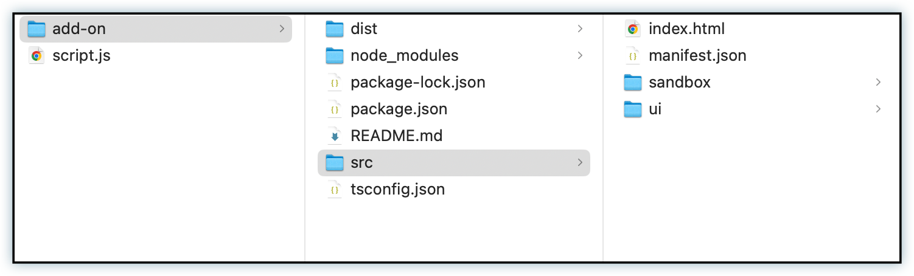

---
keywords:
  - Adobe Express
  - Express Add-on SDK
  - Adobe Express Add-on Development
  - Code Playground
  - Workflow
  - Productivity
  - Keyboard Shortcuts
  - Session Management
  - Code Download
  - Local Development
title: Code Playground - Workflow & Productivity
description: Master Code Playground workflow with keyboard shortcuts, session management, and productivity tips.
contributors:
  - https://github.com/padmkris123
  - https://github.com/hollyschinsky
  - https://github.com/ErinFinnegan
  - https://github.com/undavide
  - https://github.com/nimithajalal
---

# Code Playground - Workflow & Productivity

Master the Code Playground workflow with keyboard shortcuts, session management, and productivity tips to maximize your development efficiency.

## Transitioning Between Modes

### From Script Mode to Add-on Mode

Once you've tested your code in Script mode, you can easily transition it into Add-on Mode to build a user interface around your functionality:

1. **Copy Your Code**: Use the **Copy** button in the right corner to quickly copy your code to the clipboard
2. **Switch to Add-on Mode**: Click the **Add-on** button to enter Add-on Mode
3. **Paste and Adapt**: Paste the code into the **Document JS** tab. **Note:** Don't forget you'll need to add the `import` statements for the Document APIs and handle your `async` functions manually in this mode
4. **Build Your UI**: Modify your script code to be used in the add-on context along with your front-end logic in the **HTML**, **Iframe JS**, and **CSS** tabs. Use the initial sample code provided as a reference
5. **Configure Manifest**: If you set any manifest properties (e.g., **experimentalApis**) while in Script mode, make sure to set the same in Add-on Mode as well. These settings only apply to the context of the development mode you're in
6. **Test Your Add-on**: Click the **Run Code** button to execute your code within the context of your add-on

## Keyboard Shortcuts

Use these keyboard shortcuts to work more efficiently:

| Action                           | Windows/Linux                                                | macOS                                                       |
| -------------------------------- | ------------------------------------------------------------ | ----------------------------------------------------------- |
| **Save**                         | <kbd>Ctrl</kbd> + <kbd>Shift</kbd> + <kbd>S</kbd>            | <kbd>Cmd</kbd> + <kbd>Shift</kbd> + <kbd>S</kbd>            |
| **Run**                          | <kbd>Ctrl</kbd> + <kbd>Shift</kbd> + <kbd>Return/Enter</kbd> | <kbd>Cmd</kbd> + <kbd>Shift</kbd> + <kbd>Return/Enter</kbd> |
| **Reset**                        | <kbd>Ctrl</kbd> + <kbd>Shift</kbd> + <kbd>X</kbd>            | <kbd>Cmd</kbd> + <kbd>Shift</kbd> + <kbd>X</kbd>            |
| **Increase font size**           | <kbd>Ctrl</kbd> + <kbd>Shift</kbd> + <kbd>Plus (+)</kbd>     | <kbd>Cmd</kbd> + <kbd>Shift</kbd> + <kbd>Plus (+)</kbd>     |
| **Decrease font size**           | <kbd>Ctrl</kbd> + <kbd>Shift</kbd> + <kbd>Minus (-)</kbd>    | <kbd>Cmd</kbd> + <kbd>Shift</kbd> + <kbd>Minus (-)</kbd>    |
| **Switch between tabs**          | <kbd>Ctrl</kbd> + <kbd>1, 2, 3, 4</kbd>                      | <kbd>Cmd</kbd> + <kbd>1, 2, 3, 4</kbd>                      |
| **View the typings suggestions** | <kbd>Ctrl</kbd> + <kbd>space</kbd>                           | <kbd>Cmd</kbd> + <kbd>space</kbd>                           |

<InlineAlert slots="header,text1" variant="success"/>

#### TIP

Use the "**...**" button in the top right corner of the playground window to reference the available keyboard shortcuts, start a new session, link to documentation and more.

## Session Management

### Saving Your Work

The Code Playground features local persistence to help prevent the loss of your work. This functionality ensures that your code is stored in your browser's local storage, providing a safeguard against accidental data loss.

Code in the playground is **_not saved automatically_**. To ensure it's saved, you need to take one of the following steps:

1. Save your work using the [keyboard shortcut for Save](#keyboard-shortcuts)
2. Run the code via the **Run Code** button or with the [keyboard shortcut for Run](#keyboard-shortcuts)
3. Exit the playground (with the **X** in the upper right corner)

If you don't want to save your work at any time, use the [keyboard shortcut to Reset](#keyboard-shortcuts).

<InlineAlert slots="header, text1" variant="warning"/>

#### IMPORTANT

- Only your most recent session is saved
- Storage is browser-specific (not synced across devices)
- Code is not saved in incognito/private browsing modes
- Clearing browser data will delete saved code

### Resuming Sessions

There are two ways to resume working on your last saved session:

#### Via the Add-ons Panel

1. With any document open, click the **Add-ons** button in the left rail
2. Select the **Your add-ons** tab
3. Toggle on **Code Playground** at the bottom of the panel

<InlineAlert slots="text1" variant="info"/>

If you haven't enabled Add-on Development mode yet, you'll be prompted to do so. See [Enable Add-on Development Mode](./hello-world.md#enable-add-on-development-mode) for detailed instructions.

#### Via the Your add-ons Page

1. The **Your add-ons** page where you manage your add-ons now features a dedicated section for the playground, allowing you to quickly access your last session or create a new one
2. Find the **Playground Sessions** section in the **Your add-ons** page
3. Access your last session or create a new one with one click

<InlineAlert slots="header, text1" variant="info"/>

#### Accessing "Your add-ons" Page

- **Without a document open:** Click the **Add-ons** button in the left rail, then click the **Add-on development** toggle in the top right
- **With a document open:** Click the **Add-ons** button in the left rail, select the **Your add-ons** tab, then click the "Manage add-ons" link in the Add-on Testing section

## Downloading Your Code

### How to Download

Downloading your code is a great way to save your work and continue working on it locally in your CLI.

To download your code:

1. Click the **...** button in the top right corner of the playground window
2. Click the **Download** button
3. This will download a zip file containing your code

### Folder Structure

The downloaded zip file will contain a folder with the following structure:

- add-on folder
- `script.js` file

### Running Downloaded Code

You can run your add-on folder as a local add-on project in your CLI by following the steps in the [Quickstart Guide](../getting_started/quickstart.md#step-4-load-and-run-your-add-on). There is a readme file in the add-on folder that will guide you through the process as well.

**Note:** You cannot run the `script.js` file alone.

## Productivity Tips

### Development Workflow

1. **Start with Script Mode**: Use Script Mode to prototype and test your core functionality
2. **Iterate Quickly**: Use keyboard shortcuts to save and run code frequently
3. **Test Incrementally**: Run your code often to catch issues early
4. **Transition to Add-on Mode**: Once your logic is working, move to Add-on Mode to build the UI
5. **Download for Local Development**: Use the download feature to continue development locally

### Code Organization

- **Use Clear Naming**: Choose descriptive names for variables and functions
- **Comment Your Code**: Add comments to explain complex logic
- **Modular Approach**: Break down complex functionality into smaller functions
- **Error Handling**: Always include proper error handling in your code

### Testing Strategy

- **Test with Different Documents**: Try your add-on with various document types and sizes
- **Edge Cases**: Test with empty documents, single elements, and complex layouts
- **Performance**: Monitor how your add-on performs with large documents
- **User Experience**: Test the complete user flow from start to finish

## Troubleshooting Common Issues

### Code Not Running

- Check for syntax errors in your code
- Ensure you're using the correct mode for your use case
- Verify that all required APIs are properly imported
- Check the browser console for error messages

### Session Not Saving

- Make sure you're not in incognito/private browsing mode
- Check that your browser allows local storage
- Try saving manually using the keyboard shortcut
- Clear browser cache and try again

### Performance Issues

- Avoid heavy computations in the iframe context
- Use async/await properly for document operations
- Test with different document sizes
- Consider breaking down large operations into smaller chunks

## Next Steps

- **[Script Mode Guide](./code-playground-script-mode.md)**: Learn how to use Script Mode effectively
- **[Add-on Mode Guide](./code-playground-addon-mode.md)**: Build complete add-ons with UI
- **[Troubleshooting](./code-playground-troubleshooting.md)**: Get help with common issues
- **[Local Development](../getting_started/local_development/index.md)**: Set up a full development environment
