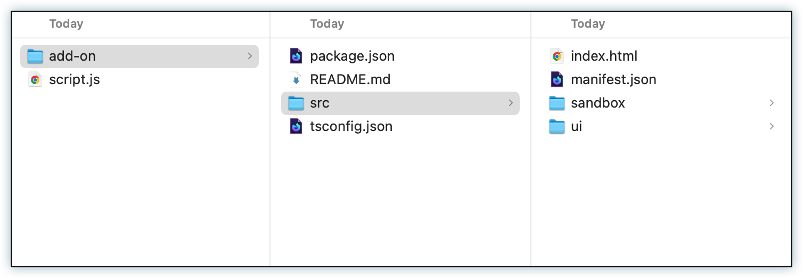

---
keywords:
  - Adobe Express
  - Express Add-on SDK
  - Adobe Express Add-on Development
  - Code Playground
  - Workflow
  - Productivity
  - Keyboard Shortcuts
  - Session Management
  - Code Download
  - Local Development
title: Code Playground - Workflow & Productivity
description: Master Code Playground workflow with keyboard shortcuts, session management, and productivity tips.
contributors:
  - https://github.com/padmkris123
  - https://github.com/hollyschinsky
  - https://github.com/ErinFinnegan
  - https://github.com/undavide
  - https://github.com/nimithajalal
---

# Code Playground - Workflow & Productivity

Master the Code Playground workflow with keyboard shortcuts, session management, and productivity tips to maximize your development efficiency.

## Transitioning Between Modes

### From Script Mode to Add-on Mode

Once you've tested your code in Script mode, you can easily transition it into Add-on Mode to build a user interface around your functionality:

1. **Copy Your Code**: Use the **Copy** button in the right corner to quickly copy your code to the clipboard
2. **Switch to Add-on Mode**: Click the **Add-on** button to enter Add-on Mode
3. **Paste and Adapt**: Paste the code into the **Document JS** tab. **Note:** Don't forget you'll need to add the `import` statements for the Document APIs and handle your `async` functions manually in this mode
4. **Build Your UI**: Modify your script code to be used in the add-on context along with your front-end logic in the **HTML**, **Iframe JS**, and **CSS** tabs. Use the initial sample code provided as a reference
5. **Configure Manifest**: If you set any manifest properties (e.g., **experimentalApis**) while in Script mode, make sure to set the same in Add-on Mode as well. These settings only apply to the context of the development mode you're in
6. **Test Your Add-on**: Click the **Run Code** button to execute your code within the context of your add-on

## Keyboard Shortcuts

Use these keyboard shortcuts to work more efficiently:

| Action                           | Windows/Linux                                                | macOS                                                       |
| -------------------------------- | ------------------------------------------------------------ | ----------------------------------------------------------- |
| **Save**                         | <kbd>Ctrl</kbd> + <kbd>Shift</kbd> + <kbd>S</kbd>            | <kbd>Cmd</kbd> + <kbd>Shift</kbd> + <kbd>S</kbd>            |
| **Run**                          | <kbd>Ctrl</kbd> + <kbd>Shift</kbd> + <kbd>Return/Enter</kbd> | <kbd>Cmd</kbd> + <kbd>Shift</kbd> + <kbd>Return/Enter</kbd> |
| **Reset**                        | <kbd>Ctrl</kbd> + <kbd>Shift</kbd> + <kbd>X</kbd>            | <kbd>Cmd</kbd> + <kbd>Shift</kbd> + <kbd>X</kbd>            |
| **Increase font size**           | <kbd>Ctrl</kbd> + <kbd>Shift</kbd> + <kbd>Plus (+)</kbd>     | <kbd>Cmd</kbd> + <kbd>Shift</kbd> + <kbd>Plus (+)</kbd>     |
| **Decrease font size**           | <kbd>Ctrl</kbd> + <kbd>Shift</kbd> + <kbd>Minus (-)</kbd>    | <kbd>Cmd</kbd> + <kbd>Shift</kbd> + <kbd>Minus (-)</kbd>    |
| **Switch between tabs**          | <kbd>Ctrl</kbd> + <kbd>1, 2, 3, 4</kbd>                      | <kbd>Cmd</kbd> + <kbd>1, 2, 3, 4</kbd>                      |
| **View the typings suggestions** | <kbd>Ctrl</kbd> + <kbd>space</kbd>                           | <kbd>Cmd</kbd> + <kbd>space</kbd>                           |

<InlineAlert slots="header,text1" variant="success"/>

#### TIP

Use the "**More**" button in the top right corner of the playground window to reference the available keyboard shortcuts, start a new session, link to documentation and more.

## Debugging

The Code Playground supports debugging your code with the browser's developer tools. In **Add-on mode**, you can use the full power of the debugger for the add-on's UI and logic (the `HTML` and `IframeJS` tabs). The `Document JS` tab and the code in the **Script mode** editor are running in a sandboxed environment with [limited capabilities](../references/document-sandbox/web/index.md); the best option here is to log messages to the Console.

<InlineAlert slots="text, text1, text2" variant="info"/>

The Code Playground **prefixes the messages in the Console** with descriptive strings to help you distinguish them from other messages.

- `[Playground: Add-on]` for Code Playground in Add-on mode.
- `[Playground: Script]` for Code Playground in Script mode.
- `[Add-on: <add-on-name>]` for add-ons from other sources (including the CLI).

Open the browser's developer tools by right-clicking on the browser window where Adobe Express is running, and selecting **Inspect** from the context menu. In the **Console**, you can filter out the messages from the Code Playground by typing just `Playground` in the filter input.

## Session Management

### Saving Your Work

The Code Playground now backs up your sessions in the cloud, ensuring your work is safely stored and protected from accidental loss.

Your code is **_not saved automatically_**. The Code Playground saves your session only when you perform the following actions:

1. Rename the session.
2. Run the code via the **Run Code** button or with the [keyboard shortcut for Run](#keyboard-shortcuts).
3. Save using the [keyboard shortcut for Save](#keyboard-shortcuts).
4. Exit the Code Playground (with the **X** in the upper right corner).
5. Switch to a new session.

If you don't want to save your work at any time, use the [keyboard shortcut to Reset](#keyboard-shortcuts).

### Managing and Resuming Sessions

There are two ways to resume working on one of your saved sessions:

#### Via the Home Screen

1. Click the **Add-ons** button in the left rail.
2. Click the **Add-on development** toggle in the top right corner of the playground window.
3. Click **Create new** to create a new one, or
4. Select the **Playground Sessions** tab to access your saved sessions.
5. Click on the session you want to resume to open it in the Code Playground.

#### Via the Add-ons Panel

If you have a **document open**, you can:

1. Click the **Add-ons** button in the left rail and select the **Your add-ons** tab.
2. Toggle on **Code Playground** at the bottom of the panel; it will open with the last session you were working on.

To browse your saved sessions:

1. Click the **More** button in the top right corner of the playground window
2. Select the **Manage Sessions** item in the dropdown menu
3. You'll see a list of your saved sessions; click on one to **select it** and click the **Open** button to resume working on it.

<InlineAlert slots="header, text1" variant="info"/>

#### Accessing "Your add-ons" Page

- **Without a document open:** Click the **Add-ons** button in the left rail, then click the **Add-on development** toggle in the top right
- **With a document open:** Click the **Add-ons** button in the left rail, select the **Your add-ons** tab, then click the "Manage add-ons" link in the Add-on Testing section

## Downloading Your Code

### How to Download

Downloading your code is a great way to save your work and continue working on it locally in your CLI.

To download your code:

1. Click the **More** button in the top right corner of the playground window
2. Click the **Download** button
3. This will download a zip file containing your code

### Folder Structure

The downloaded zip file will contain a folder with the following structure:

- add-on folder
- `script.js` file

### Running Downloaded Code

You can run your add-on folder as a local add-on project in your CLI by following the steps in the [Quickstart Guide](../getting_started/hello-world.md). There is a readme file in the add-on folder that will guide you through the process as well.

**Note:** You cannot run the `script.js` file alone.

## Productivity Tips

### Development Workflow

1. **Start with Script Mode**: Use Script Mode to prototype and test your core functionality.
2. **Iterate Quickly**: Use keyboard shortcuts to save and run code frequently.
3. **Test Incrementally**: Run your code often to catch issues early.
4. **Transition to Add-on Mode**: Once your logic is working, move to Add-on Mode to build the UI.
5. **Download for Local Development**: Use the download feature to continue development locally.

## Troubleshooting Common Issues

### Code Not Running

- Check for syntax errors in your code.
- Ensure you're using the correct mode for your use case
- Verify that all required APIs are properly imported.
- Check the browser console for error messages.

### Session Not Saving

- The Code Playground supports up to 2MB of storage per session, and 60 sessions per user. Delete unused sessions to free up space.
- Code is not saved automatically—read the [Saving Your Work](#saving-your-work) section for more details.
- Make sure you're not in incognito/private browsing mode.
- Try saving manually using the keyboard shortcut.

## Next Steps

- **[Script Mode Guide](./code-playground-script-mode.md)**: Learn how to use Script Mode effectively
- **[Add-on Mode Guide](./code-playground-addon-mode.md)**: Build complete add-ons with UI
- **[Troubleshooting](./code-playground-troubleshooting.md)**: Get help with common issues
- **[Local Development](../getting_started/local_development/index.md)**: Set up a full development environment
