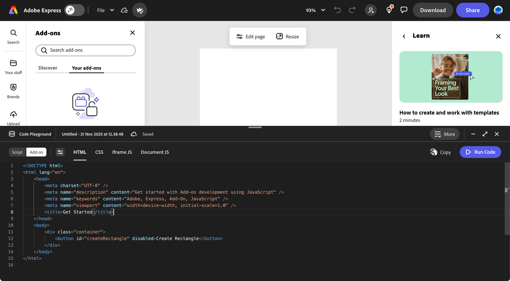
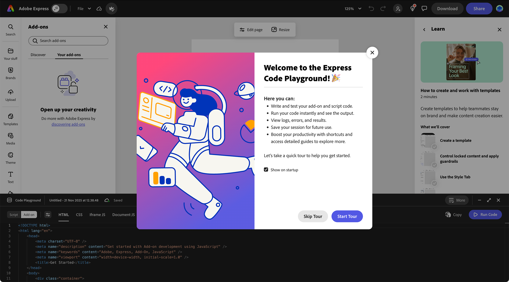

---
keywords:
  - Adobe Express
  - Express Add-on SDK
  - Adobe Express Add-on Development
  - Express Editor
  - Code Playground
  - In-app editor
  - Add-on SDK
  - SDK
  - JavaScript
  - Extend
  - Extensibility
  - API
  - Add-on Manifest
  - Add-on dev tool
  - Express Document
title: Code Playground
description: A guide to using the Code Playground in Adobe Express.
contributors:
  - https://github.com/padmkris123
  - https://github.com/hollyschinsky
  - https://github.com/ErinFinnegan
  - https://github.com/undavide
  - https://github.com/nimithajalal
---

# Code Playground

The Code Playground is an in-app lightweight code editor for fast and effortless prototyping of Adobe Express add-ons.

## Overview

### What is Code Playground?

Code Playground provides developers with a low-barrier entry point for add-on development, allowing you to experiment and iterate on ideas directly without any setup, from within Adobe Express. From learning the basics to rapidly prototyping advanced concepts, Code Playground accommodates all stages of add-on development.

### Key Benefits

- **Real-Time Preview**: See your changes as you code, allowing for immediate feedback and faster adjustments.
- **Effortless Prototyping**: Quickly turn ideas into add-ons with minimal setup.
- **Rapid Implementation**: Fast-track your prototype to a product by directly pasting your code into an add-on template.
- **Persistence**: Save your work and resume where you left off.
- **Programming Assistance**: Typed definitions and auto-completion.

### Who Should Use Code Playground?

The Code Playground is for beginners, learners, prototypers, designers, and experienced developers who want to explore Adobe Express add-on concepts quickly and easily. It provides a lightweight space to test ideas, learn the APIs, and experiment without needing a full development environment.

### Prerequisites

Before using Code Playground, ensure you have:

- An Adobe Express account.
- A document open in Adobe Express (for testing your code).

## Getting Started

### How to Launch the Code Playground

To launch the Code Playground experience, follow [this link](https://www.adobe.com/go/addon-playground) or click the button below.

<TextBlock slots=" buttons" width="100%" isCentered variantsTypePrimary="primary" variantStyleFill="outline" className="code-playground-button"/>

- [Launch the Code Playground](https://www.adobe.com/go/addon-playground)

In the future, you can always open the Code Playground from Adobe Express.

**From the Home Screen:**

1. Click the **Add-ons** button in the left rail.
2. Click the
3. Select the **Your add-ons** tab.
4. Toggle on **Code Playground** at the bottom of the panel:

**If you already have a document open:**

1. With any document open in Adobe Express, click the **Add-ons** button in the left rail.
2. Select the **Your add-ons** tab.
3. Toggle on **Code Playground** at the bottom of the panel.

### Enable Add-on Development Mode

The Code Playground needs the add-on Development Mode to be enabled in order to work. If you launch it [from this link](https://www.adobe.com/go/addon-playground) (we encourage you to do it now!), the process will be done automatically for you. You'll have to accept the terms of use and the add-on Development Mode will be enabled.

You can also enable or disable the add-on Development Mode from the Settings panel in Adobe Express. See the [Enable Add-on Development Mode](./hello-world.md#enable-add-on-development-mode) section in the Hello, World! guide for detailed instructions.

## Playground modes

The playground offers two distinct development modes to suit different needs:

### Mode Overview

| Comparison Factor     | Script Mode                                                               | Add-on Mode                                                                                                                     |
| --------------------- | ------------------------------------------------------------------------- | ------------------------------------------------------------------------------------------------------------------------------- |
| **Intended Use**      | Quick document manipulation tests and API experimentation                 | Building complete add-ons with full UI and functionality                                                                        |
| **API Access**        | [Document APIs](../../references/document-sandbox/document-apis/index.md) | [Document APIs](../../references/document-sandbox/document-apis/index.md) + [Add-on UI SDK](../../references/addonsdk/index.md) |
| **Global Await**      | Yes                                                                       | No                                                                                                                              |
| **Automatic Imports** | Yes                                                                       | No                                                                                                                              |
| **UI Components**     | Not applicable                                                            | Full HTML/CSS/JS interface creation                                                                                             |

### When to Use Each Mode

Use **Script Mode** for learning and experimenting with the Document APIs—ideal for quick tests, isolated debugging, and prototyping document logic without UI considerations.
Use **Add-on Mode** when developing a full add-on experience, including building UI, testing functionality within Adobe Express, and rapidly iterating on both interface and logic.

## Quick Start Guides

- **[Script Mode Guide](./code-playground-script-mode.md)**: Learn how to use Script Mode for quick document manipulation
- **[Add-on Mode Guide](./code-playground-addon-mode.md)**: Build complete add-ons with UI and functionality
- **[Workflow & Productivity](./code-playground-workflow.md)**: Master keyboard shortcuts, saving, and session management
- **[Troubleshooting](./code-playground-troubleshooting.md)**: Get help with common issues and FAQs

## Next Steps

Now that you understand the basics of Code Playground, explore our resources to continue building robust add-ons:

- **[API References](../../references/index.md)**: Learn about the Document APIs and Add-on SDK.
- **[Tutorials](../learn/how_to/tutorials/index.md)**: Follow step-by-step guides to build complete add-ons.
- **[How-To Guides](../learn/how_to/index.md)**: Master specific techniques and best practices.
- **[Local Development](../getting_started/local_development/index.md)**: Set up a full development environment for production-ready add-ons
- **Code Samples:** Get inspired by checking out [our code samples](../learn/samples.md) to see what's possible.
- **Community Support:** Chat with fellow developers on [Discord](http://discord.gg/nc3QDyFeb4), in the [Forums](https://community.adobe.com/t5/adobe-express-developers/ct-p/ct-adobe-express-developers), or join us for our [Office Hours](https://developer.adobe.com/developers-live).
