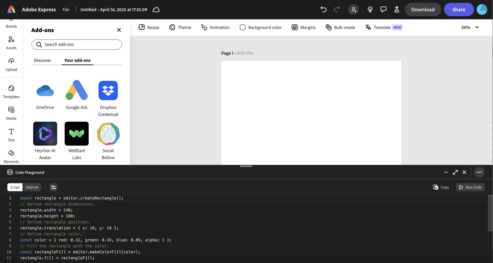
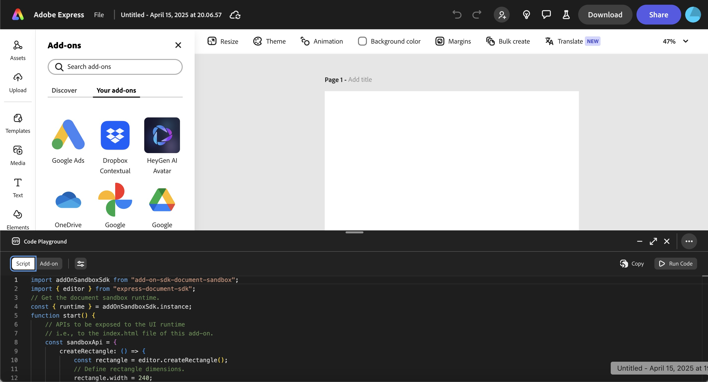
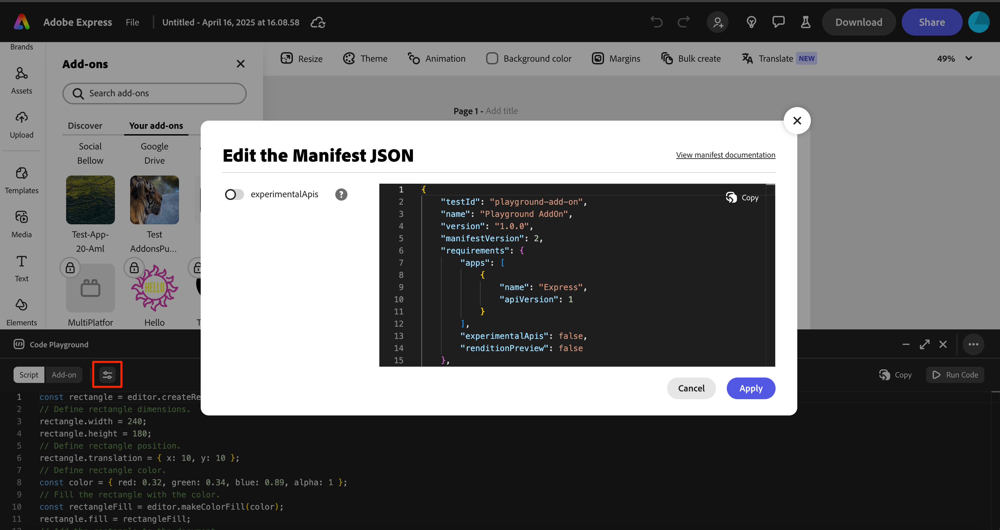
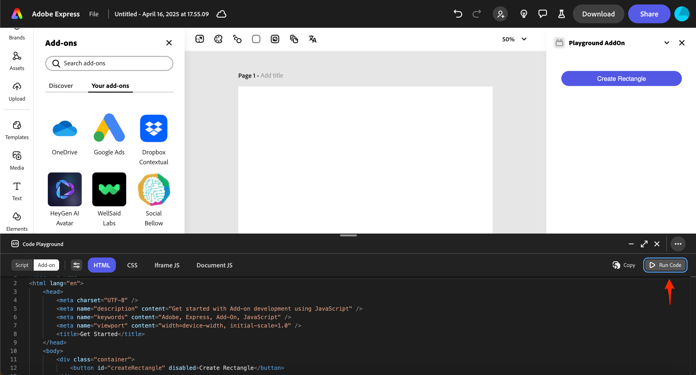
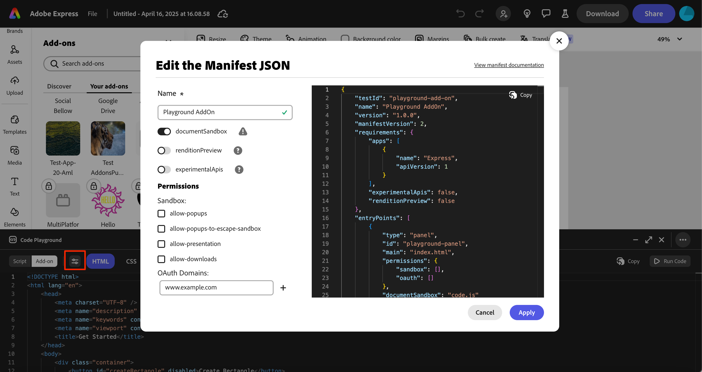
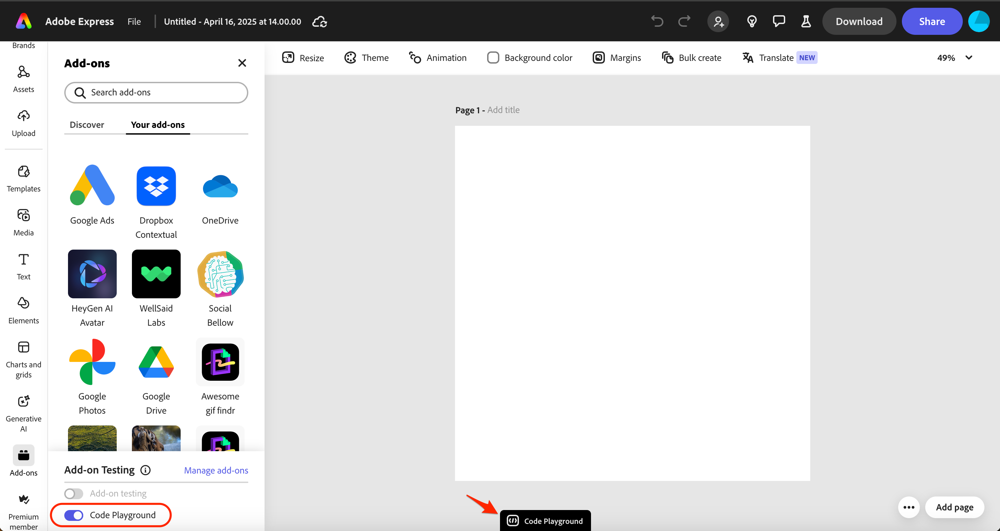
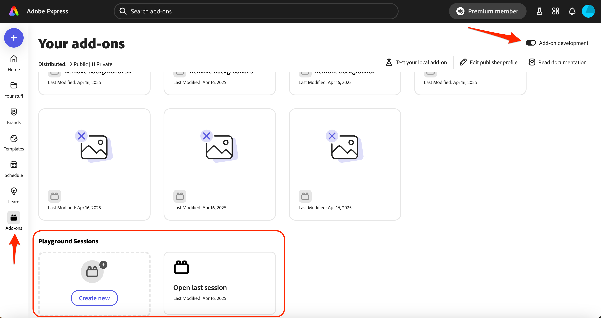

---
keywords:
  - Adobe Express
  - Express Add-on SDK
  - Adobe Express Add-on Development
  - Express Editor
  - Code Playground
  - In-app editor
  - Add-on SDK
  - SDK
  - JavaScript
  - Extend
  - Extensibility
  - API
  - Add-on Manifest
  - Add-on dev tool
  - Express Document
title: Code Playground
description: A guide to using the Code Playground in Adobe Express.
contributors:
  - https://github.com/padmkris123
  - https://github.com/hollyschinsky
  - https://github.com/ErinFinnegan
  - https://github.com/undavide
---

# Code Playground

The Code Playground is an in-app lightweight code editor for fast and effortless prototyping.

## What is Code Playground?

Code Playground provides developers with a low-barrier entry point for add-on development, allowing you to experiment and iterate on ideas directly without any setup, from within Adobe Express. From learning the basics to rapidly prototyping advanced concepts, Code Playground accommodates all stages of add-on development.

## Who Should Use Code Playground?

The Code Playground is designed for:

- **Beginners**: New developers who want to experiment with Adobe Express add-on development without setting up a full development environment.
- **Prototypers**: Developers who need to quickly test concepts or ideas before implementing them in a full add-on project.
- **Learners**: Those who are learning the Document APIs and want to see immediate results of their code.
- **Experienced Developers**: Seasoned developers who want to test specific API functionality or debug isolated code snippets.
- **Designers**: UX/UI designers who want to experiment with add-on interfaces without extensive coding setup.

## Features

| Feature                      | Description                                                                                               |
| ---------------------------- | --------------------------------------------------------------------------------------------------------- |
| **Real-Time Preview**        | See your changes as you code, allowing for immediate feedback and faster adjustments.                     |
| **Effortless Prototyping**   | Quickly turn ideas into add-ons with minimal setup.                                                       |
| **Rapid Implementation**     | Fast-track your prototype to a product by directly pasting your code into an add-on template.             |
| **Script Mode**              | An easy way to interact with the Document APIs quickly.                                                   |
| **Programming Assistance**   | Typed definitions and auto-completion.                                                                    |
| **Default Boilerplate Code** | Default boilerplate code for each tab helps you get started quickly.                                      |
| **Local Persistence**        | Save your work to your browser's local storage and resume where you left off, preventing accidental loss. |
| **Keyboard Shortcuts**       | Use keyboard shortcuts to save, run, and reset your code quickly.                                         |


## Development Workflow Use Cases

The Code Playground is designed to support the following development workflow use cases:

- **Experiment First**: Test your ideas and API interactions before committing to full add-on development.
- **Learn as You Go**: Master the basics of the Document APIs and [Add-on SDK](../../references/addonsdk/index.md) without complex setup requirements.
- **Prototype Quickly**: Build and test features in minutes instead of hours with instant feedback.
- **Bridge to Production**: Develop core functionality in Playground before moving to a complete project environment.
- **Debug with Ease**: Isolate and fix specific issues by testing API calls outside your production code.

## How to Access Code Playground

### Step 1: Enable Add-on Development Mode

- Click the avatar icon in the top right corner of Adobe Express, then the gear icon to open the "Settings".
- Enable **Add-on Development** if it's not already enabled (you might need to click the **Developer Terms of Use** link the first time).


### Step 2: Open Code Playground

- With any document open, click the **Add-ons** button in the left rail.
- Select the **Your add-ons** tab.
- Toggle on **Code Playground** at the bottom of the panel:

  

- Once enabled, the playground window will open, allowing you to begin coding immediately:

  

## Choose Your Development Mode

The playground offers two distinct development modes:

- [**Script Mode**](#script-mode): Experiment with the Adobe Express [Document Sandbox](../../references/document-sandbox/index.md). This mode is equivalent to writing code in the `sandbox/code.js` file in an add-on project running locally, but allows you to rapidly test in Express directly.
- [**Add-on Mode**](#add-on-mode): Test and iterate on your [Add-on UI](../../references/addonsdk/index.md) and functionality with no setup required.

| Comparison Factor     | Script Mode                                                               | Add-on Mode                                                                                                                     |
| --------------------- | ------------------------------------------------------------------------- | ------------------------------------------------------------------------------------------------------------------------------- |
| **Purpose**           | Quick document manipulation tests                                         | Complete add-on UI and functionality                                                                                            |
| **Environment**       | Document Sandbox only                                                     | Both iframe and Document Sandbox                                                                                                |
| **API Access**        | [Document APIs](../../references/document-sandbox/document-apis/index.md) | [Document APIs](../../references/document-sandbox/document-apis/index.md) + [Add-on UI SDK](../../references/addonsdk/index.md) |
| **Global Await**      | Yes                                                                       | No                                                                                                                              |
| **Automatic Imports** | Yes                                                                       | No                                                                                                                              |
| **UI Components**     | No UI building                                                            | Full HTML/CSS/JS interface creation                                                                                             |
| **Best For**          | Testing document operations                                               | Building complete add-ons                                                                                                       |

## Script Mode

### When to Use Script Mode

- To learn how the Document APIs work
- To quickly experiment with Document API calls without UI considerations

**Note:** The code you write in this mode is equivalent to the code you would write and use in the `sandbox/code.js` file in an add-on project running locally.

### How to Use Script Mode

1. Select the **Script** button in the top left corner of the playground window.
2. Enter your [Document API](../../references/document-sandbox/document-apis/index.md) code in the editor. Manipulate the document directly, add shapes or text, change styles, and more using the automatically available [`editor`](../../references/document-sandbox/document-apis/classes/Editor.md) object.
3. Execute your script by clicking the **Run Code** button in the right corner of the playground window to see changes in the current document.



4. If you want to use Document APIs that are currently marked experimental, click on the properties icon to open the [Manifest JSON](../../references/manifest/index.md#requirements) editing modal and toggle **experimentalApis**:



5. Head over to our [How-to guides](../learn/how_to/index.md) to see some examples of using the Document APIs with example code snippets. For instance, the guides:

   - [How to Use Geometry](../learn/how_to/use-geometry.md)
   - [How to Use Color](../learn/how_to/use-color.md)
   - [How to Use Text](../learn/how_to/use-text.md)

#### Key Considerations

- **No UI**: Script mode is focused on Document API interactions and does not support building a user interface. If you want to create a UI, switch to [Add-on mode](#add-on-mode).

- **Global Await**: The script runtime provides a global `async` wrapper, allowing you to use `await` directly when executing asynchronous code, without needing to wrap it in an `async` function. This is particularly useful for API calls that return promises, where an `await` is needed to pause the execution of an `async` function until the Promise is resolved or rejected. For example, loading a font is an asynchronous operation, but in Script mode you can use `await` directly to pause the execution of the script until the font is loaded, ie:

```js
// The script runtime provides an async wrapper to allow this:
const textNode = editor.context.selection[0];
const lato = await fonts.fromPostscriptName("Lato-Light");
```

In contrast, in [**Add-on mode**](#add-on-mode) you will need to manually wrap the code in an `async` function and use `await` in it, ie:

```js
//sandbox.code.js or Document JS tab
loadFont: async () => {
  const textNode = editor.context.selection[0];
  const lato = await fonts.fromPostscriptName("Lato-Light");
};
```

- **Automatic Imports**: Script mode automatically imports the `express-document-sdk` modules, so you don't need to add import statements for the [Document APIs](../../references/document-sandbox/document-apis/index.md). However, if you do add import statements, it wont harm anything.

<InlineAlert slots="text" variant="info"/>

Once you switch to the [Add-on mode](#add-on-mode) or to your local add-on development environment, you will need to make sure to handle your `async` functions and `import` statements manually.

## Add-on Mode

### When to Use Add-on Mode

- To develop and test an add-on directly in Adobe Express, without having to set up a full development environment.
- To prototype an add-on before building a full project.
- To iterate quickly on your add-on's UI and logic.

### How to Use Add-on Mode

1. Click on the **Add-on** button (next to the **Script** button in the top left corner of the playground window).
2. Write code for your add-on in each of the supplied tabs (described below). This includes HTML, CSS, and JavaScript code that will run in the iframe UI or in the Document Sandbox to interact directly with the Express document (optionally).
3. Click **Run Code** to execute your add-on. Your add-on should open in an iframe on the right side of the Adobe Express window, ie:



4. If you need to set [manifest properties](../../references/manifest/index.md) for your add-on (ie: if you want to use APIs that are currently marked experimental, set permissions, OAuth domains etc), click on the properties icon to open the Manifest JSON editing modal:



### Add-on Mode Tabs

The Add-on mode features four tabs for organizing your code:

1. **HTML Tab**

This tab is for writing HTML code that defines the structure of your add-on's user interface. You can create elements like buttons, text fields, and layout containers here. Functionally, this tab mirrors the role of the `index.html` file you'd use in a typical add-on project.

2. **CSS Tab**

Style your add-on's HTML elements in this tab. Create a visually appealing interface consistent with Adobe Express design patterns. This section corresponds to the `styles.css` file in a standard add-on project.

3. **Iframe JS Tab**

This tab is for writing JavaScript code that runs in the iframe context of your add-on. Here, you can interact with:

- The [Add-on UI SDK (`addOnUISdk`)](../../references/addonsdk/index.md)
- The DOM elements in your HTML
- Event handlers for your UI components

This environment corresponds to the code you would typically write in your `index.js` or UI JavaScript files in a full add-on project.

4. **Document JS Tab**

This tab is where you write JavaScript code that interacts directly with the Adobe Express document. It runs in the [Document Sandbox](../../references/document-sandbox/index.md) environment and gives you access to:

- Document manipulation capabilities with the [Document APIs](../../references/document-sandbox/document-apis/index.md)
- [Communication APIs](../../references/document-sandbox/communication/index.md) to facilitate interaction between the iframe context and the Document Sandbox.

The Document JS tab corresponds to the code typically found in the `code.js` file of a complete add-on project.

## Transitioning from Script Mode to Add-on Mode

Once you've tested your code in Script mode, you can easily transition it into the [Add-on mode](#add-on-mode) to build a user interface around your new functionality. Here's how:

1. Use the **Copy** button in the right corner to quickly copy your code to the clipboard.
2. Click the **Add-on** button to enter [Add-on mode](#add-on-mode).
3. Paste the code into the [**Document JS**](#add-on-mode-tabs) tab. **Note:** Don't forget you'll need to add the `import` statements for the Document APIs and handle your `async` functions manually in this mode.
4. Modify your script code to be used in the add-on context along with your front-end logic in the [**HTML**](#add-on-mode-tabs), [**Iframe JS**](#add-on-mode-tabs), and [**CSS**](#add-on-mode-tabs) tabs. Use the initial sample code provided as a reference.
5. If you set any manifest properties (ie: **experimentalApis**) while in [Script mode](#how-to-use-script-mode), make sure to set the same in the [Add-ons mode - Edit Manifest JSON Modal](#how-to-use-add-on-mode) as well. These settings only apply to the context of the development mode you're in.
6. Click the **Run Code** button to execute your code within the context of your add-on.

## Workflow Tips

Keyboard Shortcuts, local save and session management are all designed to help you get the most out of the Code Playground.

### Keyboard Shortcuts

| Action                           | Windows/Linux                                                | macOS                      |
| -------------------------------- | ------------------------------------------------------------ | -------------------------- |
| **Save**                         | Ctrl + Shift + S                                             | Cmd + Shift + S            |
| **Run**                          | Ctrl + Shift + Return/Enter                                  | Cmd + Shift + Return/Enter |
| **Reset**                        | Ctrl + Shift + X                                             | Cmd + Shift + X            |
| **Increase font size**           | Ctrl + Shift + Plus (+)                                      | Cmd + Shift + Plus (+)     |
| **Decrease font size**           | Ctrl + Shift + Minus (-)                                     | Cmd + Shift + Minus (-)    |
| **Switch between tabs**          | Ctrl + 1, 2, 3, 4                                            | Cmd + 1, 2, 3, 4           |
| **View the typings suggestions** | Ctrl + space                                                 | Cmd + space                |

<InlineAlert slots="header,text1" variant="success"/>

#### TIP

Use the "**...**" button in the top right corner of the playground window to reference the available keyboard shortcuts, start a new session, link to documentation and more.

### Saving Your Work

The Code Playground features local persistence to help prevent the loss of your work. This functionality ensures that your code is stored in your browser's local storage, providing a safeguard against accidental data loss.

Code in the playground is ***not saved automatically***. To ensure it's saved, you need to take one of the following steps:

1. Save your work using the [keyboard shortcut for Save](#keyboard-shortcuts).
2. Run the code via the **Run Code** button or with the [keyboard shortcut for Run](#keyboard-shortcuts).
3. Exit the playground (with the **X** in the upper right corner).

If you don't want to save your work at any time, use the [keyboard shortcut to Reset](#keyboard-shortcuts).

<InlineAlert slots="header, text1" variant="warning"/>

#### IMPORTANT

- Only your most recent session is saved.
- Storage is browser-specific (not synced across devices).
- Code is not saved in incognito/private browsing modes.
- Clearing browser data will delete saved code.

### Resuming Sessions

There are two ways to resume working on your last saved session:

1. **Via the Add-ons Panel:**

   - With any document open, click the **Add-ons** button in the left rail.
   - Select the **Your add-ons** tab.
   - Toggle on **Code Playground** at the bottom of the panel.

   

2. **Via the Your add-ons Page:**

   - The **Your add-ons** page where you manage your add-ons now features a dedicated section for the playground, allowing you to quickly access your last session or create a new one.
   - Find the **Playground Sessions** section in the **Your add-ons** page.
   - Access your last session or create a new one with one click.



<InlineAlert slots="header, text1" variant="info"/>

#### Accessing "Your add-ons" Page

- **Without a document open:** Click the **Add-ons** button in the left rail, then click the **Add-on development** toggle in the top right.
- **With a document open:** Click the **Add-ons** button in the left rail, select the **Your add-ons** tab, then click the "Manage add-ons" link in the Add-on Testing section.

## Resources

- **How-To Guides:** Begin by experimenting with the code snippets found in our [how-to guides](../learn/how_to/index.md) to kickstart your development.
- **SDK/API References:** Discover more about what you can do in your add-on by exploring our [SDK References](../../references/index.md).
- **Code Samples:** Get inspired by checking out [our code samples](../learn/samples.md) to see what's possible.
- **Ask Questions:** Chat with fellow developers on [Discord](http://discord.gg/nc3QDyFeb4).

## Next Steps: Build Your Add-on Locally

After experimenting with the Code Playground and when you're ready to build out a full-blown add-on in a local development environment:

1. Follow our [Quickstart Guide](quickstart.md) to get your environment set up and your first add-on project created quickly.
2. Copy the code from the Code Playground [Add-on mode tabs](#add-on-mode-tabs) to the corresponding files in your new project. **Note:** Don't forget, if you're copying code from Script mode into your `sandbox/code.js` file, you'll need to add the `import` statements for the Document APIs and handle your `async` functions manually.
3. Copy the JSON from the [Manifest JSON Editor](#how-to-use-add-on-mode) in the Code Playground into the `src/manifest.json` file in your new project.
4. Run your add-on locally using the [Adobe Express CLI](quickstart.md) to test and see your changes in real-time.

## FAQs

### What is the Adobe Express Code Playground?

The Adobe Express Code Playground is a lightweight code editor designed for fast and effortless prototyping. It allows you to experiment with simple code snippets to build and refine add-ons, quickly turning ideas into functional features.

### Is it free to use?

Yes, the Code Playground is free to use. You can access all its features without any cost and start prototyping and creating add-ons right away.

### Do I need coding experience?

While some basic coding knowledge is helpful, Playground is designed to be beginner-friendly and accessible. Its intuitive interface and simple code snippets make it easier for both experienced developers and those newer to coding to create and test add-ons.

### How do I start creating add-ons?

Getting started is simple. activate the playground, experiment with code snippets, and start building your add-ons. Use the real-time preview feature to see your changes instantly and iterate on your ideas with ease.

### Where can I go for help?

[Join our Discord](http://discord.gg/nc3QDyFeb4) to chat with the add-on developer community.
