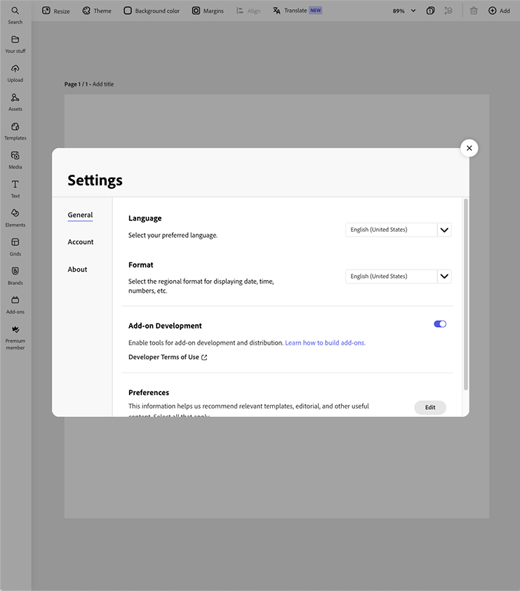
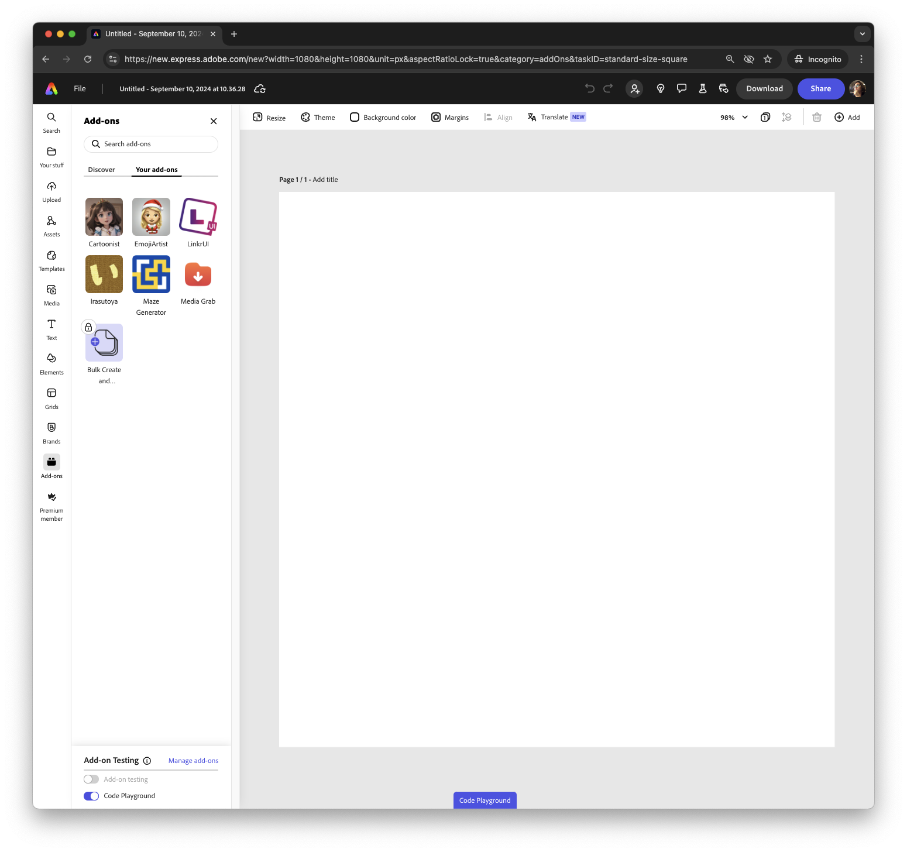
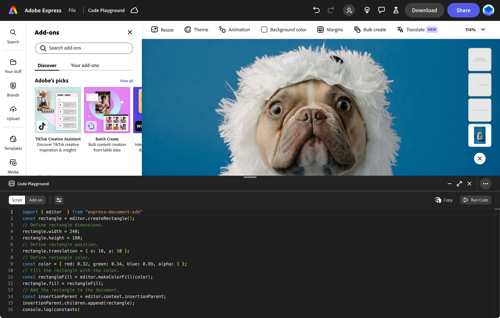

---
keywords:
  - Adobe Express
  - Express Add-on SDK
  - Express Editor
  - Adobe Express
  - Add-on SDK
  - SDK
  - JavaScript
  - Extend
  - Extensibility
  - API
  - Add-on Manifest
title: Code Playground
description: How to access the Code Playground
contributors:
  - https://github.com/ErinFinnegan
  - https://github.com/padmkris123
---

# Adobe Express Add-On Code Playground

## What is the Code Playground?

The Code Playground is an in-app lightweight code editor for fast and effortless prototyping. It lets you iterate on ideas directly by allowing you to experiment without any setup. Whether you're just getting started building add-ons or you want to test your concepts and ideas, this playground is for you.

- **Real-Time Preview:** See your changes instantly as you code, allowing for immediate feedback and faster adjustments.
- **Effortless Prototyping:** Quickly turn ideas into add-ons with minimal setup.
- **Rapid Implementation:** Fast-track your prototype to a product by directly pasting your code into an add-on template.

  <iframe width="560" height="315" src="https://youtu.be/v-6II0CcNx0" title="Introducing Code Playground for Adobe Express Add-ons" frameborder="0" allow="accelerometer; autoplay; clipboard-write; encrypted-media; gyroscope; picture-in-picture; web-share" allowfullscreen></iframe>

 

### Getting Started Steps

1. **Enable Add-On Development Mode:** Go to your settings and enable add-on development mode (if it isn’t already enabled).

2. **Open a Document in Express:** Start by opening any document in Adobe Express.
1. **Navigate to the Add-ons Section:** Click on the "Add-Ons" section located on the left side rail.
1. **Select "Your Add-Ons" Tab:** In the Add-ons panel, select the "Your Add-ons" tab.

5. **Access the Playground:** At the bottom of the add-ons rail, you’ll see the option to open the Code Playground. Click to get started!

## Where to Go Next / Get Started and Explore More

- **Experiment with Common Use Cases:** Begin by experimenting with some [common use cases](./develop/use_cases/) to kickstart your development.
- **Start with Code Samples:** Check out [these samples](https://developer.adobe.com/express/add-ons/docs/samples/) to see what’s possible and get inspired.
- **Understand Add-on Concepts:** Get familiar with the fundamentals of building add-ons.
  - [iFrame Context](https://developer.adobe.com/express/add-ons/docs/guides/develop/context/)
  - [Document Sandbox](https://developer.adobe.com/express/add-ons/docs/references/document-sandbox/document-apis/concepts/)
  - [Manifest File](https://developer.adobe.com/express/add-ons/docs/references/manifest/)
- **Explore API References:** Discover all available APIs and their capabilities in the [SDK Reference](https://developer.adobe.com/express/add-ons/docs/references/manifest/).

## FAQs

### What is the Adobe Express Developer Playground?

 Adobe Express Developer Playground is a lightweight code editor designed for fast and effortless prototyping. It allows you to experiment with simple code snippets to build and refine add-ons, quickly turning ideas into functional features.

### Is it free to use?

 Yes, the Developer Playground is free to use. You can access all its features without any cost and start prototyping and creating add-ons right away.

### Do I need coding experience?

 While some basic coding knowledge is helpful, Playground is designed to be beginner-friendly and accessible. Its intuitive interface and simple code snippets make it easier for both experienced developers and those newer to coding to create and test add-ons.

### How do I start creating add-ons?

 Getting started is simple. Activate the Playground, experiment with code snippets, and start building your add-ons. Use the real-time preview feature to see your changes instantly and iterate on your ideas with ease.