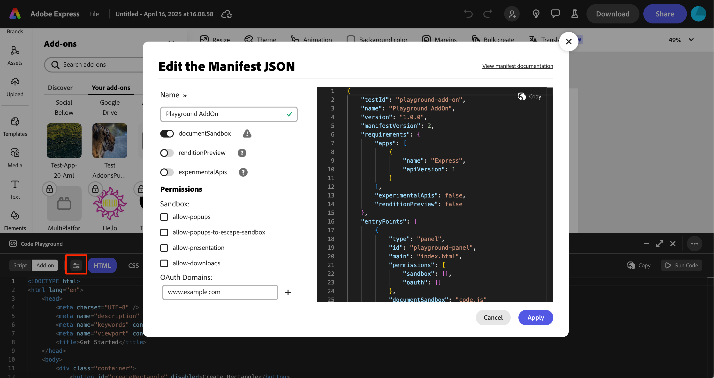
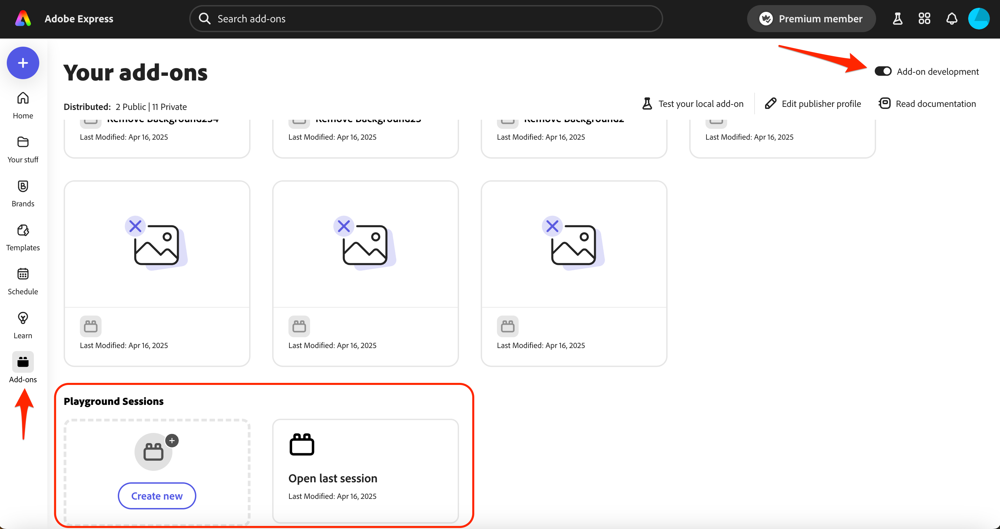

---
keywords:
  - Adobe Express
  - Express Add-on SDK
  - Adobe Express Add-on Development
  - Express Editor
  - Code Playground
  - In-app editor
  - Add-on SDK
  - SDK
  - JavaScript
  - Extend
  - Extensibility
  - API
  - Add-on Manifest
  - Add-on dev tool
  - Express Document
title: Code Playground
description: How to access the Code Playground
contributors:
  - https://github.com/padmkris123
  - https://github.com/hollyschinsky
  - https://github.com/ErinFinnegan
  - https://github.com/undavide
---

# Code Playground

The Code Playground is an in-app lightweight code editor for fast and effortless prototyping.

## What is Code Playground?

Code Playground provides a low-barrier entry point for add-on development, allowing you to experiment and iterate on ideas directly without any setup, from within Adobe Express. From learning the basics to rapidly prototyping advanced concepts, Code Playground accommodates all stages of add-on development.

## Who Should Use Code Playground?

The Code Playground is designed for:

- **Beginners**: New developers who want to experiment with Adobe Express add-on development without setting up a full development environment.
- **Prototypers**: Developers who need to quickly test concepts or ideas before implementing them in a full add-on project.
- **Learners**: Those who are learning the Document APIs and want to see immediate results of their code.
- **Experienced Developers**: Seasoned developers who want to test specific API functionality or debug isolated code snippets.
- **Designers**: UX/UI designers who want to experiment with add-on interfaces without extensive coding setup.

## Features

| Feature | Description |
|---------|-------------|
| **Real-Time Preview** | See your changes as you code, allowing for immediate feedback and faster adjustments. |
| **Effortless Prototyping** | Quickly turn ideas into add-ons with minimal setup. |
| **Rapid Implementation** | Fast-track your prototype to a product by directly pasting your code into an add-on template. |
| **Script Mode** | An easy way to interact with the Document APIs quickly. |
| **Programming Assistance** | Typed definitions and auto-completion. |
| **Default Boilerplate Code** | Default boilerplate code for each tab helps you get started quickly. |
| **Local Persistence** | Save your work to your browser's local storage and resume where you left off, preventing accidental loss. |
| **Keyboard Shortcuts** | Use keyboard shortcuts to save, run, and reset your code quickly. |

<!-- Check out the video below for a quick introduction to the add-on playground features.

  

 <iframe width="560" height="315" src="https://www.youtube.com/embed/j6KS6CXZmKo?si=j4kX8gItWbm1ZDVz" title="YouTube video player" frameborder="0" allow="accelerometer; clipboard-write; encrypted-media; gyroscope; picture-in-picture; web-share" allowfullscreen></iframe>

  -->

## Development Workflow Use Cases

There are numerous opportunities for using the Code Playground to help you throughout the development process, including:

- **Experiment First**: Test your ideas and API interactions before committing to full add-on development.
- **Learn as You Go**: Master the basics of Document APIs and Add-on SDK without complex setup requirements.
- **Prototype Quickly**: Build and test features in minutes instead of hours with instant feedback.
- **Bridge to Production**: Develop core functionality in Playground before moving to a complete project environment.
- **Debug with Ease**: Isolate and fix specific issues by testing API calls outside your production code.

## How to Access Code Playground

### Step 1: Enable Add-on Development Mode

- From your avatar icon in the top right corner, click the gear icon to open the Adobe Express settings
- Enable "Add-on Development" if not already enabled

  

### Step 2: Open Code Playground

- With any document open, click the "Add-ons" button in the left rail
- Select the "Your add-ons" tab
- Toggle on "Code Playground" at the bottom of the panel

  

- Once enabled, the playground window will open, allowing you to begin coding immediately!

  
  
## Choose Your Development Mode

The playground offers two distinct development modes:

- [**Script Mode**](#script-mode): Experiment with the Express Document APIs directly
- [**Add-on Mode**](#add-on-mode): Test and iterate on your add-on UI and functionality with no setup required

A side-by-side comparison of the two modes and specific features is below:

| Feature | Script Mode | Add-on Mode |
|---------|-------------|-------------|
| **Purpose** | Quick document manipulation tests | Complete add-on UI and functionality |
| **Environment** | Document Sandbox only | Both iframe and Document Sandbox |
| **API Access** | Document APIs | Document APIs + Add-on UI SDK |
| **UI Components** | No UI building | Full HTML/CSS/JS interface creation |
| **Best For** | Testing document operations | Building complete add-ons |

## Script Mode

### When to Use Script Mode

- To learn how the [Document APIs](../../references/document-sandbox/document-apis/index.md) work
- To quickly test Document API calls without UI considerations

### How to Use Script Mode:

1. Select the "Script" button in the top left corner of the playground window.
2. Enter your [Document API](../../references/document-sandbox/document-apis/index.md) code in the editor. Manipulate the document directly, add shapes or text, change styles, and more using the automatically available [`editor`](../../references/document-sandbox/document-apis/classes/Editor.md) object.
3. Execute your script by clicking the "Run Code" button in the top right corner of the playground window to see changes in the current document.

  

4. (Optionally) If you want to use Document APIs that are currently marked experimental, click on the [manifest properties](../../references/manifest/index.md#requirements) icon next to the mode buttons (outlined below) and toggle "experimentalApis" to enable them:

  

## Add-on Mode

### When to Use Add-on Mode

- To develop and test an add-on directly in Adobe Express, without having to set up a full development environment
- To prototype an add-on before building a full project
- To iterate quickly on your add-on's UI and logic

### How to Use Add-on Mode:

1. Click on the "Add-on" button on the right of the "Script" button in the top left corner of the playground window.
2. Write code for your add-on in each of the supplied tabs (described below). This includes HTML, CSS, and JavaScript code that will run in the iframe UI or in the Document Sandbox to interact directly with the Express document (optionally).
3. Click "Run Code" to execute your add-on. Your add-on should open in an iframe on the right side of the Adobe Express window, ie:

  

4. If you need to set [manifest properties](../../references/manifest/index.md) for your add-on (for instance if you want to use APIs that are currently marked experimental), click on the manifest properties icon next to the mode buttons (outlined below) to enable them:

  

#### HTML Tab

This tab is for writing HTML code that defines the structure of your add-on's user interface. You can create elements like buttons, text fields, and layout containers here. Functionally, this tab mirrors the role of the `index.html` file you'd use in a typical add-on project.

#### CSS Tab

Style your add-on's HTML elements in this tab. Create a visually appealing interface consistent with Adobe Express design patterns. This section corresponds to the `styles.css` file in a standard add-on project.

#### Iframe JS Tab

This tab is for writing JavaScript code that runs in the iframe context of your add-on. Here, you can interact with:

- The [Add-on UI SDK (`addOnUISdk`)](../../references/addonsdk/index.md)
- The DOM elements in your HTML
- Event handlers for your UI components

This environment corresponds to the code you would typically write in your `index.js` or UI JavaScript files in a full add-on project.

#### Document JS Tab

This tab is where you write JavaScript code that interacts directly with the Adobe Express document. It runs in the [Document Sandbox](../../references/document-sandbox/index.md) environment and gives you access to:

- Document manipulation capabilities with the [Document APIs](../../references/document-sandbox/document-apis/index.md)
- [Communication APIs](../../references/document-sandbox/communication/index.md) to facilitate interaction between the iframe context and the Document Sandbox.

The Document JS tab corresponds to the code typically found in the `code.js` file of a complete add-on project.

### Transitioning from Script Mode to Add-on Mode

Once you've tested your code in Script mode, you can easily transition it into the Add-on mode to build a user interface around your new functionality. Here's how:

1. Use the "Copy" button in the right corner to quickly copy your code to the clipboard.
2. Click the "Add-on" button to enter Add-on mode.
3. Paste the code into the "Document JS" tab.
4. Modify your script code to be used in the add-on context along with your front-end logic in the HTML, Iframe, and CSS tabs. Use the initial sample code provided as a reference.
5. Click the "Run Code" button in Add-on mode to execute your code within the context of your add-on.

## Workflow Tips

### Keyboard Shortcuts:

| Action | Windows/Linux | macOS |
|--------|---------------|-------|
| **Save** | <kbd>Ctrl</kbd>+<kbd>S</kbd> | <kbd>Cmd</kbd>+<kbd>S</kbd> |
| **Run** | <kbd>Ctrl</kbd>+<kbd>Enter</kbd> | <kbd>Cmd</kbd>+<kbd>Enter</kbd> |
| **Reset** | <kbd>Ctrl</kbd>+<kbd>X</kbd> | <kbd>Cmd</kbd>+<kbd>X</kbd> |
| **Increase font size** | <kbd>Ctrl</kbd>+<kbd>Plus (+)</kbd> | <kbd>Cmd</kbd>+<kbd>Plus (+)</kbd> |
| **Decrease font size** | <kbd>Ctrl</kbd>+<kbd>Minus (-)</kbd> | <kbd>Cmd</kbd>+<kbd>Minus (-)</kbd> |
| **Switch between tabs** | <kbd>Ctrl</kbd>+<kbd>1, 2, 3, 4</kbd> | <kbd>Cmd</kbd>+<kbd>1, 2, 3, 4</kbd> |
| **View the typings suggestions** | <kbd>Ctrl</kbd>+<kbd>space</kbd> | <kbd>Cmd</kbd>+<kbd>space</kbd> |

### Saving Your Work

The Code Playground features local persistence to help prevent the loss of your work. This functionality ensures that your code is stored in your browser's local storage, providing a safeguard against accidental data loss.

Code in the playground is not saved automatically, but you can ensure it's saved by using one of the following options:

  1. Save your work using the keyboard shortcut for Save [(above)](#keyboard-shortcuts)
  2. Run the code via the "Run Code" button or with the keyboard shortcut for Run [(above)](#keyboard-shortcuts)
  3. When exiting the playground

<InlineAlert slots="header, text1, text2, text3, text4" variant="warning">

##### IMPORTANT

- Only your most recent session is saved
- Storage is browser-specific (not synced across devices)
- Code is not saved in incognito/private browsing modes
- Clearing browser data will delete saved code

</InlineAlert>

### Resuming Sessions

There are two ways to resume working on your last saved session:

1. **Via the Add-ons Panel:**

  - With any document open, click the "Add-ons" button in the left sidebar
  - Select the "Your add-ons" tab
  - Toggle on "**Code Playground**" at the bottom of the panel

  

2. **Via the Your add-ons Page:**

  - The "Your add-ons" page where you manage your add-ons now features a dedicated section for the playground, allowing you to quickly access your last session or create a new one.
  - Find the "**Playground Sessions**" section in the "Your add-ons" page
  - Access your last session or create a new one with one click

  

<InlineAlert slots="header, text1, text2" variant="info">

#### Accessing "Your add-ons" page

- **Without a document open:** Click the Add-ons button in the left rail, then click the Add-on development toggle in the top right.
- **With a document open:** Click the Add-ons button in the left rail, select the "Your add-ons" tab, then click the "Manage add-ons" link in the Add-on Testing section.

</InlineAlert>

## Resources

- **How-To Guides:** Begin by experimenting with the code snippets found in our [how-to guides](../develop/how_to.md) to kickstart your development.
- **SDK/API References:** Discover more about what you can do in your add-on by exploring our [SDK References](../../references/index.md).
- **Code Samples:** Get inspired by checking out [our code samples](../../samples.md) to see what's possible.
- **Ask Questions:** Chat with fellow developers on [Discord](http://discord.gg/nc3QDyFeb4).

## Next Steps: Build Your Add-on Locally

After experimenting with the Code Playground and when you're ready to build out a full-blown add-on in a local development environment, follow our [Quickstart Guide](../getting_started/quickstart.md) to get up and running quickly. Once you've created your new project, simply copy your code from the Code Playground [Add-on mode tabs](#how-to-use-add-on-mode) to the corresponding files in your new project to get started!

## FAQs

### What is the Adobe Express Code Playground?

The Adobe Express Code Playground is a lightweight code editor designed for fast and effortless prototyping. It allows you to experiment with simple code snippets to build and refine add-ons, quickly turning ideas into functional features.

### Is it free to use?

Yes, the Code Playground is free to use. You can access all its features without any cost and start prototyping and creating add-ons right away.

### Do I need coding experience?

While some basic coding knowledge is helpful, Playground is designed to be beginner-friendly and accessible. Its intuitive interface and simple code snippets make it easier for both experienced developers and those newer to coding to create and test add-ons.

### How do I start creating add-ons?

Getting started is simple. activate the playground, experiment with code snippets, and start building your add-ons. Use the real-time preview feature to see your changes instantly and iterate on your ideas with ease.

### Where can I go for help?

[Join our Discord](http://discord.gg/nc3QDyFeb4) to chat with the add-on developer community.
