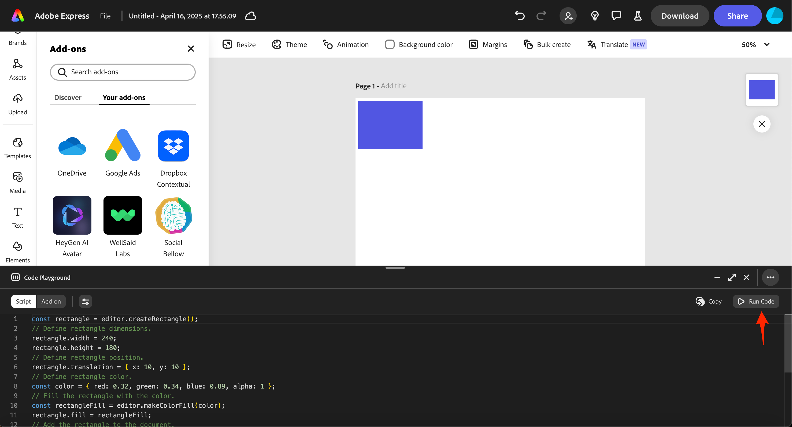

---
keywords:
  - Adobe Express
  - Express Add-on SDK
  - Adobe Express Add-on Development
  - Express Editor
  - Code Playground
  - Script Mode
  - Document APIs
  - Document Sandbox
  - JavaScript
  - Prototyping
title: Code Playground - Script Mode
description: Learn how to use Script Mode in Code Playground for quick document manipulation and API testing.
contributors:
  - https://github.com/padmkris123
  - https://github.com/hollyschinsky
  - https://github.com/ErinFinnegan
  - https://github.com/undavide
  - https://github.com/nimithajalal
---

# Code Playground - Script Mode

Script Mode in Code Playground allows you to quickly experiment with Adobe Express Document APIs without the complexity of building a full user interface.

## What is Script Mode?

Script Mode is designed for rapid prototyping and learning. It provides a simplified environment where you can:

- Test Document API calls directly
- Learn how the Document APIs work
- Experiment with document manipulation
- Debug specific functionality

**Note:** The code you write in this mode is equivalent to the code you would write and use in the `sandbox/code.js` file in an add-on project running locally.

## When to Use Script Mode

Use Script Mode when you want to:

- Learn how the Document APIs work
- Quickly experiment with Document API calls without UI considerations
- Test specific API functionality
- Debug isolated code snippets
- Prototype document manipulation logic

## How to Use Script Mode

### Step 1: Select Script Mode

1. Click the **Script** button in the top left corner of the playground window
2. You'll see a single code editor where you can write your Document API code



### Step 2: Write Your Code

Enter your [Document API](../../references/document-sandbox/document-apis/index.md) code in the editor. You can:

- Manipulate the document directly
- Add shapes or text
- Change styles and properties
- Use the automatically available [`editor`](../../references/document-sandbox/document-apis/classes/Editor.md) object

### Step 3: Execute Your Script

Click the **Run Code** button in the right corner of the playground window to see changes in the current document.

### Step 4: Configure Experimental APIs (Optional)

If you want to use Document APIs that are currently marked experimental:

1. Click on the properties icon to open the [Manifest JSON](../../references/manifest/index.md#requirements) editing modal
2. Toggle **experimentalApis** to enable experimental features


## Key Features

### Global Await Support

The script runtime provides a global `async` wrapper, allowing you to use `await` directly when executing asynchronous code, without needing to wrap it in an `async` function:

```js
// The script runtime provides an async wrapper to allow this:
const textNode = editor.context.selection[0];
const lato = await fonts.fromPostscriptName("Lato-Light");
```

This is particularly useful for API calls that return promises, where an `await` is needed to pause the execution of an `async` function until the Promise is resolved or rejected.

### Automatic Imports

Script mode automatically imports the `express-document-sdk` modules, so you don't need to add import statements for the [Document APIs](../../references/document-sandbox/document-apis/index.md). However, if you do add import statements, it won't harm anything.

### No UI Building

Script mode is focused on Document API interactions and does not support building a user interface. If you want to create a UI, switch to [Add-on Mode](./code_playground_addon_mode.md).

<InlineAlert slots="text" variant="info"/>

Once you switch to the [Add-on Mode](./code_playground_addon_mode.md) or to your local add-on development environment, you will need to make sure to handle your `async` functions and `import` statements manually.

## Learning Resources

### How-to Guides

Head over to our [How-to guides](../learn/how_to/index.md) to see some examples of using the Document APIs with example code snippets:

- [How to Use Geometry](../learn/how_to/use_geometry.md)
- [How to Use Color](../learn/how_to/use_color.md)
- [How to Use Text](../learn/how_to/use_text.md)

### API References

- [Document APIs](../../references/document-sandbox/document-apis/index.md): Complete reference for all available Document APIs
- [Document Sandbox](../../references/document-sandbox/index.md): Learn about the Document Sandbox environment

## Transitioning to Add-on Mode

Once you've tested your code in Script mode, you can easily transition it into [Add-on Mode](./code_playground_addon_mode.md) to build a user interface around your functionality:

1. Use the **Copy** button in the right corner to quickly copy your code to the clipboard
2. Click the **Add-on** button to enter Add-on Mode
3. Paste the code into the **Document JS** tab
4. Add the necessary `import` statements and handle `async` functions manually
5. Build your UI in the HTML, CSS, and Iframe JS tabs

## Next Steps

- **[Add-on Mode Guide](./code_playground_addon_mode.md)**: Learn how to build complete add-ons with UI
- **[Workflow & Productivity](./code_playground_workflow.md)**: Master keyboard shortcuts and session management
- **[Troubleshooting](./code_playground_troubleshooting.md)**: Get help with common issues
