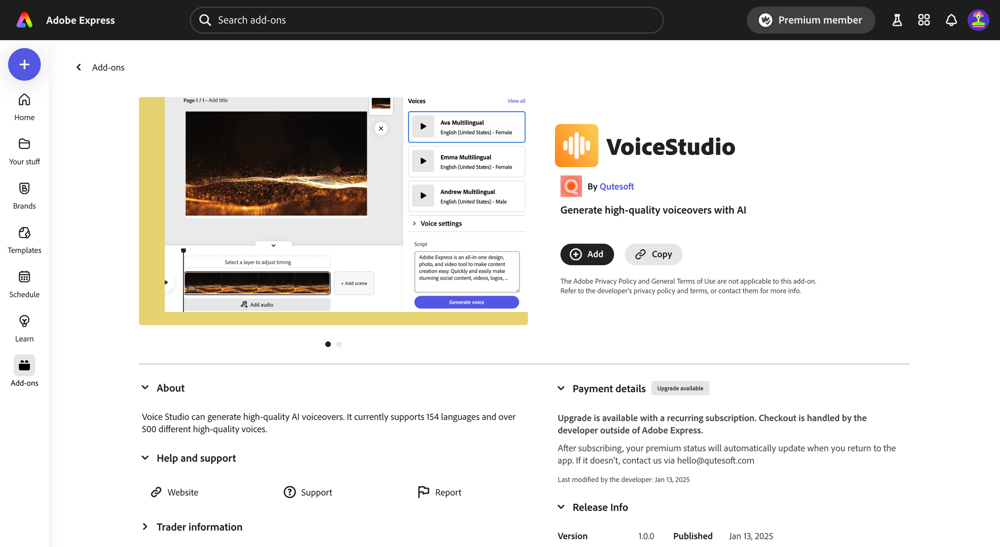

---
keywords:
  - Adobe Express
  - Express Add-on SDK
  - Express Editor
  - Adobe Express
  - Add-on SDK
  - SDK
  - JavaScript
  - Extend
  - Extensibility
  - API
  - Discover
  - Developer Journey
title: Developer Journey
description: Developer Journey
contributors:
  - https://github.com/undavide
---

# Developer Journey

[Adobe Express](https://www.adobe.com/express/) is an AI-first, all-in-one, web-based app to easily create and share content for free. It's a powerful tool that can be used by everyone, from designers to marketers, to create stunning content in minutes.

## Discover

### What are add-ons?

[Add-ons](https://new.express.adobe.com/add-ons) are extensions that enhance the functionality of Adobe Express, allowing users to be more productive and creative.

The add-on's use cases are endless, but some real-world examples are:

- Generate **AI avatars** from a selfie.
- Browse and insert **voiceover** and **music** to your project.
- Create **stylish product mockups**.
- Integrate with **Google Drive** and **Google Photos** to manage your files.
- And much more!

### How to develop add-ons

Add-ons are lightweight programs that run in their own panel within the Adobe Express user interface; you can build add-ons with standard web technologies like **HTML**, **CSS**, and **JavaScript**. Ideally, they provide a seamless experience for the user—they should feel like they are part of the Adobe Express app!

Once you have your add-on ready, you can distribute it through the [Adobe Express Marketplace](https://new.express.adobe.com/add-ons). With a few clicks, it'll be made available to **millions of Adobe Express users**.

### Monetize add-ons

Add-ons can be either **free** or **paid**, and anything in between like _freemium_ or _credit-based_.

<InlineAlert slots="text1" variant="info" />

You're allowed to implement your payment processor of choice, the Adobe Express Marketplace _does not take_ a cut of your revenue, so **you keep 100% of your earnings**.

Adobe sponsors the development of selected use cases through the [Adobe Fund for Design](https://developer.adobe.com/fund-for-design); check it out, and get paid to develop your add-on!

### Resources

You now have a basic understanding of the Adobe Express ecosystem; if you want to dive deeper into the different parts of the ecosystem, check out the following resources:

- [Introducing Adobe Express add-ons](https://www.youtube.com/watch?v=CHBiTTN1neE) (Youtube video)
- [Adobe Express add-ons overview](https://developer.adobe.com/express/add-ons/)
- [Adobe Express Office Hours](https://developer.adobe.com/developers-live)
- [Adobe Fund for Design](https://developer.adobe.com/fund-for-design)

## Learn

The best way to learn is by doing! Adobe Express integrates a [Playground](../getting_started/code_playground.md) environment that allows you experiment with the code directly in the application, without the need to set up a local development environment.

  

 <iframe width="779" height="438" src="https://www.youtube.com/embed/j6KS6CXZmKo?si=j4kX8gItWbm1ZDVz" title="YouTube video player" frameborder="0" allow="accelerometer; clipboard-write; encrypted-media; gyroscope; picture-in-picture; web-share" allowfullscreen></iframe>

 

### Run the Code Playground

You need to tick a few boxes in the application in order to enable it, as the animation below shows.

Once it's open, you can play with the code directly in the editor, and see the changes you make reflected in the document. The [Script Mode](#) is particularly useful for experimenting with the add-on's APIs. Please refer to the complete guide to the [Code Playground](../getting_started/code_playground.md) for more details.

### Explore the How-to Guides

To properly experiment with the Playground, head to the [How-tos](../learn/how_to/how_to.md) section: you'll find a collection of short guides and accompanying snippets that you can plug and play in the Playground editor. They cover the most common use cases, and are a great way to get familiar with the add-on SDK. Try the following as a starter:

- [Creating Text](../learn/how_to/use_text.md#create-text)
- [Creating Geometry](../learn/how_to/use_geometry.md)
- [Grouping Elements](../learn/how_to/group_elements.md)

When you feel more comfortable, you can tinker with these other use cases:

- [Using Colors](../learn/how_to/use_color.md)
- [Exporting Renditions](../learn/how_to/create_renditions.md)
- [Document](../learn/how_to/document_metadata.md) and [Element Metadata](../learn/how_to/document_metadata.md)

### Next steps

Feel free to explore the rest of the [How-to Guides](../develop/how_to.md) to get exposed the entire range of possibilities that the add-on SDK offers. If you're ready to get your hands dirty and start building your own add-ons, keep reading to learn how to scaffold a local environment with the CLI, and build a more complex add-on from the ground up.

## ⚠️ WIP

Add this somewhere

  <iframe width="779" height="438" src="https://www.youtube.com/embed/HHnX5o8CxHU?si=4w4KvQVdkl8r5BZZ" title="Building Add-on Features" frameborder="0" allow="accelerometer; autoplay; clipboard-write; encrypted-media; gyroscope; picture-in-picture; web-share" allowfullscreen></iframe>

