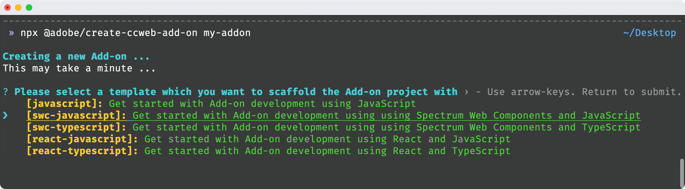
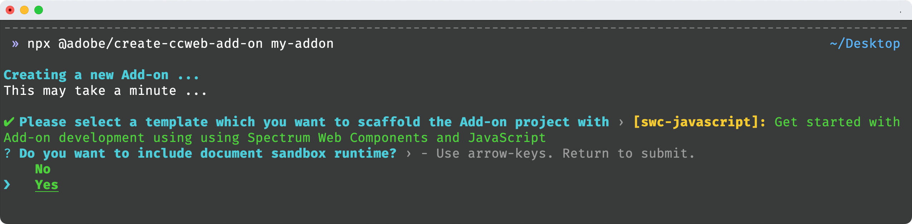
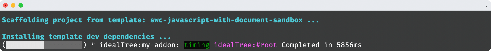
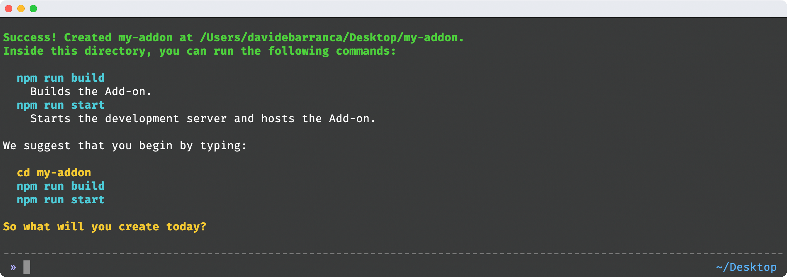
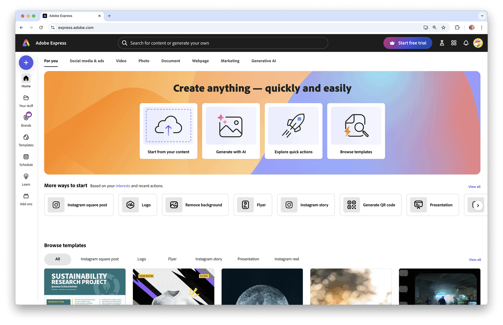
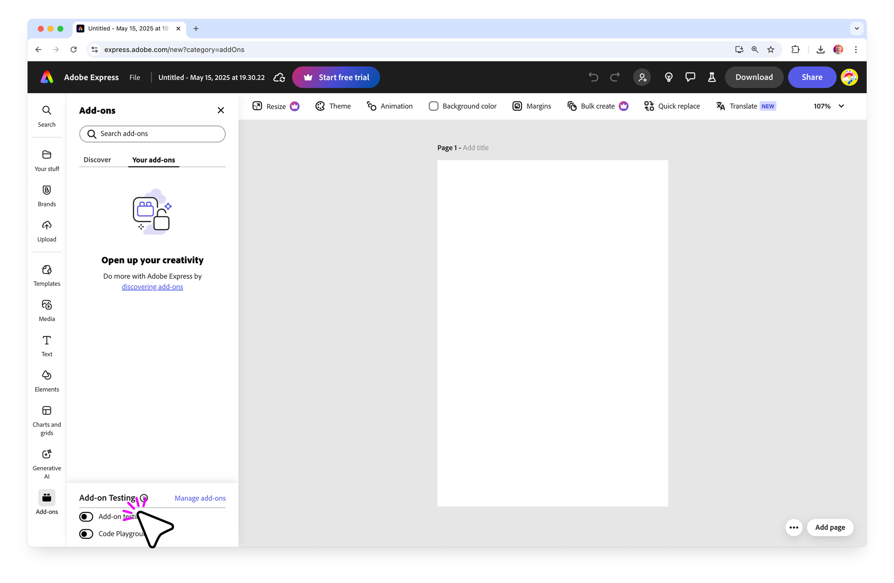
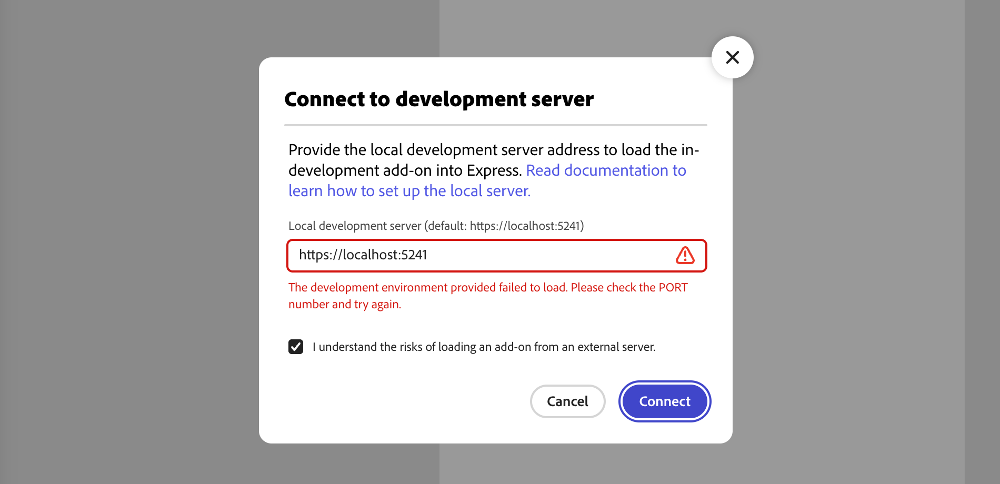
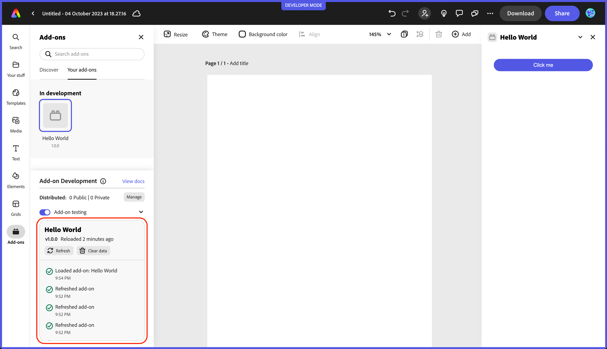
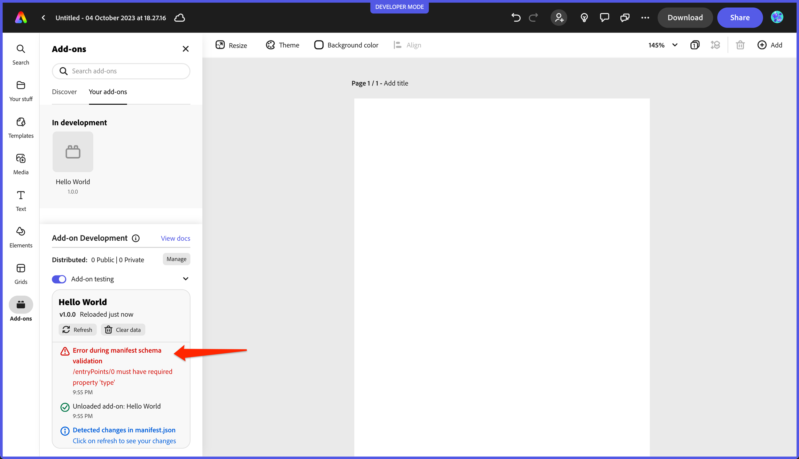
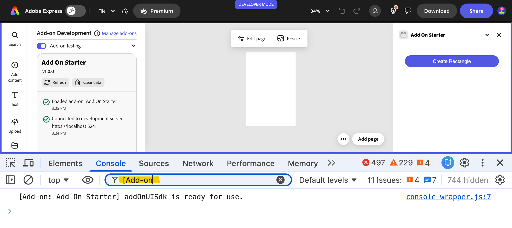

---
keywords:
  - Adobe Express
  - Express Add-on SDK
  - Express Editor
  - Adobe Express
  - Add-on SDK
  - SDK
  - JavaScript
  - Extend
  - Extensibility
  - API
  - Add-on Manifest
title: Quickstart
description: This is the Quickstart page
contributors:
  - https://github.com/hollyschinsky
  - https://github.com/undavide
---

# Development Tools

This section provides a set of guides to help you in the development stage of your add-on.

## Using the CLI

The add-on CLI (Command Line Interface) is the main tool that enables you to develop, test, and package add-ons for our platform. With the add-on CLI, you can create a new add-on project, build and test your add-on locally, and package your add-on for distribution.

Here are some key features of the add-on CLI:

- **Project creation:** The add-on CLI provides a command to create a new add-on project with a basic file structure and configuration.
- **Local development:** The add-on CLI includes a built-in server that allows you to test your add-on locally before deploying it to our platform.
- **Live reloading:** The add-on CLI watches your project files for changes and automatically reloads the server when a change is detected.
- **Packaging:** The add-on CLI provides a command to package your add-on for distribution, including creating a ZIP file that can be uploaded to our platform.

### CLI `create` options

The table below shows the list of arguments that can be specified with the CLI create command (ie: `npx @adobe/create-ccweb-add-on`):

| Argument      | Optional | Default Value                                | Description                                                                                                          |
| ------------- | -------- | -------------------------------------------- | -------------------------------------------------------------------------------------------------------------------- |
| `add-on-name` | No       |                                              | Name of the add-on. A new add-on project with this argument will be created in the user's current working directory. |
| `template`    | Yes      | none, you will<br/> be prompted from the CLI | The template to use for creating the add-on.                                                                         |
| `verbose`     | Yes      | false                                        | Setting this argument enables the verbose flag on the underlying operations.                                         |

For instance, the following command would specify all possible arguments:

```bash
npx @adobe/create-ccweb-add-on my-addon --template react-typescript --verbose
```

<InlineAlert slots="heading, text1, text2, text3, text4, text5" variant="info"/>

#### CLI troubleshooting <!-- 👈 will not render -->

See the [templates](#templates) section for the currently supported template values.

`npx` is an `npm` package runner that can execute packages without installing them explicitly. If needed, please run this command to clear the `npx` cache to ensure the latest version of the CLI is invoked.

```bash
npx clear-npx-cache
npx @adobe/create-ccweb-add-on my-addon
```

The above may prove useful when updated versions of the CLI are released. If you want to read each individual CLI command manual page, run them via `npx` with the `--help` flag, for example:

```bash
npx @adobe/ccweb-add-on-scripts start --help
```

### `start` script options

The table below shows a list of arguments that can be specified with the `start` script on your add-on project, which starts up the add-on in a local server:

| Argument  | Optional | Default Value | Description                                                                  |
| --------- | -------- | ------------- | ---------------------------------------------------------------------------- |
| `src`     | Yes      | `src`         | Directory where the source code and assets for the add-on is present.        |
| `use`     | Yes      |               | Transpiler/bundler to be used. For example, webpack.                         |
| `port`    | Yes      | `5241`        | Local development server port.                                               |
| `verbose` | Yes      | false         | Setting this argument enables the verbose flag on the underlying operations. |

For instance, to specify a port of `8080` instead, use the following command:

```bash
npm run start -- --port 8080
```

To specify you want to use `webpack` AND port `8080`:

```bash
npm run start -- --use webpack --port 8080
```

<InlineAlert slots="text" variant="info"/>

The extra arguments are unnecessary unless you do not want to use a transpiler/bundler or use the default port of `5241`. Also, note that all of the templates other than the `javascript` template are pre-configured to use webpack by default and the `--use webpack` is automatically added when you run the `build` and `start` commands. Take a look at the `scripts` property in the `package.json` of those templates and you will see the following:

```json
"scripts": {
    "clean": "ccweb-add-on-scripts clean",
    "build": "ccweb-add-on-scripts build --use webpack",
    "start": "ccweb-add-on-scripts start --use webpack"
}
```

## Templates

The add-on CLI contains built-in, pre-configured templates to allow you to create an add-on project based on your favorite development stack in the quickest possible manner. There are currently five base template options based on popular web development trends. The table below summarizes the templates and their associated frameworks.
<br/>

| Template           | Framework                                       |
| ------------------ | ----------------------------------------------- |
| `javascript`       | JavaScript                                      |
| `swc-javascript`   | JavaScript with Spectrum Web Components support |
| `swc-typescript`   | TypeScript with Spectrum Web Components support |
| `react-javascript` | React with JavaScript                           |
| `react-typescript` | React with TypeScript                           |

As well as the following five template options, which include support for the [Document Sandbox APIs](../../../references/document-sandbox/):

| Template                                 | Description                                                           |
| ---------------------------------------- | --------------------------------------------------------------------- |
| `javascript-with-document-sandbox`       | JavaScript with Document Sandbox support.                             |
| `swc-javascript-with-document-sandbox`   | JavaScript and Spectrum Web Components with Document Sandbox support. |
| `swc-typescript-with-document-sandbox`   | TypeScript and Spectrum Web Components with Document Sandbox support. |
| `react-javascript-with-document-sandbox` | React and JavaScript with Document Sandbox support.                   |
| `react-typescript-with-document-sandbox` | React and TypeScript with Document Sandbox support.                   |

You can supply any of the above template names after the `--template` parameter:

```bash
npx @adobe/create-ccweb-add-on <add-on-name> --template <template>
```

For instance, the following is an example of a command that will create an add-on based on the `react-javascript` template:

```bash
npx @adobe/create-ccweb-add-on helloworld-react-js --template react-javascript
```

and below is how you could specify the `react-javascript-with-document-sandbox` template:

```bash
npx @adobe/create-ccweb-add-on helloworld-react-js-doc-sandbox --template react-javascript-with-document-sandbox
```

### No template parameter

The template parameter is optional, and the CLI will prompt you to choose from a list of template options if it's excluded. For instance, if you use just the base CLI command:

`npx @adobe/create-ccweb-add-on <add-on-name>`

you will see the following prompt from the CLI:



which shows the five base template options to choose from, followed by a prompt to ask if you want to add the Document Sandbox support once you choose the base template.



You will also see a message in the CLI output notifying you of which template the project was scaffolded with for reference:



<InlineAlert slots="text1, text2" variant="warning"/>

Please note that to use [Spectrum Web Components](../../build/design/implementation_guide.md) in your add-on's UI, Webpack is required. All templates, except for the `javascript` and `javascript-with-document-sandbox` templates, are pre-configured to use Webpack by default.

If you don't want to use TypeScript or React, please refer to [this sample add-on](https://github.com/AdobeDocs/express-add-on-samples/tree/main/contributed/swc) as an example of a JavaScript/Webpack project with Spectrum Web Components support.

When the scaffolding is complete, you will see the following message, prompting you to navigate to the newly created project directory and start the local development scripts:



## Sideload your add-on

After the add-on has been scaffolded and—as the screenshot above suggests—you have to run these commands in the newly created project directory:

```bash
npm run build
npm run start
```

This will build the add-on and start a local server, which you can then sideload into Adobe Express by clicking the button below.

<TextBlock slots=" buttons" width="100%" isCentered variantsTypePrimary="primary" variantStyleFill="outline" className="code-playground-button-inline"/>

- [Sideload your add-on](https://www.adobe.com/go/addon-cli)

You can also do it manually by following the steps below.



<details>
  <summary>Click to view a list of steps to sideload an add-on in Adobe Express</summary>
  <ol>
    <li>Click the <b>Add-ons icon</b> in the left hand rail.</li>
    <li>Enable the <b>Add-on Development</b> switch on the top right corner.</li>
    <li>Click the <b>Test your local add-on</b> text.</li>
    <li><b>Check the checkbox</b> in the Connect to development server modal.</li>
    <li>Click the <b>Connect</b> button.</li>
    <li>Click the <b>Hello World</b> add-on icon on the Add-ons tab on the left.</li>
  </ol>

It's possible to achieve the same result when a document is already open clicking the **Add-ons** icon on the left hand rail, then browse to Your add-ons and switch on **Add-on testing**.



</details>

<InlineAlert slots="text, text2" variant="warning"/>

If you run into the error below, you can follow the steps in the [Known Issues & Limitations](./known_issues_limitations.md#chrome-local-network-access-restriction) guide to fix it.



### Add-on Development mode

Before you can build add-ons, Add-on Development mode in Adobe Express needs to be enabled—you only need to do this once.

<InlineAlert slots="text" variant="success"/>

When [launching the Code Playground](https://www.adobe.com/go/addon-playground) or connecting to your local add-on development environment via [this link](https://www.adobe.com/go/addon-cli), you'll be prompted to review the Developer Terms of Use and enable the Developer Mode.

<details>
  <summary>Click to view a list of steps to manually enable the Developer Mode</summary>
  <ol>
    <li>Open Adobe Express in your browser and click the <b>avatar icon</b> in the top right corner.</li>
    <li>Click the <b>gear icon</b> to open <b>Settings</b>.</li>
    <li>Enable <b>Add-on Development</b> if it's not already enabled. You might need to read the <b>Developer Terms of Use</b> first—click the <b>Accept and Enable</b> button to enable <b>Add-on Development</b></li>
    <li>Close the Settings dialog.</li>
  </ol>


</details>

## Manifest

A `manifest.json` file is required in every add-on project. The manifest provides details including important metadata about your add-on and how it should behave. Be sure to consult the [manifest schema reference](../../../references/manifest) to ensure that your `manifest.json` file is properly formatted and includes all of the necessary properties and values.

## Add-on Development Tools Panel

The **Add-on Development** tools panel provides useful logging details indicating the status of your add-on, as well as action buttons to allow for refreshing and clearing the data associated with your add-on. The panel is shown in the screenshots below for reference:

<InlineAlert slots="text" variant="info"/>

The **Refresh** button can be used to reload your add-on's code and resources, and the **Clear Storage** button allows you to clear any data stored by your add-on.




## Debugging

Messages logged in the Console by your add-on will be prefixed with `[Add-on: <add-on-name>]` to help you distinguish them from other messages.

Open the browser's developer tools by right-clicking on the browser window where Adobe Express is running, and selecting **Inspect** from the context menu. In the **Console**, you can filter out the messages from the Code Playground by typing just `[Add-on:` in the filter input.



### Updating old projects

If you have an old project that you're updating, you must add the following script to your `index.html` file:

```html
<head>
  <!-- ... -->
  <script type="module" src="add-on-console-override.js"></script>
</head>
```

Newer versions of the CLI, in their `build` command, will automatically provide the `add-on-console-override.js` file. Adding this script tag overrides the Console object and provides appropriately prefixed logs to your add-on project.
