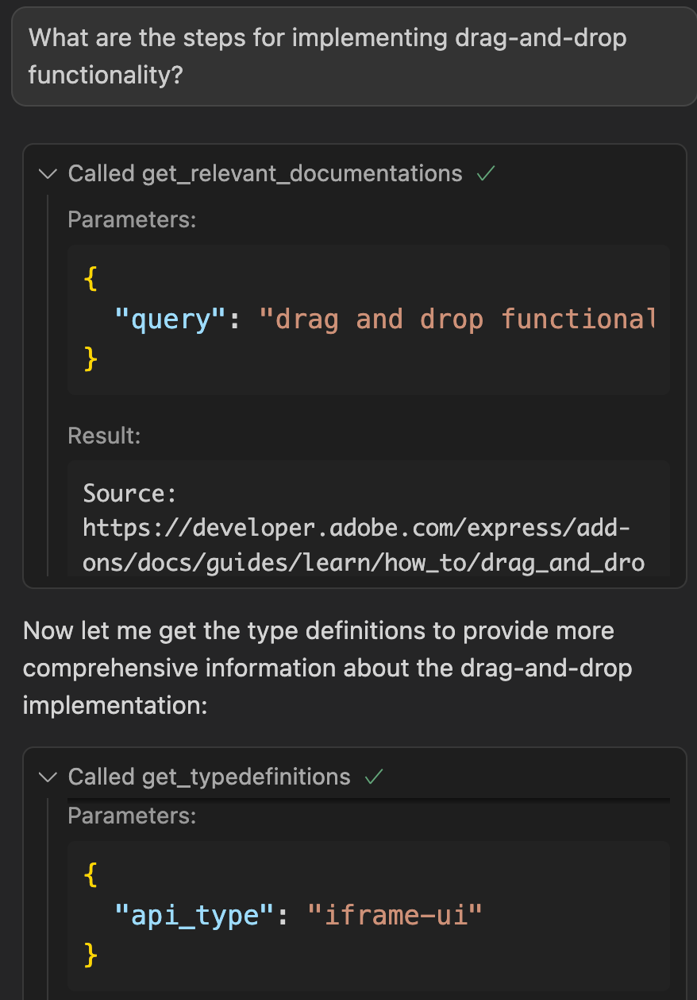

---
keywords:
  - Adobe Express
  - Add-on SDK
  - MCP Server
  - MCP (Model Context Protocol)
  - Development Tools
  - JavaScript
  - TypeScript
  - API References
  - LLM tools 
  - AI-assisted coding
  - AI-assisted debugging
  - Vibe Coding
  - Code Generation
  - TypeScript Definitions
title: Adobe Express Add-on MCP Server
description: Learn how to set up and use the Adobe Express Add-on MCP Server for enhanced development workflow in compatible editors like Cursor.
contributors:
  - https://github.com/hollyschinsky
---

# Adobe Express Add-on MCP Server (Beta)

Stop switching tabs. Get Adobe Express Add-on documentation and TypeScript definitions directly in your AI-assisted IDE through the Model Context Protocol (MCP). Build faster with grounded answers and accurate code suggestions.

<!-- > **Status: Public Beta** - We're actively improving based on developer feedback. API and tool surfaces may change. -->

<AnnouncementBlock slots="heading, text" />

#### **Status: Public Beta**

We're actively improving based on developer feedback. API and tool surfaces may change.

> **"Think of MCP like a USB-C port for AI applications. Just as USB-C provides a standardized way to connect your devices to various peripherals and accessories, MCP provides a standardized way to connect AI models to different data sources and tools."** — [Model Context Protocol](https://modelcontextprotocol.io/docs/getting-started/intro)

## What it does

The MCP server gives you structured access to Adobe Express add-on developer resources to help you get accurate, context-aware answers for coding, debugging, and building full-fledged add-ons, quickly.

This MCP server connects your IDE to Adobe's Express Add-on ecosystem, providing capabilities to ask questions and generate code with:

- **Semantic Documentation Search**: Find relevant guides, examples, and tutorials without leaving your editor
- **TypeScript Definitions**: Get accurate code completions and reduce AI hallucinations with official SDK types
- **Structured Access**: Your LLM gets grounded information from the latest Adobe Express Add-on documentation

**How it works**: The server searches a preprocessed index of Adobe Express Add-on documentation and returns semantically relevant chunks to your LLM. It works with MCP-compatible IDEs like Cursor, Claude Desktop, and others.

## Prerequisites

- **Node.js 18+** (check with `node --version`)
- **MCP-compatible IDE** (Cursor, Claude Desktop, etc.)
- **Internet connection** (for initial `npx` download)

## Quick Setup (No Installation Required)

You don't need to clone or build anything. Just configure your MCP client to launch the server via npx.

### For Cursor Users

Add this to `~/.cursor/mcp.json`:

```json
{
  "mcpServers": {
    "adobe-express-addon": {
      "command": "npx",
      "args": [
        "@adobe/ccweb-add-on-dev-mcp-server@latest",
        "--yes"
      ]
    }
  }
}
```

### For Claude Desktop Users

Add this to `claude_desktop_config.json`:

```json
{
  "mcpServers": {
    "adobe-express-addon": {
      "command": "npx",
      "args": [
        "@adobe/ccweb-add-on-dev-mcp-server@latest",
        "--yes"
      ]
    }
  }
}
```

### Verification

Many IDEs show a green indicator when the MCP server connects successfully, for example in Cursor:  


The LLM will automatically invoke tools based on your prompts, for example:



## How to use it

### Usage Examples

The MCP server excels at both answering questions and generating code for Adobe Express add-ons. Here are examples of effective prompts:

### Documentation & Learning

- "How do I create and style text in Adobe Express?"
- "What are the steps for implementing drag-and-drop functionality?"
- "How does the Document API work for manipulating elements?"
- "Show me examples of using the color picker component"

### Code Generation & Implementation

- "Implement a color picker in my add-on"
- "Generate code to create a text element with custom styling"
- "Build a drag-and-drop interface for uploading images"
- "Create a button that adds a rectangle to the canvas"
- "Write TypeScript code to handle user text input and apply it to the document"
- "Implement an image import feature with file validation"
- "Show me a sample code snippet for using a modal dialog"

### Debugging & Troubleshooting

- "Why isn't my add-on loading in Adobe Express?"
- "Why isn't my text element appearing on the canvas?"
- "Debug this error when trying to add an image to the document (error message: ...)"
- "How do I debug an issue in my `code.js` file?"

## Best Practices for Effective Use

### Crafting Better Prompts

- **Be Specific**: "Add a stroke to a rectangle" vs "Style shapes"
- **Include Context**: "I'm building a text editor add-on" helps narrow results
- **Use Technical Terms**: "text styling" vs "make it look good"
- **Ask for Examples**: "Show me code examples for text manipulation"
- **Request Code Generation**: "Generate TypeScript code to..." or "Implement a feature that..."

### Describe Your Tech Stack and Visual Requirements

**Start your session** by describing your technical setup and visual requirements. This gives the LLM context for the entire conversation and ensures all subsequent responses are tailored to your specific tech stack.

**Example of a well-structured prompt:**

> "I'm building an Adobe Express add-on using JavaScript/TypeScript and React with a UI based on Spectrum Web Components using the Express theme. My user interface needs a text field, a button, a modal dialog and a color picker. Please generate the code and show me how to set it up using the Adobe Add-on CLI."

**Key elements to include:**

- **Programming languages**: JavaScript, TypeScript
- **Framework**: React (or vanilla JS)
- **UI components**: Spectrum Web Components with Express theme
- **Specific components needed**: Modal dialog, color picker, buttons, etc.
- **Build tools**: Adobe Add-on CLI for setup and development

<InlineAlert variant="success" slots="header, text1" />

**Pro tip:**

Start with a project scaffolded by the Adobe Add-on CLI with your preferred tech stack, then ask for specific feature implementations. This gives the LLM better context about your project structure and dependencies.

### Session Management

- **Keep Sessions Focused**: Start new conversations for different features or topics
- **Be Explicit**: Ask the agent to "use the available tools" for more comprehensive answers
- **Provide Context**: Mention what you're building and your current progress
- **Iterate Gradually**: Build features step-by-step rather than asking for complete applications

## Important Notes

- **Beta Status**: API and tool surfaces will evolve based on feedback
- **Documentation Scope**: Covers official Adobe Express Add-on docs only
- **Update Frequency**: Documentation index updates periodically, not real-time
- **IDE Requirement**: Requires MCP-compatible IDE for full functionality
- **Network Dependency**: Initial setup requires internet for npx download

## Getting Started Workflow

1. **Configure your IDE** (see setup instructions above)
2. **Test the connection** - ask a simple question like "How do I create text?"
3. **Start building** - try "Generate code to create a button in my add-on"
4. **Iterate and improve** - ask follow-up questions and request code modifications

## What's New in Beta

- **v1.0.0-beta**: Initial release with documentation search and TypeScript definitions
- **Coming Soon**: Real-time documentation updates, additional API surfaces
- **Your Feedback**: We're actively collecting input to improve accuracy and coverage. Have feedback? Join our [Adobe Express Add-on Developers Discord](https://discord.com/invite/nc3QDyFeb4) for real-time chat with the team and community and share your thoughts.

## Troubleshooting

<InlineNestedAlert variant="info" header="true" iconPosition="right">

  **Server Won't Start**

  - ✅ Check Node.js version: `node --version` (needs 18+)
  - ✅ Verify MCP config JSON syntax
  - ✅ Ensure firewall allows `npx` downloads
  - ✅ Restart your IDE after configuration changes   

 </InlineNestedAlert>

<InlineNestedAlert variant="info" header="true" iconPosition="right">

  **No Documentation Results**

  - ✅ Use specific technical terms ("text styling" vs "make it pretty")
  - ✅ Try adding "Adobe Express Add-ons" for an additional context cue
  - ✅ Try broader queries first, then narrow down
  - ✅ Ask the agent to "use available tools" explicitly
  - ✅ Include context about what you're building

</InlineNestedAlert>

<InlineNestedAlert variant="info" header="true" iconPosition="right">

   **Poor Code Generation**

   - ✅ Be specific about what you want to implement
   - ✅ Mention the programming language and frameworks (TypeScript/JavaScript, React, etc.)
   - ✅ Provide context about your add-on's purpose
   - ✅ Ask for complete, working examples

</InlineNestedAlert>

<InlineNestedAlert variant="info" header="true" iconPosition="right">

  **Missing Type Definitions**

  - ✅ Specify the correct API surface (iframe-ui, express-document-sdk, add-on-sdk-document-sandbox)
  - ✅ Ask for specific types rather than general requests

</InlineNestedAlert>

<InlineNestedAlert variant="info" header="true" iconPosition="right">

   **IDE Connection Issues**

  - ✅ Ensure your IDE supports MCP protocol
  - ✅ Check for MCP server status indicators
  - ✅ Verify configuration file location and syntax
  - ✅ Try restarting the MCP server connection

</InlineNestedAlert>

<Resources slots="heading, links"/>

## Resources & Support

- **Documentation**: [Adobe Express Add-on Guides](https://developer.adobe.com/express/add-ons/docs/guides/)
- **Examples**: [Samples Repository](https://github.com/AdobeDocs/express-add-on-samples)
- **Updates**: [Changelog](https://developer.adobe.com/express/add-ons/docs/guides/getting_started/changelog/)
- **Community**: [Adobe Express Add-on Developers Discord](https://discord.com/invite/nc3QDyFeb4)
- **Forum**: [Adobe Express Developers Community](https://community.adobe.com/t5/adobe-express-developers/ct-p/ct-adobe-express-developers?page=1&sort=latest_replies&lang=all&tabid=all)

## FAQ

### Does this generate code?

Yes—it enhances your LLM's ability to generate accurate Adobe Express add-on code by providing relevant documentation and TypeScript definitions. Your IDE/LLM handles the actual code generation with improved context.

### Which IDEs work?

Any IDE supporting MCP: Cursor, Claude Desktop, and others.

### Who should use this?

Adobe Express add-on developers who want faster, more accurate development workflows.

### Is it free?

Yes, free during and after beta.

<!--

Questions for consideration whether to includeduring review

Some feedback given from community champs:

Instead of focusing heavily on setup basics, the public docs could include some prompt guide recommendation

* Best practices for prompting with MCP servers
* Template prompts or rules that enhance MCP functionality
* Guidelines for optimizing MCP interactions through context setting

* Template prompts or rules that enhance MCP functionality
* Guidelines for optimizing MCP interactions through context setting

Action Item:
The public docs should
* Have a section explaining the basic concepts of MCP and how it can help in boosting productivity can help new add-on developers. 
* Make sure that the main doc on MCP is not too long with the basic.  Try and keep the above section tucked away in a separate page. 


Takeaways:
* Developers expect the MCP to help with UI development using Adobe-standard SWC. 

Action item:
* [Eng] Increase the scope of knowledge of the MCP serve to include public docs of Spectrum design and SWC.

1 - “...the best way to ensure that the LLM always uses the server is to manually call the specific tool you want tos use each time you send a chat. In vscode you do that with a hashtag before the name of the tool”
    
    I did not include this in the draft because it's not clear how to do this without listing the names of the tools.


-->