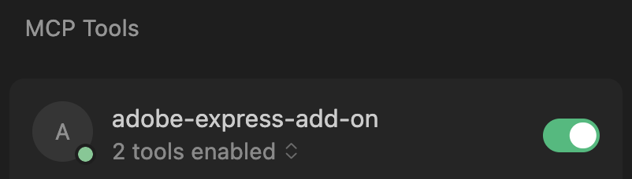

---
keywords:
  - Adobe Express
  - Add-on SDK
  - MCP Server
  - MCP (Model Context Protocol)
  - Development Tools
  - JavaScript
  - TypeScript
  - API References
  - LLM tools 
  - AI-assisted coding
  - AI-assisted debugging
  - Vibe Coding
  - Code Generation
  - TypeScript Definitions
  - IDE 
title: Adobe Express Add-on MCP Server (Beta)
description: Learn how to set up and use the Adobe Express Add-on MCP Server for enhanced development workflow in compatible editors like Cursor.
contributors:
  - https://github.com/hollyschinsky
---

# Adobe Express Add-on MCP Server (Beta)

Get Adobe Express Add-on documentation and TypeScript definitions directly in your AI-assisted IDE through the Model Context Protocol (MCP). Build faster with grounded answers and accurate code suggestions.

## TL;DR - Quick Setup

**For experienced developers:** Add one of these configurations to your MCP-compatible IDE and restart:

**Cursor** (`~/.cursor/mcp.json`):
```json
{
  "mcpServers": {
    "adobe-express-add-on": {
      "command": "npx",
      "args": ["@adobe/express-add-on-dev-mcp@latest", "--yes"]
    }
  }
}
```

**Claude Desktop** (`claude_desktop_config.json`):
```json
{
  "mcpServers": {
    "adobe-express-add-on": {
      "command": "npx",
      "args": ["@adobe/express-add-on-dev-mcp@latest", "--yes"]
    }
  }
}
```

**VS Code** (`~/.vscode/mcp.json`):
```json
{
  "mcpServers": {
    "adobe-express-add-on": {
      "command": "npx",
      "args": ["@adobe/express-add-on-dev-mcp@latest", "--yes"]
    }
  }
}
```

**Requirements:** Node.js 18+ and an MCP-compatible IDE with LLM integration.

---

## **Status: Public Beta**

<!-- **What's New**

- **v1.0.0-beta**: Initial release with documentation search and TypeScript definitions
- **Coming Soon**: Real-time documentation updates, additional API surfaces -->

<InlineAlert variant="info" slots="header, text1"/>

💬  **Feedback requested:** We're actively collecting input to improve accuracy and coverage. Have feedback? Please join our [Adobe Express Add-on Developers Discord](https://discord.com/invite/nc3QDyFeb4) for real-time chat with the team and community and share your thoughts!<br/>

<br/>

> **"Think of MCP like a USB-C port for AI applications. Just as USB-C provides a standardized way to connect your devices to various peripherals and accessories, MCP provides a standardized way to connect AI models to different data sources and tools."** — [Model Context Protocol](https://modelcontextprotocol.io/docs/getting-started/intro)<br/>

## What it does

The Adobe Express Add-on MCP Server (Beta) acts as a bridge between your LLM (AI assistant) and Adobe Express add-on developer resources. It requires an MCP-compatible IDE (like Cursor or Claude Desktop) with an LLM of your choice to provide accurate, context-aware answers for coding, debugging, and building full-fledged add-ons, quickly.

The MCP Server communicates directly with your LLM to enhance its responses by connecting your IDE to the Adobe Express Add-on ecosystem, providing capabilities to ask questions and generate code with:

- **Semantic Documentation Search**: Find relevant guides, examples, and tutorials without leaving your editor
- **TypeScript Definitions**: Get accurate code completions and reduce AI hallucinations with official SDK types
- **Structured Access**: Your LLM gets grounded information from the latest Adobe Express Add-on documentation

**How it works:** The server returns semantically relevant chunks to your LLM. It works with MCP-compatible IDEs like Cursor, Claude Desktop, and others.

## Prerequisites

- **Node.js 18+** (check with `node --version`) - Required to run the [Adobe Express Add-on MCP Server package](https://www.npmjs.com/package/@adobe/express-add-on-dev-mcp) via `npx`
- **MCP-compatible IDE** - Such as Cursor, Claude Desktop, or other editors supporting the Model Context Protocol

## Quick Setup (No Installation Required)

Clone, install or build. Just configure your MCP client (ie: Cursor, Claude Desktop) with a simple json file.

### Step 1: Configure your IDE

#### For Cursor Users

Add this to `~/.cursor/mcp.json`:

```json
{
  "mcpServers": {
    "adobe-express-add-on": {
      "command": "npx",
      "args": [
        "@adobe/express-add-on-dev-mcp@latest",
        "--yes"
      ]
    }
  }
}
```

#### For Claude Desktop Users

Add this to `claude_desktop_config.json`:

```json
{
  "mcpServers": {
    "adobe-express-add-on": {
      "command": "npx",
      "args": [
        "@adobe/express-add-on-dev-mcp@latest",
        "--yes"
      ]
    }
  }
}
```

#### For VS Code Users

Add this to your workspace in `~/.vscode/mcp.json`:

```json
{
  "mcpServers": {
    "adobe-express-add-on": {
      "command": "npx",
      "args": [
        "@adobe/express-add-on-dev-mcp@latest",
        "--yes"
      ]
    }
  }
}
```

### Step 2: Verify the Connection

Many IDEs show a green indicator when the MCP server connects successfully, for example in Cursor:  



The LLM will automatically invoke tools based on your prompts, for example, in Cursor:


## How to use it

### Usage Examples

The **Adobe Express Add-on MCP Server** excels at both helping with answering questions and generating code for Adobe Express add-ons. Here are examples of effective prompts:

### Documentation & Learning

- "*How do I create and style text in Adobe Express*?"
- "*What are the steps for implementing drag-and-drop functionality*?"
- "*How does the Document API work for manipulating elements*?"
- "*Show me examples of using the color picker component*?"

### Code Generation & Implementation

- "*Implement a color picker in my add-on*"
- "*Generate code to create a text element with custom styling*"
- "*Build a drag-and-drop interface for uploading images*"
- "*Create a button that adds a rectangle to the canvas*"
- "*Write TypeScript code to handle user text input and apply it to the document*"
- "*Implement an image import feature with file validation*"
- "*Show me a sample code snippet for using a modal dialog*"

### Debugging & Troubleshooting

- "*Why isn't my add-on loading in Adobe Express?*"
- "*Why isn't my text element appearing on the canvas?*"
- "*Debug this error when trying to add an image to the document (error message: ...)*"
- "*How do I debug an issue in my `code.js` file?*"

## Best Practices for Effective Use

### Set Context for the Entire Conversation

**Start your session** by describing your technical setup and visual requirements. This gives the LLM context for the entire conversation and ensures all subsequent responses are tailored to your specific tech stack.

**Example of a well-structured prompt:**

> "I'm building an Adobe Express add-on using JavaScript/TypeScript and React with a UI based on Spectrum Web Components using the Express theme. My user interface needs a text field, a button, a modal dialog and a color picker. Please generate the code and show me how to set it up using the Adobe Add-on CLI."

**Key elements to include:**

- **Programming languages**: JavaScript, TypeScript
- **Framework**: React (or vanilla JS)
- **UI components**: Spectrum Web Components with Express theme
- **Specific components needed**: Modal dialog, color picker, buttons, etc.
- **Build tools**: Adobe Add-on CLI for setup and development

<InlineAlert variant="success" slots="header, text1"/>

**🚀 &nbsp;Pro Tip**

Start with a project scaffolded by the Adobe Add-on CLI with your preferred tech stack, then ask for specific feature implementations. This gives the LLM better context about your project structure and dependencies.

### Craft Effective Prompts

- **Be Specific**: "*Add a stroke to a rectangle*" vs "*Style shapes*"
- **Include Context**: "*I'm building a text editor add-on*" helps narrow results
- **Use Technical Terms**: "*text styling*" vs "*make it look good*"
- **Ask for Examples**: "*Show me code examples for text manipulation*"
- **Request Code Generation**: "*Generate TypeScript code to...*" or "*Implement a feature that...*"

### Manage Your Sessions

- **Keep Sessions Focused**: Start new conversations for different features or topics
- **Be Explicit**: Ask the agent to "use the available tools" for more comprehensive answers
- **Provide Context**: Mention what you're building and your current progress
- **Iterate Gradually**: Build features step-by-step rather than asking for complete applications

<!-- <InlineAlert variant="success" slots="header, text1, text2, text3, text4, text5, text6"/> -->

### 🚀 &nbsp;Pro UI Tips

Consider using the following tips in your prompts/rules for LLM guidance when using [Spectrum Web Components](https://opensource.adobe.com/spectrum-web-components/index.html) or the [swc-react](https://opensource.adobe.com/spectrum-web-components/using-swc-react/) wrappers library for React-based add-ons. 

**[Spectrum Web Components](https://opensource.adobe.com/spectrum-web-components/index.html)** (add-ons NOT using React)

> **🤖 LLM Guidance:**
> 
> - **CRITICAL:** All `@spectrum-web-components/*` packages MUST use identical versions
> - **REQUIRED theme imports:**
> 
>   ```js
>   import '@spectrum-web-components/theme/express/theme-light.js';
>   import '@spectrum-web-components/theme/express/scale-medium.js';
>   import '@spectrum-web-components/theme/sp-theme.js';
>   ```
> 
> - Wrap app with: `<sp-theme system="express" scale="medium" color="light">`
> - **ALWAYS** check `package.json` for version consistency across **ALL** `@spectrum-web-components/*` packages
>
> **Related References:**
> 
> - [Spectrum Web Components Documentation](https://opensource.adobe.com/spectrum-web-components/index.html)
> - [Using Spectrum Web Components in a basic JavaScript add-on](https://developer.adobe.com/express/add-ons/docs/guides/learn/how_to/tutorials/spectrum-workshop/part1)

<br/>

**[swc-react](https://opensource.adobe.com/spectrum-web-components/using-swc-react/)** (only for add-ons using React)

> **🤖 LLM Guidance:**
> 
> - **MANDATORY:** Use `@swc-react/*` components (NOT React Spectrum)
> - **CRITICAL:** All `@swc-react/*` packages MUST use identical versions
> - **REQUIRED theme setup:**
> 
>   ```js
>   import '@spectrum-web-components/theme/express/theme-light.js';
>   import '@spectrum-web-components/theme/express/scale-medium.js';
>   import { Theme } from '@swc-react/theme';
>   ```
> 
> - Wrap app with: `<Theme system="express" scale="medium" color="light">`
> - **ALWAYS** check `package.json` for version consistency across **ALL** `@swc-react/*` packages
>
> **Related References:**
> 
> - [Using swc-react](https://opensource.adobe.com/spectrum-web-components/using-swc-react/)
> - [Using Spectrum Web Components in a React-based add-on with swc-react](https://developer.adobe.com/express/add-ons/docs/guides/learn/how_to/tutorials/spectrum-workshop/part2)
> - [React Synthetic Events Issue](https://github.com/facebook/react/issues/19846)<br/>

### General Recommendations

- **Avoid Getting Stuck in Debugging Loops**

  - If the LLM keeps suggesting fixes that don't work, start fresh with a new conversation
  - Save your working code frequently using version control branches
  - When debugging fails repeatedly, try a different approach or even switch to a different LLM model
  - It's often faster to restart with a clear problem description than to keep correcting a confused AI assistant

### Creating Effective LLM Rules

Custom rules can help guide your LLM's responses, but they require careful design and testing to ensure they work as intended.

**Best Practices:**

- Test your rules thoroughly before relying on them
- Focus on positive guidance rather than restrictions
- Be specific about what you want, not just what you want to avoid

**Avoid Overly Restrictive Rules:**

- Rules that focus on "never do X" or "cannot do Y" can backfire
- LLMs may over-prioritize avoiding the restriction and neglect coding fundamentals
- Instead of "*Never use inline styles*," try "*Prefer CSS classes and external stylesheets for maintainability*"

## Cursor Rules 

Here are some example rules that have proven helpful for Adobe Express add-on development in Cursor. Feel free to adapt them for your own use:

> - Use `express-add-on-dev-mcp` for questions about Express Add-ons, Express API, CLI, and SDK before web search. 
> - Add-ons are bundled and served in the browser as an iFrame. 
> - Both the Add-on UI and "Express document sandbox" are isolated and must communicate through a proxy layer. 
> - The term "document" most often refers to terminology related to Express Add-ons since the regular browser DOM isn't available in the sandboxed environment.

## Troubleshooting

<InlineNestedAlert header="true" variant="neutral" iconPosition="right">

  **Server Won't Start**

  - ✅ Check Node.js version: `node --version` (needs 18+)
  - ✅ Verify MCP config JSON syntax and file location
  - ✅ Ensure firewall allows `npx` downloads
  - ✅ Restart your IDE after configurationchanges
  - ✅ Check for MCP server status indicators

</InlineNestedAlert>

<InlineNestedAlert header="true" variant="neutral" iconPosition="right">

  **No Documentation Results**

  - ✅ Use specific technical terms ("text styling" vs "make it pretty")
  - ✅ Try adding "Adobe Express Add-ons" for an additional context cue
  - ✅ Try broader queries first, then narrow down
  - ✅ Ask the agent to "use available tools" explicitly
  - ✅ Include context about what you're building

</InlineNestedAlert>

<InlineNestedAlert header="true" variant="neutral" iconPosition="right">

   **Poor Code Generation**

   - ✅ Be specific about what you want to implement
   - ✅ Mention the programming language and frameworks (TypeScript/JavaScript, React)
   - ✅ Provide context about your add-on's purpose
   - ✅ Ask for complete, working examples

</InlineNestedAlert>

<InlineNestedAlert header="true" variant="neutral" iconPosition="right">

  **Missing Type Definitions**

  - ✅ Specify the correct API surface (`iframe-ui`, `express-document-sdk`, `add-on-sdk-document-sandbox`)
  - ✅ Ask for specific types rather than general requests

</InlineNestedAlert>

## Resources & Support

- **Documentation**: [Adobe Express Add-on Guides](https://developer.adobe.com/express/add-ons/docs/guides/)
- **Add-on Samples**: [Samples Repository](https://github.com/AdobeDocs/express-add-on-samples)
- **Updates**: [Changelog](https://developer.adobe.com/express/add-ons/docs/guides/getting_started/changelog/)
- **Community**: [Adobe Express Add-on Developers Discord](https://discord.com/invite/nc3QDyFeb4)
- **Forum**: [Adobe Express Developers Community](https://community.adobe.com/t5/adobe-express-developers/ct-p/ct-adobe-express-developers?page=1&sort=latest_replies&lang=all&tabid=all)

## FAQs

#### Q: What is an LLM and why do I need one?

**A:** LLM stands for "Large Language Model"—these are AI assistants like ChatGPT, Claude, or Copilot that can understand and generate human-like text and code. In the context of the MCP Server, the LLM is your AI coding assistant that reads your questions, searches Adobe Express documentation (via the MCP Server), and provides intelligent responses with accurate code examples. Think of it as having an expert Adobe Express developer as your pair programming partner who has instant access to all the documentation and can write code for you.

#### Q: Does the Adobe Express Add-on MCP Server generate code?

**A:** Yes—it enhances your LLM's ability to generate accurate Adobe Express add-on code by providing relevant documentation and TypeScript definitions. Your IDE/LLM handles the actual code generation with improved context.

#### Q: Which IDEs work?

**A:** Any IDE supporting MCP: Cursor, Claude Desktop, and others.

#### Q: Who should use this?

**A:** Adobe Express add-on developers who want faster, more accurate development workflows.

#### Q: Is it free?

**A:** Yes, free during and after beta.

#### Q: Where else can I get additional help with MCP Server connection issues?

**A:** You can check out the [Model Context Protocol Debugging](https://modelcontextprotocol.io/legacy/tools/debugging) for more general MCP Server connection debugging information, or message us on our [Adobe Express Add-on Developers Discord](https://discord.com/invite/nc3QDyFeb4).

<!--
# Adobe Express Add-on Development Rules

## Smple SWC Global Rules / System Prompt

1. Always use `swc-react` (@swc-react/*) for UI components instead of React Spectrum.
2. All `@swc-react/*` and `@spectrum-web-components/*` packages must use the same version (currently 1.7.0).
3. Every project must include Adobe Express theming:
   import "@spectrum-web-components/theme/theme-light.js";
   import "@spectrum-web-components/theme/express/theme-light.js";
   import "@spectrum-web-components/theme/scale-medium.js";
   import "@spectrum-web-components/theme/express/scale-medium.js";
   import { Theme } from "@swc-react/theme";
4. Handle events with React synthetic events; note `onChange` does not work for form elements. Use WC.jsx helper if needed.
5. Validate component props and events against Spectrum Web Components documentation (https://opensource.adobe.com/spectrum-web-components/).

* Best practices for prompting with MCP servers
* Template prompts or rules that enhance MCP functionality
* Guidelines for optimizing MCP interactions through context setting

## Rules before suggesting UI code:

Checklist before suggesting UI code:

- Using swc-react only? ✅
- Versions aligned (1.7.0)? ✅
- Express theming included? ✅
- Event handling correct (onChange caveat)? ✅
- Props/events from SWC docs? ✅
-->
